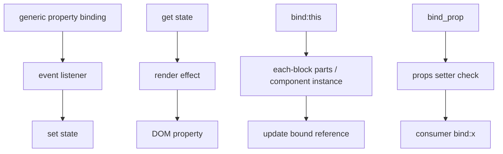

# Universal and component bindings

Sources: `universal.js`, `this.js`, and `props.js`.

## Generic element properties

`bind_property(property, event_name, element, set, get?)` attaches an event listener that reads an arbitrary DOM property. With `get`, a render effect writes state to the property; without it, setup immediately reads the initial property. Global targets (`window`, `document`, and `document.body`) receive explicit teardown removal.

`bind_content_editable(property, element, get, set)` is specialized for `innerHTML`, `textContent`, and `innerText`. Input events read the property, while the render effect writes string values and adopts the current DOM value when the model is `null`.

`bind_focused(element, set)` reports focus/blur as a boolean based on whether the element is `document.activeElement`.

## `bind:this`

`bind_this(element_or_component, update, get_value, get_parts?)` publishes an element or component instance to user state. It tracks each-block context parts rather than the bound value itself, clears the old position when context changes, and defers teardown clearing to a microtask because effects cannot safely run during teardown.

## Component prop binding

`bind_prop(props, prop, value)` exposes an exported non-prop variable through `$$props` when the property has a setter. It writes the value for consumer-side `bind:x` support and resets it to `null` on teardown. Read-only descriptors are ignored.

