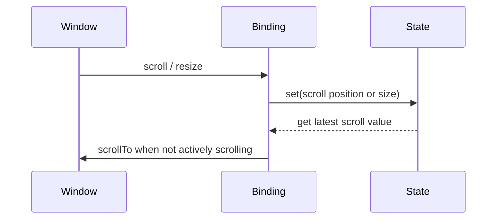

# Window bindings

Source: `internal/client/dom/elements/bindings/window.js`.

`bind_window_scroll(type, get, set)` synchronizes `window.scrollX` or `window.scrollY`. Scroll events update state without entering a reactive context. State-driven scrolling is suppressed while a user/programmatic scroll is in progress and is skipped for the initial value to preserve accessibility expectations. A timeout clears the scrolling guard; teardown removes the passive listener.

`bind_window_size(type, set)` listens for `resize` and reports `innerWidth`, `innerHeight`, `outerWidth`, or `outerHeight`. Browser reads are wrapped without a reactive context.

