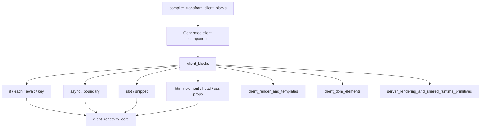
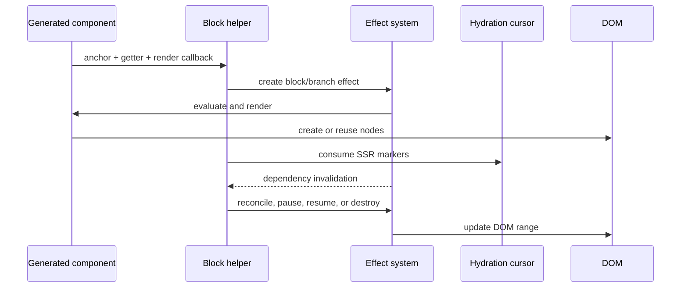
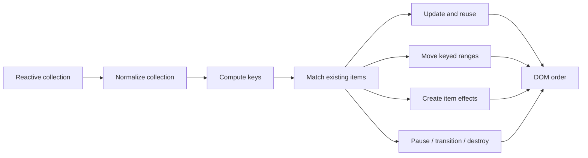

# Client Blocks

## Purpose

The `client_blocks` module is Svelte's client-side DOM block runtime. It turns compiler-generated block instructions into live DOM behavior while coordinating reactivity, effect lifecycles, transitions, asynchronous work, hydration, and component composition.

## Architecture

Generated client components provide anchors, reactive getters, and render callbacks. Block helpers wrap those callbacks in effects that create, move, pause, resume, or destroy DOM ranges.

`client_reactivity_core` supplies sources, derived values, batching, and effect lifecycle operations. `client_render_and_templates` supplies anchors, templates, hydration cursors, and DOM operations. Rendered branches may use `client_dom_elements` for attributes, events, transitions, and bindings. SSR counterparts and hydration markers come from `server_rendering_and_shared_runtime_primitives`.

## Submodules

### Control flow

[client_blocks_control_flow.md](client_blocks_control_flow.md) documents `if_block`, `each`, `await_block`, and `key`: conditional branches, keyed collection reconciliation, promise states, and keyed remounting.

### Async boundaries

[client_blocks_async_boundaries.md](client_blocks_async_boundaries.md) documents `async` and `boundary`: pending work, fallback content, error capture, reset behavior, and restoration of main content.

### Composition

[client_blocks_composition.md](client_blocks_composition.md) documents `slot`, `sanitize_slots`, `snippet`, `wrap_snippet`, and `createRawSnippet`: component content, snippets, fallback rendering, ownership checks, and raw snippets.

### Dynamic DOM

[client_blocks_dynamic_dom.md](client_blocks_dynamic_dom.md) documents `html`, `element`, `head`, and `css_props`: raw HTML, dynamic element names and namespaces, document-head effects, and reactive CSS custom properties.

## Data flow

During hydration, helpers inspect shared hydration state. A mismatch in a condition, collection, promise state, or raw HTML range removes only the affected block's server nodes and switches that block to client creation.

## Keyed collection interaction

The `each` runtime maintains both a key-to-item map and a linked item chain, enabling stable identity, efficient reordering, reactive item/index values, fallback content, hydration, controlled blocks, and animation measurement.

## Maintenance invariants

- Use the shared effect API for lifecycle changes so transitions and teardown run correctly.
- Restore shared hydration cursor state whenever a helper switches temporarily to client creation.
- Keep each-block map entries and `prev`/`next` links synchronized during insert, move, and removal.
- Ignore stale promise callbacks when the resolved promise is no longer current.
- Raw HTML is inserted as an HTML fragment and does not execute embedded scripts; untrusted values require caller-side sanitization.
- Head effects use document-level hydration markers and must advance the head cursor across multiple head blocks.

## Related modules

- [client_reactivity_core.md](client_reactivity_core.md)
- [client_dom_elements.md](client_dom_elements.md)
- [client_render_and_templates.md](client_render_and_templates.md)
- [server_rendering_and_shared_runtime_primitives.md](server_rendering_and_shared_runtime_primitives.md)
- [compiler_transform_client_blocks.md](compiler_transform_client_blocks.md)
- [compiler_transform_client_template.md](compiler_transform_client_template.md)
