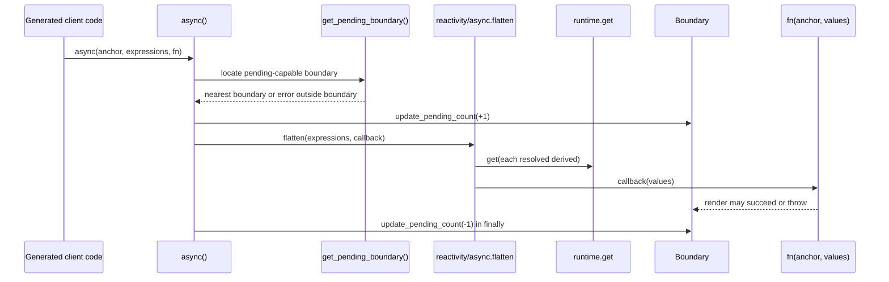
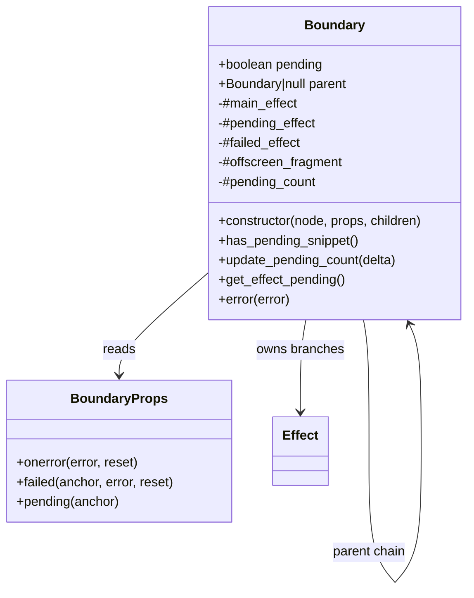
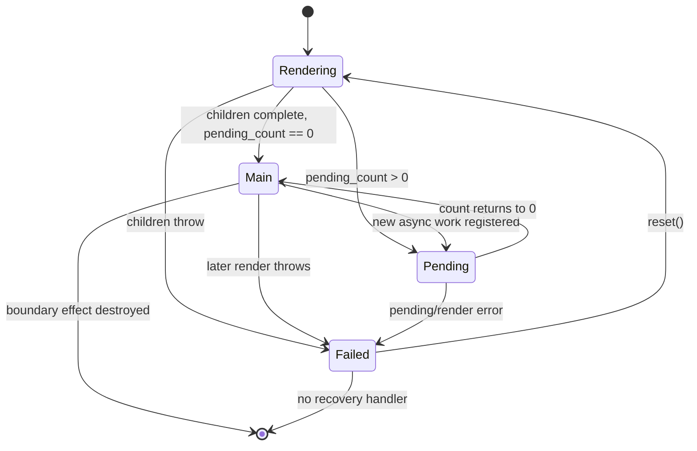
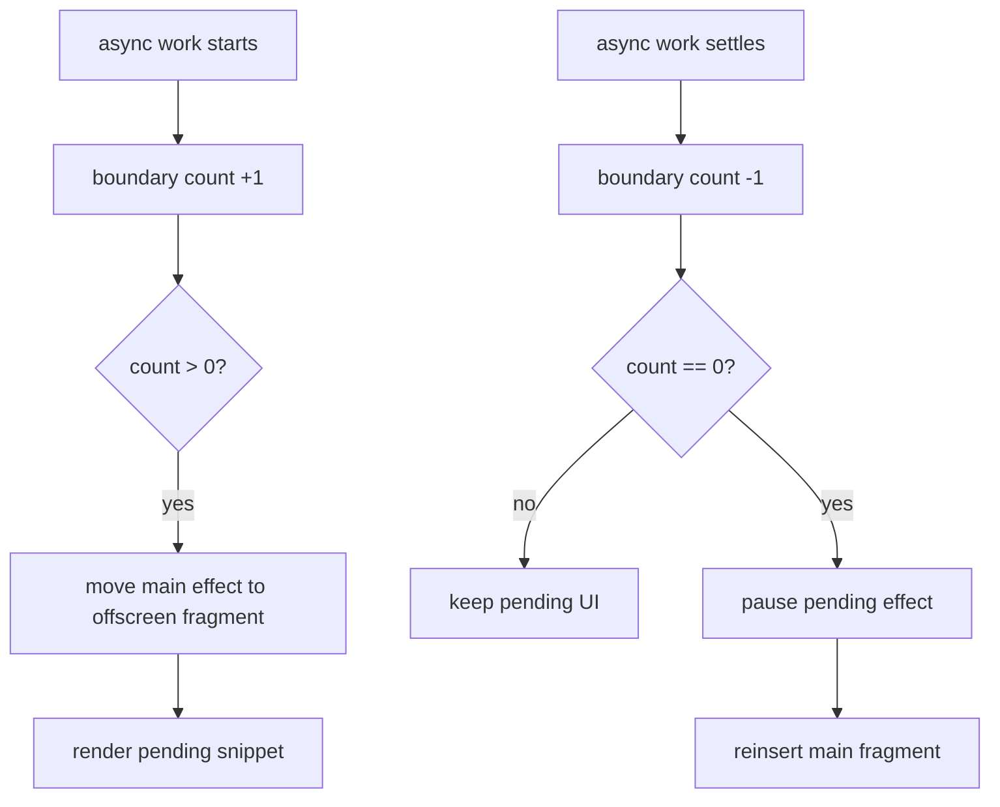
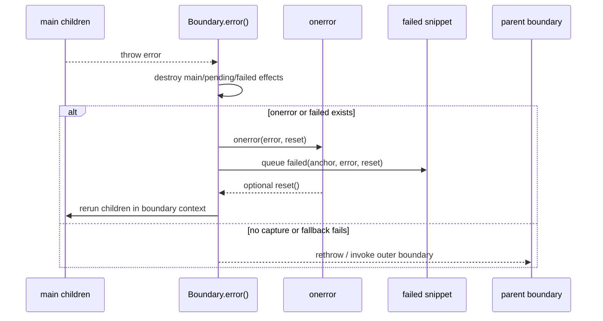
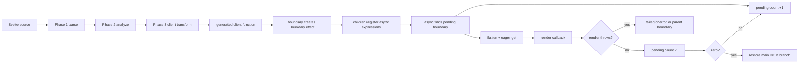

# client_blocks_async_boundaries

## Introduction

`client_blocks_async_boundaries` is the client runtime for Svelte's asynchronous rendering
boundaries. It contains two closely coupled primitives:

| Primitive | Responsibility |
| --- | --- |
| `async` | Registers an asynchronous expression, resolves its derived values, and reports its pending lifetime to a boundary. |
| `boundary` / `Boundary` | Owns the main, pending, and failed render branches; switches between them as async work settles; and recovers from errors. |

The module is used by compiler-generated client code for `{#await}`-style async work and
`<svelte:boundary>` blocks. It is part of the broader DOM block runtime and relies on the signal,
effect, and batch machinery described in [client_reactivity](client_reactivity.md).

## 1. Position in the system

```mermaid
flowchart LR
    SRC[".svelte source"] --> PARSE["parse / analyze"]
    PARSE --> TRANSFORM["client transform"]
    TRANSFORM --> EMIT["generated $.async / $.boundary calls"]

    subgraph RUNTIME["Client runtime"]
        ASYNC["async.js\nasync()"]
        BOUNDARY["boundary.js\nBoundary"]
        REACT["client_reactivity\nderiveds, effects, batches"]
        DOM["DOM operations / hydration"]
        ERR["error handling"]
    end

    EMIT --> ASYNC
    EMIT --> BOUNDARY
    ASYNC --> REACT
    ASYNC --> BOUNDARY
    BOUNDARY --> REACT
    BOUNDARY --> DOM
    BOUNDARY --> ERR

    CT["compiler_transform_client_blocks_boundary"] -. emits $.boundary .-> EMIT
    CB["compiler_transform_client_blocks"] -. selects block visitors .-> TRANSFORM
```

The compiler-side `<svelte:boundary>` implementation is documented in
[compiler_transform_client_blocks_boundary](compiler_transform_client_blocks_boundary.md).
That visitor converts boundary attributes and snippets into the runtime props object; this
module supplies the runtime semantics. Other block visitors are grouped in
[compiler_transform_client_blocks](compiler_transform_client_blocks.md).

## 2. Public runtime entry points

### `async(node, expressions, fn)`

`async` accepts a template anchor, an array of promise-producing expressions, and a callback that
creates the rendered block once all expressions are available:

```js
async(anchor, [() => promise], (anchor, value) => {
    // compiler-generated block creation
});
```

Its algorithm is deliberately small:

1. Find the nearest boundary that has a `pending` snippet using `get_pending_boundary()`.
2. Increment that boundary's pending count.
3. Pass the expressions to `flatten` from `reactivity/async.js`.
4. When flattened values are ready, eagerly call `get()` on each derived value.
5. Invoke `fn(node, ...values)` to create/update the block.
6. Decrement the pending count in `finally`, including when block creation throws.

The eager reads are important: rejected async values should fail before a render block is created,
allowing the boundary's error path to handle the failure consistently.



If no pending-capable boundary exists, `get_pending_boundary()` raises the runtime diagnostic
for async work outside a boundary. A boundary without a `pending` prop is skipped while walking
the parent chain; pending work then belongs to the nearest ancestor that can display a pending
snippet.

### `boundary(node, props, children)` and `Boundary`

`boundary` is a thin factory that constructs a `Boundary`. The class retains the runtime state
needed to coordinate three effect branches:

* `#main_effect`: the normal children;
* `#pending_effect`: the pending snippet, if supplied;
* `#failed_effect`: the failure snippet, if supplied.

The boundary also stores its anchor, parent boundary, hydration marker, pending count, and an
optional reactive source used by `$effect.pending()`.



The compiler normally supplies `onerror`, `failed`, and `pending` as properties. Reactive
properties may be emitted as getters, so the boundary reads current values when it needs them;
see the attribute handling in [compiler_transform_client_blocks_boundary](compiler_transform_client_blocks_boundary.md).

## 3. Boundary lifecycle

Construction creates a preserved, transparent boundary block effect. The boundary is installed as
`active_effect.b`, making it discoverable by nested `async` calls. Children are rendered in a
branch effect. If asynchronous work is registered during that render, the pending snippet is
shown and the main branch is moved offscreen until all work settles.



### Pending branch switching

`#show_pending_snippet()` moves the nodes belonging to `#main_effect` into a
`DocumentFragment`, then creates the pending branch at the anchor. This preserves the main DOM
without displaying it while async work is pending. When the count reaches zero,
`#update_pending_count(0)` pauses and clears the pending effect and inserts the offscreen fragment
before the anchor.

Pending counts are propagated to the nearest ancestor with a pending snippet. Every update also
registers `#effect_pending_update` with `effect_pending_updates`, so a subscribed
`$effect.pending()` source reflects the current count during batch processing.



### Error handling and reset

`error(error)` first destroys all active main, pending, and failed effects. During hydration it
also restores and advances hydration markers so failed DOM does not remain attached to the old
branch.

Recovery depends on the supplied props:

* `onerror` receives `(error, reset)`. It can report the error and call `reset` once.
* `failed` is rendered asynchronously in a microtask with `(anchor, () => error, () => reset)`.
* If neither handler exists, or if fallback creation itself fails, the error is rethrown for an
  outer error boundary.

`reset()` clears pending state, pauses the previous failed effect, reruns the children in the
boundary context, and shows pending UI again if the rerender starts new async work. Repeated reset
calls are reported as a no-op; calling reset from inside `onerror` is rejected by a dedicated
diagnostic.



## 4. Hydration behavior

The constructor records the initial `hydrate_node` as `#hydrate_open`. While hydrating, the
boundary advances to the next hydration node before rendering. If a server-rendered pending
snippet is present, it initially renders that branch, then enqueues creation of the main branch in
a batch. Once the main branch has registered its async work, the boundary either keeps pending UI
or pauses it and marks itself non-pending.

The implementation explicitly notes that future async SSR may need boundary comments to identify
whether the server emitted the pending or main branch. Consequently, current hydration behavior
should be read as client-side reconciliation around existing DOM, not as a complete async SSR
protocol.

## 5. Effect and context integration

Boundary effects use `EFFECT_TRANSPARENT | EFFECT_PRESERVED | BOUNDARY_EFFECT`. The flags allow a
boundary to remain visible to nested work while its child effects are paused or moved. `#run()`
temporarily installs the boundary effect as the active effect and restores the active reaction and
component context in `finally`. This ensures that rerendered children, pending snippets, and failed
snippets retain the correct ownership and dependency context.

The implementation delegates lifecycle work to the shared reactivity runtime rather than
duplicating it:

| Concern | Runtime dependency | Related documentation |
| --- | --- | --- |
| Branch creation and teardown | `block`, `branch`, `destroy_effect`, `pause_effect` | [client_reactivity](client_reactivity.md) |
| Async derived resolution | `flatten` | [client_reactivity](client_reactivity.md) |
| Scheduling pending updates | `Batch`, `effect_pending_updates`, microtasks | [client_reactivity](client_reactivity.md) |
| Reactive reads | `get`, `source`, `internal_set` | [client_reactivity_core](client_reactivity_core.md) |
| Component ownership | `component_context`, `set_component_context` | client DOM/runtime context |
| Hydration and node movement | hydration cursor and DOM operations | [client_dom_rendering_runtime](client_dom_rendering_runtime.md) |

## 6. Failure modes and maintenance notes

* Async work outside a pending-capable boundary is invalid and produces an
  `await_outside_boundary` diagnostic.
* A boundary without `failed` or `onerror` does not swallow errors; errors continue up the parent
  boundary chain.
* Pending counts must always be balanced. `async` guarantees its decrement with `finally`; changes
  to async block creation must preserve that invariant.
* The pending snippet is paused, not necessarily destroyed, when work settles. This keeps effect
  lifecycle semantics aligned with the shared runtime.
* Failed, pending, and main effects are destroyed before recovery. Implementations must not reuse
  stale effects after `reset()`.
* Hydration changes are particularly sensitive because the boundary tracks both an opening cursor
  and the current hydration node.

## 7. End-to-end process



For compiler-side generation details, follow [compiler_transform_client_blocks_boundary](compiler_transform_client_blocks_boundary.md). For shared reactivity contracts, see
[client_reactivity_core](client_reactivity_core.md).
