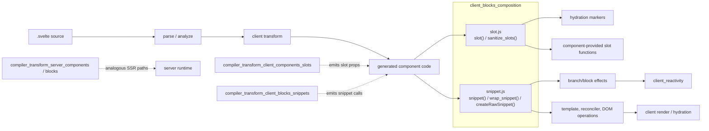
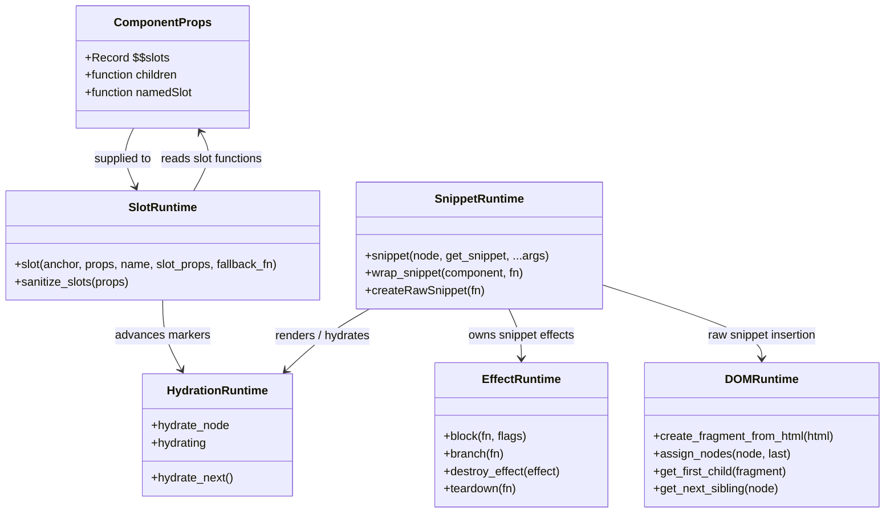
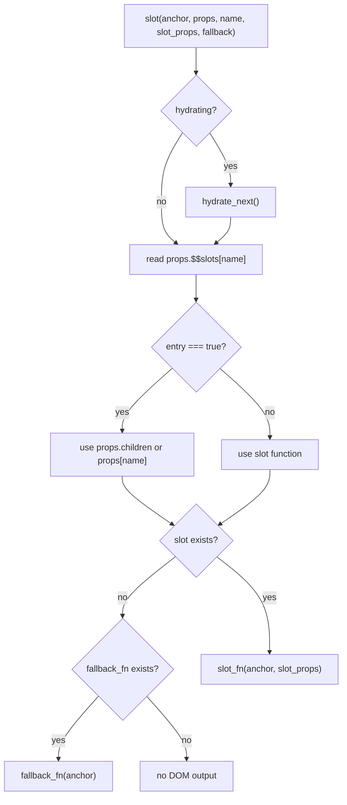
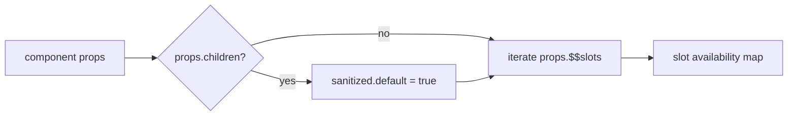
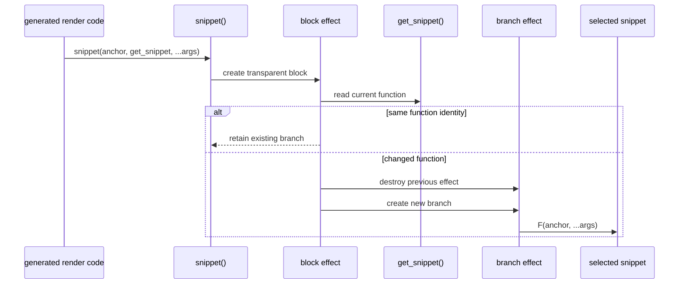
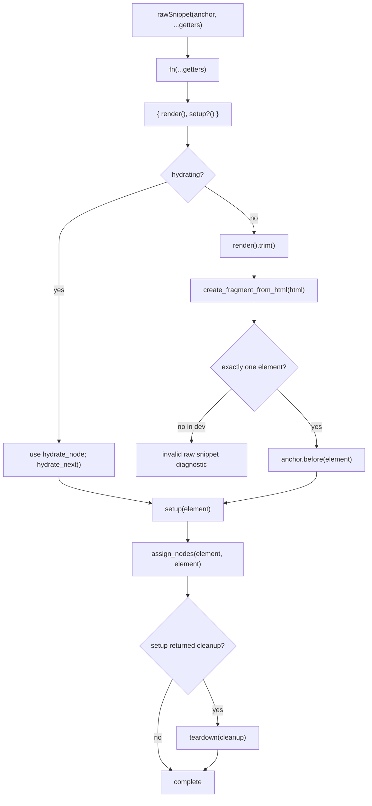
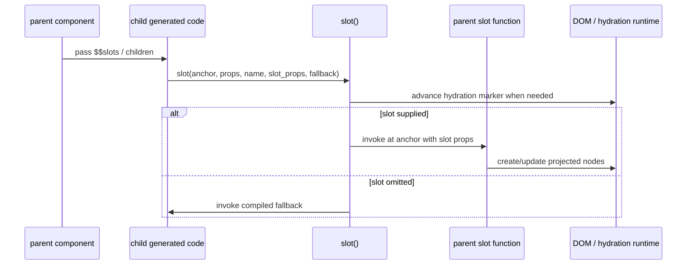
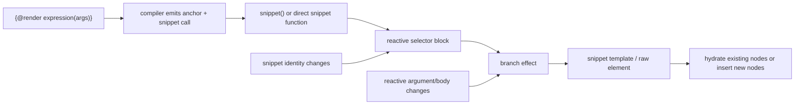

# client_blocks_composition

## Introduction

`client_blocks_composition` contains the client DOM runtime primitives that compose rendered
content from component-provided slots and reusable snippet functions. It is the composition layer
between compiler-generated component/block code and the lower-level DOM, hydration, and reactive
effect runtimes.

| Primitive | Responsibility |
| --- | --- |
| `slot` | Select a named slot supplied through component props, invoke it with slot props, or render a fallback. |
| `sanitize_slots` | Convert slot-bearing component props into the boolean slot-shape metadata used by component interop. |
| `snippet` | Reactively select and render a snippet function, replacing the previous snippet effect when the function changes. |
| `wrap_snippet` | Add development-time component ownership context and prevent accidental snippet stringification. |
| `createRawSnippet` | Adapt a user-supplied render/setup pair into a runtime snippet that can render and hydrate one element. |

This module is a child of the broader [client_blocks](client_blocks.md) runtime. Control-flow and
async behavior are documented in [client_blocks_control_flow](client_blocks_control_flow.md) and
[client_blocks_async_boundaries](client_blocks_async_boundaries.md); this document focuses on
content projection and reusable render functions.

## 1. Position in the system

The compiler determines *where* slots and snippets are used; this module determines *how* they
are attached to the live DOM. The principal compiler links are:

- [compiler_transform_client_components_slots](compiler_transform_client_components_slots.md)
  for `<slot>` and component slot projection.
- [compiler_transform_client_blocks_snippets](compiler_transform_client_blocks_snippets.md)
  for `{#snippet}` declarations and `{@render ...}` call sites.
- [compiler_transform_client_blocks](compiler_transform_client_blocks.md) for the parent visitor
  group and its relationship to the client transform.
- [compiler_transform_server_components](compiler_transform_server_components.md) and
  [compiler_transform_server_blocks](compiler_transform_server_blocks.md) for server-side output.

## 2. Component relationships

## 3. Slot projection

### `slot(anchor, $$props, name, slot_props, fallback_fn)`

`slot` renders one named slot at a comment anchor. Its behavior is intentionally small and
compiler-friendly:

1. If hydration is active, call `hydrate_next()` so the runtime consumes the existing SSR marker.
2. Read `$$props.$$slots?.[name]`.
3. Support snippet interop when the slot entry is the sentinel `true`; in that case, use
   `children` for the default slot or the named prop for a named slot.
4. If no slot function exists, invoke `fallback_fn(anchor)` when a fallback was compiled.
5. Otherwise invoke the slot function at the anchor with `slot_props`.

The slot function receives the anchor and the slot props object. In interop mode, the second
argument is a getter-like function returning `slot_props`, matching the calling convention used
by snippets. This lets component children and snippets participate in the same composition path.

### `sanitize_slots(props)`

`sanitize_slots` creates a shape-only object whose keys identify available slots:

- `props.children` marks the default slot as `default`.
- Every key in `props.$$slots` is copied with the value `true`.

The function does not render content, clone props, or validate slot bodies. It only creates stable
availability metadata for component plumbing. This separation keeps slot discovery independent of
DOM creation and allows the compiler/runtime component layer to pass slot shape information without
exposing arbitrary prop values.

## 4. Reactive snippet composition

### `snippet(node, get_snippet, ...args)`

`snippet` renders a potentially changing snippet expression at `node`. It creates a transparent
block effect and tracks the currently selected snippet function:

1. The current snippet starts as `noop`.
2. The block reads `get_snippet()` on each reactive run.
3. If the function identity is unchanged, rendering is skipped.
4. If it changed, the old branch effect is destroyed.
5. In development, a null/undefined result reports an invalid-snippet diagnostic.
6. A new branch invokes the selected function with `anchor` and the supplied arguments.

The identity check is significant: changing the snippet expression replaces the rendered branch,
while changes observed by the snippet's own reactive reads are handled by the nested effects it
creates. `EFFECT_TRANSPARENT` prevents this selector wrapper from introducing an unnecessary
reactive boundary in the visible update hierarchy.

If hydration is active, the function initially receives the normal node reference while the local
anchor is then redirected to `hydrate_node`. This allows the snippet runtime to align with existing
SSR DOM markers. Hydration details are shared with [client_render_and_templates](client_render_and_templates.md).

## 5. Development wrapping and raw snippets

### `wrap_snippet(component, fn)`

`wrap_snippet` is used by development builds around compiler-generated snippet functions. The
returned wrapper:

- saves the current component function context;
- sets the owning component while the snippet executes;
- restores the previous context in a `finally` block;
- marks the function so accidental stringification produces a useful diagnostic.

This is runtime validation and ownership bookkeeping; production rendering does not need the
additional wrapper. Related diagnostics and dev-only runtime services are described in
[client_dev_tooling](client_dev_tooling.md).

### `createRawSnippet(fn)`

`createRawSnippet` adapts a programmatic snippet factory. The factory receives getter parameters and
returns `{ render, setup? }`:

In non-hydrating mode, the rendered HTML is trimmed, parsed into a fragment, and the first child
is inserted before the anchor. Development mode rejects output that is not exactly one element;
this prevents ambiguous ownership and insertion behavior. During hydration, existing DOM is reused
instead of parsing or inserting new HTML.

The optional `setup` callback runs after the element is available. If it returns a function, that
function is registered with `teardown`, tying external resources to the element's effect lifetime.

## 6. End-to-end composition flows

### Component slot flow

### Rendered snippet flow

## 7. Dependency boundaries and invariants

| Dependency | Role in this module |
| --- | --- |
| `internal/client/reactivity/effects.js` | Creates transparent blocks and snippet branches; destroys and tears down effects. |
| `internal/client/context.js` | Tracks development component ownership while wrapped snippets run. |
| `internal/client/dom/hydration.js` | Advances SSR markers and supplies the current hydration node. |
| `internal/client/dom/reconciler.js` | Parses raw snippet HTML into a fragment. |
| `internal/client/dom/template.js` | Associates raw snippet nodes with an effect/template range. |
| `internal/client/dom/operations.js` | Finds raw snippet element boundaries. |
| `internal/shared/validate.js` | Prevents unsafe snippet stringification. |
| `internal/client/warnings.js` and `errors.js` | Report invalid raw snippets and invalid dynamic snippets. |

Important invariants for maintainers:

- Slot fallback is rendered only when the requested slot is absent; an explicitly supplied slot
  owns the projection decision.
- A dynamic snippet branch must be destroyed before its replacement is created, preventing stale
  DOM and effects from surviving a snippet identity change.
- Hydration paths consume markers rather than inserting duplicate content.
- Raw snippets are single-element compositions in development mode; changing that contract affects
  insertion, node ownership, and cleanup semantics.
- Cleanup returned by raw snippet setup must be registered with the effect system so unmounting or
  branch replacement releases resources.

## 8. Maintenance guidance

When changing `slot.js`, verify default and named slots, missing-slot fallback, snippet interop,
and hydration. When changing `snippet.js`, verify snippet identity replacement, null handling in
development, component-context restoration after exceptions, raw snippet hydration, invalid
multi-node output, and setup cleanup.

The most relevant neighboring tests and implementation areas are the compiler visitors linked
above, [client_blocks](client_blocks.md), [client_reactivity](client_reactivity.md), and
[client_render_and_templates](client_render_and_templates.md). Keep this document focused on
composition semantics; changes to control flow, async boundaries, or element bindings belong in
their respective module documentation.
