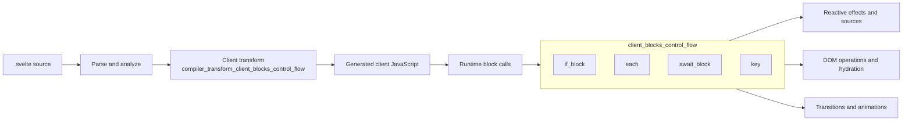
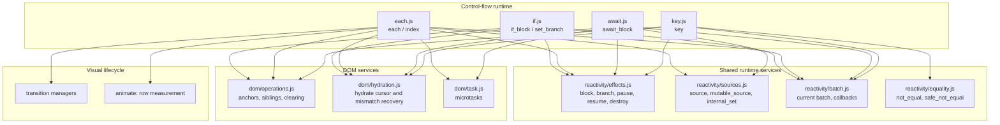
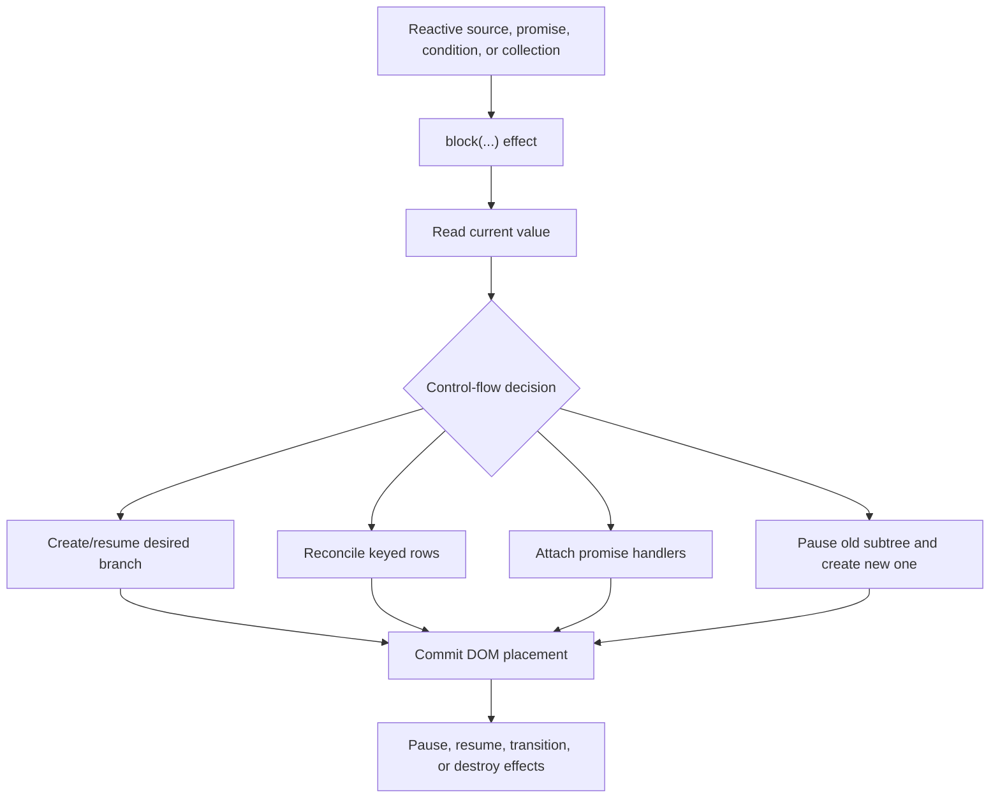
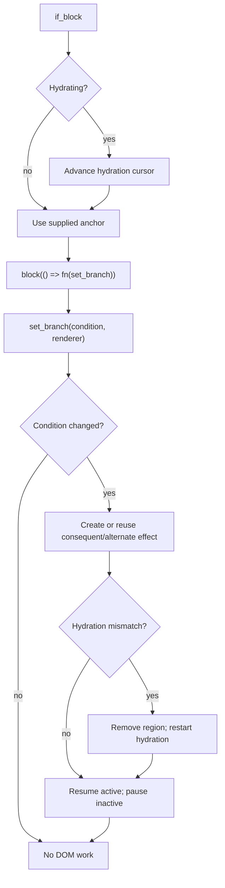
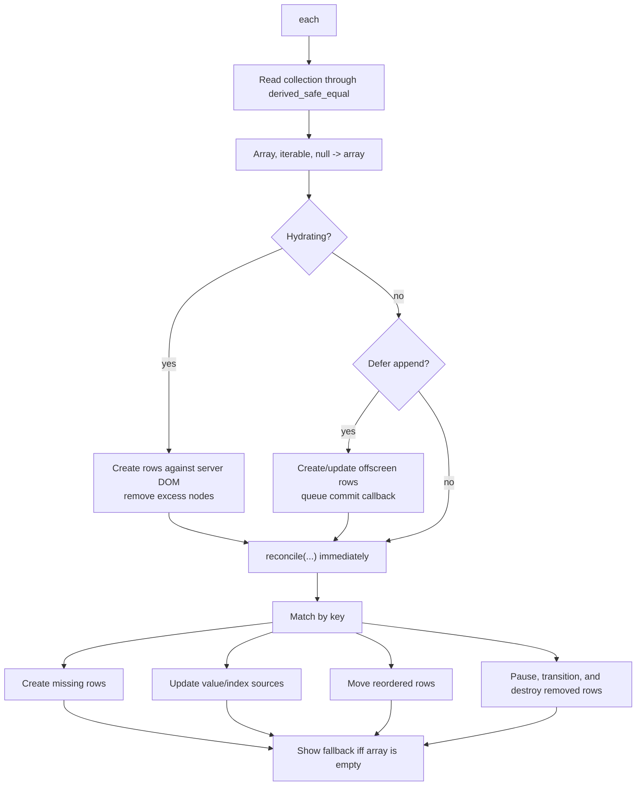
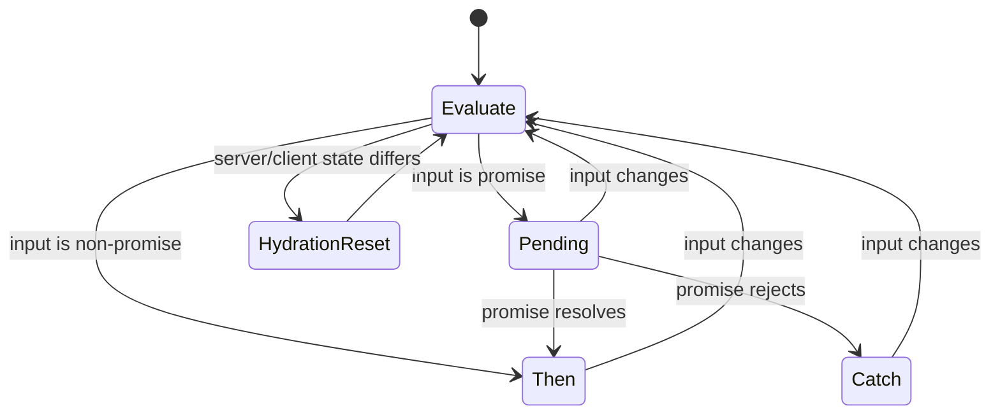
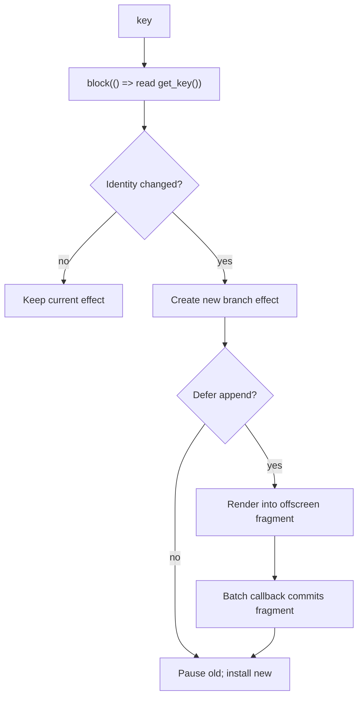

# client_blocks_control_flow

## Introduction

`client_blocks_control_flow` is the Svelte client-runtime layer for template control-flow blocks. It turns reactive changes into DOM insertions, removals, moves, pauses, resumes, and transitions for:

| Svelte construct | Runtime entry point | Primary responsibility |
| --- | --- | --- |
| `{#if}` / `{:else if}` / `{:else}` | `if_block` | Activate one of two mutually exclusive branches |
| `{#each}` / `{:else}` | `each` | Key, create, update, reorder, animate, and destroy collection rows |
| `{#await}` / `{:then}` / `{:catch}` | `await_block` | Switch between pending, fulfilled, and rejected promise branches |
| `{#key}` | `key` | Recreate a subtree whenever its identity value changes |

The module is the runtime counterpart of the compiler control-flow visitors described in [compiler_transform_client_blocks_control_flow](compiler_transform_client_blocks_control_flow.md). It sits inside the broader [client_blocks](client_blocks.md) runtime group and relies on [client_reactivity](client_reactivity.md), DOM operations, hydration, and transition/effect infrastructure.

## Position in the system



The runtime functions do not parse template syntax. The compiler emits calls with anchors, expressions, branch render functions, collection/key functions, and bit flags. Each runtime function then owns the lifecycle of the DOM region represented by its anchor.

## Architecture



### Runtime contracts

All four entry points use a `TemplateNode` as an anchor. Generated branch functions receive an anchor node and append their subtree relative to it. Effects represent the branch or row lifecycle; pausing makes a subtree inert while preserving it for possible reuse, and destruction removes it permanently.

Hydration is cross-cutting. When `hydrating` is true, the functions advance the hydration cursor, compare the server-rendered marker/content with the client result, and restart the affected region when they detect a mismatch.

## Data flow



The important distinction is that effects are the unit of lifecycle, while anchors are the unit of DOM placement. A block can therefore pause a branch without losing its location, or move a keyed row without rebuilding its subtree.

## `if_block`: mutually exclusive branches

`if_block(node, fn, elseif)` creates a reactive block around a branch registration callback. The callback receives `set_branch`, which records a condition and a branch renderer. The first truthy branch becomes the consequent; otherwise the alternate branch is used.



Only the selected effect is resumed. The previous effect is paused and cleared after its pause lifecycle completes. If appending is deferred by the current batch, the selected branch is rendered into an offscreen `DocumentFragment`; `commit` later removes its temporary text anchor and inserts the fragment before the real anchor.

`elseif` sets `EFFECT_TRANSPARENT`, allowing an `{:else if}` chain to preserve the intended transition boundary rather than behaving like an unrelated nested block.

## `each`: keyed collection reconciliation

`each(node, flags, get_collection, get_key, render_fn, fallback_fn)` maintains an `EachState` containing a `Map` of keys to linked `EachItem` records. Each record stores its value source, index source, key, effect, animation handle, and `prev`/`next` links.

The `index` helper is the default index accessor and simply returns the current numeric index. `set_current_each_item` exposes the row currently being created so animation directives can associate themselves with the correct item.



### Reconciliation behavior

`reconcile` performs a keyed diff while preserving row effects whenever keys match:

1. Existing keys are updated, including reactive item and index sources when the corresponding flags are set.
2. New keys create a row effect and link it into the doubly linked order list.
3. Existing rows in a different position are moved by relocating all DOM nodes from the row start to its successor boundary.
4. Rows not present in the new collection are paused. Their transitions run before effects are destroyed and links are removed.
5. When animation is enabled, existing and removed rows are measured/fixed and surviving rows apply their animation in a queued microtask.

The algorithm also handles a controlled each block. In that mode the parent element is the container, a text anchor is maintained inside it, and an empty collection can use a fast path that clears the parent content while retaining the anchor.

`fallback_fn` is itself a branch effect. It is resumed when the normalized array is empty, created on first use, and paused/cleared once at least one row exists.

## `await_block`: promise state machine

`await_block` models three states: `PENDING`, `THEN`, and `CATCH`. It creates sources for the resolved value and error so branch renderers can react to the settled result.



When a promise changes, handlers capture that specific promise and ignore late results from older promises (`if (promise !== input) return`). The pending branch is delayed by one microtask on the client so an already-resolved promise does not visibly flash a pending state. During hydration, pending content can be rendered immediately according to the server marker.

On resolution or rejection, `internal_set` updates the corresponding source and `update` resumes the selected branch while pausing the other two. The update restores the captured component/effect context, then calls `flushSync` so promise settlement is reflected without an extra tick. A rejection is rethrown when no catch branch exists.

## `key`: identity-driven recreation

`key(node, get_key, render_fn)` compares the current identity against the previous identity. Equality is `not_equal` in runes mode and `safe_not_equal` in legacy mode.



Unlike an each block, `key` never attempts to patch the existing subtree. A changed key always pauses the old effect and installs a newly rendered branch. Deferred commits prevent intermediate DOM states from being exposed during a batch.

## Hydration and mismatch recovery

```mermaid
sequenceDiagram
    participant H as Hydration cursor
    participant B as Control-flow block
    participant D as DOM region
    participant E as Branch/row effect

    H->>B: set current node / read marker
    B->>B: Compare expected branch, row count, or promise state
    alt Match
        B->>E: Render against existing nodes
        E->>H: Advance through hydrated nodes
    else Mismatch
        B->>D: remove_nodes()
        B->>H: set_hydrate_node(anchor); set_hydrating(false)
        B->>E: Render fresh client DOM
        B->>H: Restore hydrating mode for following content
    end
```

`if_block` and `await_block` compare hydration markers against branch state. `each` additionally recognizes the `HYDRATION_END` marker and removes surplus server rows. `key` participates in cursor setup but has no branch-state marker of its own. The shared hydration implementation is documented in the client rendering/runtime documentation referenced by [client_blocks](client_blocks.md).

## Dependency and lifecycle notes

- `effects.js` supplies `block`, `branch`, pausing, resuming, destruction, and transition coordination. The control-flow module should not directly manipulate effect flags outside those APIs.
- `sources.js` makes each-row values, row indices, await values, and await errors reactive.
- `batch.js` provides deferred commit callbacks and skipped-effect tracking. This is used by `if`, `each`, and `key` when DOM insertion is deferred.
- `operations.js` and `hydration.js` abstract anchors, sibling traversal, fragments, and server DOM reuse.
- `equality.js` preserves the distinction between runes and legacy change detection for keyed blocks.
- `task.js` schedules microtasks for each-row animation application and delayed await-pending display.

For broader reactivity semantics, see [client_reactivity](client_reactivity.md). For the compiler that supplies these runtime call arguments, see [compiler_transform_client_blocks_control_flow](compiler_transform_client_blocks_control_flow.md) and [compiler_transform_client_blocks](compiler_transform_client_blocks.md). For the server-rendering counterparts, see [compiler_transform_server_blocks](compiler_transform_server_blocks.md).

## Maintenance guidance

When changing this module, preserve these invariants:

1. A block must retain a stable anchor while its active content changes.
2. Inactive effects must be paused before they are cleared or destroyed.
3. Keyed each rows must keep `state.items`, linked-list pointers, and effect pointers consistent after every create, move, or remove operation.
4. Promise callbacks must ignore stale promises.
5. Hydration mismatch recovery must restore hydration mode before later sibling content is processed.
6. Deferred DOM work must be committed through the active batch rather than inserted synchronously.

These invariants connect generated compiler code, client reactivity, hydration, and transitions; regressions commonly appear as duplicate DOM, stale branches, lost row state, or hydration cursor drift.
