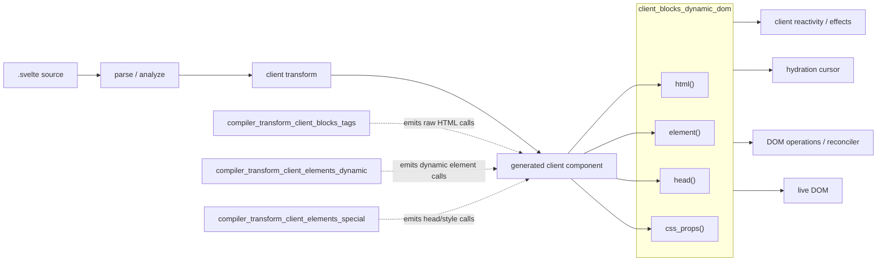
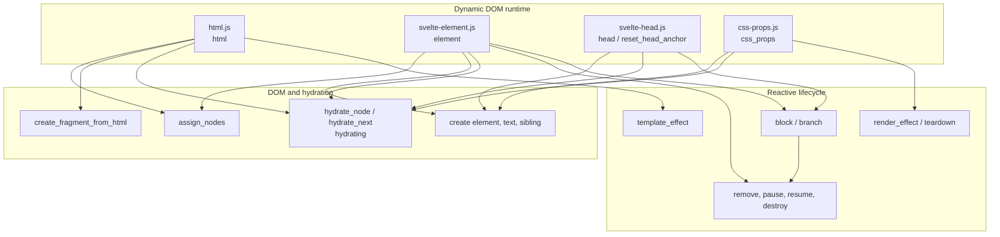
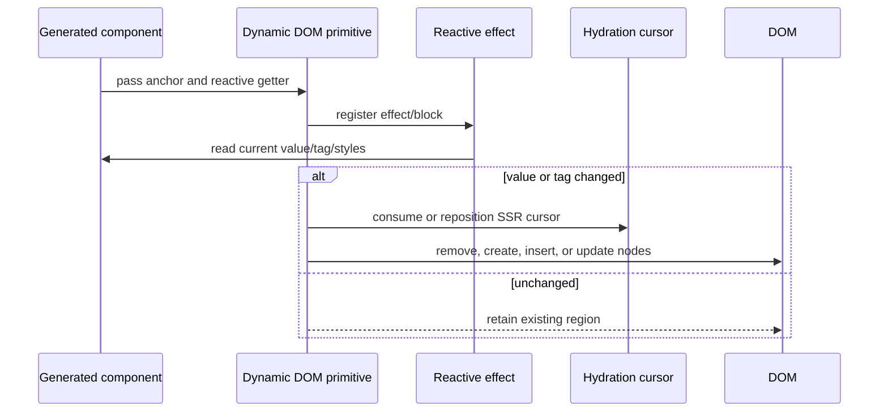
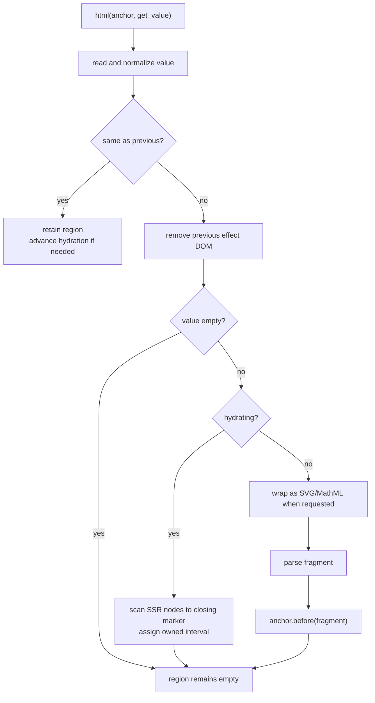
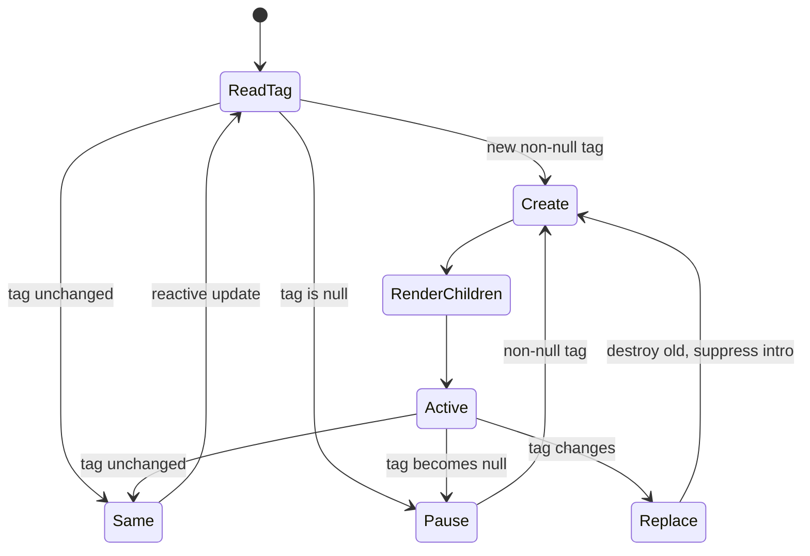
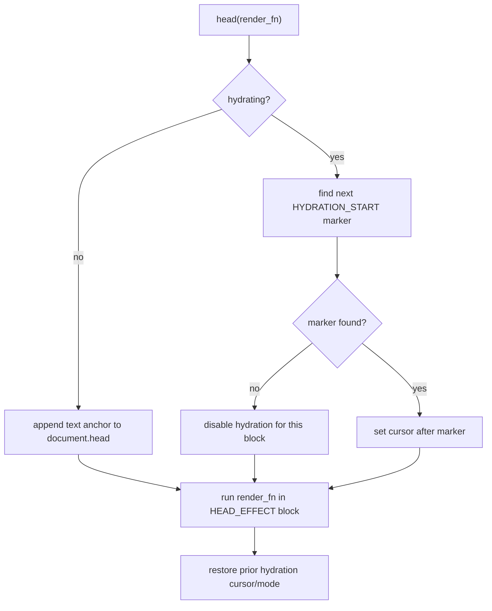
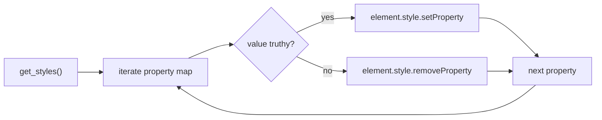
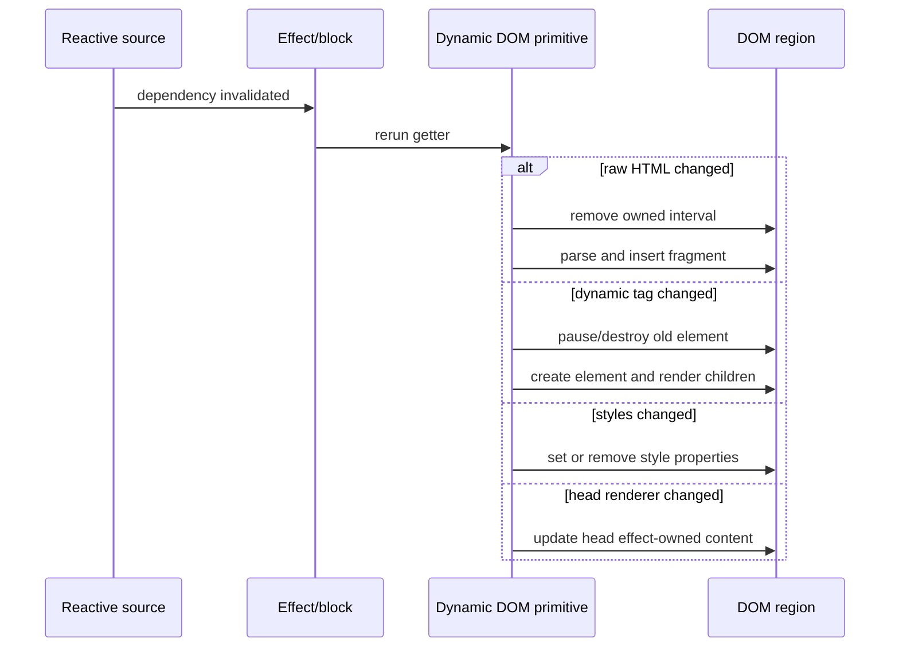
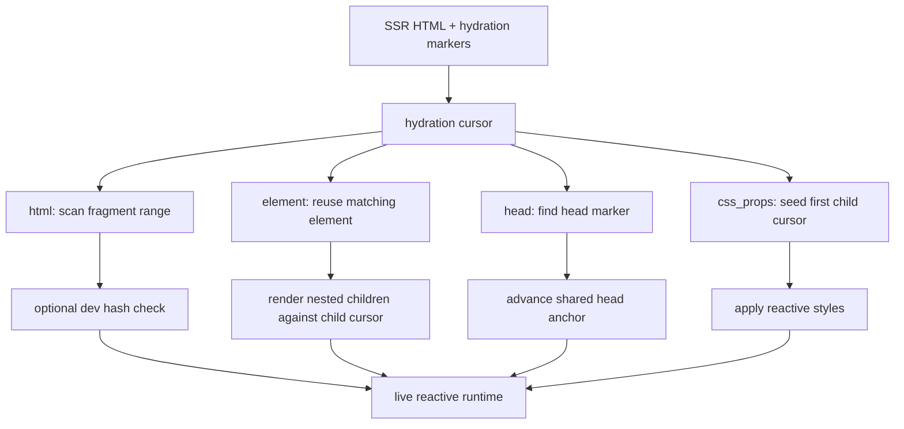

# client_blocks_dynamic_dom

## Introduction

`client_blocks_dynamic_dom` contains the Svelte client-runtime primitives that update DOM whose
shape, tag name, namespace, head placement, or inline style properties can change at runtime. It
is a child of the client DOM blocks runtime and is used by compiler-generated code for
`{@html}`, `<svelte:element>`, `<svelte:head>`, and `<svelte:style>`/dynamic CSS-property output.

| Primitive | Responsibility |
| --- | --- |
| `html` | Replace or hydrate a raw HTML region, including SVG and MathML fragments. |
| `element` | Create, replace, pause, resume, and hydrate an element whose tag is dynamic. |
| `head` | Render reactive content into `document.head` while coordinating SSR hydration markers. |
| `css_props` | Apply or remove a reactive map of CSS custom properties or inline style properties. |

The module is deliberately small: compiler visitors decide *when* these primitives are called,
while this runtime owns DOM placement and lifecycle. Control-flow blocks, snippets, and async
boundaries are documented separately in [client_blocks_control_flow](client_blocks_control_flow.md),
[client_blocks_composition](client_blocks_composition.md), and
[client_blocks_async_boundaries](client_blocks_async_boundaries.md).

## Position in the system

The compiler-side dynamic-element visitor is described in
[compiler_transform_client_elements_dynamic](compiler_transform_client_elements_dynamic.md).
The broader client block compiler relationship is described in
[compiler_transform_client_blocks](compiler_transform_client_blocks.md); the runtime’s reactive
primitives are described in [client_reactivity](client_reactivity.md).

## Architecture and dependencies

### Shared contracts

- A compiler-generated anchor (`Comment`, `Text`, or `Element`) identifies where a dynamic region
  is inserted.
- `template_effect`, `block`, or `render_effect` reruns a getter when its reactive dependencies
  change.
- `hydrate_node`, `hydrate_next`, and `set_hydrate_node` maintain the current SSR DOM cursor.
- `assign_nodes(start, end)` records the DOM interval owned by an effect so it can later be
  removed as one region.
- Element creation and sibling traversal are delegated to the DOM operations layer; the module
  does not implement a separate virtual DOM.

## Component interaction

## `html`: raw HTML regions

`html(node, get_value, svg, mathml, skip_warning)` treats the value as an HTML fragment. It keeps
the previous string value and creates a `template_effect` that performs these operations:

1. Read the current value, coercing `null`/`undefined` to the empty string.
2. Do nothing when the resulting value is unchanged; during hydration it still advances the
   hydration cursor.
3. Remove the previous effect-owned DOM interval when the value changes.
4. Parse the new value with `create_fragment_from_html` and insert it immediately before the
   anchor. SVG and MathML values are wrapped in their namespace element before extraction.
5. During hydration, reuse the server nodes between the current hydration node and the empty
   closing marker. A missing closing marker raises `HYDRATION_ERROR` after reporting a mismatch.

The implementation intentionally uses an HTML fragment parser rather than the script-aware helper:
raw `{@html}` insertion must not execute `<script>` tags. In development, a server hash is compared
with the client value and `hydration_html_changed` is reported when content differs; the runtime
does not attempt an expensive mismatch repair.

## `element`: dynamic element names

`element(node, get_tag, is_svg, render_fn, get_namespace, location)` implements
`<svelte:element this={...}>`. The tag getter is read inside a reactive `block`. When the tag is
unchanged, the block exits without DOM work. When it changes:

- A `null` tag pauses the current effect, producing no element while preserving its lifecycle for
  a possible resumed render.
- Returning to the paused tag resumes that effect and can preserve outro behavior.
- Changing from one non-null tag to another destroys the old effect immediately and suppresses
  intro transitions for the replacement.
- The next tag is created with `document.createElement` or `createElementNS`; an explicit namespace
  getter takes precedence over the `is_svg` flag and automatic `svg` detection.
- `render_fn` receives the new element and a child anchor, allowing generated children, actions,
  bindings, and nested blocks to initialize inside it.

The runtime records the current keyed-each item so an `animate:` directive created inside the
dynamic element can associate itself with the correct row. In development it also attaches source
location metadata. Hydration reuses the existing element when the cursor points at an element and
temporarily disables hydration for a raw-text element with no usable child anchor.

## `head`: reactive document head content

`head(render_fn)` creates a `HEAD_EFFECT` block around a renderer that receives a head anchor. In
non-hydrating mode the anchor is a text node appended to `document.head`. The renderer can then
create title, meta, link, style, or other compiler-generated head content relative to that marker.

During hydration, the function searches `document.head` for the next `HYDRATION_START` comment,
sets the cursor to the following node, and lets the nested renderer consume its SSR output. Multiple
head blocks share `head_anchor` so each block starts after the previous block’s marker range. If no
opening marker exists—for example, when a host framework rendered the body but omitted head
content—hydration is disabled for this block and normal client rendering proceeds.

The previous hydration cursor and hydration mode are restored in `finally`, even if the renderer
throws. `reset_head_anchor` clears the shared cursor for a new hydration/rendering session.

## `css_props`: reactive inline style maps

`css_props(element, get_styles)` associates a style getter with a `render_effect`. The getter
returns a `Record<string, string>`; each key is applied using `style.setProperty`. Falsy values
remove that property with `style.removeProperty`, which makes the map suitable for both CSS custom
properties and ordinary hyphenated inline properties.

When hydrating, the first child of the element becomes the next hydration node before the effect is
registered. This preserves the cursor contract for nested generated content while style updates are
applied independently of child DOM creation. The primitive does not diff or remove keys absent from
the newest map; callers must return a falsy value for a property that should be removed.

## End-to-end process flows

### Client update

### SSR hydration

## Failure modes and maintenance notes

- Raw HTML hydration requires a closing empty comment marker. Missing markers are treated as a
  hydration failure rather than silently attaching an incomplete range.
- A server/client raw HTML difference is diagnosed in development, but the runtime intentionally
  avoids repairing the server DOM during the hydration pass.
- Dynamic element children are rendered even for a void element so actions and related setup code
  can run; invalid children are discarded by the browser/runtime behavior and warned elsewhere.
- Dynamic tag changes destroy the old subtree, whereas a temporary `null` tag pauses it. Changes to
  this distinction affect transitions and resource cleanup.
- `head_anchor` is module state. New render or hydration entry points must call
  `reset_head_anchor` when a previous head cursor must not be reused.
- `css_props` only processes keys returned by the latest map. To clear a property, return an empty
  or falsy value for that key.

## Related modules

- [client_blocks_control_flow](client_blocks_control_flow.md) — lifecycle and DOM reconciliation
  for conditional, keyed, awaited, and repeated blocks.
- [client_blocks_composition](client_blocks_composition.md) — slots and snippets that can render
  inside dynamic elements and head regions.
- [client_blocks_async_boundaries](client_blocks_async_boundaries.md) — async effects and
  boundaries that may contain these primitives.
- [client_reactivity](client_reactivity.md) — source tracking, effects, batching, and store
  interoperability used by the getters and lifecycle wrappers.
- [compiler_transform_client_elements_dynamic](compiler_transform_client_elements_dynamic.md) —
  compiler generation for dynamic element calls.
- [compiler_transform_client_blocks_tags](compiler_transform_client_blocks_tags.md) — compiler
  handling of raw HTML and related leaf tags.
