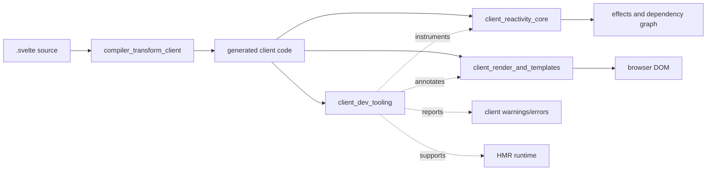
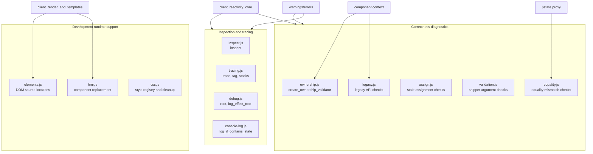
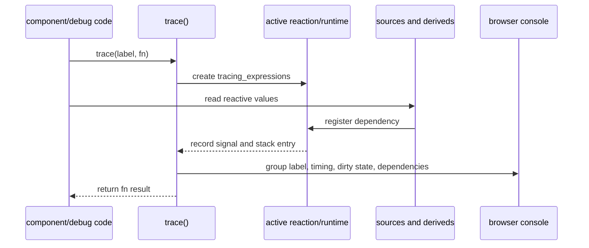
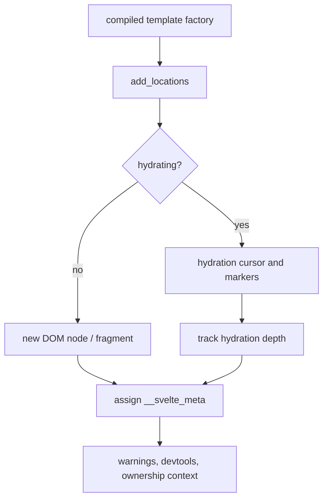
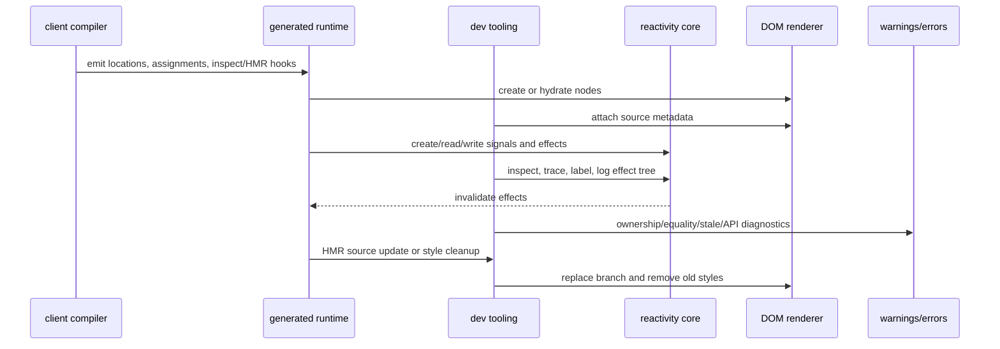

# client_dev_tooling

`client_dev_tooling` is Svelte's browser-side development instrumentation layer. It is compiled
into development builds to make reactive state, effect trees, component ownership, source
locations, HMR replacement, CSS cleanup, invalid assignments, snippets, and legacy API usage
observable and actionable. Most helpers preserve the production result and add metadata or
warnings; the HMR wrapper and style cleanup helpers also support the development workflow itself.

The module is not a second rendering engine. It is an adapter between compiler-generated code,
the client reactivity graph, DOM rendering/hydration, component context, and the warning/error
subsystems. See [client_reactivity_core](client_reactivity_core.md) for signal and effect
semantics and [client_render_and_templates](client_render_and_templates.md) for DOM creation,
hydration, and component lifecycle behavior.

## Position in the system

Development helpers are normally reached through compiler-emitted calls or dev-only runtime
branches. The module has no public application-facing state model: its inputs are signals,
component props, generated DOM factories, source locations, and runtime values; its outputs are
console groups, metadata, warning/error calls, replacement component instances, and cleanup.

## Architecture

### Component responsibilities

| Component | Role | Main integration point |
| --- | --- | --- |
| `inspect.js` | Synchronously snapshots values and reports `init`/`update` events | inspect effects and render effects |
| `tracing.js` | Records reactive dependencies, labels signals, and prints dependency traces | active reactions, derived signals, runtime tracking |
| `ownership.js` | Detects mutation or binding of state owned by a parent component | component context and `$state` markers |
| `hmr.js` | Recreates a component when its source signal changes while preserving the wrapper identity | branch effects, hydration cursor, HMR source signal |
| `elements.js` | Adds filename/line/column metadata to created or hydrated elements | template factories and hydration |
| `debug.js` | Finds effect roots and recursively prints effect/dependency trees | effect flags and dependency links |
| `console-log.js` | Converts proxied state to snapshots before console output | `$state` proxy marker and warning layer |
| `equality.js` | Detects comparisons that confuse proxied and raw values | proxy unwrapping and patched array methods |
| `assign.js` | Detects assignment expressions whose observed value differs from the assigned value | untracked property read and stale-assignment warning |
| `css.js` | Tracks style nodes by component CSS hash and removes them on HMR cleanup | style insertion and HMR lifecycle |
| `validation.js` | Validates snippet anchors and callable snippet arguments | snippet rendering |
| `legacy.js` | Reports removed/changed component instance APIs and invalid construction targets | legacy compatibility layer |

## Inspection and reactive debugging

`inspect(get_value, inspector)` installs an `$inspect` diagnostic. Its inspect effect executes
synchronously so the captured stack is close to the read that caused it. The value is cloned with
`snapshot(value, true, true)` before calling the inspector, preventing later proxy mutations from
changing the displayed result. The first successful run is reported as `init`; subsequent runs
are `update`. The callback is wrapped in `untrack` so logging does not become a new dependency.

If the getter throws, the error is retained. A companion render effect retries the getter beside
the inspect effect and logs the saved error only when the render path still exists. This avoids
reporting errors from an inspect effect that was already destroyed.

`trace(label, fn)` temporarily records the signals read while `fn` executes. Each entry includes
the signal's value and optional creation/update stacks. Derived dependencies are expanded
recursively, and signals are styled according to whether their write version makes them dirty for
the active reaction. `tag(source, label)` labels a signal and forwards the label into a proxied
value; `get_stack` removes Svelte-internal frames so diagnostics point to application code.

`root(effect)` walks parent links to the root effect. `log_effect_tree` then displays effect kind,
clean/dirty status, callsite, function body, dependencies, derived chains, and children. This is
particularly useful for understanding why a branch or render effect reran; the actual scheduling
rules remain in [client_reactivity_core](client_reactivity_core.md).

`log_if_contains_state` is a safe console adapter. It untracks the operation, snapshots any object
carrying the state marker, emits the relevant warning, and forwards the transformed values to the
requested console method. Ordinary values are passed through unchanged.

## Ownership, equality, and assignment diagnostics

`create_ownership_validator(props)` returns mutation and binding callbacks used by generated
component code. The mutation callback walks a nested prop path. It permits explicitly bound,
unset, entry-level, or non-state paths; otherwise it reports that a child mutated state owned by
its parent. The binding callback reports an interrupted binding chain when a child receives a
state proxy without a corresponding bound prop. Component filenames and source locations are
sanitized before being sent to the warning layer.

The ownership check relies on the component-context parent chain and `STATE_SYMBOL` markers. The
context lifecycle itself is documented in [client_render_and_templates](client_render_and_templates.md),
while proxy creation and propagation belong to [client_reactivity_core](client_reactivity_core.md).

`strict_equals` and `equals` preserve JavaScript comparison results but compare again after
`get_proxied_value`. A difference indicates that one operand is a state proxy and the other is its
raw value, so `state_proxy_equality_mismatch` is reported. `init_array_prototype_warnings`
temporarily wraps `indexOf`, `lastIndexOf`, and `includes` with the same raw/proxy check. It stores
a cleanup function on `Array` so REPL reinitialization does not stack patches indefinitely.

`assign`, `assign_and`, `assign_or`, and `assign_nullish` implement the corresponding assignment
forms and then read the property without tracking. If the observed value differs from the value
returned by the assignment, `assignment_value_stale` identifies the property and source location.
This catches cases where a proxy or accessor makes the immediately observed value differ from the
assignment expression's result.

## Source metadata and HMR

`add_locations(fn, filename, locations)` wraps a DOM factory. After the factory creates or locates
nodes, it associates each element with `__svelte_meta = { parent: dev_stack, loc }`. Nested location
arrays are assigned through the first child. During hydration, hydration boundary comments adjust
the traversal depth so metadata is attached only to actual elements in the current range. This
metadata powers readable warnings and editor/devtools source mapping without changing DOM output.

`hmr(original, get_source)` returns a wrapper whose source is a reactive `Source`. The wrapper
creates a transparent block effect that reads the current component source. On replacement it
clears the prior instance, destroys its branch effect, and constructs the new component into the
same anchor. Intro transitions are disabled during replacement to avoid presenting a hot update as
a fresh mount. Property descriptors are copied onto the stable `instance` object, preserving
getters and setters for consumers holding the original component result. If hydration is active,
the current hydration node is used as the anchor. HMR metadata retains the original component and
its source signal for the accept/update layer.

## Styles, snippets, and legacy compatibility

The dev CSS registry maps a style hash to all corresponding `HTMLStyleElement`s. `register_style`
adds a node to the set; `cleanup_styles` removes every node for a hash and deletes the registry
entry. This is intentionally hash-based so HMR can remove styles from old component instances even
when several instances share one compiled stylesheet. Style installation itself belongs to
[client_render_and_templates](client_render_and_templates.md).

`validate_snippet_args(anchor, ...args)` checks that the anchor is a DOM `Node` and that every
snippet argument is a function. Invalid values call the internal error subsystem; it does not
attempt recovery or alter snippet rendering. Snippet block behavior is described in
[client_blocks_composition](client_blocks_composition.md).

`check_target(target)` reports use of a component constructor through an invalid legacy API. The
object returned by `legacy_api()` exposes `$destroy`, `$on`, and `$set` methods that all report the
corresponding changed API when invoked. This keeps failures explicit while the legacy runtime
continues to be documented in [legacy_compat](legacy_compat.md) and
[legacy_compatibility_and_migration](legacy_compatibility_and_migration.md).

## End-to-end development flow

## Invariants and maintenance guidance

- Dev wrappers must preserve the wrapped function's return value and normal rendering semantics.
- Diagnostic callbacks should use `untrack`; logging or validation must not add reactive
  dependencies.
- Snapshots are required when displaying proxied state, otherwise console output can reflect a
  later mutation rather than the observed value.
- Hydration-aware location and HMR paths must respect the shared hydration cursor and marker
  ranges; see [client_render_and_templates](client_render_and_templates.md).
- HMR replacement must destroy the previous effect branch and preserve the stable instance
  descriptors, or listeners and component exports can leak across updates.
- Array prototype patches must always be reversible and idempotent.
- Ownership checks should report only state-proxy paths that cross a component boundary; bound and
  intentionally unset props are valid exceptions.
- Warning/error routing belongs to the existing internal diagnostics layer; this module should
  not duplicate formatting or throw where the runtime contract expects a warning.

## Related modules

- [client_reactivity_core](client_reactivity_core.md) — signals, derived values, effects, batching,
  proxies, and runtime tracking.
- [client_render_and_templates](client_render_and_templates.md) — component context, DOM
  factories, hydration, mounting, and style installation.
- [client_blocks](client_blocks.md) — block/effect structures consumed by HMR and debugging.
- [client_blocks_composition](client_blocks_composition.md) — snippets and slot composition.
- [client_dom_elements](client_dom_elements.md) — element operations, events, bindings, and
  transitions.
- [compiler_transform_client_core](compiler_transform_client_core.md) — compiler-generated calls
  and state/effect lowering that consume these helpers.
- [legacy_compat](legacy_compat.md) and [legacy_compatibility_and_migration](legacy_compatibility_and_migration.md)
  — legacy component runtime and migration behavior.
- [compiler_transform_server](compiler_transform_server.md) — server-side compilation and the
  SSR path that supplies hydration structure; this module itself is client/dev-only.
