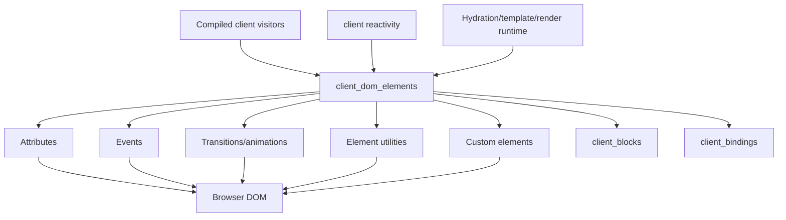
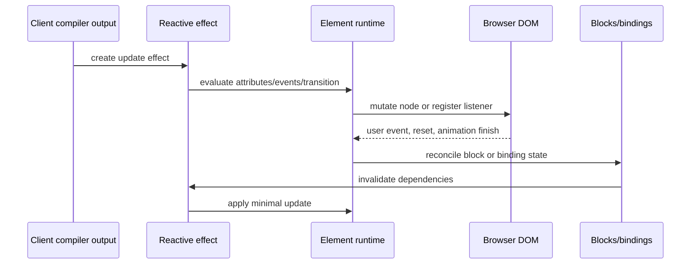

# `client_dom_elements`

## Purpose

The `client_dom_elements` module is Svelte’s browser-side element runtime. It turns compiler-generated instructions into DOM mutations, event handling, transitions, hydration-safe form behavior, and custom-element lifecycle management. It sits below compiled client visitors and beside the block, binding, rendering, and reactivity runtimes.

## Architecture

The module is intentionally a runtime boundary: compiler visitors decide *which* operation is needed, while these functions decide *how* to apply it safely and efficiently to a live browser node.

## Submodules

| Area | Documentation | Main role |
| --- | --- | --- |
| Attributes | [client_dom_elements_attributes.md](client_dom_elements_attributes.md) | Diff properties/attributes, hydration, forms, classes/styles, and attachments |
| Events | [client_dom_elements_events.md](client_dom_elements_events.md) | Install, delegate, propagate, replay, and validate events |
| Transitions | [client_dom_elements_transitions.md](client_dom_elements_transitions.md) | Manage intros/outros and keyed movement animations |
| Utilities | [client_dom_elements_utilities.md](client_dom_elements_utilities.md) | Autofocus, textarea hydration, and form-reset coordination |
| Custom elements | [client_dom_elements_custom_elements.md](client_dom_elements_custom_elements.md) | Wrap Svelte components as typed custom elements with slots |

## End-to-end data flow

## Module relationships

- [compiler_transform_client_elements.md](compiler_transform_client_elements.md) and [compiler_transform_client_directives.md](compiler_transform_client_directives.md) are the primary producers of calls into this runtime.
- [client_blocks.md](client_blocks.md) owns conditional, each, await, snippet, and dynamic-element structure; this module supplies the concrete element operations used inside those blocks.
- [client_bindings.md](client_bindings.md) synchronizes native control state and therefore shares form-control conventions with the attributes layer.
- [client_render_and_templates.md](client_render_and_templates.md) creates, hydrates, traverses, and removes nodes; this module updates the nodes after creation.
- [client_reactivity.md](client_reactivity.md) supplies effects, reactions, batching, and stores used by reactive attribute and transition work.
- [server_runtime.md](server_runtime.md) emits the SSR DOM that this module later hydrates; URL and form-default handling specifically prevent hydration from causing duplicate requests or state loss.
- [legacy_compat.md](legacy_compat.md) supplies the legacy component adapter used by custom elements.

## Operational invariants

1. DOM writes are cached or diffed whenever possible.
2. Hydration preserves existing browser state and avoids repeating resource loads.
3. User callbacks and custom-element lifecycle work execute outside the active reactive context.
4. Effect ownership controls cleanup for listeners, transitions, attachments, and mounted custom-element instances.
5. Native platform semantics—form reset, event bubbling, slots, property setters, and Web Animations—are preserved where Svelte adds reactivity around them.
