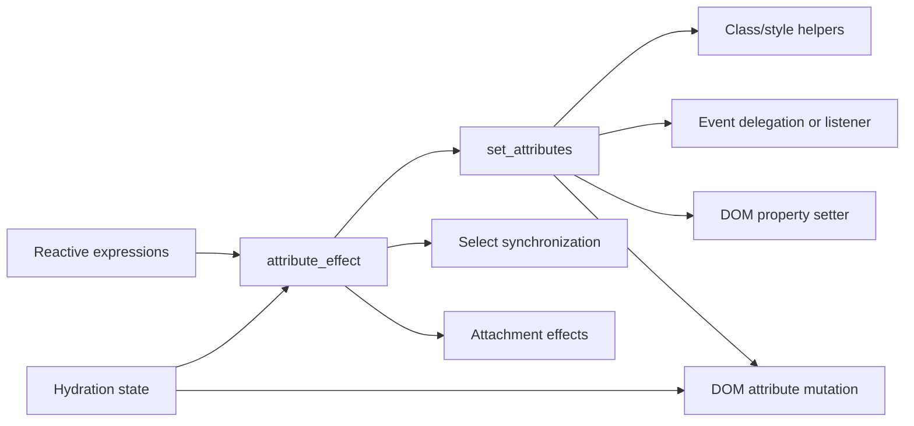

# Client DOM Elements: Attributes

`packages/svelte/src/internal/client/dom/elements/attributes.js` is the property and attribute reconciliation layer for browser DOM nodes. It converts compiler-produced attribute objects into minimal DOM mutations while handling hydration, form controls, SVG/XLink, custom elements, CSS class/style sentinels, event attributes, and attachments.

## Responsibilities

- `set_attributes` diffs `prev` and `next`, dispatching special cases for `class`, `style`, events, `value`, `checked`, `selected`, `autofocus`, properties, and ordinary attributes.
- `attribute_effect` evaluates reactive attribute expressions, applies updates inside a block effect, synchronizes `<select>` values, and creates/destroys attachment effects.
- `set_attribute` performs cached, hydration-aware single-attribute writes. URL-bearing attributes avoid duplicate network requests during hydration and can emit development warnings when server/client URLs differ.
- `set_value`, `set_checked`, `set_default_value`, and `set_default_checked` preserve the distinction between live form state and reset defaults.
- `set_custom_element_data` chooses property assignment versus attribute serialization while temporarily removing reactive and hydration context from custom-element lifecycle work.
- `remove_input_defaults` defers removal of SSR `value`/`checked` attributes and coordinates with the form-reset listener in `misc.js`.

## Update path

The per-element `__attributes` cache avoids redundant writes and records whether the node is HTML or custom. Setter discovery walks prototypes up to `Element`, caching setters by element type; this lets non-string values use DOM properties without invoking setters accidentally for ordinary string attributes.

## Integration notes

Client element visitors use this layer for compiled regular elements and dynamic elements; see [compiler_transform_client_elements.md](compiler_transform_client_elements.md). Runtime bindings in [client_bindings.md](client_bindings.md) rely on the value/checked/default handling here. DOM creation and hydration primitives are described in [client_render_and_templates.md](client_render_and_templates.md).
