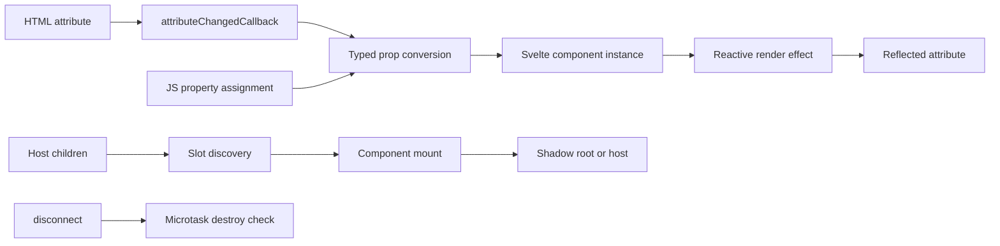

# Client DOM Elements: Custom elements

`packages/svelte/src/internal/client/dom/elements/custom-element.js` adapts a Svelte component to the Custom Elements platform and manages the boundary between DOM attributes/properties, component props, slots, lifecycle, and legacy component compatibility.

## Responsibilities

- `create_custom_element` builds an `HTMLElement` subclass, declares observed attributes, defines prop accessors, exposes selected component exports, optionally extends the class, and assigns the constructor to `Component.element`.
- The generated `SvelteElement` delays initialization by one microtask so child slot nodes exist, then mounts the component into the host or shadow root.
- `attributeChangedCallback` converts reflected attributes to typed props; component changes can be reflected back to attributes through a managed render effect.
- `create_slot` creates native `<slot>` placeholders and `get_custom_elements_slots` discovers named/default slot content supplied by the host.
- `get_custom_element_value` performs Boolean, Number, Array, and Object conversions in both directions.

## Lifecycle and data flow

Listeners are registered both with the native element and, once initialized, with the component event API. Disconnect cleanup is deferred to tolerate DOM moves. Property writes use component accessors when available and otherwise call `$set`.

## Integration notes

Attribute assignment policy is shared with [client_dom_elements_attributes.md](client_dom_elements_attributes.md). The legacy component adapter is documented in [legacy_compat.md](legacy_compat.md). Server-side custom-element output and component rendering are covered by [server_runtime.md](server_runtime.md) where applicable.
