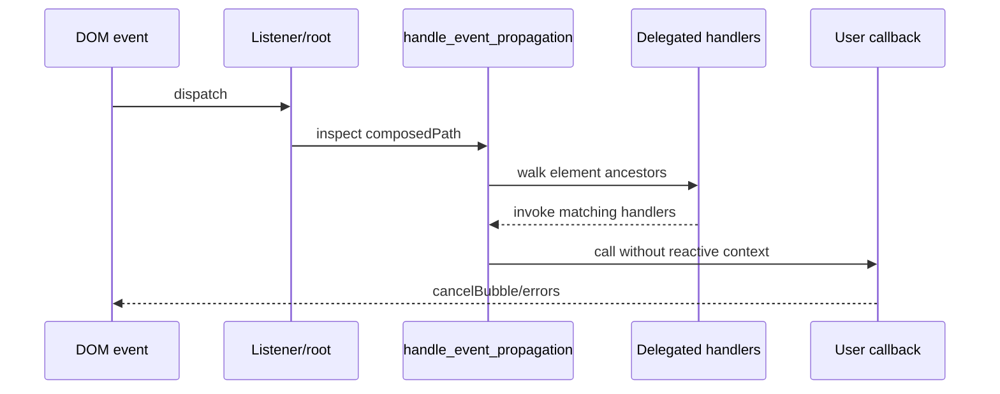

# Client DOM Elements: Events

`packages/svelte/src/internal/client/dom/elements/events.js` provides the event installation, delegation, propagation, replay, and validation primitives used by generated client code.

## Responsibilities

- `create_event` wraps a handler so delegated propagation is processed before the user callback, callbacks execute without a reactive context, and pointer/touch/wheel listeners are attached in a microtask for browser clone/disconnected-node compatibility.
- `event` installs a listener and registers teardown for long-lived targets such as `window`, `document`, `body`, and media elements.
- `delegate` registers event names with root delegation handlers; `handle_event_propagation` walks the composed path, proxies `currentTarget`, observes disabled elements, handles nested mounted apps, and aggregates errors.
- `replay_events` re-dispatches SSR-captured `load`/`error` events after hydration.
- `apply` invokes a compiled handler thunk and emits a development warning when the result is not callable.

## Event flow

The `__root` marker prevents duplicate handling across nested Svelte applications. The `all_registered_events` and `root_event_handles` sets allow roots to install only the event types currently required by compiled attributes.

## Integration notes

Attribute spreading in [client_dom_elements_attributes.md](client_dom_elements_attributes.md) routes `on*` keys here. Compiler event/directive lowering is covered by [compiler_transform_client_directives.md](compiler_transform_client_directives.md), while the generated component visitor is covered by [compiler_transform_client_components.md](compiler_transform_client_components.md).
