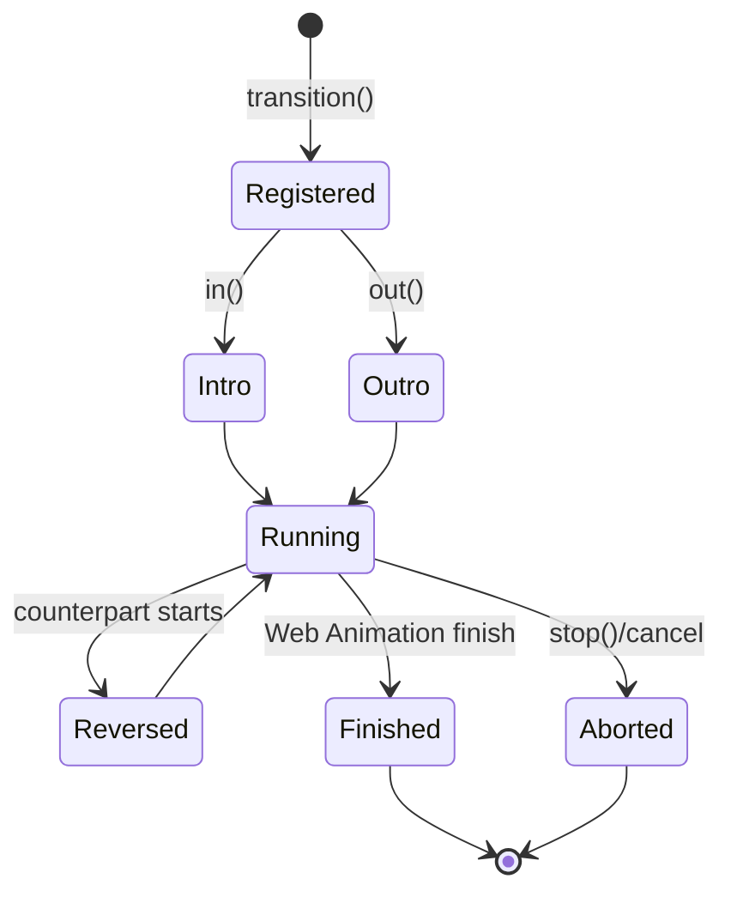

# Client DOM Elements: Transitions and animations

`packages/svelte/src/internal/client/dom/elements/transitions.js` connects compiled transition and animation instructions to the Web Animations API and Svelte’s effect lifecycle.

## Responsibilities

- `transition` creates a transition manager attached to the active effect. It supports intro, outro, bidirectional, and global transitions; reverses an in-flight counterpart smoothly; toggles `inert`; emits lifecycle events; and runs intros according to block ownership rules.
- `animation` attaches a keyed-`each` animation manager. It measures pre/post reconciliation rectangles and animates movement, temporarily fixing position and dimensions when needed.
- `linear` is the default easing function.
- Internal helpers convert CSS declaration strings to Web Animations keyframes, support `tick` callbacks, delayed/deferred transitions, overflow workarounds, cancellation, and cleanup.

## Transition lifecycle

`transition` stores managers on the active effect, so block pause/resume logic can start or stop transitions when conditional or repeated blocks change. `animation` instead participates in keyed list reconciliation through `current_each_item`.

## Integration notes

Compiler transition/animation visitors are part of [compiler_transform_client_directives.md](compiler_transform_client_directives.md). Block lifecycle primitives that pause, resume, and reconcile DOM are documented in [client_blocks.md](client_blocks.md). Public transition and animation factories are described in [motion_and_visual_effects_library.md](motion_and_visual_effects_library.md).
