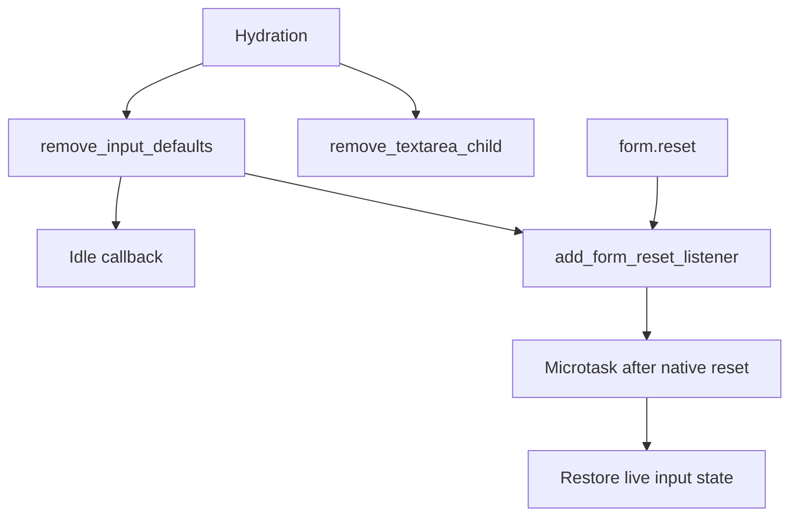

# Client DOM Elements: Utilities

`packages/svelte/src/internal/client/dom/elements/misc.js` contains small DOM lifecycle helpers shared by element updates and hydration.

## Core behavior

- `autofocus` sets the property and queues focus until the current DOM work completes. It only focuses when the document body is still active, avoiding stealing focus from user code.
- `remove_textarea_child` clears SSR textarea child text during hydration because that text represents `defaultValue`, not the live value.
- `add_form_reset_listener` installs one capture-phase document listener. After a reset has updated native control properties, it invokes each control’s deferred `__on_r` callback so hydrated inputs preserve their live value/checked state.

These helpers are implementation details of [client_dom_elements_attributes.md](client_dom_elements_attributes.md) and the hydration primitives in [client_render_and_templates.md](client_render_and_templates.md).
