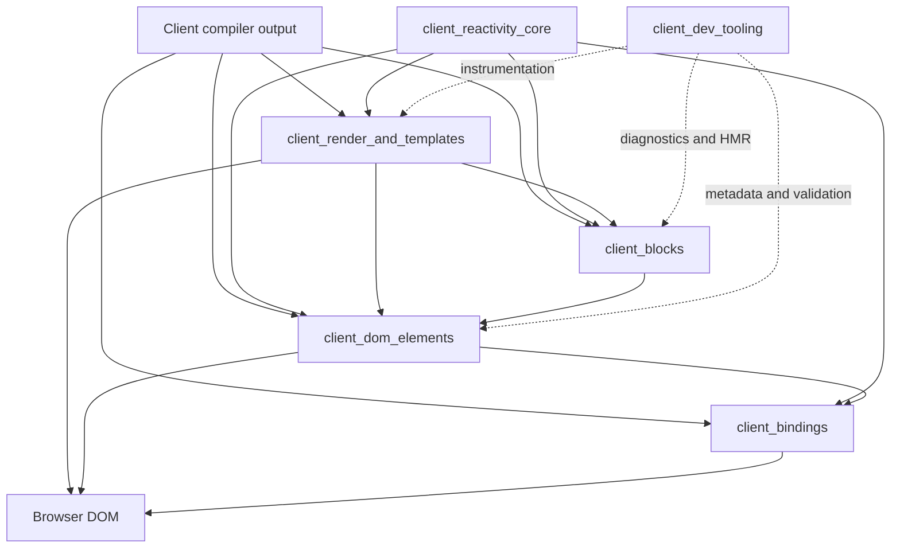
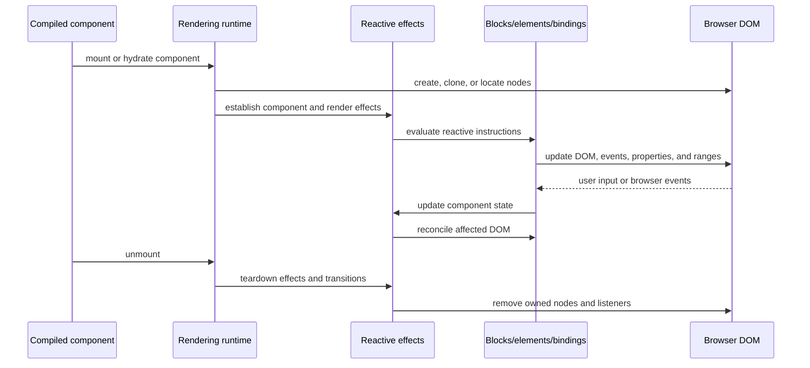

# `client_dom_rendering_runtime`

## Purpose

The `client_dom_rendering_runtime` module is Svelte’s browser-side runtime for rendering and updating compiled components. It coordinates:

- DOM creation, cloning, insertion, removal, and SSR hydration
- Reactive control-flow blocks and component composition
- Element attributes, events, transitions, and custom elements
- Two-way bindings between component state and browser APIs
- Development diagnostics, source metadata, HMR, and ownership checks

It is located at `packages/svelte/src/internal/client` and bridges compiler-generated client code with the browser DOM and `client_reactivity_core`.

## Architecture

### Rendering and update lifecycle

Hydration reuses SSR-generated nodes through a shared cursor and marker system. If the DOM shape does not match, the runtime can recover by clearing the affected range and performing a client render.

## Core components

| Component | Responsibility | Documentation |
| --- | --- | --- |
| `client_blocks` | Control flow, async boundaries, snippets, dynamic elements, and DOM-range reconciliation | [client_blocks.md](client_blocks.md) |
| `client_dom_elements` | Attributes, events, transitions, utilities, and custom elements | [client_dom_elements.md](client_dom_elements.md) |
| `client_bindings` | DOM-to-state and state-to-DOM synchronization for forms, media, viewport, and components | [client_bindings.md](client_bindings.md) |
| `client_render_and_templates` | Mounting, hydration, template factories, DOM operations, context, CSS, and lifecycle management | [client_render_and_templates.md](client_render_and_templates.md) |
| `client_dev_tooling` | Inspection, source locations, ownership validation, HMR, CSS cleanup, and development diagnostics | [client_dev_tooling.md](client_dev_tooling.md) |

The runtime depends heavily on [client_reactivity_core](client_reactivity_core.md) for signals, derived values, effects, batching, and teardown. It also integrates with the compiler’s client transformation pipeline and the server runtime’s SSR markup and hydration markers.