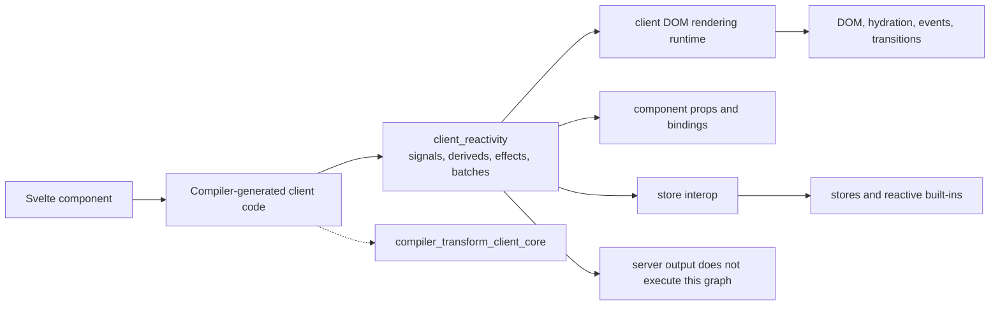
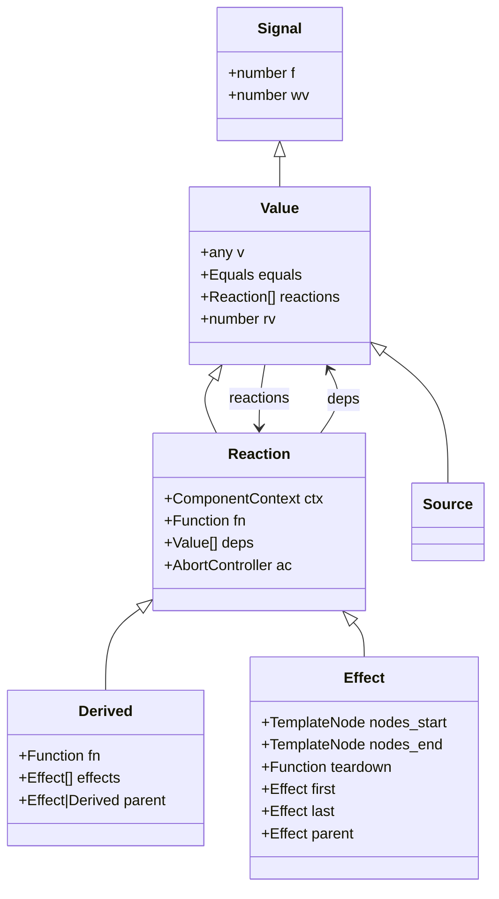
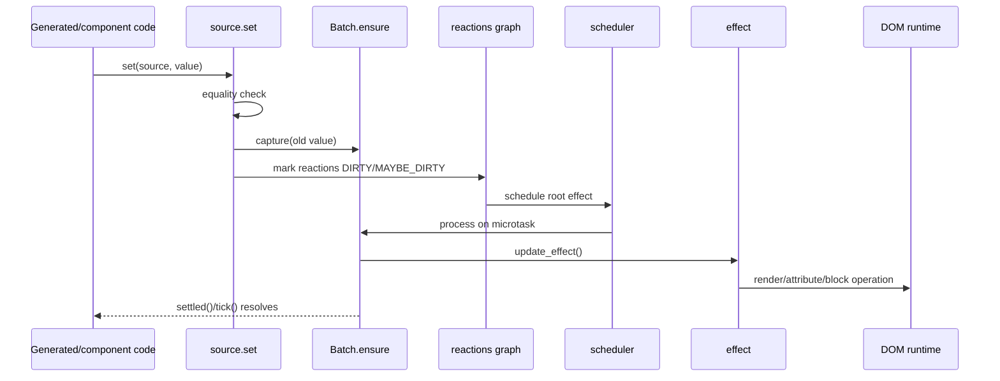
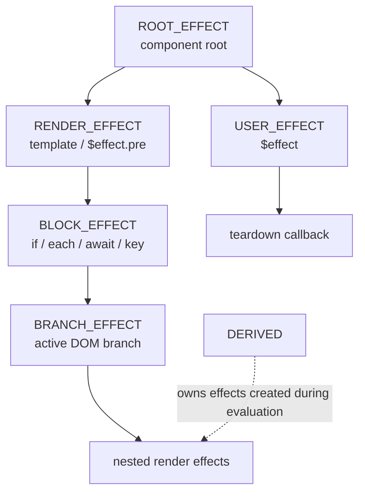
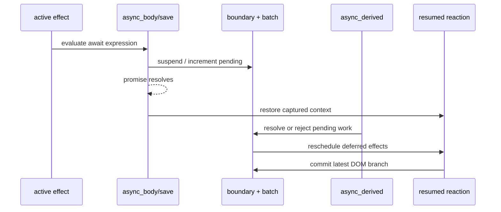
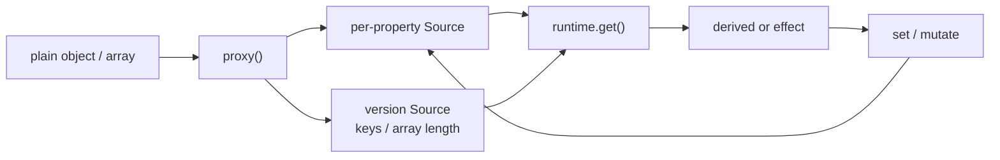
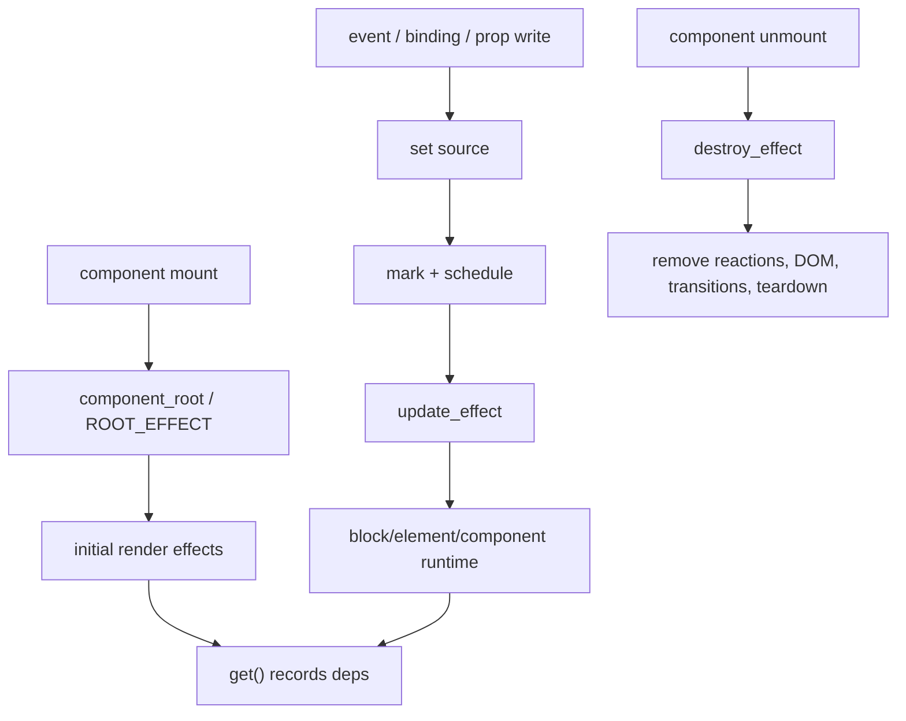

# client_reactivity

## 1. What This Module Is

`client_reactivity` is Svelte's client-side fine-grained reactivity runtime. It turns state
writes into targeted updates of derived values, effects, component props, and DOM-producing
render work. The runtime is signal-based: values are represented by sources, computations by
derived signals, and side effects by an effect tree.

The module is consumed by compiler-generated client code. The compiler decides *where* reactive
operations are needed; this runtime implements *how* dependencies are tracked, invalidated,
scheduled, committed, suspended, and destroyed. See
[compiler_transform_client_core](compiler_transform_client_core.md) for the compiler side of
that contract.

### Core files

| File | Responsibility |
| --- | --- |
| `reactivity/sources.js` | Sources, state writes, invalidation, and increment helpers |
| `reactivity/deriveds.js` | Lazy synchronous and asynchronous derived values |
| `reactivity/effects.js` | Effect creation, nesting, teardown, branches, and transitions |
| `reactivity/batch.js` | Microtask batching, effect scheduling, async settlement, and flushes |
| `reactivity/async.js` | Context preservation across `await`, suspension, and async bodies |
| `reactivity/equality.js` | Identity and safe-equality policies |
| `reactivity/props.js` | Component prop access, binding, fallback, rest, and spread behavior |
| `reactivity/types.d.ts` | `Signal`, `Source`, `Derived`, `Reaction`, and `Effect` contracts |
| `proxy.js` | Deep `$state` proxying into per-property sources |
| `runtime.js` | Active reaction state, dependency graph maintenance, reads, and updates |
| `loop.js` | `requestAnimationFrame`-driven task loops |

The lower-level implementation is grouped in [client_reactivity_core](client_reactivity_core.md),
while store integration is documented in [client_store_interop](client_store_interop.md).

## 2. Position In The System



The runtime is shared by ordinary `$state`/`$derived` code, compiled template effects, component
prop synchronization, and legacy reactive declarations. DOM block implementations such as
`if`, `each`, `await`, `key`, and `boundary` are documented in
[client_dom_rendering_runtime](client_dom_rendering_runtime.md); they create the branch and block
effects that this module schedules.

## 3. Signal And Reaction Model

Every reactive value implements the `Signal`/`Value` shape. The important fields are:

- `v`: current value;
- `f`: bit flags such as `DIRTY`, `CLEAN`, `DERIVED`, `BLOCK_EFFECT`, and `DESTROYED`;
- `reactions`: downstream deriveds and effects;
- `deps`: upstream values read by a reaction;
- `wv` and `rv`: write/read versions used to avoid redundant work.



`get()` in `runtime.js` registers the current `active_reaction` as a consumer of the signal.
During `update_reaction()`, dependencies are collected incrementally and stale dependencies are
removed. A derived is lazy: it is recomputed only when a read observes that its dependency
versions are newer. An effect is eager once scheduled and performs work such as DOM updates.

## 4. State Writes And Invalidation

`source()` creates a signal with strict identity equality. `state()` additionally records the
source for the current reaction. `mutable_source()` uses `safe_equals`, which treats object and
function assignments as potentially changed; this preserves legacy mutable-state behavior.

`set()` validates illegal writes in deriveds/effects, optionally proxies the value, and delegates
to `internal_set()`. A changed value is captured by the current `Batch`, receives a new write
version, and causes `mark_reactions()` to propagate `DIRTY` or `MAYBE_DIRTY` status downstream.



`update()` implements post-increment/decrement semantics by reading, writing, and returning the
old value. `update_pre()` writes first and returns the new value. `increment()` deliberately avoids
`get()` and is used for metadata/version sources such as proxied-object versions.

## 5. Derived Values And Effects

`derived(fn)` creates a lazy computation. `user_derived()` is the compiler/runtime entry that also
pushes the derived into the current reaction's value context. `execute_derived()` establishes the
owning effect, destroys effects created during the previous evaluation, and runs the computation.
`update_derived()` caches a changed result and marks the derived clean or maybe-dirty according to
ownership and batching rules.

Effects are nodes in a parent/child tree. `block()` creates a synchronous block effect used by
control-flow renderers. `render_effect()` runs DOM work synchronously during a flush, while
`user_effect()` represents `$effect` and is deferred until the appropriate phase. `legacy_pre_effect`
and `legacy_pre_effect_reset` preserve `$:` scheduling semantics for legacy mode.



When an effect reruns, its child effects and prior teardown are cleaned first. `destroy_effect()`
also removes DOM nodes, reactions, transitions, and abort controllers. A paused branch is marked
`INERT`, remains available for outro transitions, and can later be resumed if the condition becomes
true again.

## 6. Batches And Scheduling

`Batch.ensure()` creates one batch for a group of synchronous writes. The batch records previous and
current source values, traverses queued root effects, commits structural callbacks, then flushes
render effects and user effects. New writes produced by an effect start a separate logical batch so
updates cannot be mixed indefinitely.

```mermaid
flowchart TD
    W["one or more source writes"] --> E["Batch.ensure()"]
    E --> M["queue microtask"]
    M --> P["Batch.process(root effects)"]
    P --> T["traverse effect tree"]
    T --> Q{ "async work pending?" }
    Q -->|No| C["commit branch callbacks"]
    C --> R["flush render effects"]
    R --> U["flush user effects"]
    Q -->|Yes| D["defer dirty/maybe-dirty effects"]
    D --> A["async resolution activates batch"]
    A --> R
    R --> F["settled promise resolves"]
```

`flushSync()` drains queued roots and tasks immediately. `tick()` waits for the next microtask (or
animation frame in async mode), then flushes pending updates. `settled()` returns the current
batch's promise and includes asynchronous work that originated from state changes. `clear()` exists
primarily to isolate tests by removing current batches.

The scheduler has an infinite-loop guard after 1,000 flush iterations. In development it reports
source update stacks and routes the error to the nearest available error boundary.

## 7. Async Reactivity

Async work must preserve the reaction that existed before an `await`; otherwise reads after the
`await` would not become dependencies. `save()` captures and restores effect, reaction, component,
and batch context. `async_body()` suspends the pending boundary and releases it in `finally`.

`async_derived()` evaluates a promise-producing function inside an async effect. Each resolution
updates a source, handles stale/error values, and adjusts both boundary and batch pending counts.
`for_await_track_reactivity_loss()` wraps iterator operations so development mode can report reads
that occurred after dependency tracking was lost.



If a branch is destroyed while async work is pending, its abort controller receives
`STALE_REACTION`; stale results are ignored or converted to boundary errors rather than being
applied to detached DOM.

## 8. Props, Proxies, And Equality

`prop()` provides the compiler-generated getter/setter abstraction for component props. It handles
fallback values, lazy defaults, bindable setters, runes versus legacy mode, local overrides, and
store-backed bindings. A read-only runes prop returns a getter; a writable unbound prop is backed by
a derived signal; a bindable prop forwards writes to the parent setter when available.

`rest_props()`, `legacy_rest_props()`, and `spread_props()` expose proxy views without copying the
underlying object. Legacy rest props use a coarse version source so writes to one property rerun
consumers of the proxy. `update_prop()` and `update_pre_prop()` provide compiler-compatible
increment operations.

`proxy()` converts plain objects and arrays into deep reactive state. Each accessed property gets a
source lazily; array `length` is eager, and structural changes increment a version source used by
iteration and key enumeration. `update_path()` only changes development tracing labels and does
not alter reactivity.



Equality is policy-driven: `equals` uses strict identity, `not_equal` is strict inequality, and
`safe_equals` is the inverse of `safe_not_equal`, which considers non-null objects and functions
changed even when their identity is reused.

## 9. Component Interaction And Lifecycle



DOM operations are intentionally outside this module. A generated component creates effects and
passes DOM work to the rendering runtime; this module supplies lifecycle, dependency, and timing
guarantees. Store subscriptions follow the same graph through
[client_store_interop](client_store_interop.md); public package entry points expose the supported
component APIs on top of this internal runtime.

## 10. Development Diagnostics And Safety

Development-only tracing records creation and update stacks, source labels, writes during effects,
and async reactivity loss. `$inspect` effects are collected separately and flushed without
over-firing clean effects. Runtime checks reject unsafe state mutation in derived computations,
effect misuse outside a component context, invalid prop descriptors, and writes during teardown.

The graph also protects memory and correctness by disconnecting unused deriveds, removing stale
reactions, aborting async controllers, and preserving old values while an effect is being destroyed.
These mechanisms are why generated code should use the runtime helpers instead of mutating signal
objects directly.

## 11. Practical Trace For Maintainers

When debugging a missed or excessive update, follow this path:

1. Confirm the compiler emitted a `get`, `set`, `mutate`, `update`, `prop`, or effect call. Start at
   [compiler_transform_client_javascript](compiler_transform_client_javascript.md) and
   [compiler_transform_client_core](compiler_transform_client_core.md).
2. Inspect `runtime.get()` to verify the intended `active_reaction` received the dependency.
3. Inspect `sources.internal_set()` and `mark_reactions()` for equality and invalidation behavior.
4. Inspect `batch.schedule_effect()` and `Batch.process()` for ordering, async deferral, or a
   paused/inert branch.
5. Inspect `update_effect()` and the relevant DOM block/element module for the final side effect.

For lifecycle bugs, inspect `destroy_effect()` and the effect tree first; for async bugs, inspect
`save()`, `async_derived()`, pending boundary counts, and abort handling together.
