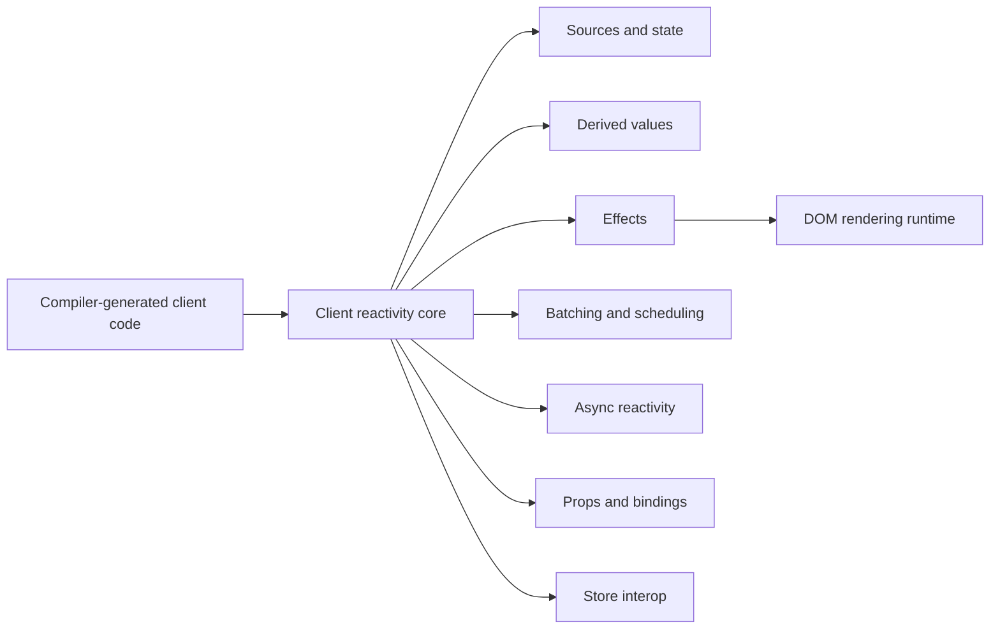
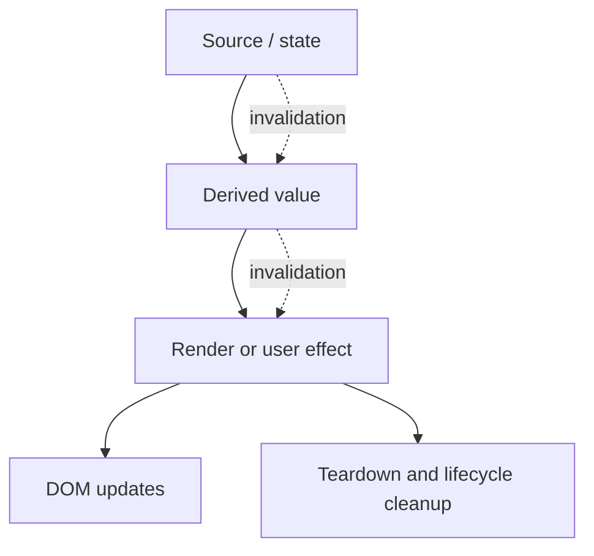
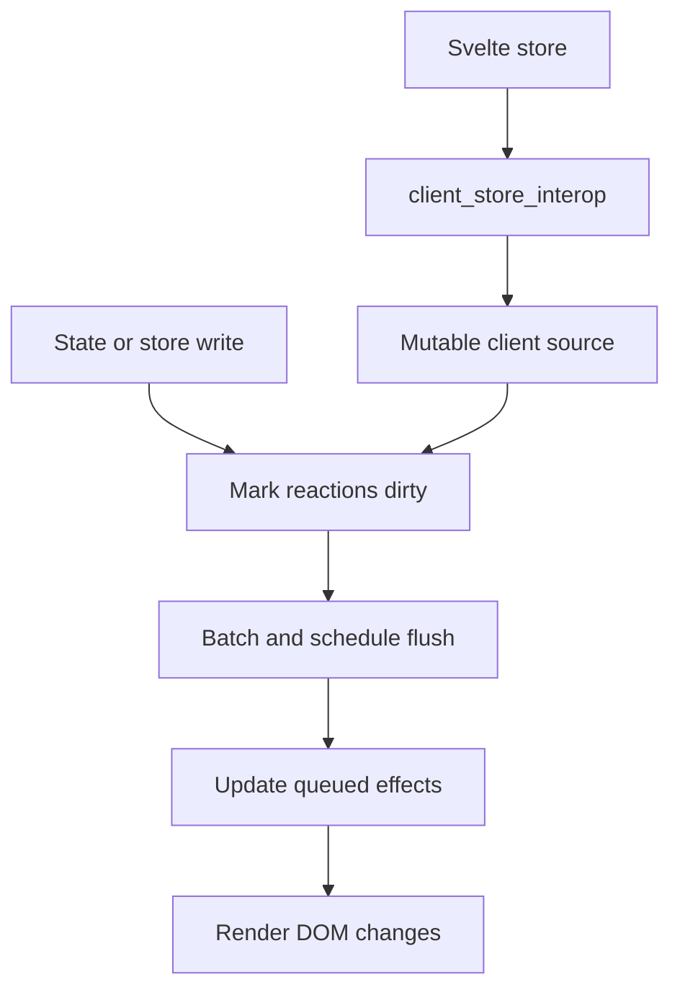

# Client Reactivity Core

`client_reactivity_core` is Svelte’s client-side fine-grained reactivity runtime, located at `packages/svelte/src/internal/client/reactivity`. It tracks dependencies between reactive sources, derived values, effects, component props, and stores. The runtime handles invalidation, batching, scheduling, asynchronous context preservation, teardown, and store subscription lifecycle.

Compiler-generated client code determines where reactive operations are needed; this module provides the runtime mechanisms that execute them.

## Architecture

### Reactive dependency graph

Sources hold mutable values and notify downstream consumers when changed. Derived values lazily recompute from their dependencies. Effects form a parent-child tree and perform rendering, user effects, block updates, and cleanup.

### Scheduling and store integration

Writes are grouped into batches and flushed through a microtask scheduler. Store values are represented as client-reactivity sources so `$store` reads participate in the same dependency graph.

## Core Components

- `sources.js` — reactive sources, state writes, invalidation, and update helpers.
- `deriveds.js` — lazy synchronous and asynchronous derived values.
- `effects.js` — effect trees, branches, teardown, transitions, and lifecycle management.
- `batch.js` — batching, scheduling, flushing, `tick()`, and `settled()`.
- `async.js` — preservation of reactive context across `await`.
- `props.js` — component prop access, bindings, fallbacks, and spreads.
- `proxy.js` — deep `$state` proxying into per-property sources.
- `runtime.js` — dependency tracking and reaction graph maintenance.
- `store.js` — Svelte store subscriptions, reads, writes, updates, and cleanup.
- `equality.js`, `types.d.ts`, and `loop.js` — equality policies, type contracts, and animation-frame task loops.

## Related Documentation

- [client_reactivity](client_reactivity.md) — signal sources, derived values, effects, batching, async reactivity, and runtime scheduling.
- [client_store_interop](client_store_interop.md) — integration between Svelte stores and the client reactivity graph.
- [compiler_transform_client_core](compiler_transform_client_core.md) — compiler-side generation of reactive client operations.
- [compiler_transform_client_core_bindings](compiler_transform_client_core_bindings.md) — binding and store-reference classification.
- [client_dom_rendering_runtime](client_dom_rendering_runtime.md) — DOM blocks and rendering effects driven by this runtime.