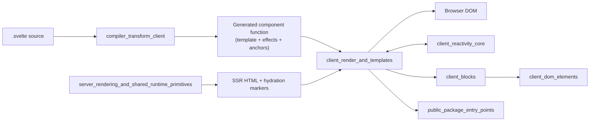
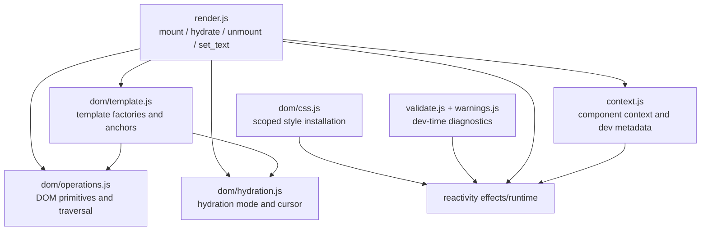
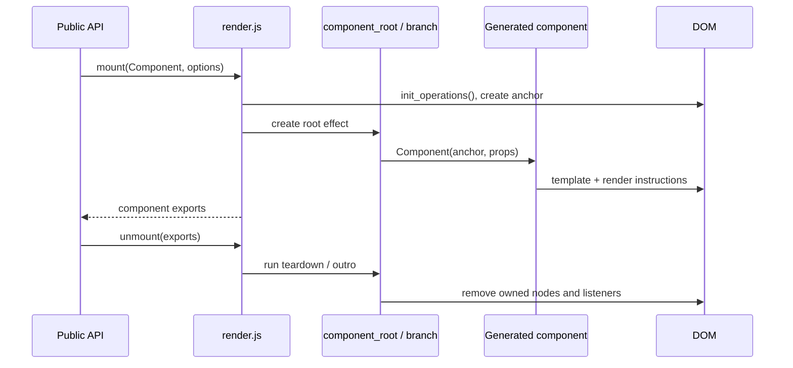
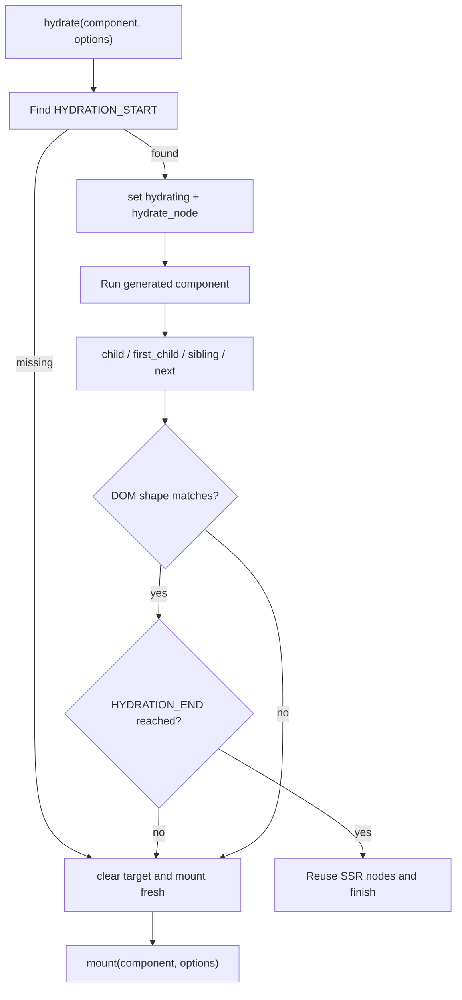
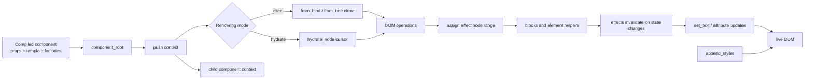

# Client Render and Templates

`client_render_and_templates` is the low-level browser runtime used by compiled Svelte components. It turns compiler-emitted template factories and DOM instructions into mounted component instances, supports both fresh client rendering and SSR hydration, and provides the shared component-context and validation helpers needed while rendering.

It is intentionally narrower than the surrounding runtime: control-flow behavior belongs to [client_blocks.md](client_blocks.md), reactive scheduling belongs to [client_reactivity_core.md](client_reactivity_core.md), and element attributes, events, bindings, and transitions belong to [client_dom_elements.md](client_dom_elements.md).

## Position in the system

The compiler decides *what* should be rendered and emits calls into this module. This module decides *how* nodes are created, located, cloned, hydrated, inserted, and associated with an effect range. The same primitives are consumed by block and element helpers, so a change here can affect almost every client-rendered component.

## Architecture

### Rendering and lifecycle

`mount` delegates to the internal `_mount` path. `_mount` initializes DOM operations, registers delegated event handling for the target, creates a component root effect, establishes a component context when supplied, and invokes the compiled component function with an anchor and props. The returned component export object is stored in a `WeakMap`, allowing `unmount` to find its teardown function without retaining dead components.

`unmount` removes the component's event registrations and anchor, and delegates the actual lifecycle work to the root effect. When outro transitions are requested, the effect system can delay removal until transitions finish. A second or unknown unmount is harmless in production and emits `lifecycle_double_unmount` in development.

`set_text` performs null-to-empty conversion and string coercion, then caches the last rendered value on the text node (`__t`) to avoid unnecessary `nodeValue` writes. This is a hot path used by generated expressions.

### Template factories

`from_html`, `from_svg`, and `from_mathml` return lazy factories. The first non-hydrating call parses the template once; subsequent calls clone the cached node. `from_html` uses the HTML reconciler, while namespace factories wrap content in an SVG or MathML root before extracting or cloning it. Fragment flags preserve a start/end range; non-fragment templates return one root node.

`from_tree` is the structured-template alternative. It recursively creates text, comments, elements, attributes, `<template>` contents, and namespace transitions. `foreignObject` deliberately returns to the HTML namespace for its children.

`with_script` replaces parsed `<script>` elements with newly created script elements so browser script execution semantics are preserved for client-created DOM. It does nothing during hydration because SSR-created scripts already exist in the document.

The factories call `assign_nodes` to record the DOM range owned by the active effect. That range is later used by blocks and effects for insertion, movement, teardown, and hydration recovery.

### DOM operations

`init_operations` lazily captures browser globals and native `firstChild`/`nextSibling` getters. Lazy initialization keeps the shared runtime importable in server contexts. It also installs internal node caches such as `__t`, `__className`, and `__attributes`; development mode additionally enables array-prototype diagnostics and Svelte metadata.

`child`, `first_child`, and `sibling` abstract over ordinary DOM traversal and hydration traversal. In normal rendering they read from the supplied node or fragment. In hydration they read from the global hydration cursor, create missing empty text nodes when SSR emitted no text node, and advance the cursor. `create_element`, `create_fragment`, `create_comment`, and `create_text` provide compiler-friendly constructors; `set_attribute` handles the special `xlink:` namespace.

## Hydration model

Hydration is a cursor-based walk over server-rendered nodes. `hydrate` searches the target for the `HYDRATION_START` comment, enables hydration, points `hydrate_node` at the first candidate, and mounts the component against that cursor. Generated code advances the cursor through `child`, `first_child`, `sibling`, `next`, and `hydrate_next`. The final `HYDRATION_END` marker must be reached exactly; otherwise the runtime reports a mismatch.

`hydrate_template` resets the cursor to a template's content. `reset` verifies that a hydrated range has no unexpected remaining siblings before restoring a caller-provided cursor. `remove_nodes` removes a nested hydration range through its matching end marker, which is useful when a block abandons server content. `set_hydrate_node` treats a null cursor as a mismatch and throws the internal hydration error.

By default hydration disables intro transitions (`options.intro ?? false`), but callers may opt in. If recovery is allowed, a mismatch clears the target and performs a normal mount. `recover: false` escalates to the hydration failure error. Shared cursor state is restored in `finally`, so nested or repeated hydration calls do not leak state.

## Context and component metadata

`push` creates a component-context frame linked to its parent; `pop` flushes deferred user effects, records the component export when provided, and restores the parent frame. Each frame can contain props, a context map, effects, and legacy-mode state.

`setContext`, `getContext`, `hasContext`, and `getAllContexts` operate on the closest inherited `Map`. They are initialization-time APIs: calls outside a component produce a lifecycle error, and async mode warns when `setContext` occurs after initialization. `_mount` copies an explicitly supplied context map into the new component frame.

In development, `add_svelte_meta` maintains a stack containing component filename, source position, block type, and optional metadata. This lets diagnostics identify the generated runtime operation that produced a warning.

## CSS installation

`append_styles` creates a reactive effect that waits until the anchor has a meaningful root, then installs a `<style>` element in the document head or the current shadow root. The CSS hash is used as the DOM id, making installation idempotent within that root. In development the style node is registered with the dev CSS tooling. The function therefore supports both ordinary document components and components rendered inside shadow DOM.

## Validation and diagnostics

`validate_each_keys` runs a render effect, normalizes array-like collections, and reports duplicate keys with their indexes. It is a development correctness check for keyed `{#each}` blocks; reconciliation itself is documented in [client_blocks_control_flow.md](client_blocks_control_flow.md).

`validate_binding` checks whether a bound property participates in the reactive graph. It avoids false positives for store subscriptions, probes the property inside a nested effect, and reports `binding_property_non_reactive` when no dependency is observed. Diagnostic formatting and environment gating are centralized in `warnings.js`; the generated warnings module contains both runtime diagnostics such as hydration mismatch and lifecycle double-unmount and the boundary reset warning.

## End-to-end data flow

## Maintenance invariants

- Keep `hydrating` and `hydrate_node` balanced across nested rendering and recovery paths; `hydrate` restores both in its `finally` block.
- Every created or hydrated effect range must receive correct `nodes_start` and `nodes_end` through `assign_nodes`.
- Do not eagerly access browser globals at module evaluation time; `init_operations` is the server-safe boundary.
- Template factories may cache parsed structure, but each render must receive an independent clone unless hydration is reusing existing nodes.
- Context frames must be popped even when component initialization throws.
- CSS insertion must remain idempotent per DOM root and preserve shadow-root placement.
- Validation helpers should remain diagnostic-only and must not alter production rendering semantics.

## Related modules

- [client_blocks.md](client_blocks.md) — control flow, async boundaries, snippets, raw HTML, dynamic elements, and head blocks.
- [client_reactivity_core.md](client_reactivity_core.md) — sources, derived values, effects, batching, and scheduling.
- [client_dom_elements.md](client_dom_elements.md) — attributes, events, transitions, custom elements, and element-level behavior.
- [client_bindings.md](client_bindings.md) — input, media, size, window, document, and universal bindings.
- `packages/svelte/src/internal/client/dev/` — development metadata, inspection, HMR, ownership, and validation tooling.
- [compiler_transform_client_template.md](compiler_transform_client_template.md) — compiler-side template lowering that consumes these factories.
- [compiler_transform_server.md](compiler_transform_server.md) — compiler-side SSR transformation that produces the HTML and hydration structure consumed here.
- `packages/svelte/src/index-client.js` and `packages/svelte/src/index-server.js` — public package entry points that expose the rendering lifecycle APIs.
