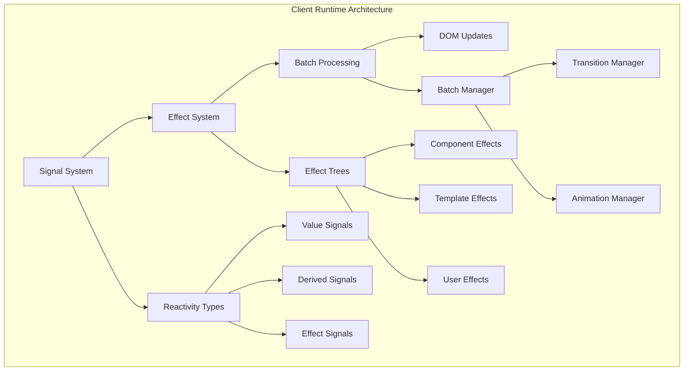
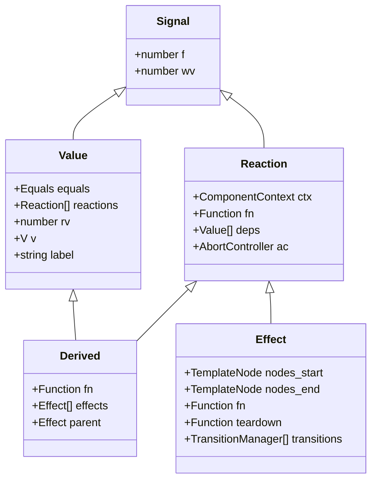
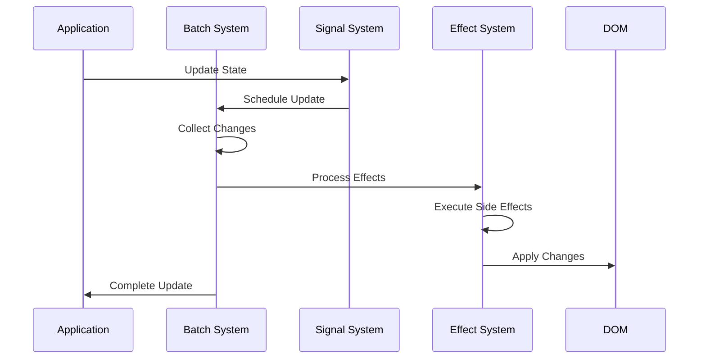

# Client Runtime Module

## Overview

The Client Runtime module is the core reactive system that powers Svelte's client-side execution. It provides a sophisticated reactivity engine based on signals, effects, and batched updates that enables efficient DOM manipulation and state management in Svelte applications.

## Purpose

This module serves as the foundation for:
- **Reactive State Management**: Fine-grained reactivity through signals and derived values
- **Effect System**: Coordinated side effects and DOM updates
- **Batch Processing**: Efficient batching of updates to minimize DOM thrashing
- **Animation & Transition Management**: Coordinated animations and transitions
- **Component Lifecycle**: Managing component state and cleanup

## Architecture Overview

The Client Runtime follows a signal-based reactive architecture with the following key principles:

1. **Signal-Based Reactivity**: All reactive state is represented as signals that can be observed and updated
2. **Effect Trees**: Side effects are organized in hierarchical trees for efficient execution and cleanup
3. **Batched Updates**: Changes are batched and processed efficiently to minimize DOM updates
4. **Lazy Evaluation**: Derived values are computed only when needed and cached appropriately



## Core Sub-modules

### Reactivity System
**Documentation**: [reactivity_system.md](reactivity_system.md)

The reactivity system provides the fundamental building blocks for Svelte's reactive state management. It implements a sophisticated signal-based architecture that enables fine-grained reactivity with automatic dependency tracking and efficient updates. Key features include:

- **Signal Hierarchy**: Base Signal interface with specialized Value, Derived, Effect, and Reaction types
- **Dependency Tracking**: Automatic tracking of signal dependencies for precise updates
- **Lazy Evaluation**: Derived values computed only when needed with intelligent caching
- **Memory Management**: Automatic cleanup of unused signals and their dependencies

### Batch Processing System
**Documentation**: [batch_processing.md](batch_processing.md)

The batch processing system is the orchestration layer that manages efficient updates and DOM synchronization. It ensures that multiple state changes are processed together to minimize DOM operations and maintain consistent application state. Core capabilities include:

- **Intelligent Batching**: Groups related updates to minimize DOM thrashing
- **Effect Scheduling**: Sophisticated scheduling of effects based on priority and dependencies  
- **Async Coordination**: Manages asynchronous effects and their integration with synchronous updates
- **Flush Control**: Provides both automatic and manual control over when updates are applied

### Animation & Transition Management
**Documentation**: [animation_transition.md](animation_transition.md)

The animation and transition management system provides seamless integration of animations within Svelte's reactive framework. It coordinates element animations and transitions with the component lifecycle and state updates:

- **Transition Coordination**: Manages element enter/exit transitions with proper cleanup
- **Animation Synchronization**: Coordinates animations during component updates and reconciliation
- **Performance Optimization**: Efficient animation scheduling that works with the batching system
- **Lifecycle Integration**: Proper integration with component mounting, updating, and destruction

## Key Components

### Signal Hierarchy



### Processing Flow



## Integration with Other Modules

### Compiler Integration
The Client Runtime works closely with the [compiler_core](compiler_core.md) module:
- **Transform States**: Uses transform states from the compiler for code generation
- **Template Processing**: Processes compiled templates through the effect system
- **Component Analysis**: Leverages compiler analysis for optimization

### Component System Integration
Integrates with the [component_system](component_system.md):
- **Component Context**: Manages component lifecycle and state
- **Props & Events**: Handles reactive props and event dispatching
- **Lifecycle Hooks**: Coordinates with component lifecycle methods

### Store Integration
Works with the [stores](stores.md) module:
- **Store Subscriptions**: Manages reactive subscriptions to stores
- **State Synchronization**: Keeps store state in sync with component state

## Performance Characteristics

### Batching Benefits
- **Reduced DOM Thrashing**: Multiple updates are batched into single DOM operations
- **Efficient Scheduling**: Effects are scheduled optimally to minimize redundant work
- **Memory Management**: Automatic cleanup of unused effects and signals

### Reactivity Optimization
- **Fine-grained Updates**: Only affected components re-render
- **Lazy Evaluation**: Derived values computed only when accessed
- **Dependency Tracking**: Precise tracking of what depends on what

## Usage Patterns

### Basic Reactivity
```typescript
// Signal creation and usage
const count = signal(0);
const doubled = derived(() => count.value * 2);

// Effect creation
effect(() => {
    console.log('Count is:', count.value);
});
```

### Batch Processing
```typescript
// Manual batch control
flushSync(() => {
    // Synchronous updates
    count.set(1);
    name.set('updated');
});
```

### Animation Integration
```typescript
// Transition management
const manager: TransitionManager = {
    is_global: false,
    in: () => fadeIn(element),
    out: (callback) => fadeOut(element, callback),
    stop: () => cleanup()
};
```

## Development and Debugging

### Signal Tracing
The system includes comprehensive debugging support:
- **Label Tracking**: Signals can be labeled for easier debugging
- **Creation Traces**: Stack traces showing where signals were created
- **Update History**: History of signal updates with stack traces

### Effect Monitoring
- **Effect Trees**: Visual representation of effect hierarchies
- **Execution Tracking**: Monitoring when and why effects execute
- **Performance Profiling**: Built-in performance monitoring

## Error Handling

### Boundary Integration
- **Error Boundaries**: Integration with Svelte's error boundary system
- **Effect Cleanup**: Automatic cleanup when errors occur
- **Recovery Mechanisms**: Graceful recovery from runtime errors

### Infinite Loop Protection
- **Loop Detection**: Automatic detection of infinite update loops
- **Circuit Breakers**: Mechanisms to break infinite loops
- **Diagnostic Information**: Detailed error information for debugging

## Future Considerations

### Performance Improvements
- **Micro-optimizations**: Continued optimization of hot paths
- **Memory Usage**: Further reduction in memory overhead
- **Scheduling Improvements**: Enhanced effect scheduling algorithms

### Feature Enhancements
- **Advanced Batching**: More sophisticated batching strategies
- **Async Integration**: Better integration with async/await patterns
- **Developer Tools**: Enhanced debugging and profiling tools