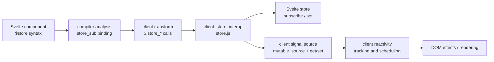
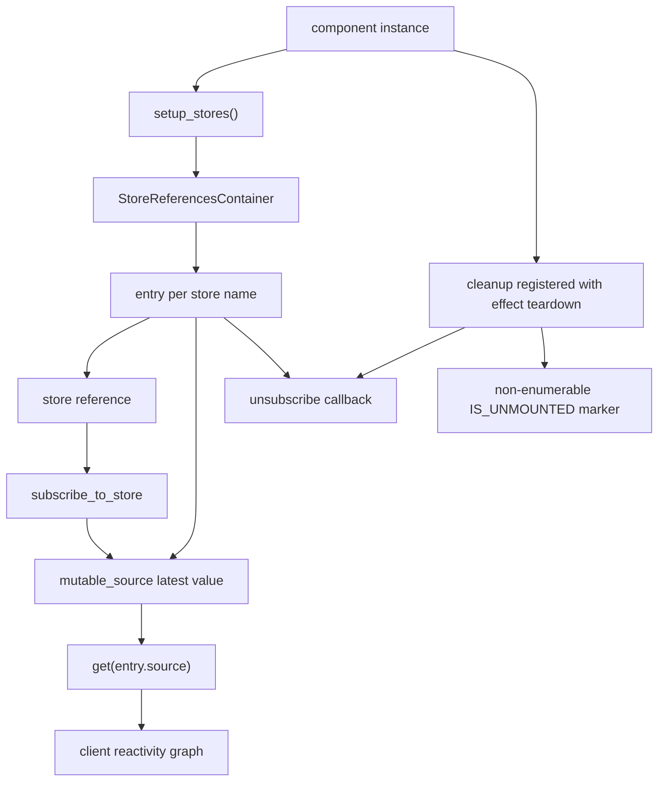
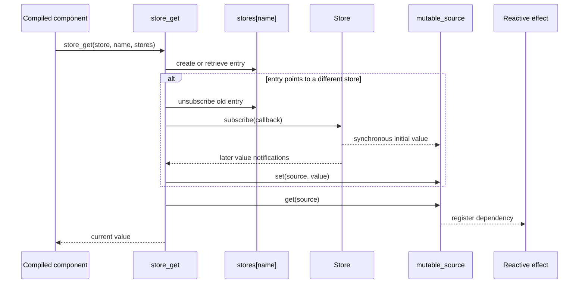
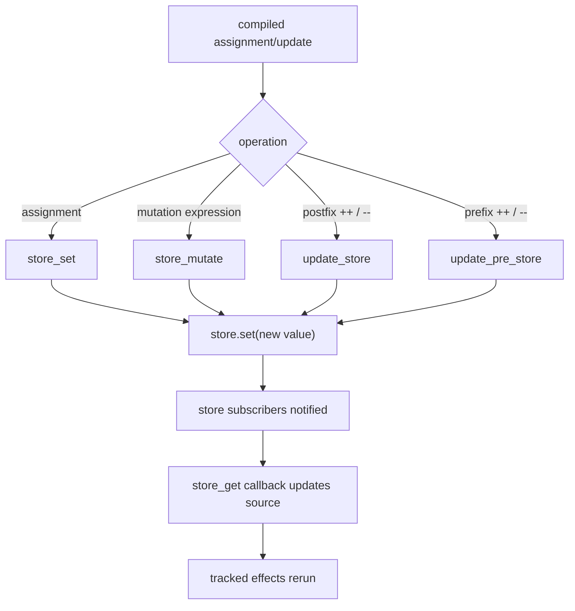
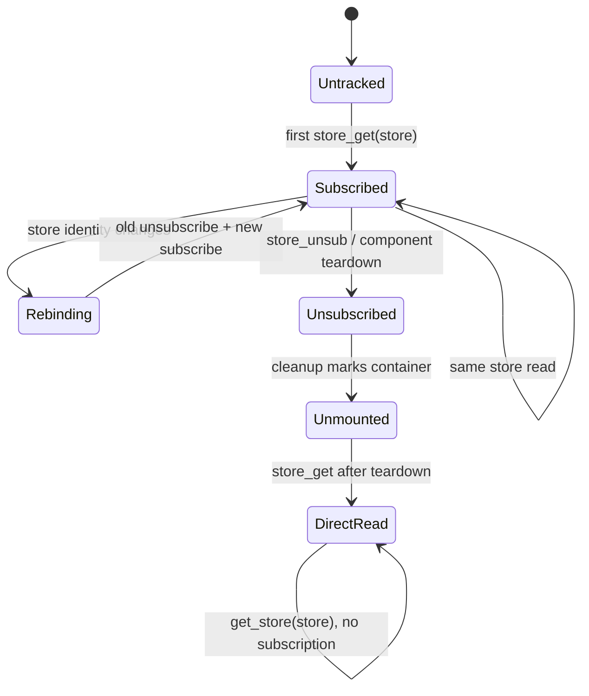
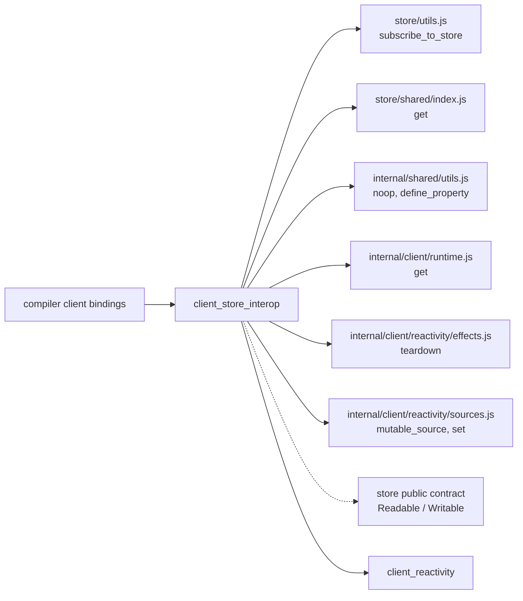

# Client store interop

`client_store_interop` is the client-runtime adapter for Svelte stores. It makes a store used through the `$store` syntax look like a reactive client signal, while preserving the store's subscription and mutation semantics. The module is intentionally small: compiler output calls it for store reads, writes, updates, and cleanup; the general signal scheduler and effect lifecycle remain in [client_reactivity](client_reactivity.md).

The source is `packages/svelte/src/internal/client/reactivity/store.js`.

## Role in the system

The compiler classifies `$count`-style references as `store_sub` bindings and emits calls such as `$.store_get`, `$.store_set`, `$.store_mutate`, `$.update_store`, and `$.store_unsub`. See [compiler_transform_client_core_bindings](compiler_transform_client_core_bindings.md) for the binding classification and generated-code decisions. At runtime, this module connects those calls to the public store contract (`subscribe`, `set`, and `update`) and to client reactivity sources.



## Architecture

The module has three cooperating responsibilities:

1. **Reference container and lifecycle** — `setup_stores` creates the per-component `stores` container. Each store name maps to its current store, a mutable source containing the latest value, and an unsubscribe function.
2. **Read/write interop** — `store_get` subscribes lazily and reads the source; `store_set`, `store_mutate`, `update_store`, and `update_pre_store` delegate writes to the store API while returning the value expected by generated expressions.
3. **Binding and cleanup guards** — `store_unsub` handles store reassignment, `IS_UNMOUNTED` prevents subscriptions after destruction, and `mark_store_binding`/`capture_store_binding` communicate mutability of store-bound props.



## Store reference entries

`store_get(store, store_name, stores)` creates an entry on first access:

```js
{
  store: null,
  source: mutable_source(undefined),
  unsubscribe: noop
}
```

The entry is keyed by the compiler-generated store name, normally the identifier used after `$`. The `store` field is compared by identity. If the component changes from one store object to another under the same name, the old subscription is removed before the new one is installed.

The subscription callback updates `source` in two modes:

- The first synchronous callback is written directly to `source.v`. This avoids an unsafe signal mutation when a store (especially a derived store) synchronously emits during subscription.
- Later emissions call `set(entry.source, value)`, allowing the normal client reactivity machinery to observe and schedule dependents.

In development builds, the source is labelled with `store_name`, improving diagnostics and inspection output.

## Read path

Reads are lazy. A component that never evaluates `$store` does not subscribe to the store. Once read, the source becomes the reactive representation of the store value, so template effects and derived computations track it through the ordinary client runtime.



If the component has already been unmounted, `store_get` deliberately avoids registering a subscription. For consistency after teardown it reads the store directly through the public `get` helper; this is less efficient than the signal path but avoids a stale source and a memory leak.

## Write and update paths

The write helpers preserve JavaScript expression semantics while using the store API:

| Helper | Runtime operation | Returned value |
| --- | --- | --- |
| `store_set(store, value)` | `store.set(value)` | `value` |
| `store_mutate(store, expression, new_value)` | `store.set(new_value)` | original `expression` |
| `update_store(store, store_value, d)` | `store.set(store_value + d)` | pre-update value |
| `update_pre_store(store, store_value, d)` | `store.set(store_value + d)` | post-update value |

The distinction between `update_store` and `update_pre_store` matches postfix and prefix increment/decrement behavior generated by the compiler. The helper receives the current `$store` value because the compiler has already built the corresponding expression; the helper is responsible for committing the new value to the underlying store.



## Subscription lifecycle and reassignment

`setup_stores` returns `[stores, cleanup]`. The compiler/runtime calls the cleanup function as part of the component effect teardown. Cleanup unsubscribes every entry and then defines the non-enumerable `IS_UNMOUNTED` marker on the container.

`store_unsub` is separate from normal cleanup. It is used when the store variable itself is reassigned. It unsubscribes an entry when the entry's current store differs from the store being processed, but intentionally leaves the `entry.store` field unchanged so a subsequent `store_get` can correctly attach to the replacement store.



## Store-bound props

`mark_store_binding` sets a short-lived module flag while a prop getter is evaluated. `capture_store_binding(fn)` clears the flag, runs `fn`, captures whether the getter encountered a store binding, and restores the previous flag in a `finally` block. The compiler/runtime uses the result to treat `<Child bind:x={$store} />` as mutable in runes mode and to suppress a false `binding_property_non_reactive` diagnostic. This is metadata communication, not value propagation.

## Invalidation helper

`invalidate_store(stores, store_name)` writes the source's current value back to the underlying store when an entry is active. It supports compiler-generated mutation/invalidation paths where a value may have been changed through a proxied or nested expression and the store must be notified explicitly.

## Dependencies and boundaries



The adapter accepts ordinary Svelte stores and also benefits from `subscribe_to_store`'s compatibility handling for RxJS-style unsubscribe objects. It does not implement store creation, derived-store computation, equality policy, or effect scheduling. Those belong to the store library and [client_reactivity](client_reactivity.md).

## Operational invariants

- One store name has at most one active subscription in a component's reference container.
- A store is subscribed only when `$store` is read, and subscriptions are removed during teardown or explicit reassignment.
- The source is updated synchronously only for the initial subscription callback; subsequent updates use the reactive `set` path.
- A post-unmount read must not create a new subscription.
- Write helpers delegate to `store.set` and preserve the return value required by the original JavaScript operator.
- The binding flag is restored even if the captured getter throws.

## Related modules

- [client_reactivity](client_reactivity.md) — signal sources, effects, derived values, batching, and runtime reads.
- [compiler_transform_client_core_bindings](compiler_transform_client_core_bindings.md) — identifies `store_sub` bindings and emits the `$.store_*` calls consumed here.
- [compiler_transform_client_javascript](compiler_transform_client_javascript.md) — transforms assignments, updates, and expressions that reach these helpers.
- [compiler_transform_server_javascript_stores](compiler_transform_server_javascript_stores.md) — compiler-side store handling for server output.
- [compiler_transform_server_core_program](compiler_transform_server_core_program.md) — server-side store subscription bookkeeping and teardown generation.
- [compiler_transform_server](compiler_transform_server.md) — the server transformation boundary that emits code using server-side store helpers such as `update_store`, `update_store_pre`, and `unsubscribe_stores`.
