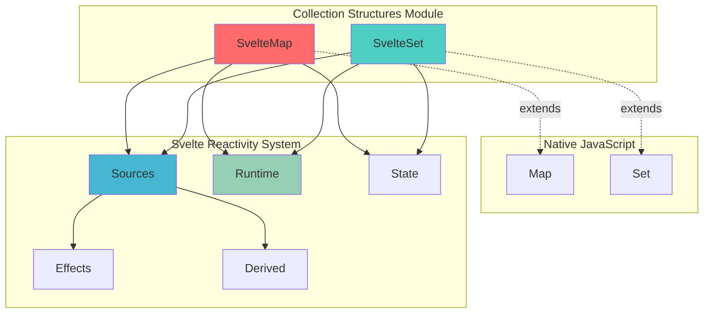
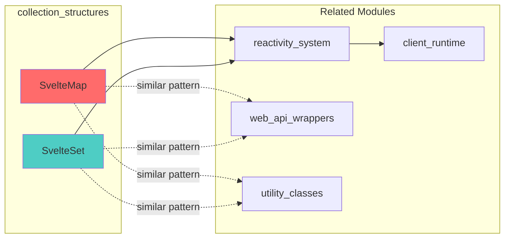
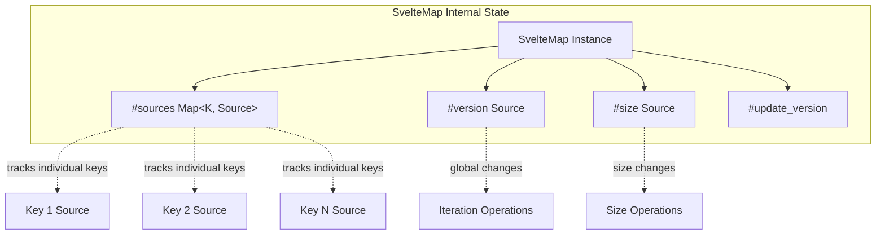
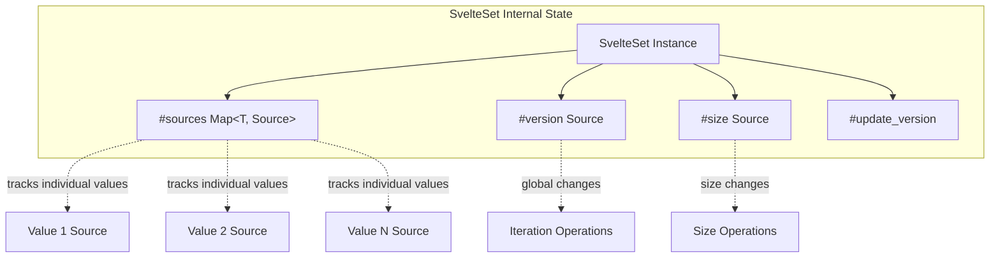
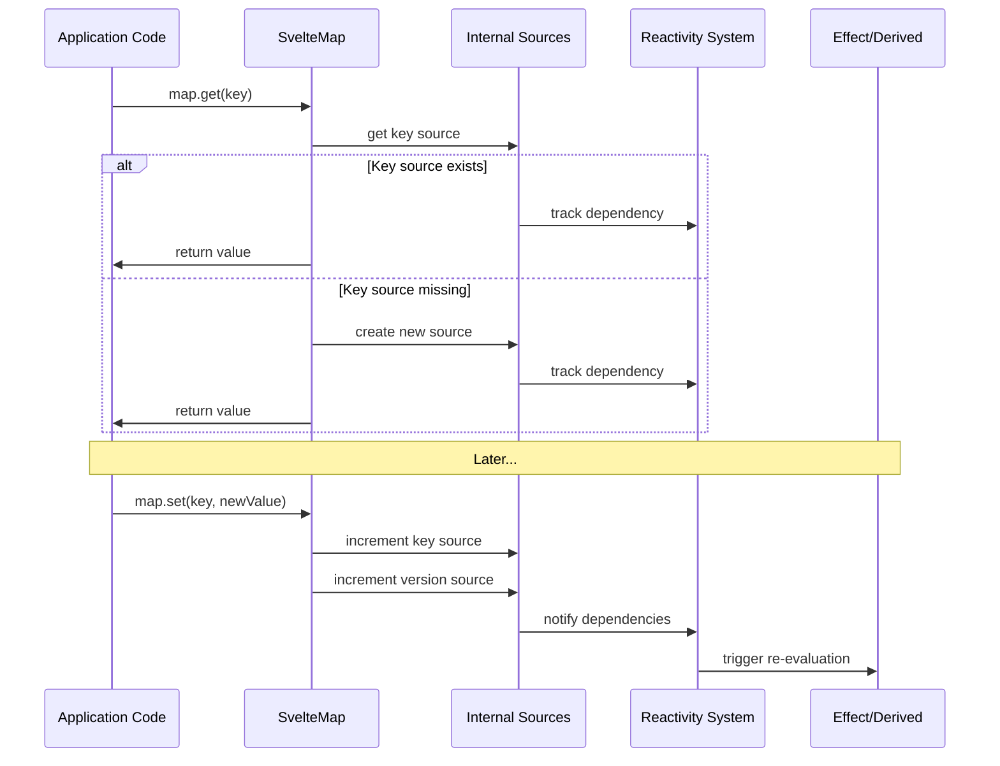

# Collection Structures Module

The collection_structures module provides reactive versions of JavaScript's built-in collection types (Map and Set) that integrate seamlessly with Svelte's reactivity system. These reactive collections automatically trigger re-evaluation of effects and derived values when their contents change, enabling fine-grained reactivity for complex data structures.

## Overview

This module is part of Svelte's reactive data structures system and provides:

- **SvelteMap**: A reactive version of the native Map object
- **SvelteSet**: A reactive version of the native Set object

Both classes extend their native counterparts while adding reactivity tracking through Svelte's internal reactivity system. They maintain full API compatibility with native collections while providing automatic dependency tracking for reactive contexts.

## Architecture



## Component Relationships



## Core Components

### SvelteMap

A reactive version of JavaScript's Map that tracks access to keys and automatically updates dependent reactive contexts when the map changes.

**Key Features:**
- Full Map API compatibility
- Fine-grained reactivity per key
- Automatic size tracking
- Version-based change detection
- Development mode debugging support

**Internal Structure:**


**Reactive Operations:**
- **Read Operations**: `get()`, `has()`, `size`, iteration methods
- **Write Operations**: `set()`, `delete()`, `clear()`
- **Iteration**: `keys()`, `values()`, `entries()`, `forEach()`

### SvelteSet

A reactive version of JavaScript's Set that tracks membership and automatically updates dependent reactive contexts when the set changes.

**Key Features:**
- Full Set API compatibility
- Fine-grained reactivity per value
- Automatic size tracking
- Version-based change detection
- Support for Set-like operations (union, intersection, etc.)

**Internal Structure:**


## Reactivity Flow



## Usage Patterns

### Basic Reactive Map Usage

```javascript
import { SvelteMap } from 'svelte/reactivity';

// Create reactive map
let gameBoard = new SvelteMap();

// Reactive derived value
let winner = $derived(calculateWinner(gameBoard));

// Reactive effect
$effect(() => {
  console.log(`Board size: ${gameBoard.size}`);
});

// Updates trigger reactivity
gameBoard.set('A1', 'X');  // Triggers size effect
gameBoard.set('B2', 'O');  // Triggers winner calculation
```

### Basic Reactive Set Usage

```javascript
import { SvelteSet } from 'svelte/reactivity';

// Create reactive set
let selectedItems = new SvelteSet();

// Reactive derived value
let selectionCount = $derived(selectedItems.size);
let hasSelection = $derived(selectedItems.size > 0);

// Updates trigger reactivity
selectedItems.add('item1');    // Triggers size calculations
selectedItems.delete('item1'); // Triggers size calculations
```

## Performance Characteristics

### Memory Management
- **Per-key/value tracking**: Each accessed key/value gets its own reactive source
- **Lazy source creation**: Sources are only created when keys/values are accessed
- **Automatic cleanup**: Sources are removed when keys/values are deleted

### Optimization Strategies
- **Version tracking**: Global version prevents unnecessary per-key updates during iteration
- **Batch updates**: Multiple changes in the same reaction are optimized
- **Conditional reactivity**: Sources created based on reaction context

## Integration Points

### With Reactivity System
- Integrates with Svelte's [reactivity_system](reactivity_system.md) for dependency tracking
- Uses internal sources and runtime for state management
- Supports effects and derived values automatically

### With Client Runtime
- Leverages [client_runtime](client_runtime.md) for batch processing and updates
- Integrates with the component lifecycle and update scheduling

### With Other Reactive Structures
- Follows similar patterns as [web_api_wrappers](web_api_wrappers.md) (SvelteDate, SvelteURL)
- Complements [utility_classes](utility_classes.md) for comprehensive reactive data handling

## Development Features

### Debug Support
- Development mode tagging for better debugging experience
- Labeled sources for easier identification in dev tools
- Console-friendly output during inspection

### Type Safety
- Full TypeScript support with generic type parameters
- Maintains type compatibility with native Map and Set
- Proper inference for key/value types

## Best Practices

### When to Use
- **Complex state management**: When you need reactive collections that multiple components depend on
- **Game state**: Board games, card games, or other grid-based applications
- **Selection management**: Multi-select interfaces, shopping carts, or tag systems
- **Cache management**: Reactive caches that need to trigger updates when contents change

### Performance Considerations
- **Large collections**: Be mindful of memory usage with very large collections
- **Frequent iteration**: Consider the cost of tracking all keys/values during iteration
- **Nested reactivity**: Values in collections are not made deeply reactive

### Common Patterns
```javascript
// Reactive cache pattern
let cache = new SvelteMap();
let cacheHit = $derived(cache.has(currentKey));

// Selection management pattern
let selectedIds = new SvelteSet();
let selectedItems = $derived(
  items.filter(item => selectedIds.has(item.id))
);

// State machine pattern
let gameState = new SvelteMap([
  ['phase', 'setup'],
  ['players', new SvelteSet()],
  ['score', new SvelteMap()]
]);
```

## Related Documentation

- [reactivity_system](reactivity_system.md) - Core reactivity implementation
- [web_api_wrappers](web_api_wrappers.md) - Other reactive wrapper classes
- [utility_classes](utility_classes.md) - Additional reactive utilities
- [client_runtime](client_runtime.md) - Runtime system integration
- [component_system](component_system.md) - Component integration patterns

## API Reference

### SvelteMap<K, V>

Extends `Map<K, V>` with full API compatibility plus reactive behavior.

**Constructor:**
- `new SvelteMap(iterable?)` - Creates a new reactive map

**Reactive Methods:**
- All standard Map methods (`get`, `set`, `has`, `delete`, `clear`, etc.)
- All methods trigger appropriate reactive updates
- Iteration methods track global version for efficiency

### SvelteSet<T>

Extends `Set<T>` with full API compatibility plus reactive behavior.

**Constructor:**
- `new SvelteSet(iterable?)` - Creates a new reactive set

**Reactive Methods:**
- All standard Set methods (`add`, `has`, `delete`, `clear`, etc.)
- Set-like operations (`union`, `intersection`, `difference`, etc.)
- All methods trigger appropriate reactive updates