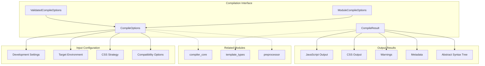
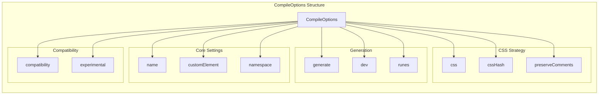
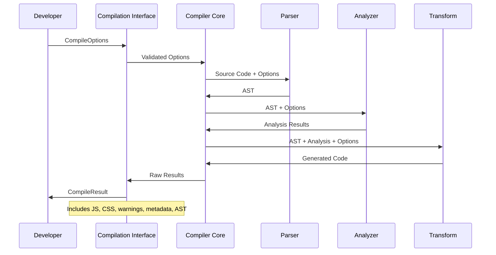
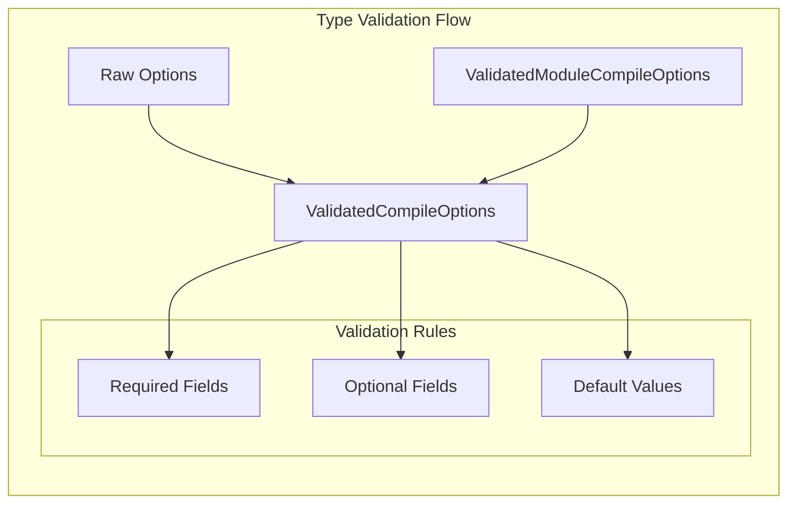

# Compilation Interface Module

The compilation interface module serves as the primary API contract for Svelte's compilation system, defining the essential types and interfaces that govern how Svelte components are compiled from source code into executable JavaScript and CSS.

## Overview

This module provides the foundational types that define:
- **Compilation Configuration**: How developers configure the compilation process through `CompileOptions`
- **Compilation Results**: What the compiler returns after processing Svelte components via `CompileResult`
- **Type Safety**: Comprehensive TypeScript definitions ensuring type-safe compilation workflows
- **Extensibility**: Interfaces that support various compilation targets (client, server, custom elements)

The module acts as the bridge between developer intent (configuration) and compiler output (results), establishing a clear contract for the entire Svelte compilation pipeline.

## Architecture Overview



## Core Components

### CompileOptions Interface

The `CompileOptions` interface defines all configuration parameters available when compiling Svelte components. It extends `ModuleCompileOptions` and provides comprehensive control over the compilation process.

#### Key Configuration Categories

**Component Generation**
- `name`: JavaScript class name for the component
- `customElement`: Generate custom element constructor
- `accessors`: Create getters/setters for props (legacy mode)
- `namespace`: Element namespace (html, svg, mathml)

**Code Generation Strategy**
- `generate`: Target environment ('client', 'server', or false)
- `dev`: Enable development mode with runtime checks
- `runes`: Force runes mode or legacy mode
- `immutable`: Optimization for immutable data (legacy)

**CSS Handling**
- `css`: CSS inclusion strategy ('injected' or 'external')
- `cssHash`: Custom CSS class name generation
- `preserveComments`: Retain HTML comments in output
- `preserveWhitespace`: Maintain original whitespace

**Advanced Options**
- `fragments`: DOM cloning strategy ('html' or 'tree')
- `compatibility`: Backward compatibility settings
- `experimental`: Experimental feature flags



### CompileResult Interface

The `CompileResult` interface represents the complete output of the Svelte compilation process, containing all generated code, metadata, and diagnostic information.

#### Result Components

**JavaScript Output**
- `js.code`: Generated JavaScript code
- `js.map`: Source map for debugging

**CSS Output**
- `css.code`: Generated CSS code (if applicable)
- `css.map`: CSS source map
- `css.hasGlobal`: Global CSS rules indicator

**Diagnostics and Metadata**
- `warnings`: Compilation warnings array
- `metadata.runes`: Runes mode detection result
- `ast`: Abstract syntax tree representation

```mermaid
graph TB
    subgraph "CompileResult Structure"
        CR[CompileResult]
        
        subgraph "JavaScript Output"
            JSC[js.code]
            JSM[js.map]
        end
        
        subgraph "CSS Output"
            CSSC[css.code]
            CSSM[css.map]
            CSSG[css.hasGlobal]
        end
        
        subgraph "Diagnostics"
            WARN[warnings]
            META[metadata]
        end
        
        subgraph "AST"
            AST[ast]
        end
    end
    
    CR --> JSC
    CR --> JSM
    CR --> CSSC
    CR --> CSSM
    CR --> CSSG
    CR --> WARN
    CR --> META
    CR --> AST
```

## Compilation Flow



## Integration with Compiler Pipeline

The compilation interface module serves as the entry and exit point for the entire Svelte compilation pipeline:

### Input Processing
1. **Option Validation**: Raw `CompileOptions` are validated and normalized
2. **Default Application**: Missing options receive appropriate defaults
3. **Compatibility Handling**: Legacy options are processed for backward compatibility

### Output Formatting
1. **Result Aggregation**: Compilation outputs are collected from various phases
2. **Source Map Generation**: Debug information is consolidated
3. **Warning Collection**: Diagnostic messages are formatted and categorized

## Type Safety and Validation



The module provides several validation types:
- `ValidatedCompileOptions`: Ensures all required options have values
- `ValidatedModuleCompileOptions`: Base validation for module compilation
- Type guards prevent runtime errors and ensure consistent behavior

## Dependencies and Relationships

### Core Dependencies
- **[compiler_core](compiler_core.md)**: Utilizes parsing, analysis, and transformation phases
- **[template_types](template_types.md)**: References AST and template node types
- **[preprocessor](preprocessor.md)**: Integrates with preprocessing pipeline

### External Dependencies
- `magic-string`: Source map generation and manipulation
- `estree`: JavaScript AST node types for expressions and statements

## Usage Patterns

### Basic Compilation
```typescript
const options: CompileOptions = {
  filename: 'App.svelte',
  generate: 'client',
  dev: true
};

const result: CompileResult = compile(source, options);
```

### Server-Side Rendering
```typescript
const ssrOptions: CompileOptions = {
  generate: 'server',
  css: 'external',
  hydratable: true
};
```

### Custom Element Generation
```typescript
const customElementOptions: CompileOptions = {
  customElement: true,
  css: 'injected',
  tag: 'my-component'
};
```

## Configuration Strategies

### Development vs Production
- **Development**: Enable `dev`, preserve comments, include source maps
- **Production**: Disable `dev`, optimize CSS strategy, minimize output

### Target Environment Optimization
- **Client**: Focus on bundle size and runtime performance
- **Server**: Optimize for rendering speed and SEO
- **Universal**: Balance between client and server requirements

## Error Handling and Diagnostics

The module provides comprehensive error and warning types:
- `CompileError`: Fatal compilation errors
- `Warning`: Non-fatal issues with detailed location information
- `ICompileDiagnostic`: Base diagnostic interface with position tracking

## Future Considerations

### Runes Mode Transition
- Default runes mode in Svelte 6
- Gradual migration path for legacy components
- Compatibility layer maintenance

### Performance Optimizations
- Incremental compilation support
- Caching strategies for repeated compilations
- Memory usage optimization for large projects

## Related Documentation

- **[compiler_core](compiler_core.md)**: Core compilation phases and pipeline
- **[template_types](template_types.md)**: AST node definitions and template structures
- **[preprocessor](preprocessor.md)**: Source transformation before compilation
- **[css_types](css_types.md)**: CSS-specific type definitions and processing

This module forms the foundation of Svelte's compilation system, providing the essential contracts that enable developers to transform Svelte components into optimized, executable code while maintaining full type safety and comprehensive configuration control.