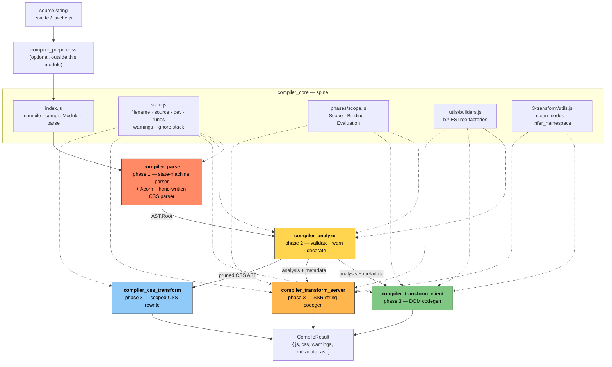
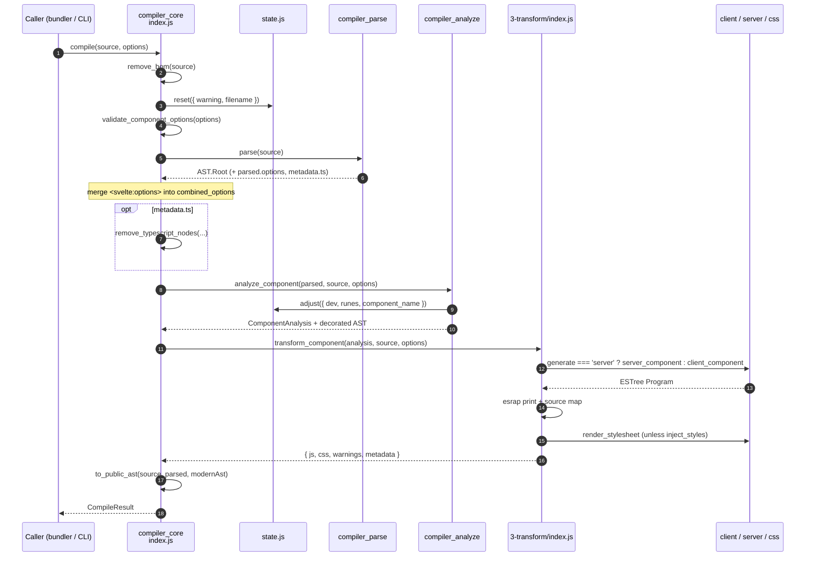
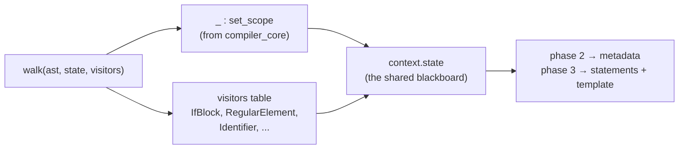
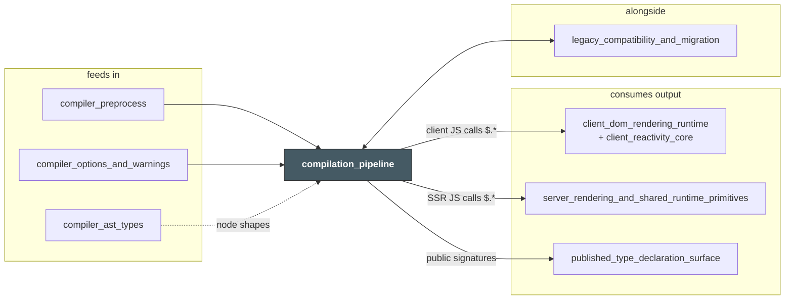

# compilation_pipeline

## 1. What this module is

`compilation_pipeline` is the **whole Svelte compiler**: the code that takes a `.svelte` file (or a `.svelte.js` module) and turns it into a plain JavaScript module plus a CSS file.

Source root: `packages/svelte/src/compiler`.

The compiler is a **three-phase pipeline**. Each phase has one job, and each hands a single artifact to the next:

```
source text
   │
   ▼  phase 1 — parse            "what did the user write?"
AST.Root
   │
   ▼  phase 2 — analyze          "is it legal, and what does codegen need to know?"
AST.Root + metadata + ComponentAnalysis
   │
   ▼  phase 3 — transform        "what JavaScript / CSS should we emit?"
CompileResult { js, css, warnings, metadata, ast }
```

Phase 3 forks three ways — a **client** (DOM) generator, a **server** (SSR string) generator, and a **CSS** rewriter — all reading the *same* analyzed tree. Around all of it sits `compiler_core`, which owns the entry points, the global compiler state, the scope/binding model, and the AST builders that every phase shares.

Key properties worth knowing before you read any sub-document:

| Property | Consequence |
| --- | --- |
| **Phase 2 creates no new tree.** | It mutates `node.metadata.*` in place and returns one `ComponentAnalysis` accumulator. Both transforms read the same decorated AST. |
| **Compiler state is global and module-level.** | `state.reset()` must be the first thing any entry point calls; compilations cannot run concurrently in one JS realm. |
| **Errors throw, warnings accumulate.** | The first illegal construct aborts the compile; `w.*` calls collect into `state.warnings` and land on the result. |
| **Offsets are sacred.** | Every node carries `start`/`end` into the *original* source. Source maps, code frames, and the CSS MagicString rewrite all depend on them. |
| **Client and server share input, not output.** | Same AST and analysis; DOM effects on one side, string concatenation on the other. |

---

## 2. Architecture

### 2.1 The pipeline, end to end



### 2.2 What `compile()` actually does



`compileModule()` is the short path for `.svelte.js` / `.svelte.ts`: no template, no CSS, no legacy mode — always runes, straight from `analyze_module` to `transform_module`.

### 2.3 Component map

```mermaid
graph TD
    CP["<b>compilation_pipeline</b>"]

    CP --> C["compiler_core<br/><i>entry points · state · scope · builders</i>"]
    CP --> A["compiler_parse<br/><i>phase 1</i>"]
    CP --> B["compiler_analyze<br/><i>phase 2</i>"]
    CP --> D["compiler_transform_client<br/><i>phase 3 · DOM</i>"]
    CP --> E["compiler_transform_server<br/><i>phase 3 · SSR</i>"]
    CP --> F["compiler_css_transform<br/><i>phase 3 · CSS</i>"]

    A --> A1["state machine<br/>dispatch · element · tag"]
    A --> A2["readers<br/>expression · script · style · options"]
    A --> A3["JS/TS interop<br/>acorn · remove_typescript_nodes"]
    A --> A4["utils<br/>html · bracket · fuzzymatch"]

    B --> B1["blocks &amp; tags"]
    B --> B2["special elements"]
    B --> B3["expression metadata"]
    B --> B4["exports"]
    B --> B5["css analysis"]

    D --> D1["core<br/>state · bindings · expressions"]
    D --> D2["template"]
    D --> D3["blocks"]
    D --> D4["elements"]
    D --> D5["directives"]
    D --> D6["components"]
    D --> D7["javascript"]

    E --> E1["core<br/>program · template"]
    E --> E2["javascript<br/>runes · declarations · classes · stores"]
    E --> E3["blocks"]
    E --> E4["elements"]
    E --> E5["components"]

    style CP fill:#455a64,stroke:#333,color:#fff
    style C fill:#e0e0e0,stroke:#333,color:#000
    style A fill:#ff8a65,stroke:#333,color:#000
    style B fill:#ffd54f,stroke:#333,color:#000
    style D fill:#81c784,stroke:#333,color:#000
    style E fill:#ffb74d,stroke:#333,color:#000
    style F fill:#90caf9,stroke:#333,color:#000
```



### 2.4 The one pattern that repeats everywhere

Phases 2 and 3 are all the same shape: a **zimmerframe walk with a visitor table**, one file per AST node type, plus a catch-all `_` visitor that keeps `context.state.scope` correct.



Because of this, a node type usually has **four** files with the same name: an analyze visitor, a client visitor, a server visitor, and a parse state that built it. Adding a new block or directive means touching all four — that is the single most useful fact about this module's layout.

---

## 3. Phase responsibilities at a glance

| Phase | Input | Output | Fails on |
| --- | --- | --- | --- |
| **[compiler_parse](compiler_parse.md)** | raw source string | `AST.Root` (`fragment`, `instance`, `module`, `css`, `options`, `comments`) | syntax errors only — no semantics checked |
| **[compiler_analyze](compiler_analyze.md)** | `AST.Root` | same tree, decorated; `ComponentAnalysis`; warnings | illegal-but-parseable code (`export let` in runes mode, misplaced `:global`, …) |
| **[compiler_transform_client](compiler_transform_client.md)** | analysis | browser ES module calling `$.*` DOM runtime | nothing — decisions only |
| **[compiler_transform_server](compiler_transform_server.md)** | analysis | SSR ES module pushing strings into `$$payload` | nothing — decisions only |
| **[compiler_css_transform](compiler_css_transform.md)** | analysis + original source | scoped CSS text + source map | nothing — pure rewrite |

### The three artifacts that tie the phases together

1. **`AST.Root`** — parse's only product. Every node carries `start`/`end` and a `metadata` slot.
2. **`Scope` / `Binding`** (`compiler_core`) — built once by `create_scopes`, consulted by every phase after. `Binding.kind` (`prop`, `state`, `each`, `snippet`, `legacy_reactive`, …) and the `mutated` / `reassigned` flags drive nearly every codegen branch.
3. **`ComponentAnalysis` + `node.metadata`** — analyze's only product. Flags like `Fragment.metadata.dynamic`, `expression.has_state / has_call / has_await`, and `ComplexSelector.metadata.used` are what let phase 3 emit a static template string instead of a reactive effect.

---

## 4. Core component documentation

| Document | Covers | Read it when |
| --- | --- | --- |
| [compiler_core](compiler_core.md) | `index.js` entry points, `state.js`, `phases/scope.js`, `utils/builders.js`, shared transform helpers, diagnostics | Always first — nothing else makes sense without the scope model and the `b.*` builders |
| [compiler_parse](compiler_parse.md) | `phases/1-parse/` — the `Parser` class, state machine, readers, Acorn interop, loose mode, TypeScript stripping | Adding template syntax, or debugging a bad `start`/`end` offset |
| [compiler_analyze](compiler_analyze.md) | `phases/2-analyze/` — the visitor registry, `AnalysisState`, `mark_subtree_dynamic`, export validation, CSS pruning | Adding a compile error or warning, or a new metadata flag |
| [compiler_transform_client](compiler_transform_client.md) | `phases/3-transform/client/` — transform state, the `transform` rewrite record, `Memoizer`, `Template` builder, ~50 visitors | Changing generated browser code, or the static/dynamic optimisation |
| [compiler_transform_server](compiler_transform_server.md) | `phases/3-transform/server/` — the three walks, `process_children` / `build_template`, hydration markers, reactivity erasure | Changing SSR output or hydration marker placement |
| [compiler_css_transform](compiler_css_transform.md) | `phases/3-transform/css/` — `render_stylesheet`, MagicString rewriting, hash scoping, `:where()` specificity trick | Changing how `.svelte-hash` is attached or dead CSS is stripped |

### Nested documents

Each phase document links onward to its own sub-documents:

- **parse** → state machine (`dispatch` · `element` · `tag`), readers (`expression` · `script` · `style` · `options`), `js_interop`, `utils`
- **analyze** → `blocks` · `special_elements` · `expression_metadata` · `exports` · `css`
- **client transform** → `core` (`state` · `bindings` · `expressions`), `template`, `blocks` (`control_flow` · `snippets` · `tags` · `boundary`), `elements` (`regular` · `dynamic` · `attributes` · `special`), `directives`, `components` (`builder` · `entries` · `slots`), `javascript`
- **server transform** → `core` (`program` · `template`), `javascript` (`runes` · `declarations` · `classes` · `stores`), `blocks`, `elements` (`emit` · `attributes` · `special`), `components`

---

## 5. Neighbouring modules



| Module | Relationship |
| --- | --- |
| `compiler_support_services` (preprocess, option validation, AST types) | Runs before / alongside the pipeline. Preprocessors normalise the source; `validate-options.js` gates every flag the phases branch on; `types/` declares every node and metadata slot. |
| `client_dom_rendering_runtime`, `client_reactivity_core` | The `$` namespace that client-generated code calls. Every `$.if`, `$.each`, `$.set_attribute` in the output is defined there. |
| `server_rendering_and_shared_runtime_primitives` | The `$` namespace for SSR output: `$.escape`, `$.slot`, `$.head`, `$$payload`. |
| `legacy_compatibility_and_migration` | `legacy.js` converts the modern AST into Svelte 4 node shapes for `to_public_ast`; `migrate/` rewrites Svelte 4 source using this module's `parse` and `scope`. |
| `published_type_declaration_surface` | Publishes `compile` / `compileModule` / `parse` signatures and the AST types third-party tools consume. |

---

## 6. Notes for maintainers

- **Adding a template feature is a four-file change.** A new block, tag, or directive needs: a parse state (`state/tag.js` or `state/element.js`), a node type in `compiler_ast_types`, an analyze visitor, and a visitor in *both* transforms. Forgetting the server transform is the classic bug — the client path is far better covered by tests.
- **Order the state calls correctly.** `reset()` before anything, `set_source()` before any diagnostic (or code frames come out blank), `adjust()` only after runes mode is known.
- **Whitespace changes are high-risk.** `clean_nodes` in `compiler_core` decides what the browser sees, and both transforms read the same trimmed list. A change there can silently break hydration matching between SSR output and the client template.
- **Never assume the two transforms agree.** They share the AST and the analysis, and almost nothing else. Any new metadata flag has to be interpreted independently on each side.
- **CSS edits are MagicString edits.** They must not overlap, and offsets are absolute into the whole `.svelte` file, not into the `<style>` block.