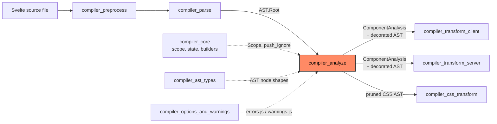
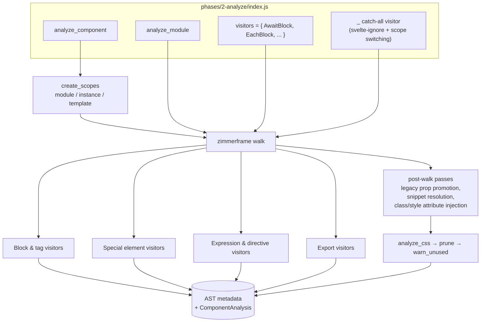
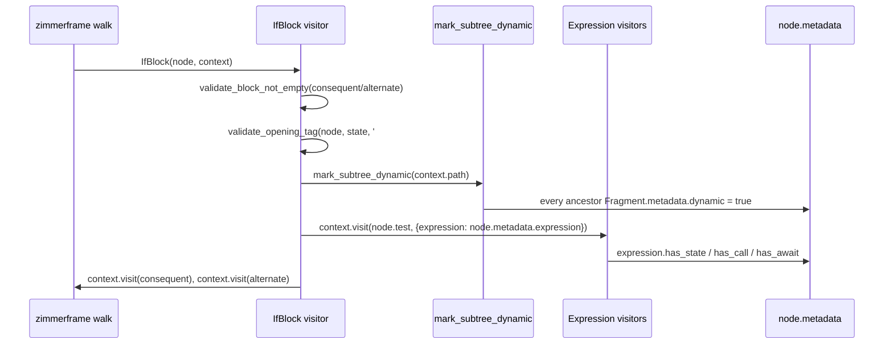
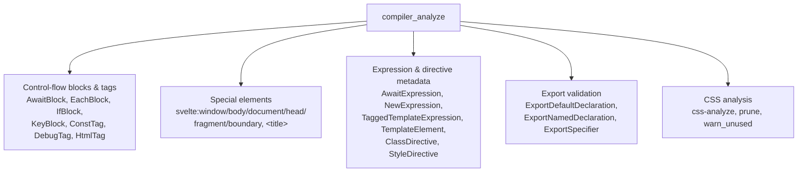
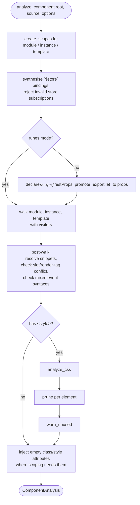

# compiler_analyze

## 1. What This Module Does

`compiler_analyze` is **phase 2** of the Svelte compiler. It sits between parsing and code
generation:

```
source text  ──►  1-parse  ──►  AST  ──►  2-analyze  ──►  AST + metadata  ──►  3-transform  ──►  JS + CSS
```

Phase 1 ([compiler_parse](compiler_parse.md)) only answers *"what did the user write?"*.
Phase 2 answers three further questions:

1. **Is it legal?** — report errors for things the grammar allows but Svelte forbids
   (`{#each}` with a `$state` context, `<svelte:head class="x">`, `:global` in the middle of a
   selector, `export let` in runes mode, top-level `await` without the experimental flag, …).
2. **Is it suspicious?** — report warnings that do not stop the build
   (unused CSS selectors, empty blocks, inline classes in hot paths, bidirectional control
   characters, non-reactive updates, …).
3. **What does the generator need to know?** — decorate the AST **in place** with metadata:
   which fragments are dynamic, which expressions read state / call functions / await,
   which each-blocks are keyed, which CSS selectors are used and which elements are scoped,
   which bindings must be promoted to reactive state.

The phase produces **no new tree**. Its whole output is (a) thrown errors, (b) emitted warnings,
and (c) mutations to `node.metadata.*` plus a single `ComponentAnalysis` object that
[compiler_transform_client](compiler_transform_client.md) and
[compiler_transform_server](compiler_transform_server.md) read from.

## 2. Where It Fits



| Neighbour | Relationship |
| --- | --- |
| [compiler_parse](compiler_parse.md) | Produces the `AST.Root` (module / instance / fragment / css) that this phase walks. |
| [compiler_core](compiler_core.md) | Supplies `Scope` / `create_scopes` / `get_rune`, the global `state.js` ignore stack, and the `builders` helpers. |
| [compiler_ast_types](compiler_ast_types.md) | Declares every node type and its `metadata` slot that this phase fills in. |
| [compiler_options_and_warnings](compiler_options_and_warnings.md) | `errors.js` and `warnings.js` — every `e.*` / `w.*` call in this module lands there. |
| [compiler_transform_client](compiler_transform_client.md) / [compiler_transform_server](compiler_transform_server.md) | Consumers of the metadata. A visitor here has an almost 1:1 counterpart there. |
| [compiler_css_transform](compiler_css_transform.md) | Consumes `metadata.used` / `metadata.is_global` set by the CSS analysis to emit scoped CSS. |

## 3. Architecture

### 3.1 The visitor registry

`phases/2-analyze/index.js` is the entry point. It exports two functions:

* `analyze_module(source, options)` — for `.svelte.js` / `.svelte.ts` modules. One walk over one
  `Program`.
* `analyze_component(root, source, options)` — for `.svelte` files. Three walks (module script,
  instance script, template fragment) over a **shared** `ScopeRoot`.

Both walks use [zimmerframe](https://github.com/Rich-Harris/zimmerframe)'s `walk(node, state, visitors)`.
Each file in `visitors/` exports exactly one function named after the node type it handles, and
`index.js` collects them into one flat `visitors` object. This module documents that visitor set.



### 3.2 The `AnalysisState` object

Every visitor receives `(node, context)` where `context.state` is an `AnalysisState`
(`phases/2-analyze/types.d.ts`). Visitors thread information down the tree by calling
`context.next({ ...context.state, <override> })` or
`context.visit(child, { ...context.state, <override> })`.

| Field | Meaning |
| --- | --- |
| `scope` / `scopes` | Current lexical scope and the node→scope map from `compiler_core`. |
| `analysis` | The mutable `ComponentAnalysis` accumulator (exports, slot names, css info, flags…). |
| `options` | Validated compile options — gates things like `experimental.async`. |
| `ast_type` | `'module' \| 'instance' \| 'template'` — the same visitor behaves differently per tree. |
| `fragment` | Nearest enclosing template `Fragment`, or `null`. |
| `parent_element` | Tag name of the nearest real parent element (used for HTML nesting checks). |
| `expression` | `ExpressionMetadata` of the expression currently being visited — the sink for `has_state` / `has_call` / `has_await`. |
| `state_fields` | Map used while analysing `$state` class fields. |
| `function_depth` | How deep inside functions we are (top-level `await` detection). |
| `reactive_statement` | Legacy `$:` bookkeeping. |

The `expression` slot is the single most important mechanism in the module. A block visitor opens
it before descending:

```js
context.visit(node.expression, { ...context.state, expression: node.metadata.expression });
```

…and leaf visitors deep inside the expression write to it:

```js
context.state.expression.has_call = true;   // TaggedTemplateExpression
context.state.expression.has_await = true;  // AwaitExpression
```

### 3.3 Two cross-cutting helpers

Almost every visitor in this module uses one of two shared helpers:

* **`mark_subtree_dynamic(path)`** (`visitors/shared/fragment.js`) — walks *up* `context.path` and
  flags every enclosing `Fragment` as `dynamic`. A fragment that is never marked can be emitted as
  a static template string by phase 3, which is the single biggest codegen optimisation.
* **`validate_opening_tag(node, state, expected)`** (`visitors/shared/utils.js`) — in runes mode,
  asserts the character right after `{` is the expected sigil, so `{ #if x}` is a hard error
  instead of silently parsing.



## 4. Sub-modules

The visitor set splits cleanly along the kind of node it handles. Each group is documented
separately.



### 4.1 Control-flow blocks and tags → [compiler_analyze_blocks.md](compiler_analyze_blocks.md)

Handles `{#await}`, `{#each}`, `{#if}`, `{#key}`, `{@const}`, `{@debug}` and `{@html}`. These
visitors share one shape: check the block is not empty, check the opening sigil, mark the subtree
dynamic, then descend into the block expression with a fresh `expression` metadata target.
`EachBlock` additionally decides whether the block is *keyed* and, in legacy mode, walks the
transitive dependency graph to promote plain `let` bindings into reactive state. `ConstTag`
enforces that `{@const}` only appears as a direct child of a block or component fragment.

This sub-module also owns the two shared helpers described in section 3.3
(`validate_block_not_empty`, `validate_opening_tag`, `mark_subtree_dynamic`), which the other
sub-modules reuse.

### 4.2 Special elements → [compiler_analyze_special_elements.md](compiler_analyze_special_elements.md)

Handles `<svelte:window>`, `<svelte:body>`, `<svelte:document>`, `<svelte:head>`,
`<svelte:fragment>`, `<svelte:boundary>` and `<title>`. These are almost pure validators: they
forbid children (`disallow_children`), restrict which attributes are allowed (event attributes
only for `window`/`body`/`document`, `onerror`/`failed`/`pending` for `svelte:boundary`, nothing
for `svelte:head`/`<title>`), and check placement (`<svelte:fragment>` must be a direct child of a
component).

### 4.3 Expression and directive metadata → [compiler_analyze_expression_metadata.md](compiler_analyze_expression_metadata.md)

The "sensor" visitors. They do not usually validate; they observe an expression and record what it
implies for reactivity: `AwaitExpression` sets `has_await` and gates the experimental async
feature, `TaggedTemplateExpression` sets `has_call`/`has_state` for impure tags, `NewExpression`
forces `needs_context` and warns about inline classes, `TemplateElement` warns about hidden
bidirectional control characters. `ClassDirective` and `StyleDirective` sit here because their job
is likewise to funnel their value's metadata into `node.metadata.expression`.

### 4.4 Export validation → [compiler_analyze_exports.md](compiler_analyze_exports.md)

`ExportDefaultDeclaration`, `ExportNamedDeclaration` and `ExportSpecifier` decide what a component
or module is allowed to expose. Components may never `export default`; runes-mode components may
never `export let` (that is what `$props()` is for); `$derived` values and reassigned `$state` can
never be exported. In runes mode these visitors also populate `analysis.exports`, which phase 3
turns into the component's public API.

### 4.5 CSS analysis → [compiler_analyze_css.md](compiler_analyze_css.md)

`css/css-analyze.js` walks the stylesheet and answers "which selectors are global, which rules are
`:global {}` blocks, which keyframes need hashing?" while rejecting every illegal `:global`
placement. Its sibling `css-prune.js` then matches each remaining selector against the real element
list (`analysis.elements`) to set `metadata.used` / `metadata.scoped`, and `css-warn.js` reports
whatever is still unused. The results feed [compiler_css_transform](compiler_css_transform.md).

## 5. End-to-end flow



Key property: **errors throw immediately** (`e.*` functions never return), so the first illegal
construct aborts the whole compile. Warnings (`w.*`) accumulate and are attached to the final
`CompileResult`. The `svelte-ignore` comment mechanism is implemented in the catch-all `_` visitor
of `index.js` by pushing/popping the global ignore stack from
[compiler_core](compiler_core.md)'s `state.js` around each node.

## 6. Sub-module documentation index

| Sub-module | Covers |
| --- | --- |
| [compiler_analyze_blocks.md](compiler_analyze_blocks.md) | `{#await}`, `{#each}`, `{#if}`, `{#key}`, `{@const}`, `{@debug}`, `{@html}` and the shared block helpers. |
| [compiler_analyze_special_elements.md](compiler_analyze_special_elements.md) | `<svelte:window/body/document/head/fragment/boundary>` and `<title>`. |
| [compiler_analyze_expression_metadata.md](compiler_analyze_expression_metadata.md) | `AwaitExpression`, `NewExpression`, `TaggedTemplateExpression`, `TemplateElement`, `ClassDirective`, `StyleDirective`. |
| [compiler_analyze_exports.md](compiler_analyze_exports.md) | `export default`, `export let`, `export { … }` validation and `analysis.exports`. |
| [compiler_analyze_css.md](compiler_analyze_css.md) | Stylesheet analysis, `:global` rules, selector pruning and unused-selector warnings. |

### Related modules

* [compiler_parse.md](compiler_parse.md) — produces the AST consumed here.
* [compiler_core.md](compiler_core.md) — scopes, compiler state and AST builders.
* [compiler_ast_types.md](compiler_ast_types.md) — node and metadata type declarations.
* [compiler_options_and_warnings.md](compiler_options_and_warnings.md) — the error and warning catalogue.
* [compiler_transform_client.md](compiler_transform_client.md) / [compiler_transform_server.md](compiler_transform_server.md) — consume the analysis metadata.
* [compiler_css_transform.md](compiler_css_transform.md) — consumes the CSS analysis results.
