# compiler_analyze_blocks

## Introduction

`compiler_analyze_blocks` is the part of Svelte's **analysis phase** (phase 2) that
checks and annotates *template blocks and tags* — the `{#...}` and `{@...}`
constructs you write in a `.svelte` file.

It handles seven node types:

| Node | Template syntax |
| --- | --- |
| `IfBlock` | `{#if ...}` / `{:else if ...}` / `{:else}` |
| `EachBlock` | `{#each items as item, i (key)}` |
| `AwaitBlock` | `{#await ...}` / `{:then ...}` / `{:catch ...}` |
| `KeyBlock` | `{#key ...}` |
| `ConstTag` | `{@const x = ...}` |
| `DebugTag` | `{@debug x}` |
| `HtmlTag` | `{@html ...}` |

Each visitor does three kinds of work:

1. **Validate** — report errors and warnings for malformed or misplaced blocks.
2. **Annotate** — write facts onto the node's `metadata` (for example, "this
   `{#each}` is keyed", "this fragment is dynamic") that later phases read.
3. **Recurse** — hand control back to the walker with the right `state`, so the
   block's expression is analysed against the right scope and the right
   `ExpressionMetadata` bucket.

The visitors never rewrite the AST. They only read it, decorate it, and raise
diagnostics. Code generation happens later in
[compiler_transform_client](compiler_transform_client.md) and
[compiler_transform_server](compiler_transform_server.md).

---

## Where this module sits

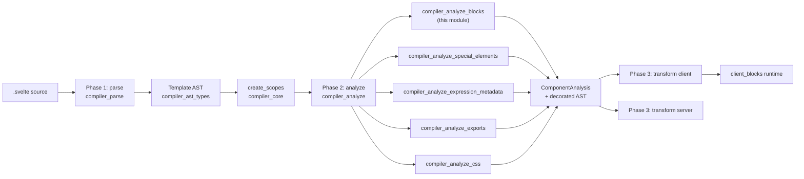

Read [compiler_analyze](compiler_analyze.md) for how the whole phase is wired,
and [compiler_parse](compiler_parse.md) for how these block nodes are produced.

---

## Files in the module

```
phases/2-analyze/visitors/
├── IfBlock.js            {#if} / {:else if}
├── EachBlock.js          {#each}
├── AwaitBlock.js         {#await}
├── KeyBlock.js           {#key}
├── ConstTag.js           {@const}
├── DebugTag.js           {@debug}
├── HtmlTag.js            {@html}
└── shared/
    ├── utils.js          validate_block_not_empty, validate_opening_tag, ...
    └── fragment.js       mark_subtree_dynamic
```

### Component map

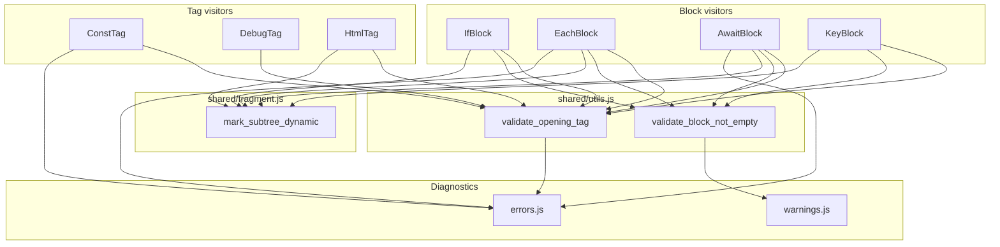

Notice the shape: every visitor is a thin, node-specific policy layer sitting on
top of two tiny shared helpers. That is the whole design of the module.

---

## The two shared helpers

### `validate_opening_tag(node, state, expected)`

Checks that the character right after the opening `{` is the expected sigil —
`#` for `{#if}`, `:` for `{:else if}`, `@` for `{@const}`.

It reads the **raw source text** (`state.analysis.source`) rather than the AST,
because the parser in legacy mode tolerates whitespace like `{ #if ...}`. This
check exists so runes-mode components reject that older, looser syntax. When it
fails it calls `e.block_unexpected_character` and highlights only the first ~5
characters, to avoid a wall of red squiggles.

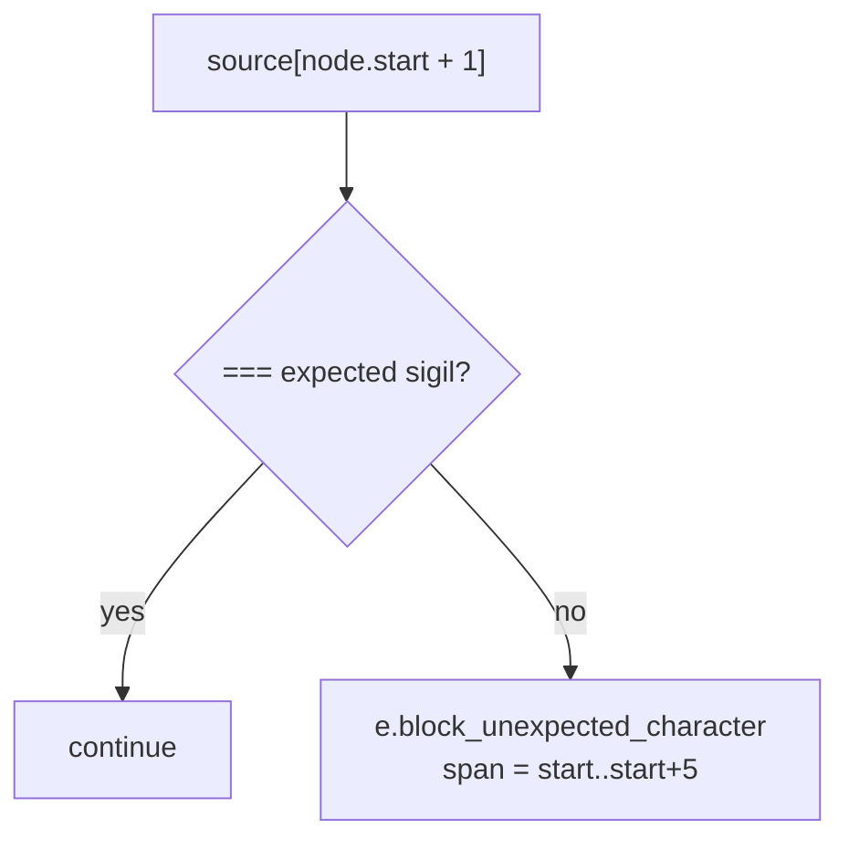

> Important: most visitors call this **only when `analysis.runes` is true**.
> `EachBlock` is the exception — it validates unconditionally, in both runes and
> legacy mode.

### `validate_block_not_empty(fragment, context)`

Emits the `block_empty` **warning** when a block body contains nothing but
whitespace text. It deliberately stays quiet when the body has zero nodes,
assuming the developer is mid-typing and a warning would just be noise.

### `mark_subtree_dynamic(path)`

The one piece of *annotation* shared across the module. It walks the ancestor
`path` from the innermost node outward and sets `metadata.dynamic = true` on
every `Fragment` it passes. It stops early the moment it finds a fragment
already marked, so repeated calls stay cheap.

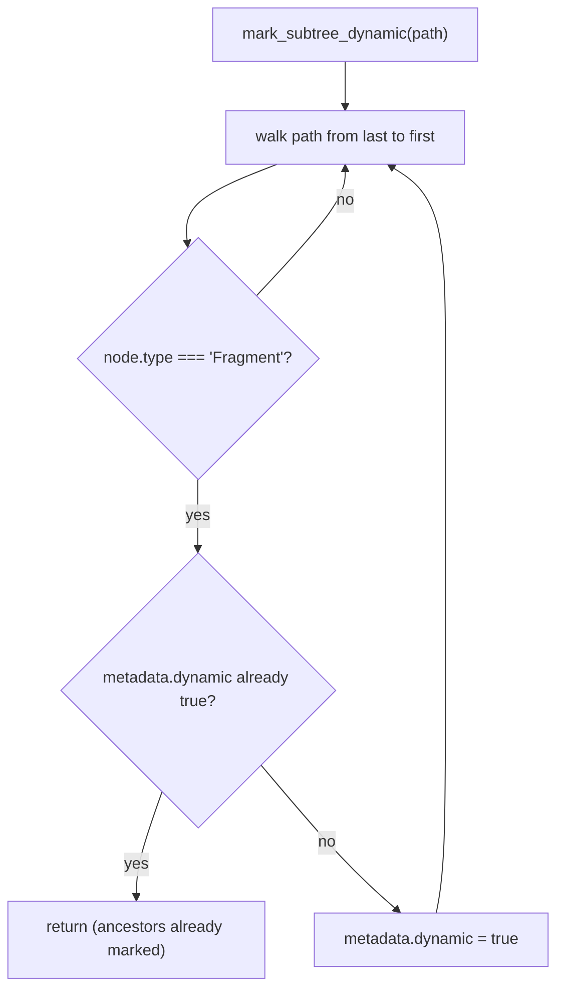

**Why it matters:** a fragment marked `dynamic` tells phase 3 that the runtime
must walk into this fragment during mount and hydrate, instead of treating it as
a static chunk of HTML that can be cloned wholesale. Any block whose content can
change over time must set this flag, or the generated code would skip creating
the effects that keep it up to date.

---

## Common visitor shape

Every visitor in this module follows the same four-step pattern.

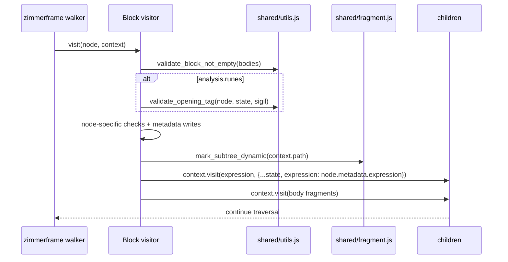

The key detail is the `expression` field threaded through `state`. Sibling module
[compiler_analyze_expression_metadata](compiler_analyze_expression_metadata.md)
owns the visitors that *fill in* `ExpressionMetadata` (`dependencies`,
`has_state`, `has_call`, `has_await`, …). Block visitors decide **which bucket**
those facts land in, by setting `state.expression` before descending. That is how
the compiler later knows, for instance, that the `{#if}` test depends on a
particular state variable and therefore needs its own reactive effect.

---

## Per-visitor behaviour

### IfBlock

```javascript
validate_block_not_empty(node.consequent, context);
validate_block_not_empty(node.alternate, context);
if (runes) validate_opening_tag(node, state, node.elseif ? ':' : '#');
mark_subtree_dynamic(context.path);
context.visit(node.test, { ...state, expression: node.metadata.expression });
context.visit(node.consequent);
if (node.alternate) context.visit(node.alternate);
```

The sigil is chosen from the `elseif` flag: an `{:else if}` chain is represented
as a nested `IfBlock` with `elseif: true`, so it expects `:` rather than `#`.

### KeyBlock

The simplest block: check the single fragment is not empty, validate the `#`
sigil in runes mode, mark the subtree dynamic, then visit the key expression and
the fragment.

### AwaitBlock

Handles three optional bodies (`pending`, `then`, `catch`) and adds a check the
other blocks do not need — a **`:then` / `:catch` sigil check for the value
pattern**.

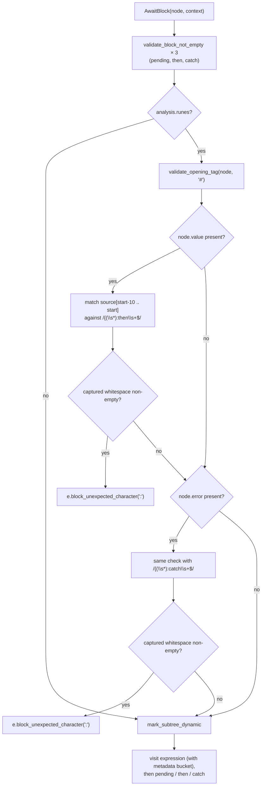

**Why the regex?** The `{:then value}` and `{:catch error}` clauses are not
separate AST nodes — the pattern hangs off the `AwaitBlock` as `node.value` /
`node.error`. There is no node whose `start` points at the `{`, so the visitor
looks backwards 10 characters from the pattern's `start` and reconstructs the
clause opening from the raw source. If the captured whitespace group is
non-empty, the source said `{ :then foo}`, which runes mode rejects.

### EachBlock

The largest visitor, because it carries both keying logic and the legacy
reactivity fixups.

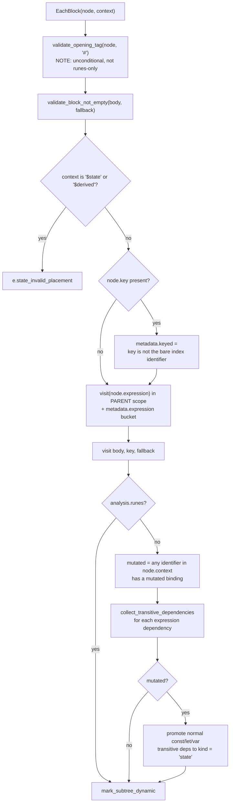

Three things deserve attention:

**1. The expression is visited in the parent scope.**

```javascript
context.visit(node.expression, {
  ...context.state,
  expression: node.metadata.expression,
  scope: context.state.scope.parent
});
```

`create_scopes` (see [compiler_core](compiler_core.md)) gives an `EachBlock` its
own child scope holding the `as item` binding and the index. But
`{#each items as items}` must resolve `items` to the *outer* variable, not to
itself. Stepping up to `scope.parent` makes that correct.

**2. Keyed vs. indexed.**

```javascript
node.metadata.keyed =
  node.key.type !== 'Identifier' || !node.index || node.key.name !== node.index;
```

`{#each items as item, i (i)}` keys by the index, which is the same thing as not
keying at all — so it is treated as a plain indexed block, which is faster. Any
other key expression makes the block genuinely keyed. Phase 3 reads this flag to
pick the runtime each-block strategy (see [client_blocks](client_blocks.md)).

**3. Legacy transitive state promotion (non-runes only).**

In Svelte 4 semantics, mutating `item` inside `{#each items as item}` must
invalidate `items` — and anything `items` itself derives from. So the visitor:

- checks whether any binding introduced by `node.context` is `mutated`;
- walks the expression's `dependencies`, following `legacy_reactive` bindings
  through their `legacy_dependencies` recursively (`collect_transitive_dependencies`,
  guarded by a `Set` so cycles terminate), storing the closure in
  `metadata.transitive_deps`;
- if the item *was* mutated, promotes every plain `const` / `let` / `var` binding
  in that closure from `kind: 'normal'` to `kind: 'state'`, so phase 3 will back
  them with mutable sources that can be invalidated.

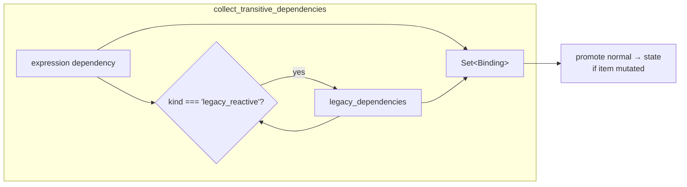

### ConstTag

Does no dynamic marking. Its distinctive job is a **placement check**: `{@const}`
is only legal as a direct child of a fragment whose owner can host it.

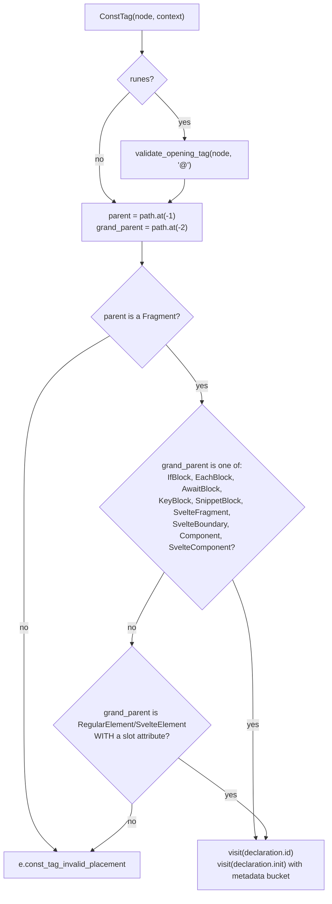

The element-with-`slot` escape hatch exists because such an element acts as a
slot template, which is a legal `{@const}` host. The declaration is visited in
two parts: the pattern `id` with the ambient state, and `init` with the tag's
own `ExpressionMetadata` bucket.

### HtmlTag

```javascript
if (runes) validate_opening_tag(node, state, '@');
mark_subtree_dynamic(context.path);          // "unfortunately this is necessary"
context.next({ ...state, expression: node.metadata.expression });
```

`{@html}` always marks its subtree dynamic — even for a constant string. The
comment in the source explains why: raw HTML may be malformed, and the browser's
parser will reshape it on insertion. Because the compiler cannot predict the
resulting DOM shape, it cannot rely on static template cloning here, so the
subtree must be traversed at runtime.

### DebugTag

The thinnest visitor in the module: validate the `@` sigil in runes mode, then
`context.next()`. It does *not* mark the subtree dynamic — `{@debug}` produces no
DOM. Note also that `DebugTag` in the AST has no `metadata.expression`; it carries
a plain `identifiers` array instead, so there is no bucket to thread.

---

## Behaviour comparison

| Visitor | Empty-body warning | Opening-tag check | Marks subtree dynamic | Extra validation | Writes metadata |
| --- | --- | --- | --- | --- | --- |
| `IfBlock` | consequent, alternate | runes only, `:` or `#` | yes | — | — |
| `EachBlock` | body, fallback | **always**, `#` | yes | `$state`/`$derived` as context name | `keyed`, `transitive_deps`, binding kinds |
| `AwaitBlock` | pending, then, catch | runes only, `#` | yes | `:then` / `:catch` sigil via source regex | — |
| `KeyBlock` | fragment | runes only, `#` | yes | — | — |
| `ConstTag` | — | runes only, `@` | **no** | parent / grandparent placement | — |
| `DebugTag` | — | runes only, `@` | **no** | — | — |
| `HtmlTag` | — | runes only, `@` | yes (always) | — | — |

---

## Data flow: what the module reads and writes

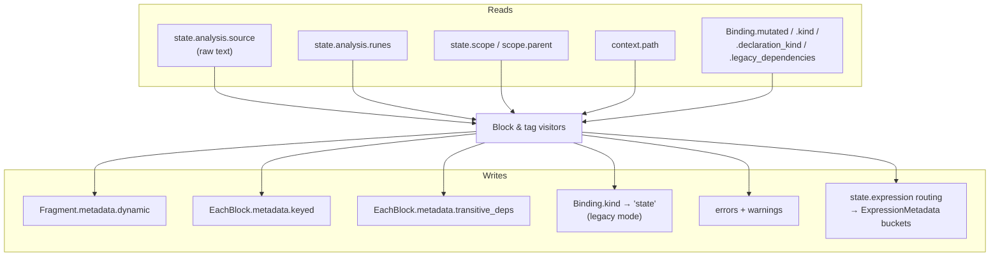

### Consumers downstream

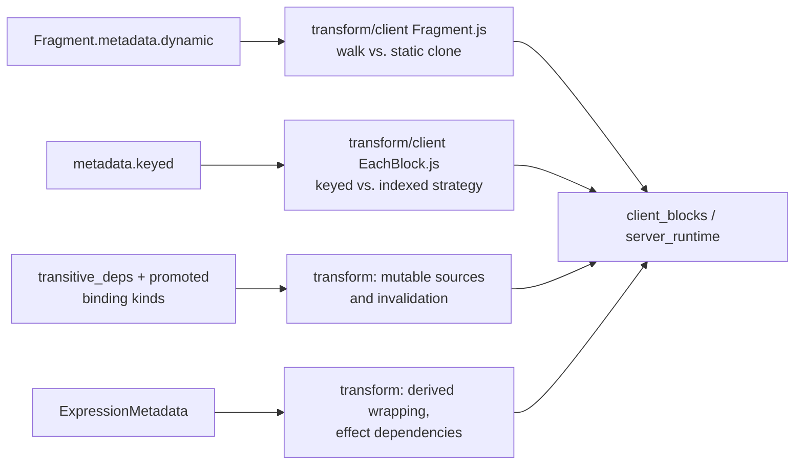

See [compiler_transform_client](compiler_transform_client.md),
[compiler_transform_server](compiler_transform_server.md), and
[client_blocks](client_blocks.md) for the consuming side.

---

## Runes mode vs. legacy mode

`analysis.runes` splits behaviour in two places, and it is the main source of
conditional logic in the module.

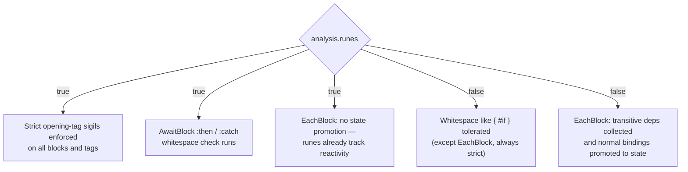

The comment on `validate_opening_tag` states the intent plainly: once legacy mode
is removed, this check should move into the parser and disappear from analysis.
The same is true of the whole legacy branch of `EachBlock`.

---

## Traversal example

For this template:

```svelte
{#each rows as row (row.id)}
  {#if row.open}
    {@const label = row.name.toUpperCase()}
    {@html row.body}
  {/if}
{/each}
```

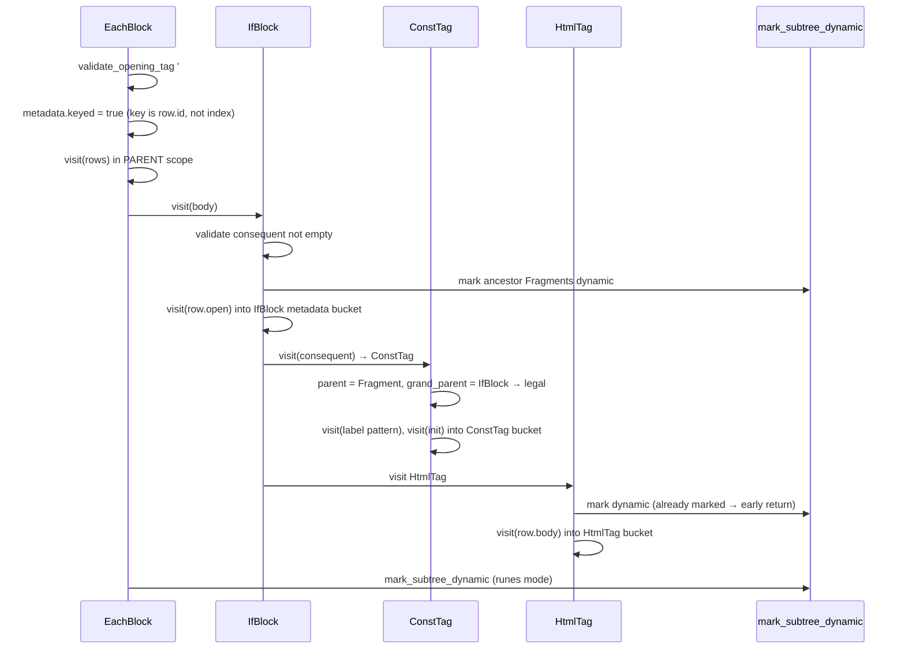

Note the early return in `mark_subtree_dynamic`: the `IfBlock` marked the chain
first, so the later calls from `HtmlTag` and `EachBlock` cost almost nothing.

---

## Extending the module

To add a new block or tag visitor:

1. Create `visitors/MyBlock.js` exporting `MyBlock(node, context)`.
2. Register it in the visitor table used by `analyze_component`
   (see [compiler_analyze](compiler_analyze.md)).
3. Call `validate_opening_tag(node, context.state, sigil)` — gate it on
   `context.state.analysis.runes` unless the syntax was always strict.
4. Call `validate_block_not_empty` for each optional body fragment.
5. Call `mark_subtree_dynamic(context.path)` **if and only if** the block can
   produce DOM that changes at runtime. Skipping this on a dynamic block causes
   subtle "the UI never updates" bugs; adding it needlessly costs performance.
6. Thread `expression: node.metadata.expression` into the state you pass when
   visiting the block's own expressions, so expression facts land in the right
   bucket.
7. Add matching transform visitors in
   [compiler_transform_client](compiler_transform_client.md) and
   [compiler_transform_server](compiler_transform_server.md), plus node types in
   [compiler_ast_types](compiler_ast_types.md).

---

## Related modules

| Module | Relationship |
| --- | --- |
| [compiler_analyze](compiler_analyze.md) | Parent phase; owns the visitor table and `ComponentAnalysis` |
| [compiler_analyze_expression_metadata](compiler_analyze_expression_metadata.md) | Fills the `ExpressionMetadata` buckets these visitors route into |
| [compiler_analyze_special_elements](compiler_analyze_special_elements.md) | Sibling: `<svelte:*>` elements; shares the `shared/` helpers |
| [compiler_analyze_exports](compiler_analyze_exports.md) | Sibling; also uses `shared/utils.js` |
| [compiler_analyze_css](compiler_analyze_css.md) | Sibling; runs after the AST walk and also calls `mark_subtree_dynamic` |
| [compiler_parse](compiler_parse.md) | Produces the block nodes consumed here |
| [compiler_core](compiler_core.md) | `create_scopes`, `Scope`, `Binding`, builders |
| [compiler_ast_types](compiler_ast_types.md) | `AST.IfBlock`, `AST.EachBlock`, `ExpressionMetadata`, … |
| [compiler_transform_client](compiler_transform_client.md) | Reads `keyed`, `dynamic`, promoted binding kinds |
| [compiler_transform_server](compiler_transform_server.md) | Server-side counterpart |
| [client_blocks](client_blocks.md) | Runtime implementations these decisions target |
| [compiler_options_and_warnings](compiler_options_and_warnings.md) | Defines `block_empty` and friends |
