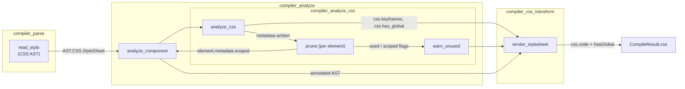
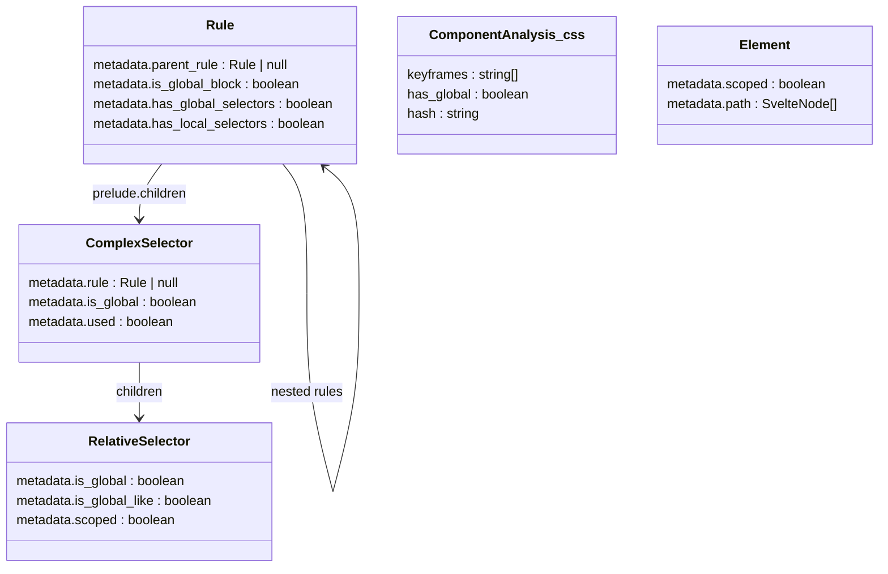
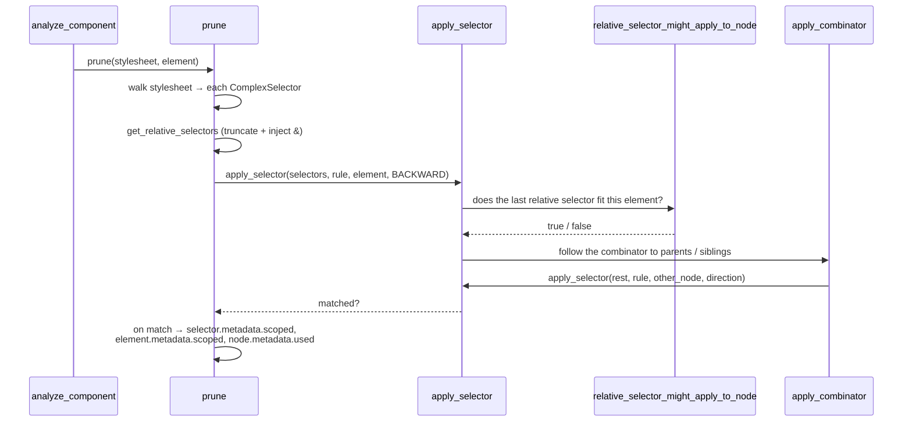
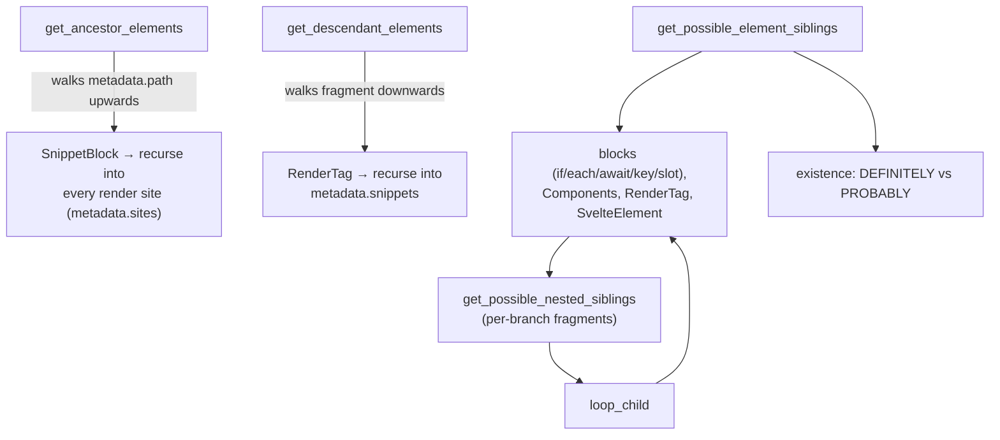
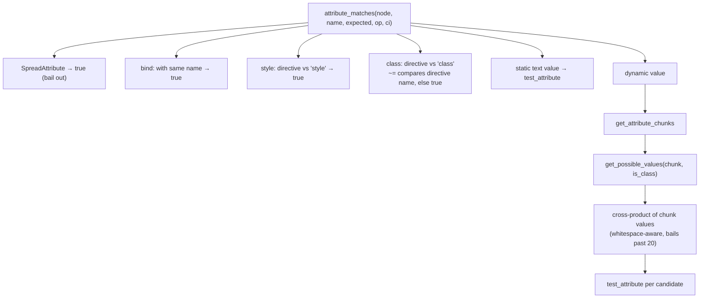
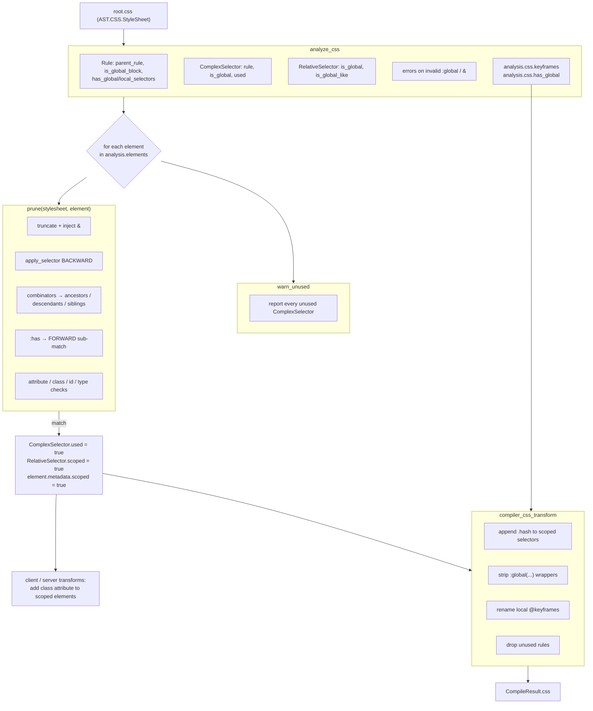
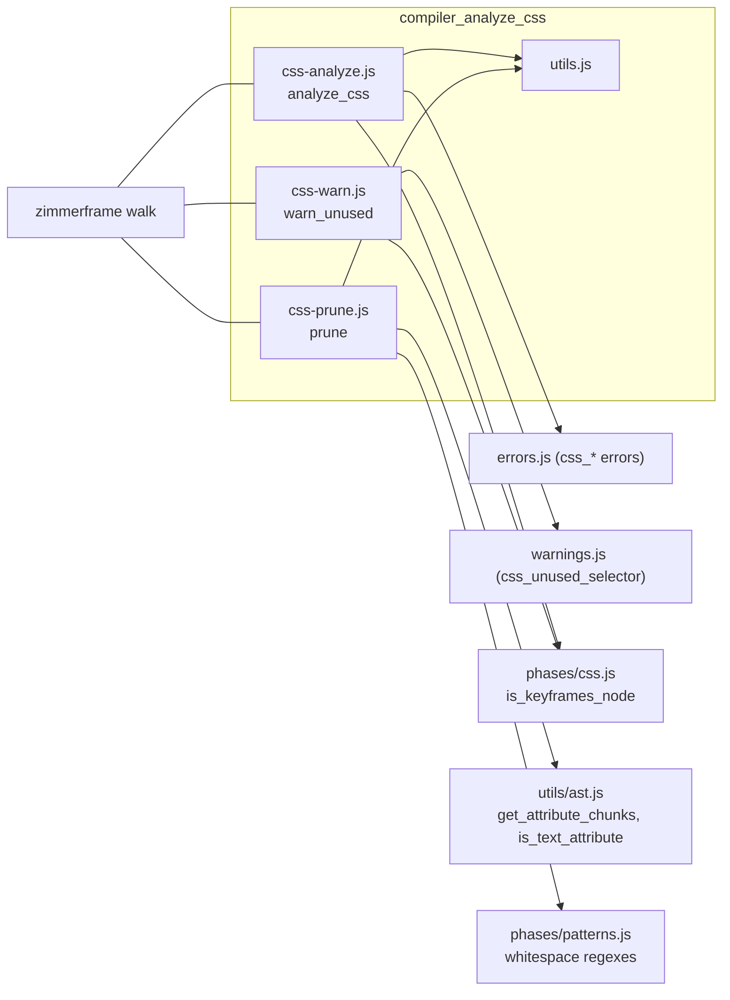

# compiler_analyze_css

## Introduction

`compiler_analyze_css` is the CSS brain of Svelte's analysis phase (phase 2). It takes the CSS
AST that the parser produced from a component's `<style>` block, together with the list of
elements in the component's template, and answers three questions:

1. **Is this CSS valid?** — mostly rules about where `:global` and `&` may appear.
2. **Which selector matches which element?** — so the transform phase knows which elements need
   the scoping class and which selectors need the scoping suffix.
3. **Which selectors match nothing?** — so the compiler can warn about dead CSS.

It does not rewrite any CSS. It only *annotates* the AST with metadata. The rewriting happens
later in [compiler_css_transform](compiler_css_transform.md), which reads exactly the flags this
module writes.

The module lives in `packages/svelte/src/compiler/phases/2-analyze/css/` and has four files:

| File | Core exports | Job |
| --- | --- | --- |
| `css-analyze.js` | `analyze_css`, plus internal `is_global_block_selector`, `is_in_global_block`, `is_unscoped` | Walk the stylesheet, validate it, mark globalness, collect keyframes |
| `css-prune.js` | `prune` | Match one template element against every selector; mark matches as used/scoped |
| `css-warn.js` | `warn_unused` | Walk the stylesheet again and warn for every selector still unmarked |
| `utils.js` | `is_global`, `is_unscoped_pseudo_class`, `get_possible_values`, plus `is_outer_global`, `get_parent_rules` | Shared predicates and the class/attribute value estimator |

---

## Where the module sits



Related modules:

- [compiler_parse_readers_style](compiler_parse_readers_style.md) — produces the CSS AST this
  module consumes (`read_style`, `read_selector`, `read_at_rule`, `read_declaration`).
- [compiler_analyze](compiler_analyze.md) — the parent phase; `analyze_component` is the only
  caller of this module.
- [compiler_css_transform](compiler_css_transform.md) — the consumer of all metadata produced here.
- [compiler_options_and_warnings](compiler_options_and_warnings.md) — defines `css_unused_selector`
  and the `css_*` error factories used below.
- [compiler_ast_types](compiler_ast_types.md) / [css_ast](css_ast.md) — the node and metadata
  shapes (`AST.CSS.Rule`, `RelativeSelector`, `PseudoClassSelector`, …).

### Call site inside `analyze_component`

```js
if (analysis.css.ast) {
    analyze_css(analysis.css.ast, analysis);

    // mark nodes as scoped/unused/empty etc
    for (const node of analysis.elements) {
        prune(analysis.css.ast, node);
    }

    if (!should_ignore_unused) {   // `<!-- svelte-ignore css_unused_selector -->`
        warn_unused(analysis.css.ast);
    }
}
```

Order matters and is strict: `analyze_css` writes the globalness metadata that `prune` reads;
`prune` writes the `used` flags that `warn_unused` reads.

---

## The metadata model

Everything this module does is expressed as flags on AST nodes. Understanding these five groups is
enough to understand the whole module.



| Flag | Written by | Read by | Meaning |
| --- | --- | --- | --- |
| `Rule.metadata.parent_rule` | `analyze_css` | `prune`, `utils` | Enclosing rule for CSS nesting; `null` at top level |
| `Rule.metadata.is_global_block` | `analyze_css` | `prune`, `warn_unused`, transform | Rule's prelude starts with bare `:global` |
| `Rule.metadata.has_global_selectors` / `has_local_selectors` | `analyze_css` | transform | Whether any / not-all selectors are global |
| `ComplexSelector.metadata.rule` | `analyze_css` | `prune` | Back-pointer used for nesting resolution |
| `ComplexSelector.metadata.is_global` | `analyze_css` | transform, `prune` | Every relative selector is global(-like) |
| `ComplexSelector.metadata.used` | `analyze_css` + `prune` | `warn_unused`, transform | Selector matched something (or is global) |
| `RelativeSelector.metadata.is_global` | `analyze_css` | `prune`, transform | Truly `:global(...)` / bare `:global` |
| `RelativeSelector.metadata.is_global_like` | `analyze_css` | `prune`, transform | `:root`, `:host`, `::view-transition*`, or sits after `:global` in a global block |
| `RelativeSelector.metadata.scoped` | `prune` | transform | Needs the `.svelte-xyz` suffix appended |
| `Element.metadata.scoped` | `prune` | `analyze_component`, client/server transforms | Element needs the scoping class attribute |
| `analysis.css.keyframes` | `analyze_css` | transform | Local `@keyframes` names to rename |
| `analysis.css.has_global` | `analyze_css` | `render_stylesheet` → `CompileResult.css.hasGlobal` | Component emits CSS affecting things outside itself |

---

## Stage 1 — `analyze_css`

```js
export function analyze_css(stylesheet, analysis) {
    const css_state = { keyframes: analysis.css.keyframes, rule: null, analysis };
    walk(stylesheet, css_state, css_visitors);
}
```

A single `zimmerframe` walk with a `CssState` carrying the *current* rule (so nested selectors know
their owner), the keyframes accumulator, and the whole `ComponentAnalysis`.

### Visitor responsibilities

```mermaid
graph TD
    W["walk(stylesheet, css_state, css_visitors)"]

    W --> AT["Atrule"]
    W --> R["Rule"]
    W --> CS["ComplexSelector"]
    W --> RSel["RelativeSelector"]
    W --> NS["NestingSelector"]

    AT --> AT1["is_keyframes_node?<br/>collect local name<br/>or flag has_global for -global-"]
    R --> R1["set parent_rule"]
    R --> R2["detect :global block<br/>+ validate modifiers/combinator/list"]
    R --> R3["visit prelude, then block<br/>(explicit ordering)"]
    R --> R4["roll up has_global_selectors<br/>/ has_local_selectors / has_global"]
    CS --> CS1["validate :global placement<br/>inside the selector"]
    CS --> CS2["is_global = all children global(-like)"]
    CS --> CS3["used ||= is_global"]
    CS --> CS4["mark &:hover under :global(...) as used"]
    RSel --> RS1["validate leading combinator"]
    RSel --> RS2["is_global via utils.is_global"]
    RSel --> RS3["is_global_like: :root / :host / ::view-transition*"]
    RSel --> RS4["pre-mark nested selectors inside globals as used"]
    NS --> NS1["validate & placement<br/>(needs a parent rule)"]
```



### `Atrule` — keyframes bookkeeping

For `@keyframes` (after vendor-prefix stripping via
[`is_keyframes_node`](compiler_css_transform.md)):

- name **not** starting with `-global-` and **not** inside a `:global {}` block →
  push the name onto `state.keyframes`, so the transform can rename it to `hash-name` and rewrite
  matching `animation` declarations.
- name starting with `-global-` → the keyframes escape the component, so
  `analysis.css.has_global ||= is_unscoped(path)`.

### `Rule` — `:global {}` blocks, nesting and roll-up

The heavy lifting. For each complex selector in the prelude it scans the relative selectors for a
bare `:global` (`is_global_block_selector`: a `PseudoClassSelector` named `global` with
`args === null`).

- Bare `:global` at position 0 of a relative selector → `node.metadata.is_global_block = true`,
  and everything **after** it in the same complex selector becomes `is_global_like`.
- Any inner selectors of the `:global` compound (`:global.foo`) are walked and force-marked
  `used`, because scoping never applies to them.
- After the prelude is visited, per-selector globalness is rolled up into
  `has_global_selectors` / `has_local_selectors`.
- `analysis.css.has_global` becomes true when a rule has global selectors **and** contains real
  declarations (not just nested rules) **and** every enclosing rule also has global selectors
  (`is_unscoped`).

The prelude is visited explicitly *before* the block, so that when nested rules are visited their
`parent_rule` metadata is already populated:

```js
const state = { ...context.state, rule: node };
context.visit(node.prelude, state);   // populate child selector metadata
/* roll-up happens here */
context.visit(node.block, state);     // nested rules see parent metadata
```

### Helper predicates in this file

| Function | Input | Returns true when |
| --- | --- | --- |
| `is_global_block_selector(simple_selector)` | one simple selector | it is exactly `:global` (no args) |
| `is_in_global_block(path)` | CSS node path | some ancestor rule has `is_global_block` |
| `is_unscoped(path)` | node path | every ancestor `Rule` has `has_global_selectors` |

### Errors raised here

All of these come from `../../../errors.js` and abort compilation:

| Error | Triggered by |
| --- | --- |
| `css_global_block_invalid_placement` | nested `:global` used where it cannot be (e.g. inside a pseudo-class) |
| `css_global_invalid_placement` | `:global(...)` in the middle of a selector, followed by non-global parts |
| `css_global_invalid_selector` | `:global(a, b)` with several selectors inside a larger selector |
| `css_global_invalid_selector_list` | `:global(element)` not first in its compound selector |
| `css_type_selector_invalid_placement` | `:global(.x)element` |
| `css_global_block_invalid_modifier` | `:global` appearing after another selector in a compound (`.x:global`) |
| `css_global_block_invalid_modifier_start` | `:global.x { }` at top level, or `:global { &.foo { } }` |
| `css_global_block_invalid_combinator` | `:global > { }` (combinator other than descendant) |
| `css_global_block_invalid_list` | `:global, :global x { }` — mixing a lone `:global` into a list |
| `css_global_block_invalid_declaration` | `:global { color: red }` — declarations directly in a lone global block |
| `css_selector_invalid` | a leading combinator on a non-nested rule |
| `css_nesting_selector_invalid_placement` | `&` used outside a nested rule (except inside `:global(&)`) |

---

## Stage 2 — `prune`

`prune(stylesheet, element)` is called **once per template element**. Despite the name it deletes
nothing; it decides, for this element, which selectors *could* match it, and records that as
`ComplexSelector.metadata.used`, `RelativeSelector.metadata.scoped` and
`element.metadata.scoped`.



### Direction: matching runs backwards

CSS reads left-to-right, but the AST walk knows only the *current* element, so matching starts at
the **right-most** relative selector and walks up the template (`BACKWARD`). `:has(...)` inverts
this — inside `:has(...)` the algorithm switches to `FORWARD` and looks at descendants, treating
`.x:has(.y)` roughly like `.x .y`.

### Preparing the selector list

`get_relative_selectors(node)`:

1. `truncate(node)` drops **trailing** `:global(...)` / `:global` / global-like relative selectors —
   they contribute nothing to scoping. Special case: for `:root.y:has(...)`, only the `:has(...)`
   part is kept, because `.y` is unscoped but the contents of `:has()` must still be scoped.
2. If the owning rule is nested and no explicit `&` appears anywhere (including inside
   `:is` / `:has` / `:where`), a synthetic `nesting_selector` (`&`) plus a descendant combinator is
   prepended, so matching climbs into the parent rule.

Two module-level constant nodes (`descendant_combinator`, `nesting_selector`, `any_selector`) are
reused for these synthetic insertions.

### `apply_selector` — the recursion core

```js
const relative_selector = direction === FORWARD ? rest.shift() : rest.pop();

const matched =
    !!relative_selector &&
    relative_selector_might_apply_to_node(relative_selector, rule, element, direction) &&
    apply_combinator(relative_selector, rest, rule, element, direction);

if (matched) {
    if (!is_outer_global(relative_selector)) relative_selector.metadata.scoped = true;
    element.metadata.scoped = true;
}
```

Note the deliberate asymmetry: `metadata.scoped` is **not** set for outer-global selectors
(`is_outer_global` — true even for `:global(x):has(y)`), because those must never get the hash
suffix, while the element itself still counts as scoped.

### `apply_combinator` — walking the template

| Combinator | Direction BACKWARD | Direction FORWARD |
| --- | --- | --- |
| `' '` (descendant) | `get_ancestor_elements(node, false)` | `get_descendant_elements(node, false)` |
| `>` (child) | nearest ancestor element only | immediate descendants only |
| `+` / `~` | `get_possible_element_siblings(..., BACKWARD, adjacent)` | same, forwards |
| anything else | assumed to match (`return true`) | same |

When walking backwards and no candidate exists (top of the component, or no parent at all), the
match still succeeds if every remaining selector is global — that is how `:global(.x) > p` matches
a `<p>` at the component root.

### Template traversal helpers

Because Svelte templates contain blocks, slots, components and snippets, "the parent element" is
not a simple parent pointer. These helpers resolve it:



- **Existence tri-state.** A sibling found inside `{#if}` or a `<slot>` only *probably* exists, so
  it is recorded as `NODE_PROBABLY_EXISTS`; a plain element in the same fragment is
  `NODE_DEFINITELY_EXISTS`. `has_definite_elements` uses this to decide whether an adjacent-only
  search (`+`, `>`) may stop early. `add_to_map` / `higher_existence` merge maps keeping the
  stronger claim.
- **Non-exhaustive branches** (a missing `{:else}`, a `<slot>`, a snippet) downgrade every found
  sibling to `PROBABLY`.
- **Snippets and `{@render}`** are followed in both directions via `metadata.sites` /
  `metadata.snippets`, with a `seen` set guarding against cycles.
- **Slotted content** (`<x slot="...">`) is skipped when collecting siblings, since it is
  re-parented at render time.
- **`{#each}` bodies** feed their own nested siblings back in, because the last child of one
  iteration is the previous sibling of the first child of the next.

### `relative_selector_might_apply_to_node` — per-selector checks

The selectors of one relative selector are split into `:has(...)` selectors and everything else.

`:has(...)` first (it forces a downward, `FORWARD` search):

- `get_parent_rules(rule)` is used to decide `include_self` — inside a global or `:root` context
  (`:root:has(.x)`, `:global(.foo):has(.x)`) the element itself is a valid `:has` target.
- Each inner complex selector is tried both including self and excluding self (the latter by
  prefixing the synthetic `any_selector` + descendant combinator).
- If any `:has(...)` argument matches nothing, the whole relative selector fails.

Then the remaining simple selectors:

| Selector type | Rule |
| --- | --- |
| `PseudoClassSelector` `:host` / `:root` | never matches a component element → `false` |
| `:global(x)` alone in the relative selector | recurse into the argument with `apply_selector(..., BACKWARD)` |
| bare `:global` | everything beyond is global → `true` |
| `:not(...)` | contents force-marked `used` and left **unscoped** (scoping `:not` would make it bleed out); complex arguments with descendants pessimistically scope the whole ancestor chain |
| `:is(...)` / `:where(...)` | any matching argument marks that argument `used`; multi-part arguments are optimistically accepted and scoped |
| `PseudoElementSelector` | ignored (always passes) |
| `AttributeSelector` | `attribute_matches`, unless whitelisted (`details[open]`, `dialog[open]`) |
| `ClassSelector` | `attribute_matches(element, 'class', name, '~=')` |
| `IdSelector` | `attribute_matches(element, 'id', name, '=')` |
| `TypeSelector` | tag name compare; `*` and `<svelte:element>` always pass |
| `NestingSelector` (`&`) | try every complex selector of the parent rule; also succeeds if the parent is entirely global |
| `Percentage` / `Nth` | skipped |

The bias is deliberately **optimistic**: when the algorithm cannot prove a mismatch it returns
`true`. A false positive only means a missed prune (extra CSS shipped); a false negative would mean
a wrongly deleted style plus a bogus "unused selector" warning.

### Attribute matching and `get_possible_values`

`attribute_matches` has to reason about attributes whose value is dynamic.



`get_possible_values` (in `utils.js`) walks the expression and enumerates every string the chunk
could produce:

- `Literal` → its string value.
- `ConditionalExpression` → both branches.
- `LogicalExpression`: `||` / `??` → both sides; `&&` → the right side plus only the *falsy*
  possibilities of the left side (so `class={[cond && 'blah']}` does not deopt on `cond`).
- With `is_class`, `ArrayExpression` elements and `ObjectExpression` keys are enumerated too,
  matching the `clsx`-style class attribute handling.
- Anything else adds the internal `UNKNOWN` sentinel; if `UNKNOWN` is present the function returns
  `null`, which callers read as "could be anything" → match.

`test_attribute` implements the CSS operators `=`, `~=`, `|=`, `^=`, `$=`, `*=` with optional
case-insensitivity (the `i` flag).

### Globalness inside `prune`

`css-prune.js` has its own, *rule-aware* `is_global(selector, rule)` — distinct from the
`utils.is_global(relative_selector)` used by `analyze_css`. It additionally resolves:

- `:is(...)` / `:where(...)` whose every argument is global,
- `&` (`NestingSelector`), by recursing into the parent rule's prelude.

This is the predicate behind "matching may end early if the rest is global".

---

## Stage 3 — `warn_unused`

A short walk that reports whatever `prune` never touched:

```js
ComplexSelector(node, context) {
    if (!node.metadata.used && /* not a nested duplicate */ …) {
        const text = /* original source slice */;
        w.css_unused_selector(node, text);
    }
    context.next();
}
```

Skip rules that keep the noise down:

- `Atrule`: keyframes bodies are not descended into (percentage selectors are not selectors).
- `PseudoClassSelector`: only `:is` / `:where` are descended into.
- `Rule`: for a `:global {}` block only the prelude is visited — the declarations inside are global
  by definition.
- The duplicate guard in `ComplexSelector` prevents `.unused:is(.unused)` from being reported twice:
  an inner selector is only reported if its outer selector *was* used.

The warning text is sliced out of `stylesheet.content.styles` using the node offsets relative to
`content.start`, so the message shows the selector exactly as written.

See [compiler_options_and_warnings](compiler_options_and_warnings.md) for the warning definition,
and note that `analyze_component` skips this stage entirely when the style block carries
`<!-- svelte-ignore css_unused_selector -->`.

---

## End-to-end data flow



`analyze_component` also uses `element.metadata.scoped` right after pruning: for a scoped element
without a `class` attribute it synthesises an empty `class=""`, so the transform phase has
somewhere to write the hash. Custom elements that end up scoped additionally trigger
`mark_subtree_dynamic`.

---

## Component interaction summary



| Consumer | What it reads |
| --- | --- |
| `render_stylesheet` ([compiler_css_transform](compiler_css_transform.md)) | `used`, `scoped`, `is_global`, `is_global_block`, `keyframes`, `has_global` |
| `RegularElement` / `SvelteElement` visitors ([compiler_transform_client](compiler_transform_client.md), [compiler_transform_server](compiler_transform_server.md)) | `element.metadata.scoped` |
| `analyze_component` ([compiler_analyze](compiler_analyze.md)) | `element.metadata.scoped` for class/style attribute synthesis |
| `CompileResult.css.hasGlobal` ([compiler_api](compiler_api.md)) | `analysis.css.has_global` |

---

## Notes for maintainers

- **Two `is_global`s.** `utils.is_global(relative_selector)` is structural and used during analysis;
  `css-prune.js`'s private `is_global(selector, rule)` is rule-aware (resolves `&`, `:is`,
  `:where`). Also present: `is_outer_global`, which is looser — `:global(x):has(y)` is outer-global
  but not global. Picking the wrong one is the most common source of scoping bugs.
- **`prune` is O(elements × selectors).** Each call re-walks the whole stylesheet, and combinator
  handling recurses over the template. Complexity guards exist (`prev_values.length > 20` bail-out
  in `attribute_matches`, `seen` sets for snippets, `adjacent_only` early exits) — keep them when
  editing.
- **Module-level `seen` set.** `css-prune.js` declares one `seen` set at module scope and clears it
  at the start of each `ComplexSelector` visit. The traversal helpers otherwise take their own
  local `seen` defaults; do not conflate the two.
- **Flags are monotonic.** Almost everything is written with `||=`. `prune` runs once per element,
  so a selector used by *any* element stays used. Never reset these flags mid-phase.
- **Optimism is the contract.** When in doubt, return `true` / mark `used`. Being too strict emits
  false "unused selector" warnings and deletes working styles; being too loose only ships a little
  extra CSS.
- **`analyze_css` is the only stage that throws.** `prune` and `warn_unused` never error, which is
  why validation must be complete before pruning starts.
