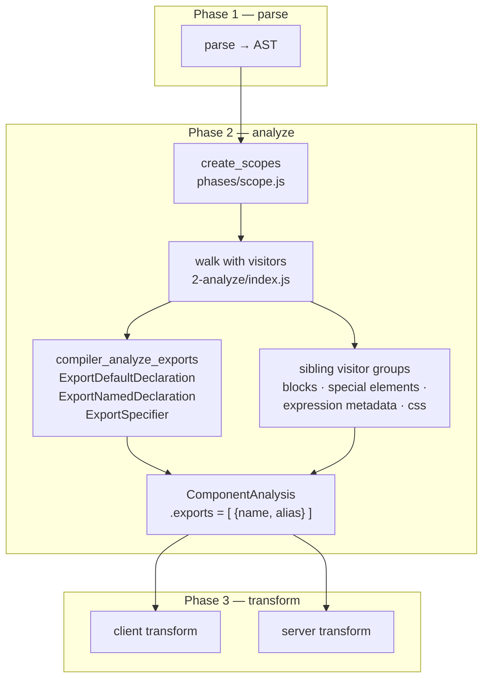
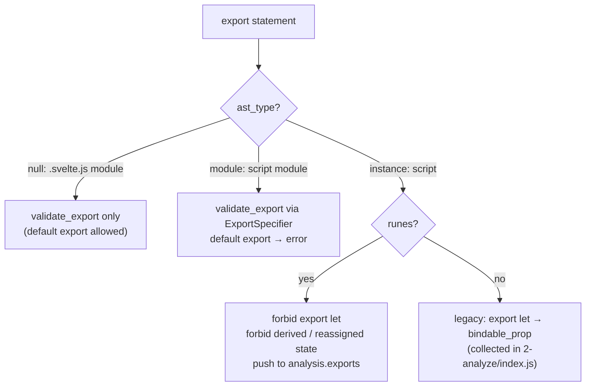
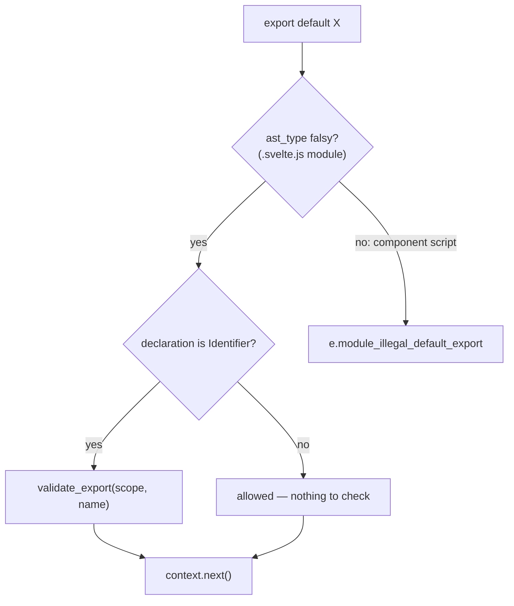
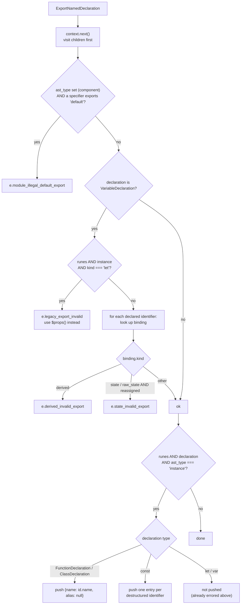
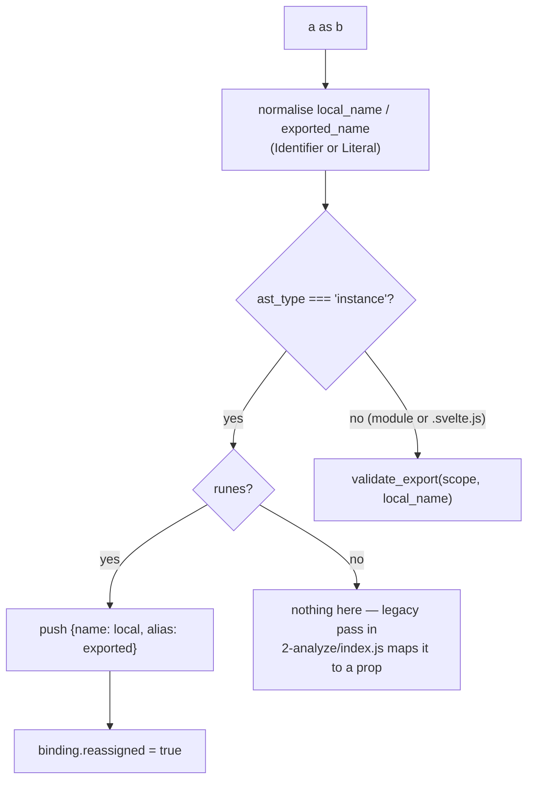
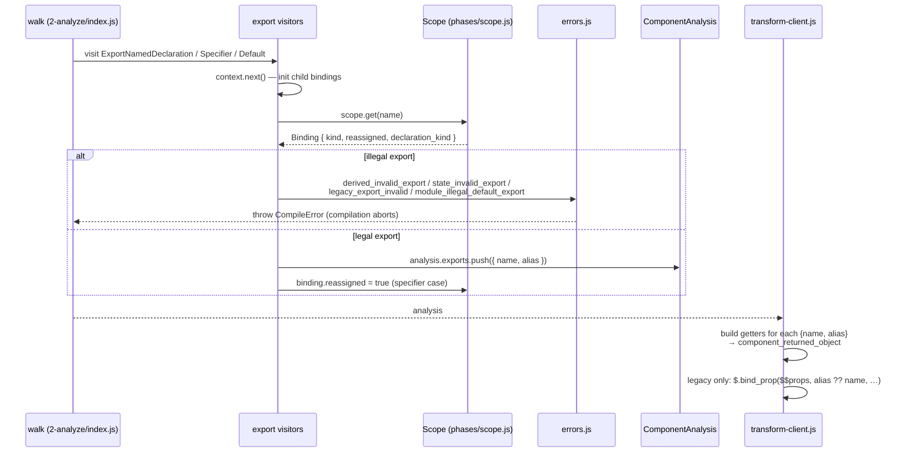

# compiler_analyze_exports

## Introduction

`compiler_analyze_exports` is a small, focused slice of Svelte's **analyze** phase (phase 2). It owns every `export` statement the compiler sees — in `<script>` blocks of a component *and* in plain `.svelte.js` / `.svelte.ts` modules.

It has two jobs:

1. **Say no to illegal exports.** A component cannot have a default export. In runes mode you cannot `export let`. You cannot export a `$derived` value, and you cannot export a reassigned `$state` value.
2. **Record the legal ones.** Every allowed export of a component instance is pushed into `analysis.exports` as a `{ name, alias }` pair. Phase 3 later turns that list into the object a component returns to its caller.

The module is tiny — three visitors plus one shared helper — but it is the only place where "what may this component expose to the outside world?" is decided.

| Component | File | Role |
| --- | --- | --- |
| `ExportDefaultDeclaration` | `2-analyze/visitors/ExportDefaultDeclaration.js` | Blocks `export default` in components; validates it in modules |
| `ExportNamedDeclaration` | `2-analyze/visitors/ExportNamedDeclaration.js` | Handles `export let/const/function/class`; collects runes-mode exports |
| `ExportSpecifier` | `2-analyze/visitors/ExportSpecifier.js` | Handles `export { a as b }`; collects aliases |
| `validate_export` | `2-analyze/visitors/shared/utils.js` | Shared guard: no derived, no reassigned state |

---

## Where this module sits

The three visitors are entries in the visitor table used by `analyze_component` and `analyze_module` in `2-analyze/index.js`. They are invoked by the AST walker, not called directly.



Related documentation:

- [compiler_analyze](compiler_analyze.md) — the analyze phase as a whole and the visitor table
- [compiler_core](compiler_core.md) — `phases/scope.js` (bindings, `Scope.get`), `compileModule`
- [compiler_parse](compiler_parse.md) — how the script AST reaches this phase
- [compiler_transform_client](compiler_transform_client.md) / [compiler_transform_server](compiler_transform_server.md) — consumers of `analysis.exports`
- [compiler_analyze_blocks](compiler_analyze_blocks.md), [compiler_analyze_special_elements](compiler_analyze_special_elements.md), [compiler_analyze_expression_metadata](compiler_analyze_expression_metadata.md) — sibling visitor groups that share `visitors/shared/utils.js`
- [compiler_options_and_warnings](compiler_options_and_warnings.md) — `errors.js` / `warnings.js` reporting machinery
- [compiler_ast_types](compiler_ast_types.md) — `Context`, `AnalysisState`, `ComponentAnalysis` shapes

---

## The two axes that drive every decision

Almost all logic here is a switch on two pieces of context state.

**Axis 1 — `context.state.ast_type`:** which script the node lives in.

| Value | Meaning |
| --- | --- |
| `'instance'` | the component's `<script>` |
| `'module'` | the component's `<script module>` |
| `'template'` | markup (exports never appear here) |
| `null` | a standalone `.svelte.js` / `.svelte.ts` module (set by `analyze_module`) |

The falsy check `!context.state.ast_type` is therefore "am I a plain module file, not a component?".

**Axis 2 — `context.state.analysis.runes`:** runes mode or legacy mode. In runes mode this module collects `analysis.exports` itself. In legacy mode a separate loop in `2-analyze/index.js` walks `instance.ast.body` and fills `analysis.exports` *before* the visitors ever run, because legacy `export let` becomes a **prop**, not an export.



---

## Component-by-component behaviour

### `ExportDefaultDeclaration`



- In a component (either `<script>` or `<script module>`) a default export is always an error: `A component cannot have a default export`. The component *itself* is the default export.
- In a `.svelte.js` module a default export is fine, but if it re-exports a named binding (`export default count`) the same rules as any other export apply, so `validate_export` runs.
- If the default export is an inline expression (`export default () => {}`, `export default 42`) there is no binding to check, so nothing happens.

### `ExportNamedDeclaration`

This is the largest visitor. Note the ordering: it calls `context.next()` **first**, so child nodes (including `ExportSpecifier`) are visited and bindings are fully initialised before any check runs.



Three distinct concerns live in this one function:

1. **`export { x as default }`** is caught here, because that form has no `ExportDefaultDeclaration` node. The check reads both `Identifier` and string-literal (`export { x as "default" }`) forms of `specifier.exported`.
2. **Reactivity rules.** A `$derived` binding can never be exported: its value is recomputed lazily, so a snapshot would go stale. A `$state` binding can be exported only if it is *never reassigned* — mutating its properties is fine, because the proxy identity stays stable. These two checks are duplicated inline here (walking declarators) rather than reusing `validate_export`, since the error must point at the whole `export` node.
3. **Collection.** Only runes-mode instance exports are collected here; see the table below.

### `ExportSpecifier`

Handles the individual `a as b` entries of `export { a as b }`. Both sides can be identifiers or string literals, so the names are normalised first.



The `binding.reassigned = true` line is subtle and important. An exported binding is reachable from outside the component (`component.foo = 1` via accessors, or `bind:foo`), so the compiler must assume it can change from anywhere. Marking it reassigned forces phase 3 to keep it as a mutable signal instead of inlining it as a constant. Analysis code that reports unused props explicitly filters out `ExportSpecifier` references so this synthetic mark does not silence the `export_let_unused` warning.

### `validate_export` (shared helper)

The minimal common guard, used where only a name and a scope are available:

```javascript
export function validate_export(node, scope, name) {
    const binding = scope.get(name);
    if (!binding) return;                          // unknown name — reported elsewhere
    if (binding.kind === 'derived') e.derived_invalid_export(node);
    if ((binding.kind === 'state' || binding.kind === 'raw_state') && binding.reassigned)
        e.state_invalid_export(node);
}
```

It lives in `visitors/shared/utils.js`, a grab-bag shared with the sibling analyze groups (that same file also holds `validate_assignment`, `is_pure`, `validate_block_not_empty`, `validate_identifier_name`, …). Only `validate_export` belongs to this module.

Note what it does **not** do: an unresolvable export name is *not* an error here. That case is reported later by a dedicated pass in `2-analyze/index.js`, which emits `snippet_invalid_export` (you tried to export a snippet) or `export_undefined`.

---

## Which exports land in `analysis.exports`

`analysis.exports` is `Array<{ name: string; alias: string | null }>` on `ComponentAnalysis`. Both this module and the legacy pass in `2-analyze/index.js` write to it.

| Source form | Mode / script | Written by | Result |
| --- | --- | --- | --- |
| `export function f() {}` | runes, instance | `ExportNamedDeclaration` | `{ f, null }` |
| `export class C {}` | runes, instance | `ExportNamedDeclaration` | `{ C, null }` |
| `export const { a, b } = o` | runes, instance | `ExportNamedDeclaration` | one entry per identifier |
| `export let x` | runes, instance | — | **error** `legacy_export_invalid` |
| `export { a as b }` | runes, instance | `ExportSpecifier` | `{ a, b }` + `reassigned` |
| `export function f() {}` | legacy, instance | `2-analyze/index.js` | `{ f, null }` |
| `export let x` | legacy, instance | `2-analyze/index.js` | binding becomes `bindable_prop` (a **prop**, not an export) |
| `export { a as b }` where `a` is `let`/`var` | legacy, instance | `2-analyze/index.js` | `bindable_prop` with `prop_alias = b` |
| anything in `<script module>` | either | — | plain ES module export; only validated |
| anything in `.svelte.js` | either | — | plain ES module export; only validated |

Two things follow from this table:

- **Module-level exports are never collected.** `<script module>` and `.svelte.js` exports pass straight through to the emitted JavaScript, so there is nothing to record — this module only validates them.
- **Legacy mode never reaches the collection branch** of these visitors, because the pre-pass in `2-analyze/index.js` has already sorted every instance export into either "prop" or "export".

---

## Data flow into phase 3



On the consuming side, `3-transform/client/transform-client.js` maps every `analysis.exports` entry to a getter (`get alias() { return <name> }`) on the object the component function returns — that object is what `mount()` hands back and what the legacy class-component wrapper exposes as accessors. In legacy mode it additionally emits `$.bind_prop` calls so `bind:x` works against static exports. Meanwhile `3-transform/client/visitors/ExportNamedDeclaration.js` strips the `export` keyword from instance code (returning just the declaration, or `b.empty` for a bare specifier list), since the instance body becomes a plain function body.

---

## Error catalogue

All errors are thrown — the first one aborts compilation. Definitions live in `compiler/errors.js` (see [compiler_options_and_warnings](compiler_options_and_warnings.md)).

| Error | Raised by | Message | Why |
| --- | --- | --- | --- |
| `module_illegal_default_export` | `ExportDefaultDeclaration`, `ExportNamedDeclaration` | A component cannot have a default export | The component is already the module's default export |
| `legacy_export_invalid` | `ExportNamedDeclaration` | Cannot use `export let` in runes mode — use `$props()` instead | Props are declared with `$props()` in runes mode |
| `derived_invalid_export` | `ExportNamedDeclaration`, `validate_export` | Cannot export derived state from a module. Export a function returning its value | A derived value is recomputed lazily; a snapshot would go stale |
| `state_invalid_export` | `ExportNamedDeclaration`, `validate_export` | Cannot export state from a module if it is reassigned. Export a function returning it, or only mutate its properties | Importers hold the old value after a reassignment; mutation keeps proxy identity |

---

## Notes for maintainers

- **Order matters in `ExportNamedDeclaration`.** `context.next()` runs before every check so that child bindings exist. If you add a check that must run *before* children are visited, put it above that call and say why.
- **Two code paths for the same rule.** The derived/reassigned-state rule exists both inline in `ExportNamedDeclaration` and in `validate_export`. Change one and you must change the other; they differ only in which node the error is attached to.
- **`ast_type` truthiness is load-bearing.** `analyze_module` sets `ast_type` to `null`, so `!context.state.ast_type` distinguishes "plain module file" from "component script". A future refactor that gives modules a real `ast_type` string must update both `ExportDefaultDeclaration` and `ExportNamedDeclaration`.
- **`binding.reassigned = true` in `ExportSpecifier` is deliberate**, not a bug. Anything that reads `reassigned` must tolerate this synthetic mark; the unused-prop warning already filters `ExportSpecifier` references out.
- **Legacy mode is a separate pass.** When touching export handling, check `2-analyze/index.js` (the `if (!runes)` block around the `instance.ast.body` loop) as well as this module. Once legacy mode is removed, that pre-pass disappears and these visitors become the single source of truth.
