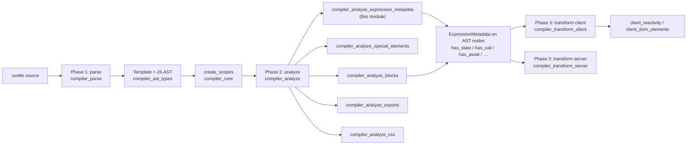
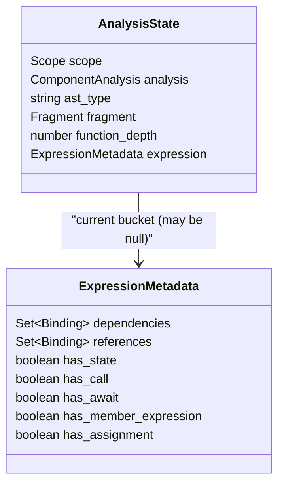
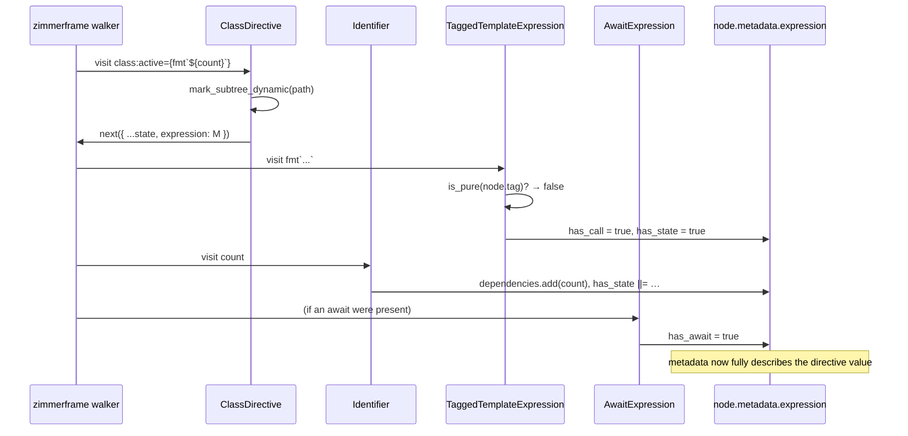
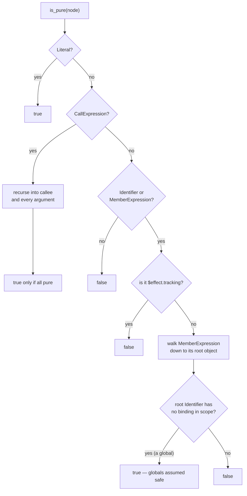
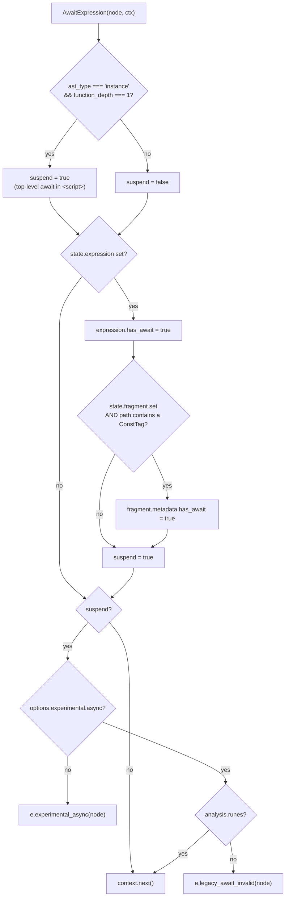
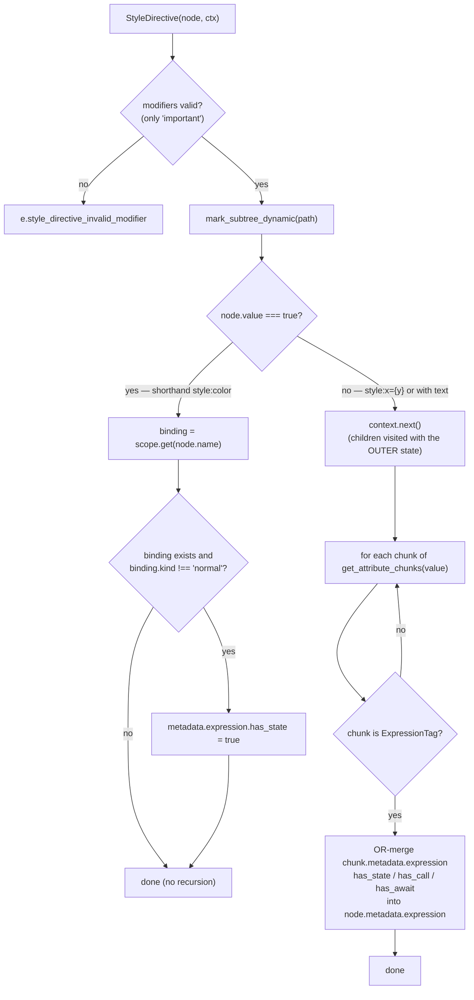
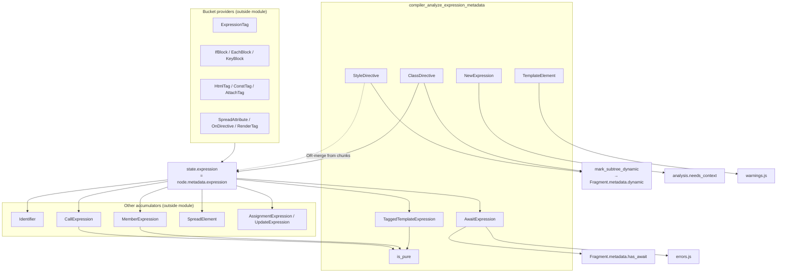
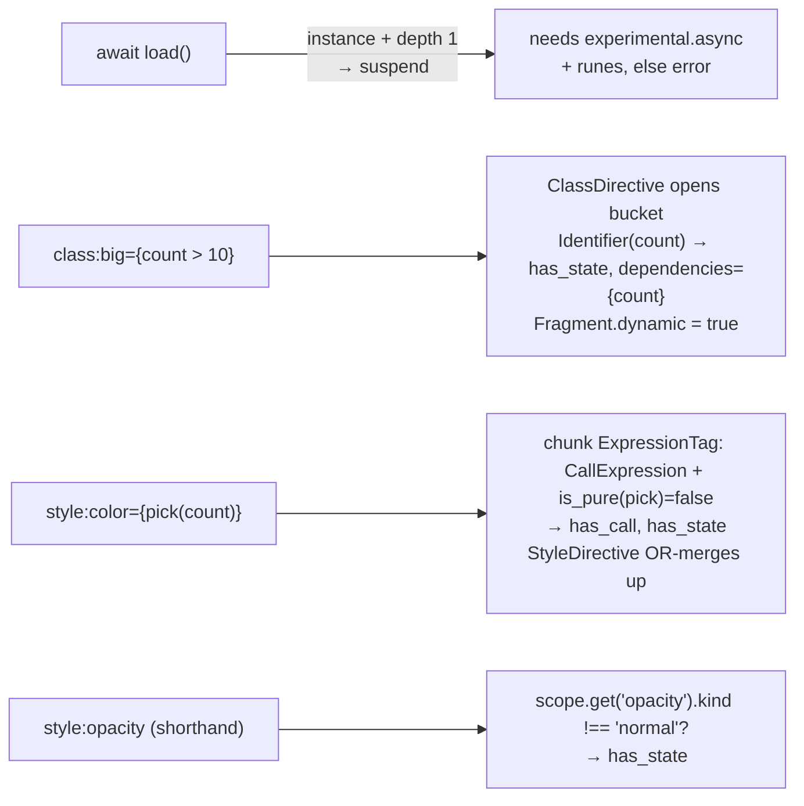

# compiler_analyze_expression_metadata

## Introduction

`compiler_analyze_expression_metadata` is the part of Svelte's **analysis phase**
(phase 2) that answers one question about every piece of JavaScript inside a
component:

> *What does this expression actually do — does it read state, call a function,
> `await` something?*

The answer is written into a small record called `ExpressionMetadata` that hangs
off the AST node. Phase 3 reads that record and uses it to decide whether an
expression can be inlined as a constant, must be wrapped in a `$.derived`,
needs a memo, or must suspend an async block.

This module owns six visitors plus one shared helper:

| Component | Job |
| --- | --- |
| `AwaitExpression` | Flags `await`, gates it behind runes + `experimental.async` |
| `NewExpression` | Warns about `new class { … }`, sets `needs_context` |
| `TaggedTemplateExpression` | Treats an impure tag call as state + call |
| `TemplateElement` | Warns about bidirectional control characters |
| `ClassDirective` | Opens a metadata bucket for `class:x={y}` |
| `StyleDirective` | Opens/merges a metadata bucket for `style:x={y}` |
| `is_pure` (shared/utils.js) | Decides if a callee/tag is safe to ignore |

None of these visitors rewrite the AST. They only **read** it, **decorate** it
with metadata, and **raise diagnostics**. Compare with the sibling modules:
[compiler_analyze_blocks](compiler_analyze_blocks.md) validates block structure,
[compiler_analyze_special_elements](compiler_analyze_special_elements.md)
validates `<svelte:*>` placement, and this module characterises *expressions*.

---

## Where this module sits



See [compiler_analyze](compiler_analyze.md) for how the whole visitor table is
wired, and [compiler_core](compiler_core.md) for `Scope` / `create_scopes`.

---

## Files in the module

```
phases/2-analyze/visitors/
├── AwaitExpression.js            await ... (has_await + async gating)
├── NewExpression.js              new Foo() / new class {}
├── TaggedTemplateExpression.js   tag`...`
├── TemplateElement.js            the "..." chunks of a template literal
├── ClassDirective.js             class:x={y}
├── StyleDirective.js             style:x={y}
└── shared/
    ├── utils.js                  is_pure(...)  ← the purity oracle
    └── fragment.js               mark_subtree_dynamic(...)
```

---

## The data structure everything revolves around

`ExpressionMetadata` is created by `create_expression_metadata()` in
`phases/nodes.js` and lives at `node.metadata.expression` for every node that
holds a template expression (`ExpressionTag`, `IfBlock`, `EachBlock`,
`ClassDirective`, `StyleDirective`, `SpreadAttribute`, …).



| Field | Meaning | Set by |
| --- | --- | --- |
| `dependencies` | bindings read *eagerly* (not inside a function) | `Identifier` |
| `references` | every binding read, including inside functions | `Identifier`, `shared/function.js` |
| `has_state` | value can change over time | `Identifier`, `MemberExpression`, `CallExpression`, **`TaggedTemplateExpression`**, `SpreadElement`, **`StyleDirective`** |
| `has_call` | contains a call → usually needs a derived/memo | `CallExpression`, **`TaggedTemplateExpression`**, `SpreadElement`, **`StyleDirective`** |
| `has_await` | contains `await` → needs async handling | **`AwaitExpression`**, **`StyleDirective`** |
| `has_member_expression` | contains `a.b` | `MemberExpression` |
| `has_assignment` | contains `=` or `++` | `AssignmentExpression`, `UpdateExpression` |

Bold entries are owned by this module. The others come from sibling visitors in
the same phase — the record is a **shared accumulator**, not a per-visitor
output.

---

## The "current expression bucket" pattern

The whole module rests on one convention. `AnalysisState.expression` points at
the metadata record of the *nearest enclosing template expression*, or is `null`
when we are in ordinary `<script>` code that nobody needs metadata for.

A "provider" visitor opens the bucket when it recurses:

```js
// ClassDirective.js
context.next({ ...context.state, expression: node.metadata.expression });
```

Every expression visitor below it then contributes with a guard:

```js
if (context.state.expression) {
    context.state.expression.has_await = true;   // AwaitExpression.js
}
```



Providers of the bucket live outside this module (`ExpressionTag`, `IfBlock`,
`EachBlock`, `HtmlTag`, `ConstTag`, `AttachTag`, `OnDirective`,
`SpreadAttribute`, `RenderTag`, `KeyBlock`, `AwaitBlock`, `SvelteElement`) —
`ClassDirective` and `StyleDirective` are this module's two contributions to
that set.

---

## Component walkthrough

### `is_pure(node, context)` — the purity oracle

`is_pure` is the shared judgment call behind `has_call` / `has_state`. It answers
*"can calling this thing be treated as harmless and non-reactive?"*



Key consequences:

* **Globals are trusted.** `Math.max(...)` or `JSON.stringify(x)` are pure, so a
  template expression using them is not forced into a derived just because of
  the call.
* **Anything locally bound is suspect.** A local, an import, a prop — the
  compiler cannot prove the call is side-effect free, so it is impure.
* `$effect.tracking()` is explicitly impure — its result depends on *where* it
  runs.

`is_pure` is also used by `MemberExpression` (`has_state ||= !is_pure(node)`)
and `CallExpression` in the same phase, so a change here moves reactivity for
a large amount of generated code.

### `AwaitExpression`

Two responsibilities, driven by one local flag `suspend`:



* **`function_depth === 1`** means the `await` is at the top level of the
  instance script — not nested inside a function, where `await` is always fine.
* Reaching *any* template expression (`state.expression` is non-null) also
  suspends, because `{await foo()}`, `{#if await x}` and friends all need async
  machinery.
* The `ConstTag` check propagates `has_await` up to the enclosing
  `Fragment.metadata.has_await`, so a `{@const x = await …}` marks its whole
  fragment as async. The source comments this as a TODO — it is a deliberate
  approximation, not a general rule.
* Errors: [`experimental_async`](compiler_options_and_warnings.md) when the
  `experimental.async` option is off, `legacy_await_invalid` in legacy
  (non-runes) mode. Both are hard errors, thrown via `errors.js`.

Downstream, `has_await` decides whether
[compiler_transform_client](compiler_transform_client.md) emits an async block
(`ConstTag.js`, `AwaitBlock.js`, `HtmlTag.js`, `shared/element.js` all branch on
it) and, at runtime, whether `client_blocks`' `async` / `await_block` wrappers
are used.

### `NewExpression`

```js
if (node.callee.type === 'ClassExpression' && context.state.scope.function_depth > 0) {
    w.perf_avoid_inline_class(node);
}
context.state.analysis.needs_context = true;
```

* **Warning** `perf_avoid_inline_class` — `new class { … }` inside any function
  re-creates the class object on every call, so the advice is to hoist the class
  to the top level. (`ClassDeclaration` in the same phase enforces the related
  depth rule for declared classes.)
* **`needs_context = true`** — constructing an object may run user code that
  calls `getContext`, `$effect`, etc., so the component must be given a
  component context. This is a *component-wide* flag on `ComponentAnalysis`, not
  expression metadata: `transform-client.js` and `transform-server.js` read
  `analysis.needs_context` to decide whether to emit `$.push(...)` / `$.pop()`.
  `CallExpression` and `MemberExpression` set the same flag for their own
  reasons.

### `TaggedTemplateExpression`

```js
if (context.state.expression && !is_pure(node.tag, context)) {
    context.state.expression.has_call = true;
    context.state.expression.has_state = true;
}
```

A tagged template is a disguised function call, so it is graded exactly like
`CallExpression`: if the tag is not pure, the expression both *calls* and
*may change*, which pushes phase 3 to wrap the value in a derived/memo. A pure
tag (e.g. a global like `String.raw`) contributes nothing.

### `TemplateElement`

The one visitor here that has nothing to do with reactivity. It scans the
*cooked* text of each template-literal chunk with
`regex_bidirectional_control_characters` (from `phases/patterns.js`) and warns
via `bidirectional_control_characters`. These Unicode characters can make source
code render differently from how it executes — a well-known supply-chain trick.
Note it takes only `node`, no `context`, and does not call `context.next()`,
because template-literal chunks have no children to visit.

### `ClassDirective`

```js
mark_subtree_dynamic(context.path);
context.next({ ...context.state, expression: node.metadata.expression });
```

Two lines, two jobs:

1. `mark_subtree_dynamic` (shared with
   [compiler_analyze_blocks](compiler_analyze_blocks.md)) walks the ancestor path
   and sets `metadata.dynamic = true` on every enclosing `Fragment`, so phase 3
   knows it must traverse into that fragment at mount/hydrate time instead of
   emitting a static template.
2. Opens the metadata bucket for `class:x={y}` so all the accumulator visitors
   above can describe `y`.

### `StyleDirective`

The most involved visitor of the six, because `style:` has three shapes.



Two details worth remembering:

* **Shorthand `style:color`** desugars to `style:color={color}`. There is no
  expression node to walk, so the visitor looks the name up in the scope itself
  and marks `has_state` when the binding is anything other than a plain
  `normal` variable (i.e. state, derived, prop, store, …).
* **Roll-up instead of pass-down.** Unlike `ClassDirective`, `StyleDirective`
  calls `context.next()` *without* injecting its own bucket. Each nested
  `ExpressionTag` fills its own metadata (via `ExpressionTag.js`), and the
  directive then OR-merges the interesting flags upward with
  `get_attribute_chunks` (from `utils/ast.js`) flattening the
  `true | ExpressionTag | Array<ExpressionTag | Text>` union. This keeps
  per-chunk metadata intact — phase 3's `shared/element.js` reads both the
  per-chunk and the directive-level flags.

---

## Interaction map



---

## End-to-end example

Source:

```svelte
<script>
    let count = $state(0);
    const items = await load();      // top-level await
</script>

<div
    class:big={count > 10}
    style:color={pick(count)}
    style:opacity
>{`v${count}`}</div>
```

What this module records:



Phase 3 then reads these flags: `class:big` and `style:color` are re-evaluated
in an effect (they have `has_state`), `style:color` additionally goes through a
memo (`has_call`), the fragment is traversed at mount (`dynamic`), and the
top-level `await` turns the component body into an async body handled by
[client_reactivity](client_reactivity.md)'s `async_body`.

---

## Practical notes for maintainers

* **Always guard on `context.state.expression`.** It is `null` in plain module /
  instance script code. Writing to it unguarded throws.
* **Never *clear* a flag.** The record is an accumulator shared by many
  visitors; use `= true` or `||=`, never `= false`.
* **`mark_subtree_dynamic` is cheap but load-bearing.** Forgetting it in a new
  directive visitor produces a component that renders the initial value and then
  never updates — a silent bug, not a compile error.
* **Widening `is_pure` is a reactivity change, not an optimisation detail.**
  Making something "pure" removes `has_state`/`has_call`, which can drop a
  derived and break updates. Narrowing it adds deriveds and costs performance.
  Both directions need fixture coverage.
* **Errors vs warnings.** `errors.js` helpers (`e.*`) throw and abort
  compilation; `warnings.js` helpers (`w.*`) are collected into
  `CompileResult.warnings`. See
  [compiler_options_and_warnings](compiler_options_and_warnings.md).

---

## Related documentation

* [compiler_analyze](compiler_analyze.md) — the phase-2 visitor table and
  `AnalysisState`
* [compiler_analyze_blocks](compiler_analyze_blocks.md) — blocks/tags that
  *provide* the expression bucket
* [compiler_analyze_special_elements](compiler_analyze_special_elements.md) —
  `<svelte:*>` validation
* [compiler_core](compiler_core.md) — `Scope`, `Binding`, `create_scopes`,
  builders
* [compiler_ast_types](compiler_ast_types.md) — `ExpressionMetadata`,
  `ClassDirective`, `StyleDirective`, `Fragment.metadata`
* [compiler_transform_client](compiler_transform_client.md) /
  [compiler_transform_server](compiler_transform_server.md) — the consumers of
  every flag described here
* [client_reactivity](client_reactivity.md) — deriveds, effects and async bodies
  that the flags ultimately select
* [compiler_options_and_warnings](compiler_options_and_warnings.md) — the
  `experimental.async` option and warning plumbing
