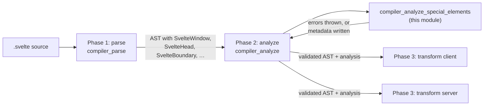
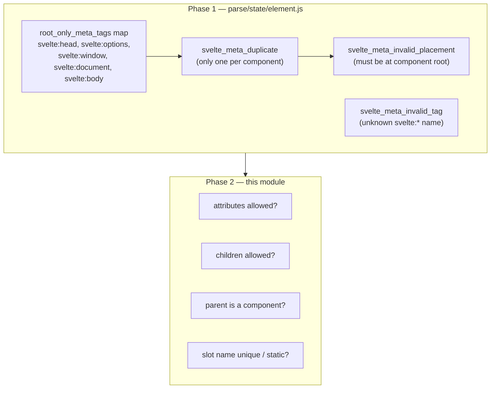
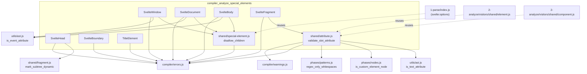
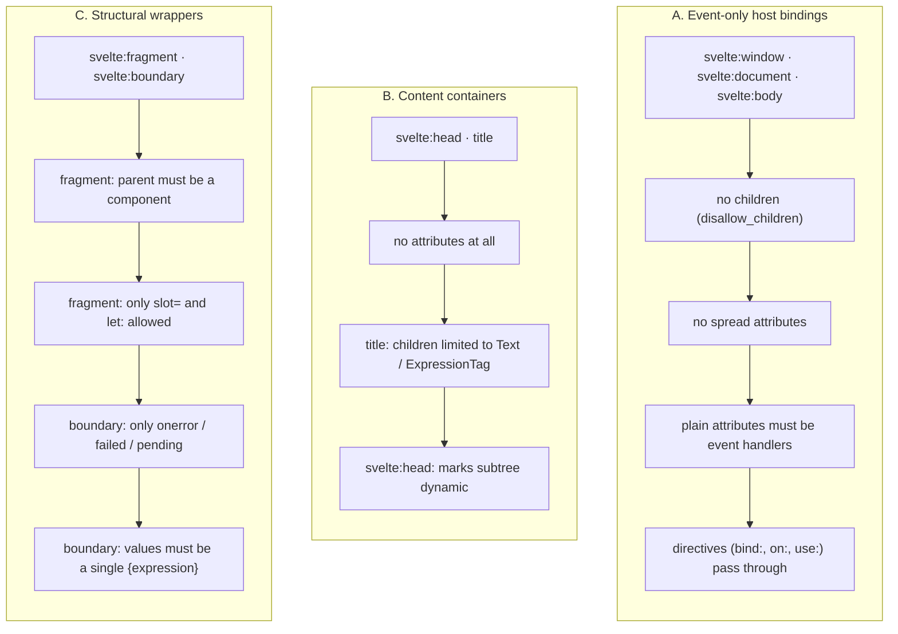
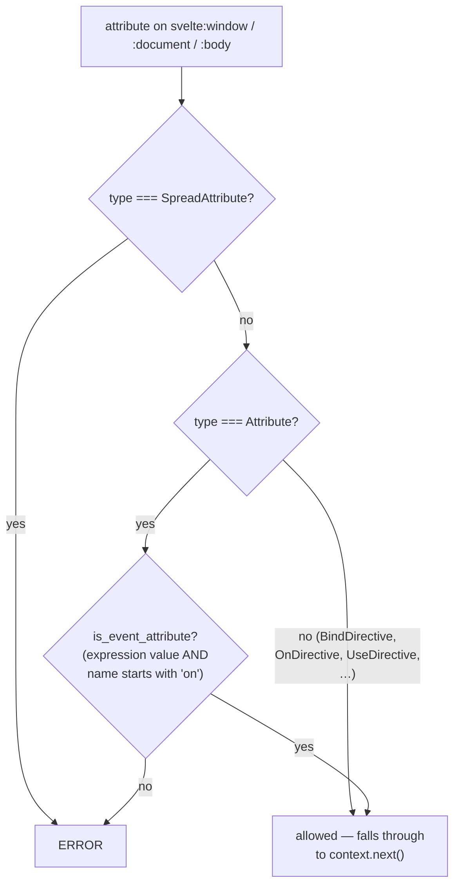
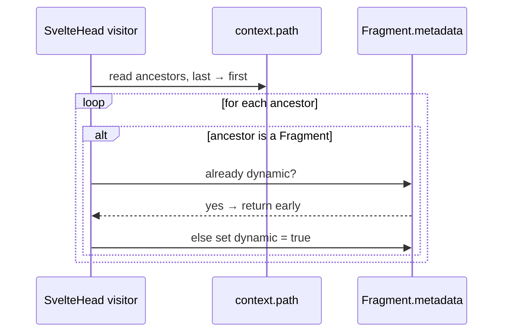
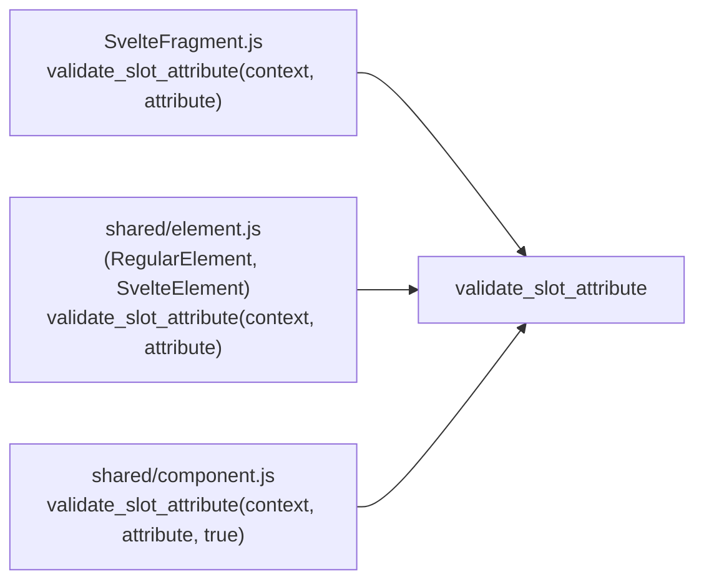
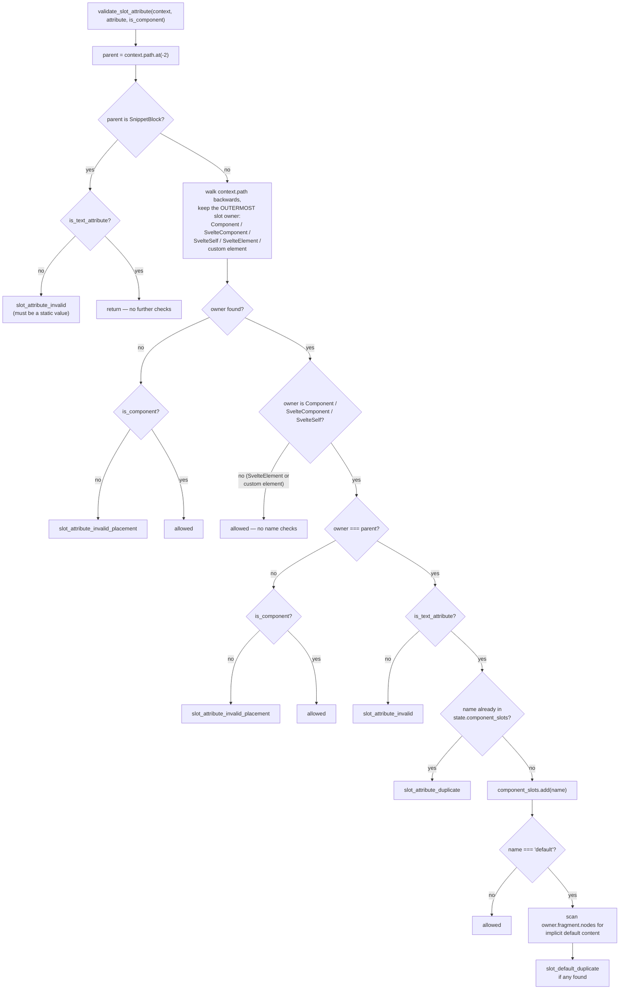
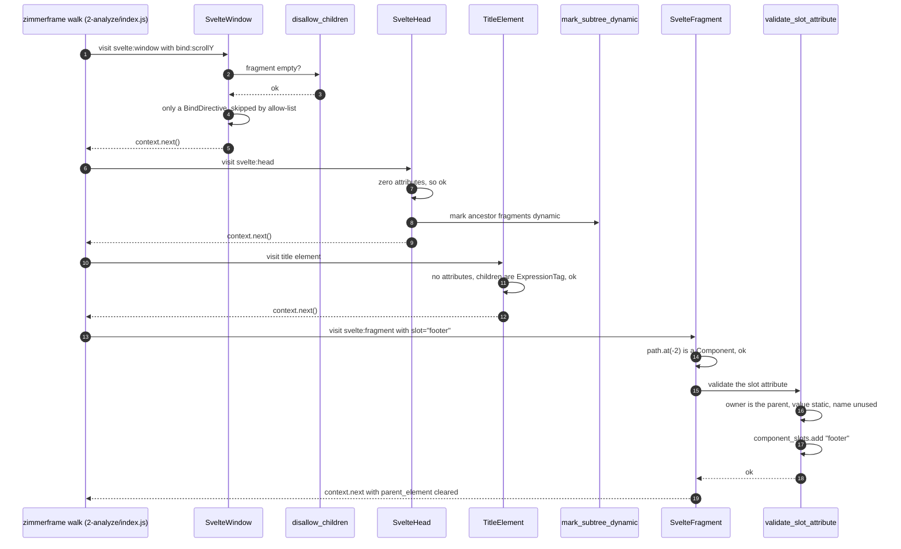
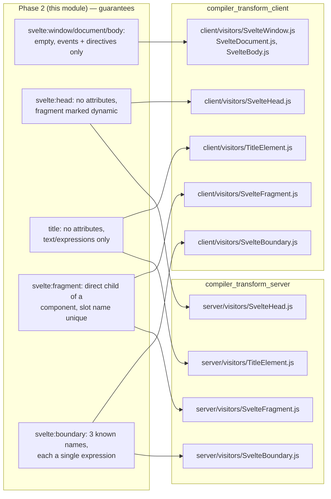

# compiler_analyze_special_elements

## Introduction

Svelte templates contain a handful of tags that are not normal HTML elements and not components either. They look like elements, but the compiler treats them as *special elements* (also called "meta tags"):

| Tag | AST node type | What it does |
| --- | --- | --- |
| `<svelte:window>` | `SvelteWindow` | attach events / bindings to `window` |
| `<svelte:document>` | `SvelteDocument` | attach events / bindings to `document` |
| `<svelte:body>` | `SvelteBody` | attach events to `document.body` |
| `<svelte:head>` | `SvelteHead` | inject content into `<head>` |
| `<svelte:fragment>` | `SvelteFragment` | fill a named slot without a wrapper element |
| `<svelte:boundary>` | `SvelteBoundary` | catch errors / show pending state for a subtree |
| `<title>` | `TitleElement` | the document title (only valid inside `<svelte:head>`) |

This module is the **validation layer** for those tags inside the second compiler phase (analyze). It does *not* generate code and it does *not* build the AST — it only decides whether the way the author wrote the tag is legal, and records a small amount of metadata for later phases.

The rule of thumb for the whole module: **each special element has a very narrow contract, and this module enforces that contract with a hard compile error the moment it is broken.**

Related docs:
- [compiler_parse_state_machine_element](compiler_parse_state_machine_element.md) — where these nodes are created and where placement/duplication is checked
- [compiler_analyze](compiler_analyze.md) — the phase that owns the visitor table this module plugs into
- [compiler_analyze_blocks](compiler_analyze_blocks.md) — sibling module, same shape, for `{#if}` / `{#each}` / `{#await}` / `{#key}` and tags
- [compiler_transform_client](compiler_transform_client.md) and [compiler_transform_server](compiler_transform_server.md) — the phase-3 visitors that consume these validated nodes
- [compiler_ast_types](compiler_ast_types.md) — node shapes (`AST.SvelteWindow`, `AST.SvelteBoundary`, …)
- [compiler_options_and_warnings](compiler_options_and_warnings.md) — the error/warning message catalogue

---

## 1. Where the module sits



Phase 1 already answered *"is this tag allowed here at all?"*. Phase 2 answers *"is the inside of this tag well formed?"*. The split matters:



So a test like `window-duplicate` or `window-inside-block` fails in phase 1, while `svelte:window` with a `class` attribute fails here in phase 2.

`<svelte:options>` is the odd one out: it is fully read and validated during parsing (see [compiler_parse_readers_options](compiler_parse_readers_options.md)), and it *reuses* this module's `disallow_children` helper — an import that points backwards from phase 1 into phase 2.

---

## 2. Components

```
packages/svelte/src/compiler/phases/2-analyze/visitors/
├── SvelteWindow.js          → SvelteWindow(node, context)
├── SvelteDocument.js        → SvelteDocument(node, context)
├── SvelteBody.js            → SvelteBody(node, context)
├── SvelteHead.js            → SvelteHead(node, context)
├── SvelteFragment.js        → SvelteFragment(node, context)
├── SvelteBoundary.js        → SvelteBoundary(node, context)
├── TitleElement.js          → TitleElement(node, context)
└── shared/
    ├── special-element.js   → disallow_children(node)
    ├── attribute.js         → validate_slot_attribute(context, attribute, is_component?)
    └── fragment.js          → mark_subtree_dynamic(path)   (shared with compiler_analyze_blocks)
```

Every visitor has the same signature and the same skeleton:

```js
export function SomeSpecialElement(node, context) {
    // 1. structural checks (children, placement)
    // 2. attribute loop → throw on anything not on the allow-list
    // 3. context.next()   → keep walking into the subtree
}
```

`context` is the [zimmerframe](https://github.com/Rich-Harris/zimmerframe) visitor context typed as `Context` in `2-analyze/types.d.ts`. Two of its fields carry most of the weight here:

- `context.path` — the ancestor chain. `path.at(-1)` is the enclosing `Fragment`, so **`path.at(-2)` is the real parent node**. This is why every parent check in the module reads `at(-2)` and not `at(-1)`.
- `context.state` — `AnalysisState`, notably `parent_element` (nearest element tag name) and `component_slots` (slot names already used on the current parent component).

### Dependency graph



Note the two dotted arrows: `disallow_children` and `validate_slot_attribute` are shared outward, not just inward. They are the reason the two `shared/` files exist as separate modules instead of living inline in a visitor.

---

## 3. The three families of special element

The seven visitors split cleanly into three groups by what they validate.



### 3.A Event-only host bindings — `svelte:window`, `svelte:document`, `svelte:body`

These three are structurally identical. They do not render anything; they only wire listeners and bindings onto a global host object. So they must be empty, and their attributes may only be event handlers.

```js
export function SvelteWindow(node, context) {
    disallow_children(node);

    for (const attribute of node.attributes) {
        if (
            attribute.type === 'SpreadAttribute' ||
            (attribute.type === 'Attribute' && !is_event_attribute(attribute))
        ) {
            e.illegal_element_attribute(attribute, 'svelte:window');
        }
    }

    context.next();
}
```

The attribute test is deliberately narrow. Read it as an allow-list:



Because the check only fires for `Attribute` and `SpreadAttribute`, every *directive* node type is implicitly allowed and gets validated by its own visitor instead — that is how `bind:scrollY` on `<svelte:window>` and `on:click` on `<svelte:body>` still work.

`is_event_attribute` (in `compiler/utils/ast.js`) requires both that the name starts with `on` and that the value is a single expression tag, so `onclick="doThing()"` (a string) is rejected as well as `class="x"`.

The only difference between the three visitors is the error they raise:

| Visitor | Error | Message |
| --- | --- | --- |
| `SvelteWindow` | `illegal_element_attribute(attribute, 'svelte:window')` | `` `<svelte:window>` does not support non-event attributes or spread attributes `` |
| `SvelteDocument` | `illegal_element_attribute(attribute, 'svelte:document')` | same shape, `svelte:document` |
| `SvelteBody` | `svelte_body_illegal_attribute(attribute)` | `` `<svelte:body>` does not support non-event attributes or spread attributes `` |

`SvelteBody` having its own dedicated error code rather than reusing the parameterised one is a historical artefact — the wording is identical.

#### `disallow_children`

```js
export function disallow_children(node) {
    const { nodes } = node.fragment;

    if (nodes.length > 0) {
        const first = nodes[0];
        const last = nodes[nodes.length - 1];

        e.svelte_meta_invalid_content({ start: first.start, end: last.end }, node.name);
    }
}
```

Two details worth noting:

1. The error is anchored to a **synthetic span** built from the first child's `start` and the last child's `end`, not to the node itself. That makes the code frame underline exactly the offending content rather than the whole tag. Code frames come from `utils/compile_diagnostic.js` (`get_code_frame`, see [compiler_core](compiler_core.md)).
2. It accepts `AST.SvelteOptionsRaw` in its type signature even though no phase-2 visitor passes one — that overload exists purely for the phase-1 `<svelte:options>` call site.

### 3.B Content containers — `svelte:head`, `title`

```js
export function SvelteHead(node, context) {
    for (const attribute of node.attributes) {
        e.svelte_head_illegal_attribute(attribute);
    }

    mark_subtree_dynamic(context.path);

    context.next();
}
```

The attribute loop has no condition at all — the *first* attribute of any kind is an error (`` `<svelte:head>` cannot have attributes nor directives ``). Children, by contrast, are the whole point of the tag, so `disallow_children` is not called.

`SvelteHead` is the only visitor in this module that writes metadata rather than only validating. `mark_subtree_dynamic` (shared with [compiler_analyze_blocks](compiler_analyze_blocks.md)) walks back up `context.path` and flips `metadata.dynamic = true` on every enclosing `Fragment`, stopping early once it finds one already marked:



Head content always needs a real effect at runtime (it is hoisted into `document.head`), so the enclosing fragment can never be treated as a static template that phase 3 clones in one shot. Marking it dynamic here is what forces phase 3 to emit per-node code — see `client/visitors/SvelteHead.js` in [compiler_transform_client](compiler_transform_client.md).

`TitleElement` validates both ends:

```js
export function TitleElement(node, context) {
    for (const attribute of node.attributes) {
        e.title_illegal_attribute(attribute);       // `<title>` cannot have attributes nor directives
    }

    for (const child of node.fragment.nodes) {
        if (child.type !== 'Text' && child.type !== 'ExpressionTag') {
            e.title_invalid_content(child);          // `<title>` can only contain text and {tags}
        }
    }

    context.next();
}
```

The content restriction exists because the title is ultimately assigned to `document.title`, a plain string. Anything that could produce elements — a nested tag, a `{#if}` block, a `{@render}` tag — is rejected. Note that a *block* is rejected even though it might only ever produce text; the check is purely syntactic on the node type.

### 3.C Structural wrappers — `svelte:fragment`, `svelte:boundary`

`<svelte:fragment>` is the legacy slot-filling syntax (superseded by snippets). Its contract is about *where* it lives as much as what it holds:

```js
export function SvelteFragment(node, context) {
    const parent = context.path.at(-2);
    if (parent?.type !== 'Component' && parent?.type !== 'SvelteComponent') {
        e.svelte_fragment_invalid_placement(node);
    }

    for (const attribute of node.attributes) {
        if (attribute.type === 'Attribute') {
            if (attribute.name === 'slot') {
                validate_slot_attribute(context, attribute);
            }
        } else if (attribute.type !== 'LetDirective') {
            e.svelte_fragment_invalid_attribute(attribute);
        }
    }

    context.next({ ...context.state, parent_element: null });
}
```

Three things happen:

1. **Placement.** `path.at(-2)` must be a `Component` or `SvelteComponent` — a *direct* child, not a descendant. `<svelte:self>` is notably absent from that list.
2. **Attributes.** `LetDirective` is allowed, `slot` is allowed and delegated, and everything else — including any other plain attribute name — errors with `` `<svelte:fragment>` can only have a slot attribute and (optionally) a let: directive ``. Note the asymmetry: a non-`slot` `Attribute` silently passes the `if` and is *not* reported, because the inner `if` has no `else`; only non-`Attribute`, non-`LetDirective` nodes reach the error.
3. **State reset.** `context.next({ ...context.state, parent_element: null })` — because `<svelte:fragment>` produces no DOM element, descendants must not think their parent element is `svelte:fragment`. Clearing `parent_element` keeps downstream checks (a11y rules, `<option>`-inside-`<select>` style checks) correct.

`<svelte:boundary>` is the newest of the group and has the simplest, strictest rule set:

```js
const valid = ['onerror', 'failed', 'pending'];

export function SvelteBoundary(node, context) {
    for (const attribute of node.attributes) {
        if (attribute.type !== 'Attribute' || !valid.includes(attribute.name)) {
            e.svelte_boundary_invalid_attribute(attribute);
        }

        if (
            attribute.value === true ||
            (Array.isArray(attribute.value) &&
                (attribute.value.length !== 1 || attribute.value[0].type !== 'ExpressionTag'))
        ) {
            e.svelte_boundary_invalid_attribute_value(attribute);
        }
    }

    context.next();
}
```

A hard allow-list of exactly three names, and each value must be a **single `ExpressionTag`**:

| Written as | `attribute.value` | Result |
| --- | --- | --- |
| `onerror={handler}` | `[ExpressionTag]` | ok |
| `failed` | `true` (boolean shorthand) | `svelte_boundary_invalid_attribute_value` |
| `failed="snippet"` | `[Text]` | `svelte_boundary_invalid_attribute_value` |
| `pending="{a}{b}"` | `[ExpressionTag, ExpressionTag]` | `svelte_boundary_invalid_attribute_value` |
| `class="x"` | — | `svelte_boundary_invalid_attribute` |

Both checks run on the same attribute in sequence, but since `e.*` functions are declared `@returns {never}` (they throw), only the first one that trips is ever reported.

`failed` and `pending` are snippet slots — in practice they are usually written as `{#snippet failed(…)}` children rather than attributes, and the attribute form here is the expression alias. The runtime counterpart is `internal/client/dom/blocks/boundary.js` in [client_blocks](client_blocks.md).

---

## 4. `validate_slot_attribute` — the shared slot rule

This is by far the largest helper in the module, and the only one with meaningful branching. It answers: *is this `slot="name"` attribute legal, and does it collide with anything?* It is called from three places:



The third argument `is_component` relaxes the placement rule: a component with `slot="x"` nested deeper inside another component is tolerated, whereas a plain element in the same position is not.

### Control flow



### The owner scan

```js
let i = context.path.length;
while (i--) {
    const ancestor = context.path[i];
    if (!owner && (/* Component | SvelteComponent | SvelteSelf | SvelteElement | custom element */)) {
        owner = ancestor;
    }
}
```

The loop runs from the end of the path to the beginning, but the `!owner` guard means only the **first** match in iteration order is kept — and because iteration goes inner-to-outer while the guard blocks reassignment, `owner` ends up being the **innermost** slot-owning ancestor. Reading this loop the wrong way round is an easy mistake; the guard, not the direction, decides the answer.

Custom elements count as owners (`is_custom_element_node`, from `phases/nodes.js`) because native slots work on them too — but they get no name-uniqueness checks, since the browser, not Svelte, resolves those slots. Same for `<svelte:element>`, whose tag is only known at runtime.

### Duplicate detection and `component_slots`

`context.state.component_slots` is a `Set<string>` on `AnalysisState`, scoped to "which slots the current parent component has". The visitor for the component itself replaces this set before walking children, so names accumulate per component instance and reset between them. Two `slot="header"` children of the same component therefore collide, while `slot="header"` under two different components does not.

The `default` case has an extra rule. If someone writes an explicit `slot="default"` child, then *any* other non-whitespace child of that component is implicit default content, and the two would fight:

```svelte
<Widget>
    <div slot="default">explicit</div>
    <p>implicit — slot_default_duplicate</p>
</Widget>
```

The scan skips whitespace-only `Text` nodes (via `regex_only_whitespaces` from `phases/patterns.js`) and skips `RegularElement` / `SvelteFragment` nodes that carry their own `slot` attribute. Everything else triggers `slot_default_duplicate`.

`shared/attribute.js` also exports `validate_attribute_name` and `validate_attribute`, which handle generic attribute concerns (illegal `:` in names, unquoted attribute sequences, the `attribute_quoted` warning). Those belong to the general element/component visitors rather than to special elements, but they share the file.

---

## 5. End-to-end walk

Putting it together for a component that uses several special elements:



If any check fails, the corresponding `e.*` function throws a `CompileDiagnostic` immediately — the analyze phase does not collect special-element problems and continue. Only warnings (from `warnings.js`) accumulate. That means **one bad special element hides any later ones** in the same compile.

---

## 6. Error and warning reference

| Code | Raised by | Trigger |
| --- | --- | --- |
| `illegal_element_attribute` | `SvelteWindow`, `SvelteDocument` | non-event or spread attribute |
| `svelte_body_illegal_attribute` | `SvelteBody` | non-event or spread attribute |
| `svelte_meta_invalid_content` | `disallow_children` | any child inside `svelte:window` / `:document` / `:body` / `:options` |
| `svelte_head_illegal_attribute` | `SvelteHead` | any attribute or directive |
| `title_illegal_attribute` | `TitleElement` | any attribute or directive |
| `title_invalid_content` | `TitleElement` | child that is not `Text` or `ExpressionTag` |
| `svelte_fragment_invalid_placement` | `SvelteFragment` | parent is not `Component` / `SvelteComponent` |
| `svelte_fragment_invalid_attribute` | `SvelteFragment` | attribute node that is neither `Attribute` nor `LetDirective` |
| `svelte_boundary_invalid_attribute` | `SvelteBoundary` | name outside `onerror` / `failed` / `pending`, or a non-`Attribute` node |
| `svelte_boundary_invalid_attribute_value` | `SvelteBoundary` | value is not exactly one `ExpressionTag` |
| `slot_attribute_invalid` | `validate_slot_attribute` | `slot` value is not a static string |
| `slot_attribute_invalid_placement` | `validate_slot_attribute` | no slot owner, or owner is not the direct parent |
| `slot_attribute_duplicate` | `validate_slot_attribute` | same slot name twice on one component |
| `slot_default_duplicate` | `validate_slot_attribute` | explicit `slot="default"` plus implicit default content |

Errors raised in phase 1, not here, but often confused with the above: `svelte_meta_duplicate`, `svelte_meta_invalid_placement`, `svelte_meta_invalid_tag`. See [compiler_parse_state_machine_element](compiler_parse_state_machine_element.md).

Message text lives in `packages/svelte/messages/compile-errors/template.md` and is code-generated into `compiler/errors.js`; see [compiler_options_and_warnings](compiler_options_and_warnings.md).

---

## 7. Downstream consumers

Because this module guarantees a narrow shape, the phase-3 visitors can be written without defensive checks. Each special element has a matching client and (mostly) server visitor:



`svelte:window`, `svelte:document` and `svelte:body` have **no server visitor** — they only attach browser listeners, so SSR simply drops them. The runtime helpers they compile to live in [client_bindings](client_bindings.md) (`bind_window_scroll`, `bind_window_size`, `bind_active_element`, `bind_online`) and [client_dom_elements](client_dom_elements.md) (`event`).

---

## 8. Adding or changing a special element

The pattern to follow, in order:

1. **Register the tag name** in `1-parse/state/element.js` — add it to `meta_tags`, and to `root_only_meta_tags` if it must be a top-level singleton. This gives you the duplicate/placement errors for free.
2. **Add the AST node type** in `compiler/types/template.d.ts` (see [compiler_ast_types](compiler_ast_types.md)) and mirror it in the published surface, `packages/svelte/types/index.d.ts` ([template_ast](template_ast.md)).
3. **Add the message** to `messages/compile-errors/template.md` and regenerate `errors.js`.
4. **Write the phase-2 visitor** here, following the three-step skeleton, and register it in the visitors object in `2-analyze/index.js`.
5. **Reuse the shared helpers** — `disallow_children` if the tag must be empty, `mark_subtree_dynamic` if it always needs a runtime effect, `validate_slot_attribute` if it participates in slots.
6. **Add phase-3 visitors** for client and, if it renders anything, server.
7. **Add fixtures** under `packages/svelte/tests/compiler-errors/samples/` — one directory per error code, with a `_config.js` naming the expected `code`.

Two design conventions worth preserving:

- **Allow-list, never deny-list.** Every attribute loop in this module names what is permitted and errors on the rest. That way a newly added directive node type cannot silently slip past validation on a tag that never intended to support it.
- **Validate in the earliest phase that can see the problem.** Placement and duplication are visible during parsing, so they belong to phase 1; anything needing scope or ancestor state belongs here.
