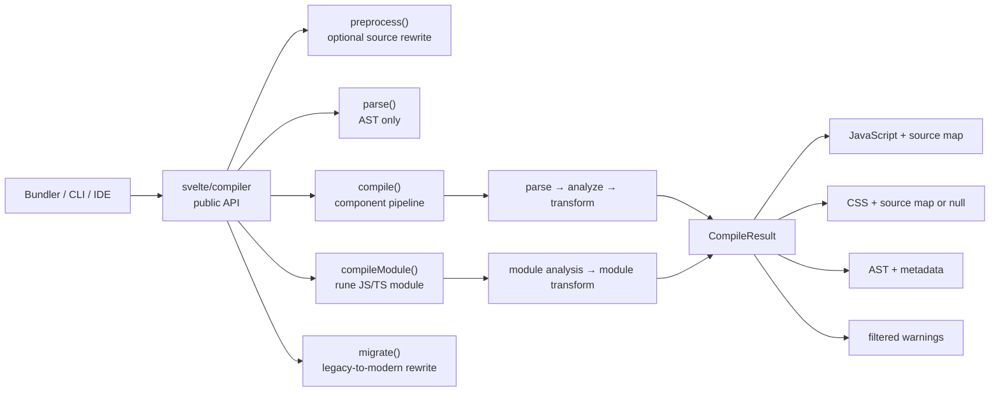
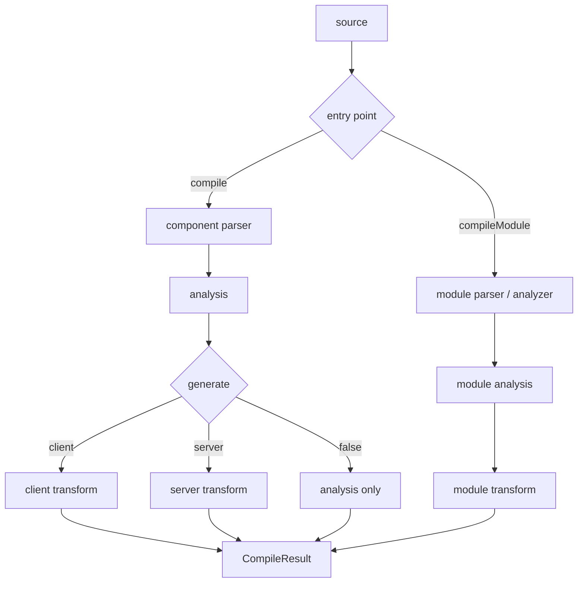
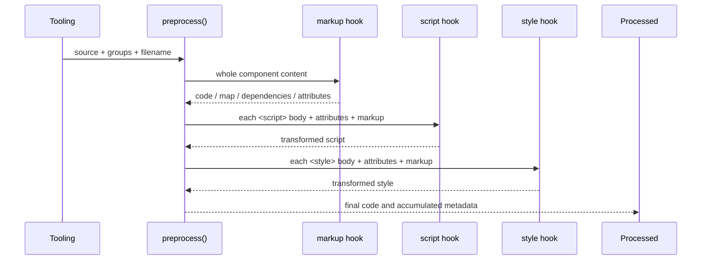
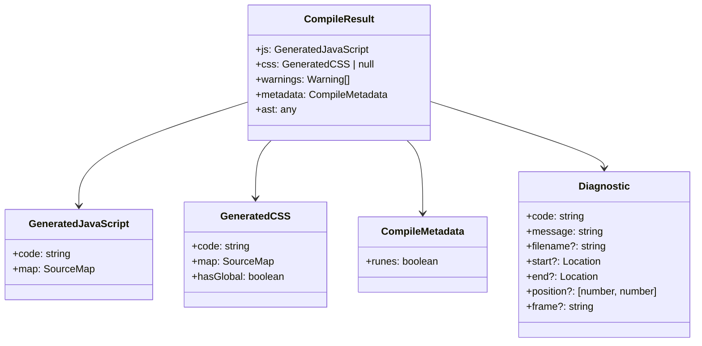
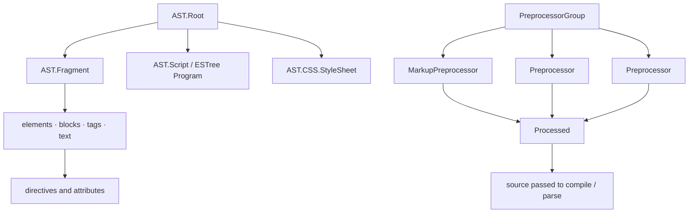

# compiler_api

## Introduction

`compiler_api` is Svelte's public compiler contract. It is the TypeScript declaration surface in
`packages/svelte/types/index.d.ts` for parsing components, preprocessing source, compiling
components or rune modules, inspecting diagnostics, and migrating legacy syntax.

The declarations describe the boundary between tools such as bundler plugins, language servers,
formatters, and the implementation in `packages/svelte/src/compiler`. They do not implement the
compiler. The implementation pipeline is documented in [compilation_pipeline](compilation_pipeline.md),
while the internal entry points and shared state are covered by [compiler_core](compiler_core.md).



## 1. Public entry points

### 1.1 `compile(source, options)`

`compile` converts a `.svelte` component into a JavaScript module. Its input is the complete
component source and a `CompileOptions` object. The output is a `CompileResult` containing generated
JavaScript, optional generated CSS, warnings, metadata, and an AST.

The implementation performs the following logical steps:

1. Validate and normalize options.
2. Parse markup, scripts, expressions, and CSS into `AST.Root`.
3. Analyze scopes, bindings, runes, blocks, exports, and CSS usage.
4. Select client, server, or diagnostic-only generation.
5. Transform the analyzed tree into JavaScript and CSS.
6. Attach source maps, diagnostics, and the requested public AST representation.

See [compiler_parse](compiler_parse.md), [compiler_analyze](compiler_analyze.md),
[compiler_transform_client](compiler_transform_client.md), [compiler_transform_server](compiler_transform_server.md),
and [compiler_css_transform](compiler_css_transform.md) for phase-level behavior.

### 1.2 `compileModule(source, options)`

`compileModule` compiles JavaScript or TypeScript containing Svelte runes, typically a
`.svelte.js` or `.svelte.ts` module. It does not process a component template or component CSS.
Its result still uses `CompileResult`, but `metadata.runes` is always `true`.



### 1.3 `parse(source, options)`

`parse` returns an AST without running semantic analysis or code generation. The `modern` option
controls the AST shape:

| Option | Result |
|---|---|
| `modern: true` | Modern `AST.Root`, suitable for current tooling. |
| omitted or `false` | Legacy AST shape for compatibility. |

The default is currently legacy-oriented in Svelte 5; modern AST output is planned to become the
default in Svelte 6. `filename` improves diagnostics and `loose` permits parser behavior intended
for tolerant tooling. Node offsets refer to the supplied source and are used by diagnostics and
source maps. The full node vocabulary is documented in [compiler_ast_types](compiler_ast_types.md).

### 1.4 `preprocess(source, preprocessor, options?)`

`preprocess` applies one or more `PreprocessorGroup` values to markup, script, and style sections.
Each hook may return synchronously, asynchronously, or return nothing to leave its input unchanged.



`Processed` can contain transformed `code`, an optional source `map`, additional watched
`dependencies`, and updated tag `attributes`. Bundler integrations normally pass the resulting
source map back to `compile` through `CompileOptions.sourcemap`.

The runtime implementation is described in [compiler_preprocess](compiler_preprocess.md), and
the public option/warning rules are in [compiler_options_and_warnings](compiler_options_and_warnings.md).

### 1.5 `migrate(source, options?)`

`migrate` performs a best-effort source rewrite toward runes, event attributes, and render tags.
It returns `{ code }`; it is not a compiler pass and may throw when a construct is too complex to
convert automatically. `filename` improves diagnostics and `use_ts` preserves TypeScript-oriented
rewrites. See [compiler_migrate](compiler_migrate.md) and [legacy_compatibility_and_migration](legacy_compatibility_and_migration.md).

## 2. Compilation contract

### 2.1 `ModuleCompileOptions`

These options are shared by `compile` and `compileModule`:

| Option | Purpose |
|---|---|
| `generate` | `'client'`, `'server'`, or `false` for analysis/warnings only. Defaults to `'client'`. |
| `dev` | Adds development checks and debugging information. |
| `filename` | Identifies the source in diagnostics and source maps. |
| `rootDir` | Prevents absolute filesystem paths from leaking into output. |
| `warningFilter` | Keeps a warning only when the callback returns `true`. |
| `experimental.async` | Enables experimental async deriveds, template expressions, and top-level component `await`. |

### 2.2 `CompileOptions`

Component-specific options extend `ModuleCompileOptions`:

| Area | Options and effect |
|---|---|
| Component identity | `name` controls the generated component name. |
| Output form | `customElement`, `namespace`, `accessors`, `compatibility.componentApi`. |
| CSS | `css`, `cssHash`, `cssOutputFilename`. Custom elements always inject styles into their shadow root. |
| Source fidelity | `preserveComments`, `preserveWhitespace`, `fragments`. |
| Reactivity | `runes`, `immutable`, `discloseVersion`. `runes` may be inferred unless explicitly set. |
| Source maps | `sourcemap`, `outputFilename`, `cssOutputFilename`. |
| Tooling | `hmr`, `modernAst`. |

Deprecated options remain represented for migration compatibility, but options such as
`accessors` and `immutable` have no effect in runes mode. Inline `<svelte:options>` settings are
represented by `AST.SvelteOptions` and can override compiler options where supported.

## 3. `CompileResult` and diagnostics



`js` is always present. `css` is `null` when no CSS is emitted; otherwise `hasGlobal` indicates
whether the output includes global rules. `ast` is the public AST selected by `modernAst` (or the
parse API's `modern` option).

Warnings are non-fatal diagnostics with a stable `code`, human-readable `message`, optional source
locations, and an optional code frame. Compile errors are represented by the same diagnostic
shape but are thrown rather than returned. Warning filtering occurs through
`ModuleCompileOptions.warningFilter`.

## 4. AST and preprocessing type relationships



The public declarations intentionally expose the modern template AST, CSS AST, embedded ESTree
nodes, and source offsets. Internal analysis metadata is added during compilation and should be
treated as implementation detail; consumers should rely on documented AST fields and the
`CompileResult` contract rather than internal metadata objects.

## 5. Integration guidance

Typical tooling follows this flow:

```text
optional preprocess(source)
        ↓
compile(processed.code, { filename, sourcemap, generate })
        ↓
emit result.js, result.css, result.warnings
```

Use `parse` when only syntax inspection is required, `compile` for `.svelte` components, and
`compileModule` for rune-bearing JavaScript/TypeScript modules. Use `generate: false` when a tool
needs validation and warnings without generated output. Preserve and merge preprocessor source maps
so generated diagnostics and debugger locations continue to point at author source.

The compiled JavaScript is consumed by the client runtime or server runtime, not by this API layer:
[client_dom_rendering_runtime](client_dom_rendering_runtime.md) handles DOM operations and reactive
blocks, while [server_rendering_and_shared_runtime_primitives](server_rendering_and_shared_runtime_primitives.md)
provides SSR helpers. Public component and runtime types are re-exported through
[public_package_entry_points](public_package_entry_points.md).

## 6. Compatibility and versioning notes

The declarations contain both Svelte 5 function components and deprecated Svelte 4 class-oriented
types. `SvelteComponent`, `SvelteComponentTyped`, and legacy compiler options exist to support
transition-period tooling; new integrations should prefer modern AST output, `Component`, runes,
and callback props where applicable. `VERSION` exposes the package compiler version for tooling
that needs to report compatibility.
