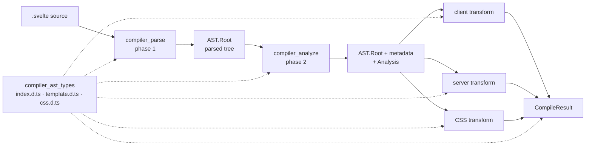
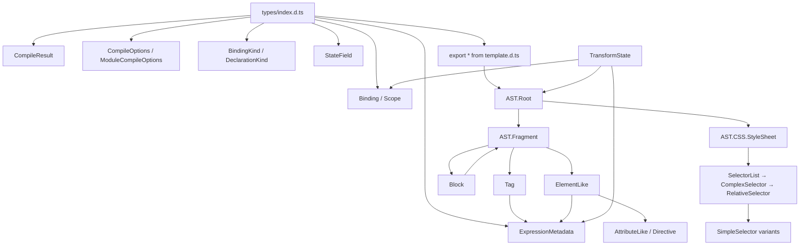
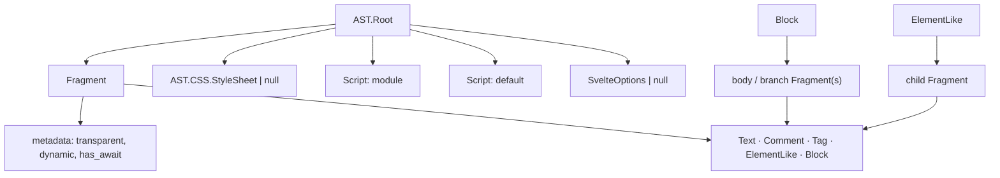
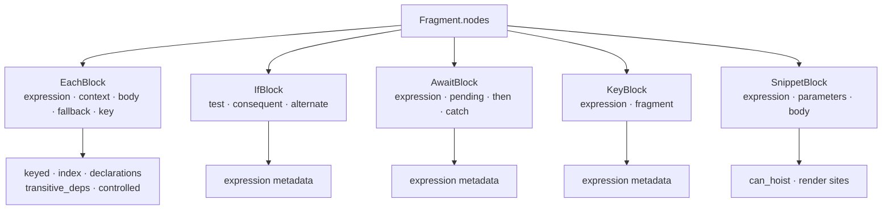
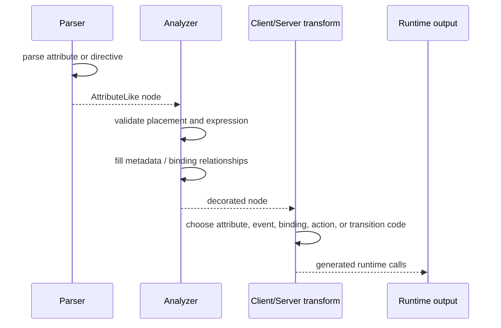
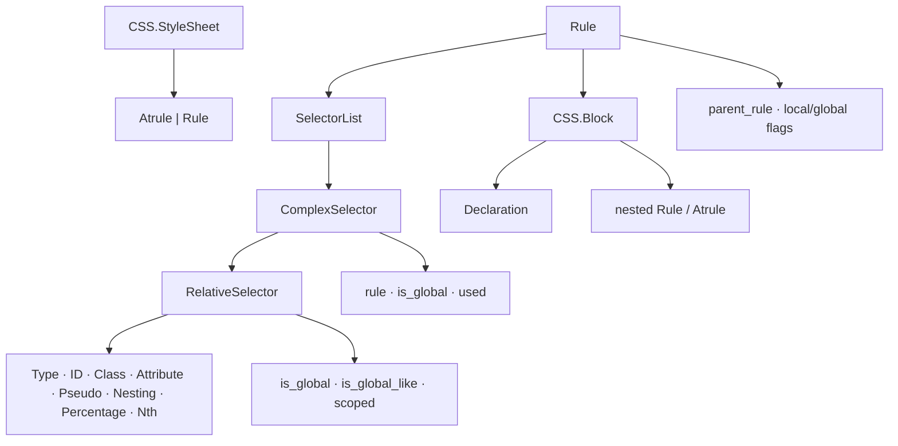
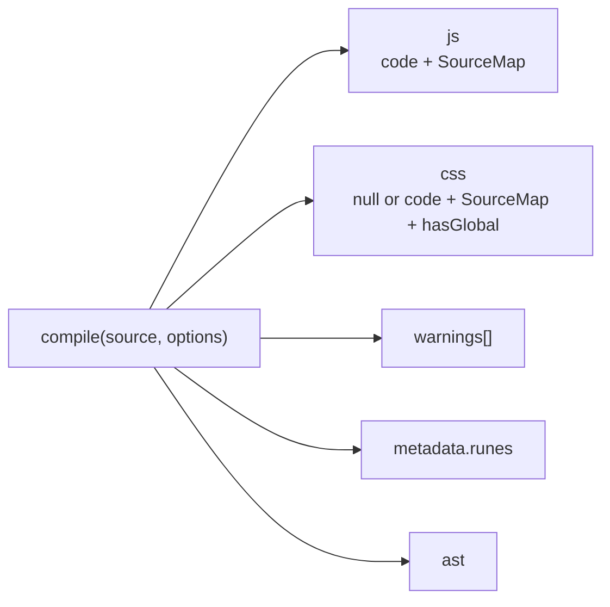
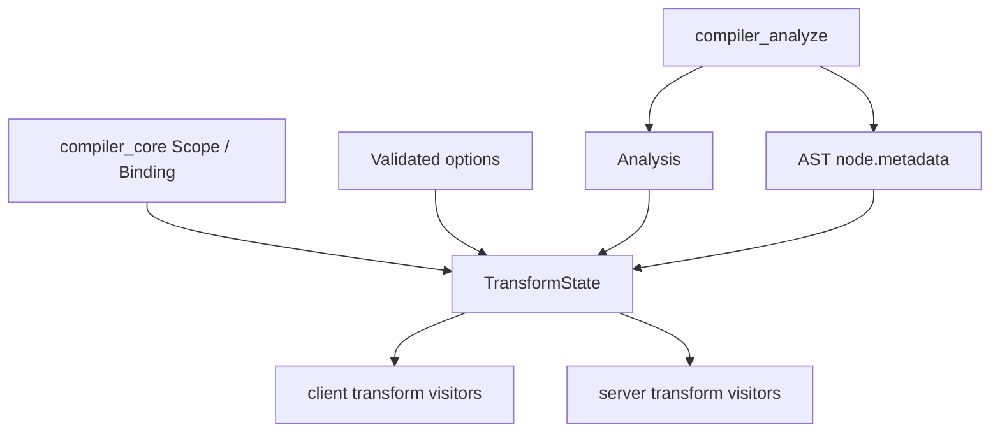
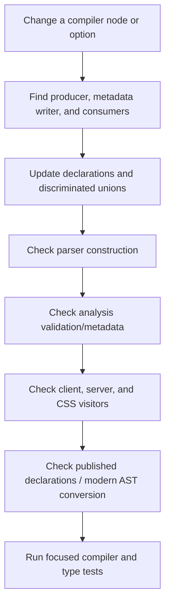

# compiler_ast_types

## 1. What this module does

`compiler_ast_types` is the TypeScript declaration layer for Svelte's compiler data model. It
defines the shapes that travel through the compiler rather than implementing a runtime algorithm.
Its central contract is the `AST` namespace in `packages/svelte/src/compiler/types/template.d.ts`:

```text
Svelte source
    │
    ▼
AST.Root ── parsed template, scripts, and CSS
    │
    ▼
AST.Root + metadata ── scope, reactivity, CSS, and code-generation facts
    │
    ▼
CompileResult ── generated JavaScript, CSS, warnings, metadata, and AST
```

The module is consumed by [compiler_parse](compiler_parse.md), [compiler_analyze](compiler_analyze.md),
[compiler_transform_client](compiler_transform_client.md), [compiler_transform_server](compiler_transform_server.md),
and [compiler_css_transform](compiler_css_transform.md). The declarations ensure that all of those
phases agree on node discriminants, source locations, child relationships, and analysis metadata.

## 2. Where it fits in the system



This module has four closely related surfaces:

| File | Responsibility |
| --- | --- |
| `types/index.d.ts` | Compiler results, compile options, binding kinds, expression metadata, and transform-facing state fields. |
| `types/template.d.ts` | The modern template AST, its unions, embedded ESTree nodes, and source-location contract. |
| `types/css.d.ts` | The stylesheet and selector AST used by CSS analysis and rewriting. |
| `phases/3-transform/types.d.ts` | `TransformState`, the common typed context for phase-3 generators. |

The declarations are not a separate runtime package. They describe objects created by the parser,
mutated by analysis, and consumed by code generation. Public compiler declarations are re-exported
through `packages/svelte/types/index.d.ts`; that generated/re-exported file is the package-level
surface for consumers.

## 3. Type architecture



### 3.1 Common node contract

`AST.BaseNode` supplies a string `type` discriminator and numeric `start` / `end` offsets. Every
template node uses these offsets to point into the original source. The parser and diagnostic
system use them for errors and code frames; transforms use them for source maps and source-aware
rewrites. CSS nodes use the equivalent `_CSS.BaseNode` contract.

`SvelteNode` is the broad internal union of ESTree nodes, template nodes, fragments, CSS nodes,
and scripts. This allows scope maps and transform paths to refer to any node participating in a
walk, while narrower unions keep individual visitors type-safe:

| Union | Members |
| --- | --- |
| `ElementLike` | Components, regular elements, `<slot>`, `<title>`, and `svelte:*` elements. |
| `Block` | `EachBlock`, `IfBlock`, `AwaitBlock`, `KeyBlock`, and `SnippetBlock`. |
| `Tag` | Expression, HTML, const, debug, render, and attach tags. |
| `Directive` | Animate, bind, class, let, event, style, transition, and use directives. |
| `TemplateNode` | Root plus all text, comments, tags, elements, attributes, directives, and blocks. |

## 4. Template AST

### 4.1 Root and fragments

`AST.Root` is the component-level container. It carries:

- `options`: inline `<svelte:options>` settings, if present;
- `fragment`: the rendered template tree;
- `css`: the parsed `<style>` stylesheet, if present;
- `instance` and `module`: the two `<script>` programs;
- `comments`: JavaScript comments retained from scripts and expressions;
- `metadata.ts`: whether TypeScript syntax was parsed.

`AST.Fragment` is the ordered child container. Its internal metadata is especially important:

- `transparent` indicates whether it has a code-generation scope of its own;
- `dynamic` tells the client transform whether it must traverse the fragment at runtime;
- `has_await` records asynchronous content in the subtree.



### 4.2 Text and tags

`Text` preserves both decoded `data` and original `raw` text. This distinction lets generated
HTML use decoded semantics while diagnostics and formatting tools retain the exact input.

Expression-bearing tags are deliberately separate node types:

| Node | Source syntax | Main payload |
| --- | --- | --- |
| `ExpressionTag` | `{value}` | ESTree `expression` plus expression metadata. |
| `HtmlTag` | `{@html value}` | Raw HTML expression plus metadata. |
| `ConstTag` | `{@const x = value}` | A constrained ESTree variable declaration. |
| `DebugTag` | `{@debug x}` | Identifiers to inspect. |
| `RenderTag` | `{@render snippet(...)}` | A call expression, resolution path, and snippet candidates. |
| `AttachTag` | `{@attach value}` | Attachment expression plus metadata. |

`ExpressionMetadata` is the bridge between syntax and reactivity. It records eager dependencies,
all references, and whether an expression has state, calls, awaits, member access, or assignments.
The analysis phase fills it; both client and server transforms use it to choose evaluation and
effect strategies. See [compiler_analyze_expression_metadata](compiler_analyze_expression_metadata.md).

### 4.3 Elements and special elements

`BaseElement` establishes the shared shape: a name, mixed attributes/directives, and a child
fragment. Its concrete types distinguish ordinary DOM elements from component and special-element
semantics:

| Group | Types | Additional information |
| --- | --- | --- |
| DOM | `RegularElement` | SVG/MathML namespace flags, spread presence, CSS scoping, and source path. |
| Dynamic DOM | `SvelteElement` | Dynamic tag expression and inferred SVG/MathML/scoping flags. |
| Components | `Component`, `SvelteComponent`, `SvelteSelf` | Component scope map, candidate snippets, and resolution path; dynamic components also carry an expression. |
| Content targets | `SlotElement`, `SvelteFragment` | Slot and fragment placement/content semantics. |
| Document targets | `SvelteHead`, `SvelteBody`, `SvelteDocument`, `TitleElement` | Target-specific validation and output behavior. |
| Boundaries/options | `SvelteBoundary`, `SvelteOptionsRaw` | Error boundaries and the parser-only intermediate options element. |
| Window | `SvelteWindow` | Window-level bindings and events. |

`SvelteOptionsRaw` is explicitly an intermediate parser representation. Analysis normalizes its
attributes into `Root.options`; it does not represent output DOM.

### 4.4 Blocks



Block nodes own one or more fragments and carry analysis metadata used directly by code generation:

- `EachBlock` models context/index/key declarations and tracks declarations, transitive
  dependencies, group bindings, and the controlled-block optimization.
- `IfBlock` distinguishes ordinary branches from `elseif` nodes and stores expression metadata.
- `AwaitBlock` stores optional pending/then/catch fragments and patterns for resolved values and
  rejection reasons.
- `KeyBlock` forces recreation when its key expression changes.
- `SnippetBlock` models named renderable content, parameter patterns, optional type parameters,
  hoistability, and the component/render sites that may invoke it.

The block visitors that validate and decorate these shapes are documented in
[compiler_analyze_blocks](compiler_analyze_blocks.md), while generated control flow is described
in [compiler_transform_client_blocks](compiler_transform_client_blocks.md) and
[compiler_transform_server_blocks](compiler_transform_server_blocks.md).

## 5. Attributes and directives

An `Attribute` contains a literal, expression tag, or mixed text/expression array. Its internal
metadata records whether an event can be delegated and whether a `class` value needs `clsx`.
`SpreadAttribute` instead carries one ESTree expression and expression metadata.

Directives encode Svelte's declarative behavior without flattening it into ordinary attributes:

| Directive | Key fields |
| --- | --- |
| `AnimateDirective` | Name and optional expression. |
| `BindDirective` | Name, assignable expression, binding-group identifier, parent each blocks. |
| `ClassDirective` | Fixed `class` name, expression metadata. |
| `LetDirective` | Name and nullable destructuring expression. |
| `OnDirective` | Event name, optional handler, supported modifiers, expression metadata. |
| `StyleDirective` | Property name, boolean/expression/text value, `important` modifier. |
| `TransitionDirective` | Name, expression, `local`/`global`, and intro/outro flags. |
| `UseDirective` | Action name and optional parameter expression. |



## 6. CSS AST

The `_CSS` namespace models parsed styles independently from template elements, but CSS analysis
cross-references both trees. A `StyleSheet` contains at-rules and rules; each `Rule` contains a
selector list and declaration/nested-rule block.



Important metadata is analysis-owned:

- `Rule.metadata` links nested rules to parents and records local/global selector properties.
- `ComplexSelector.metadata.used` records whether a selector matches a template element.
- `RelativeSelector.metadata` controls global handling and scoping decisions.

The CSS transform consumes this information to remove global pseudo-class syntax, scope local
selectors, and emit the final stylesheet. See [compiler_analyze_css](compiler_analyze_css.md) and
[compiler_css_transform](compiler_css_transform.md).

## 7. Compiler results and options

`CompileResult` is the public output contract of `compile`:



`CompileOptions` extends `ModuleCompileOptions`. The options separate concerns cleanly:

- output selection: `generate`, `css`, `customElement`;
- naming and source maps: `name`, `filename`, `rootDir`, `sourcemap`, output filenames;
- syntax/runtime mode: `runes`, `dev`, `hmr`, `experimental.async`;
- generated behavior: `namespace`, `preserveComments`, `preserveWhitespace`, `fragments`;
- compatibility and migration: `accessors`, `immutable`, `compatibility`, `modernAst`;
- diagnostics: `warningFilter`.

`ValidatedModuleCompileOptions` and `ValidatedCompileOptions` express the post-validation state:
required defaults are present, while deliberately optional values such as `runes`, filenames, and
source maps remain possibly undefined. `compiler_core` performs validation and combines these
options with inline `Root.options`; see [compiler_core](compiler_core.md) and
[compiler_options_and_warnings](compiler_options_and_warnings.md).

## 8. Analysis and transform state contracts

`BindingKind` classifies how a name participates in Svelte semantics: ordinary variables, props,
bindable/rest props, raw/deep state, derived values, each/snippet/template bindings, store
subscriptions, legacy reactive declarations, and statically known values. `DeclarationKind`
classifies the source declaration (`var`, `let`, `const`, function, import, parameter, or synthetic).

`StateField` records a class state field created from a rune, including its ESTree key, source node,
and call expression. It is shared by analysis and the client transform.

`TransformState` is the common base for client and server transforms:

| Field | Purpose |
| --- | --- |
| `analysis` | Component-level facts produced by phase 2. |
| `options` | Validated module options. |
| `scope` | Current lexical scope. |
| `scopes` | Map from Svelte nodes to lexical scopes. |
| `state_fields` | Rune-generated class state fields. |



## 9. Dependency and ownership map

```mermaid
graph TD
    ASTT["compiler_ast_types"]
    ASTT -->|imports| ESTREE["estree node types"]
    ASTT -->|imports| MAGIC["magic-string SourceMap"]
    ASTT -->|references| SCOPE["compiler_core Scope / Binding"]
    ASTT -->|references| DIAG["compile diagnostics"]
    ASTT -->|references| RUNES["StateCreationRuneName"]
    ASTT --> PARSER["compiler_parse\ncreates nodes"]
    ASTT --> ANALYZER["compiler_analyze\nadds metadata"]
    ASTT --> CLIENT["compiler_transform_client\nreads AST + metadata"]
    ASTT --> SERVER["compiler_transform_server\nreads AST + metadata"]
    ASTT --> CSST["compiler_css_transform\nreads CSS metadata"]
    ASTT --> PUBLIC["published_type_declaration_surface\nre-exports public types"]
```



The ownership rule is intentional: parsing owns the initial node shape, analysis owns most
`metadata` fields, and transforms should treat those facts as input. A change to a discriminated
union or metadata property therefore has downstream impact even though this module contains no
runtime code.

## 10. Processing flow and maintenance guidance



When adding a node, update the concrete interface, the relevant union (`Tag`, `Block`,
`ElementLike`, or `Directive`), and any `SvelteNode`-based scope/path consumers. Preserve `start`
and `end` offsets. If the node has metadata, document who writes each field and verify both
client and server visitors handle it. For public-facing types, also check the generated/re-exported
surface in `packages/svelte/types/index.d.ts`.

## 11. Related documentation

- [compilation_pipeline](compilation_pipeline.md) — end-to-end phase ordering and compile flow.
- [compiler_parse](compiler_parse.md) — construction of `AST.Root` and child nodes.
- [compiler_analyze](compiler_analyze.md) — validation and in-place metadata decoration.
- [compiler_transform_client](compiler_transform_client.md) — DOM code generation from the AST.
- [compiler_transform_server](compiler_transform_server.md) — SSR code generation from the AST.
- [compiler_analyze_css](compiler_analyze_css.md) — CSS selector usage and scoping metadata.
- [compiler_css_transform](compiler_css_transform.md) — final CSS rewriting and emission.
- [compiler_core](compiler_core.md) — scopes, bindings, builders, diagnostics, and entry points.
- `packages/svelte/types/index.d.ts` — package-level type exports and aliases.
