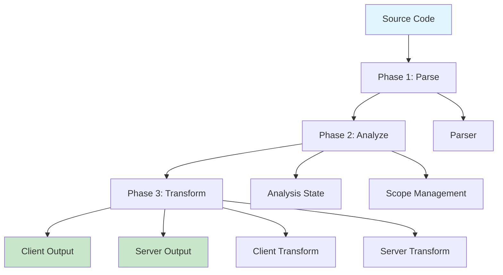
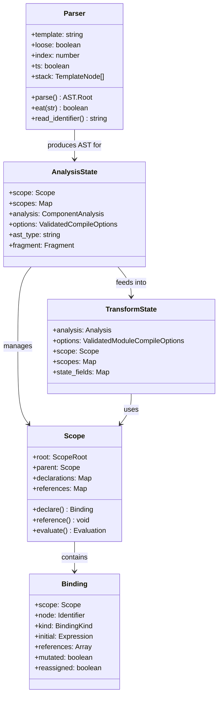
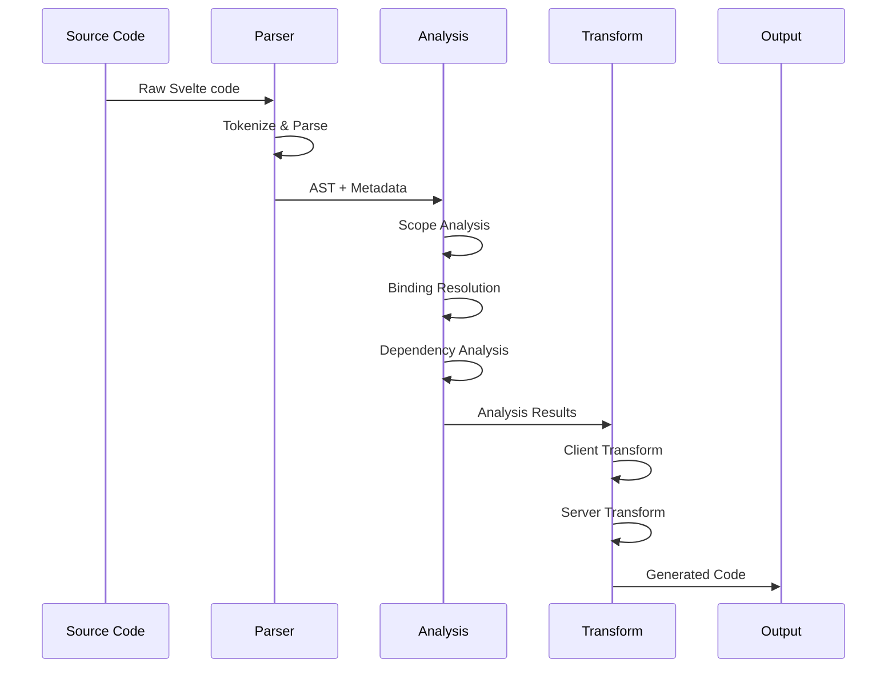
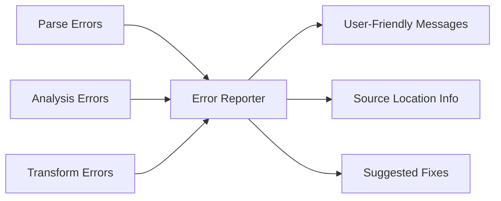

# Compiler Core Module

## Overview

The `compiler_core` module forms the heart of the Svelte compiler, orchestrating the complete compilation pipeline from source code parsing to final output generation. This module implements a multi-phase compilation architecture that transforms Svelte components through parsing, analysis, and transformation phases.

## Architecture

The compiler core follows a structured multi-phase approach:



## Core Sub-modules

### 1. Parsing Phase ([parsing_phase.md](parsing_phase.md))
The parsing phase is responsible for converting raw Svelte source code into a structured Abstract Syntax Tree (AST). Key features include:

- **Parser Class**: Main parsing engine with comprehensive template processing
- **TypeScript Detection**: Automatic detection and handling of TypeScript syntax
- **Loose Parsing Mode**: Error-tolerant parsing for development tools
- **Template Processing**: Handles Svelte-specific syntax including directives, blocks, and components
- **Error Recovery**: Intelligent error recovery for malformed input

### 2. Analysis Phase ([analysis_phase.md](analysis_phase.md))
The analysis phase performs semantic analysis and builds the foundation for code generation. Core components include:

- **AnalysisState Management**: Comprehensive state tracking during compilation
- **Scope Resolution**: Advanced lexical scoping with binding management
- **Dependency Analysis**: Reactive dependency tracking and validation
- **Type Analysis**: Component and template type analysis
- **Binding System**: Variable binding, mutation tracking, and reference analysis

### 3. Transform Phase ([transform_phase.md](transform_phase.md))
The transform phase generates target-specific code from the analyzed AST. Features include:

- **Multi-Target Generation**: Separate client and server code generation
- **State Management**: Transform state tracking and optimization
- **Runtime Integration**: Code generation that interfaces with Svelte's runtime
- **Component Transformation**: Specialized handling for component compilation
- **Optimization**: Dead code elimination and performance optimizations

## Component Relationships



## Data Flow

The compilation process follows a clear data flow pattern:



## Key Features

### Multi-Target Compilation
- **Client-side**: Generates reactive runtime code for browsers
- **Server-side**: Produces SSR-compatible code for Node.js environments
- **Hydration**: Ensures seamless client-server state synchronization

### Advanced Scope Management
- **Lexical Scoping**: Proper variable scope resolution across template and script boundaries
- **Binding Tracking**: Comprehensive tracking of variable mutations and reassignments
- **Reference Analysis**: Detailed analysis of variable usage patterns

### Type Safety
- **TypeScript Support**: Native TypeScript parsing and analysis
- **Type Inference**: Advanced type inference for reactive statements
- **Validation**: Comprehensive compile-time validation and error reporting

## Integration Points

The compiler core integrates with several other modules in the Svelte ecosystem:

- **[compiler_types.md](compiler_types.md)**: Provides comprehensive type definitions for AST nodes, compilation options, and template structures
- **[css_types.md](css_types.md)**: Handles CSS parsing, scoping, and stylesheet management
- **[client_runtime.md](client_runtime.md)**: Generates code that interfaces with Svelte's reactive client runtime system
- **[server_runtime.md](server_runtime.md)**: Produces server-compatible output for SSR environments
- **[component_system.md](component_system.md)**: Integrates with the component lifecycle and API system
- **[preprocessor.md](preprocessor.md)**: Handles preprocessing of source code before compilation
- **[stores.md](stores.md)**: Integrates with Svelte's store system for state management
- **[reactive_data_structures.md](reactive_data_structures.md)**: Works with reactive data structures and primitives

## Performance Considerations

### Compilation Speed
- **Incremental Parsing**: Supports partial re-parsing for development workflows
- **Scope Caching**: Efficient scope resolution with caching mechanisms
- **Lazy Evaluation**: Deferred evaluation of complex expressions

### Memory Efficiency
- **AST Optimization**: Minimal memory footprint for AST representation
- **Scope Cleanup**: Automatic cleanup of unused scopes and bindings
- **Reference Counting**: Efficient tracking of variable references

## Error Handling

The compiler core provides comprehensive error handling:



### Error Categories
- **Syntax Errors**: Invalid Svelte syntax or malformed templates
- **Semantic Errors**: Type mismatches, undefined variables, invalid bindings
- **Transform Errors**: Issues during code generation or optimization

## Usage Examples

### Basic Compilation
```javascript
import { parse } from './phases/1-parse/index.js';
import { analyze } from './phases/2-analyze/index.js';
import { transform } from './phases/3-transform/index.js';

// Parse Svelte source code
const ast = parse(source, { loose: false });

// Analyze and build scopes
const analysis = analyze(ast, options);

// Transform for target environment
const result = transform(analysis, { target: 'client' });
```

### Advanced Usage
```javascript
// Custom compilation pipeline
const parser = new Parser(template, loose);
const analysisState = createAnalysisState(parser.root, options);
const transformState = createTransformState(analysisState);

// Generate optimized output
const clientCode = generateClientCode(transformState);
const serverCode = generateServerCode(transformState);
```

## Future Enhancements

- **Parallel Compilation**: Multi-threaded compilation for large projects
- **Advanced Optimizations**: Dead code elimination and tree shaking
- **Plugin Architecture**: Extensible compilation pipeline
- **Source Maps**: Enhanced debugging support with detailed source maps

---

*This documentation covers the core compilation architecture. For detailed information about specific phases, refer to the individual sub-module documentation files.*