# compiler_core

## Introduction

`compiler_core` is the **spine** of the Svelte compiler. It does not parse, analyze, or generate code by itself. Instead it holds the pieces that every phase needs:

- the **public entry points** (`compile`, `compileModule`, `parse`) that run the three phases in order;
- the **global compiler state** (filename, source text, dev flag, warnings, ignore stack);
- the **scope and binding model** that tells every later phase what each identifier means;
- the **AST builders** used to construct the generated JavaScript;
- **shared transform helpers** (whitespace cleaning, namespace inference, `$inspect` rewriting);
- **diagnostics** (code frames, `svelte-ignore` handling).

If you think of the compiler as a factory line, [compiler_parse](compiler_parse.md), [compiler_analyze](compiler_analyze.md), [compiler_transform_client](compiler_transform_client.md), and [compiler_transform_server](compiler_transform_server.md) are the stations. `compiler_core` is the conveyor belt, the shared toolbox, and the clipboard that travels with the work.

---

## 1. Where this module sits

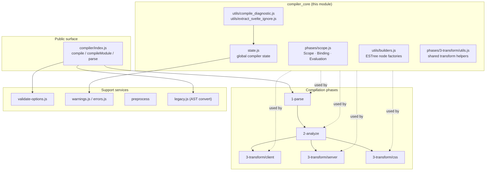
```mermaid
graph TB
    subgraph Public["Public surface"]
        API["compiler/index.js<br/>compile / compileModule / parse"]
    end

    subgraph Core["compiler_core (this module)"]
        STATE["state.js<br/>global compiler state"]
        SCOPE["phases/scope.js<br/>Scope · Binding · Evaluation"]
        BUILD["utils/builders.js<br/>ESTree node factories"]
        TUTIL["phases/3-transform/utils.js<br/>shared transform helpers"]
        DIAG["utils/compile_diagnostic.js<br/>utils/extract_svelte_ignore.js"]
    end

    subgraph Phases["Compilation phases"]
        P1["1-parse"]
        P2["2-analyze"]
        P3C["3-transform/client"]
        P3S["3-transform/server"]
        P3CSS["3-transform/css"]
    end

    subgraph Support["Support services"]
        VOPT["validate-options.js"]
        WARN["warnings.js / errors.js"]
        PRE["preprocess"]
        LEG["legacy.js (AST convert)"]
    end

    API --> P1 --> P2 --> P3C
    P2 --> P3S
    P2 --> P3CSS
    API --> VOPT
    API --> LEG

    Core -.->|used by| P1
    Core -.->|used by| P2
    Core -.->|used by| P3C
    Core -.->|used by| P3S
    Core -.->|used by| P3CSS

    STATE --> WARN
    DIAG --> STATE

    click P1 "compiler_parse.md"
    click P2 "compiler_analyze.md"
    click P3C "compiler_transform_client.md"
    click P3S "compiler_transform_server.md"
    click P3CSS "compiler_css_transform.md"
```

**Related documents**

| Topic | Document |
|---|---|
| Parsing `.svelte` source into an AST | [compiler_parse](compiler_parse.md) |
| Semantic analysis, validation, CSS pruning | [compiler_analyze](compiler_analyze.md) |
| Client (DOM) code generation | [compiler_transform_client](compiler_transform_client.md) |
| Server (SSR) code generation | [compiler_transform_server](compiler_transform_server.md) |
| CSS scoping output | [compiler_css_transform](compiler_css_transform.md) |
| Option validation & warning catalogue | [compiler_options_and_warnings](compiler_options_and_warnings.md) |
| AST node type definitions | [compiler_ast_types](compiler_ast_types.md) |
| Preprocessors | [compiler_preprocess](compiler_preprocess.md) |
| Svelte 4 → 5 migration | [compiler_migrate](compiler_migrate.md) |

---

## 2. Component map

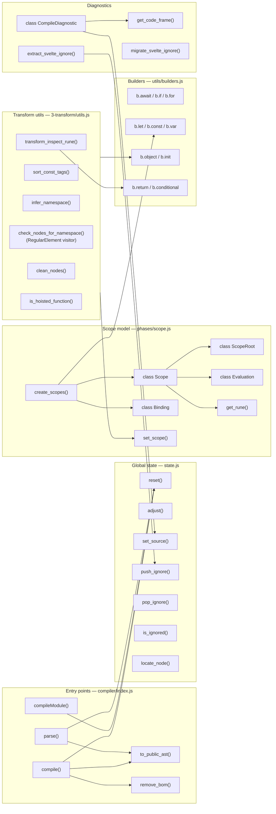
```mermaid
graph LR
    subgraph EntryPoints["Entry points — compiler/index.js"]
        compile["compile()"]
        compileModule["compileModule()"]
        parseFn["parse()"]
        toPublic["to_public_ast()"]
        removeBom["remove_bom()"]
    end

    subgraph StateMod["Global state — state.js"]
        reset["reset()"]
        adjust["adjust()"]
        setSource["set_source()"]
        pushIgnore["push_ignore()"]
        popIgnore["pop_ignore()"]
        isIgnored["is_ignored()"]
        locateNode["locate_node()"]
    end

    subgraph ScopeMod["Scope model — phases/scope.js"]
        Scope["class Scope"]
        Binding["class Binding"]
        ScopeRoot["class ScopeRoot"]
        Evaluation["class Evaluation"]
        createScopes["create_scopes()"]
        setScope["set_scope()"]
        getRune["get_rune()"]
    end

    subgraph Builders["Builders — utils/builders.js"]
        bAwait["b.await / b.if / b.for"]
        bDecl["b.let / b.const / b.var"]
        bObj["b.object / b.init"]
        bRet["b.return / b.conditional"]
    end

    subgraph TUtils["Transform utils — 3-transform/utils.js"]
        cleanNodes["clean_nodes()"]
        sortConst["sort_const_tags()"]
        inferNs["infer_namespace()"]
        checkNs["check_nodes_for_namespace()<br/>(RegularElement visitor)"]
        inspectRune["transform_inspect_rune()"]
        hoisted["is_hoisted_function()"]
    end

    subgraph Diag["Diagnostics"]
        frame["get_code_frame()"]
        CDiag["class CompileDiagnostic"]
        extractIgnore["extract_svelte_ignore()"]
        migrateIgnore["migrate_svelte_ignore()"]
    end

    compile --> reset
    compile --> removeBom
    compile --> toPublic
    compileModule --> reset
    parseFn --> reset
    parseFn --> toPublic

    createScopes --> Scope
    createScopes --> Binding
    Scope --> Evaluation
    Scope --> ScopeRoot
    Scope --> getRune

    createScopes --> bDecl
    TUtils --> setScope
    TUtils --> bObj
    inspectRune --> bRet

    CDiag --> frame
    CDiag --> setSource
    extractIgnore --> pushIgnore
```

---

## 3. Entry points — `compiler/index.js`

This file is the door to the whole compiler. Three functions matter.

### 3.1 `compile(source, options)`

Turns a `.svelte` file into a JavaScript module.

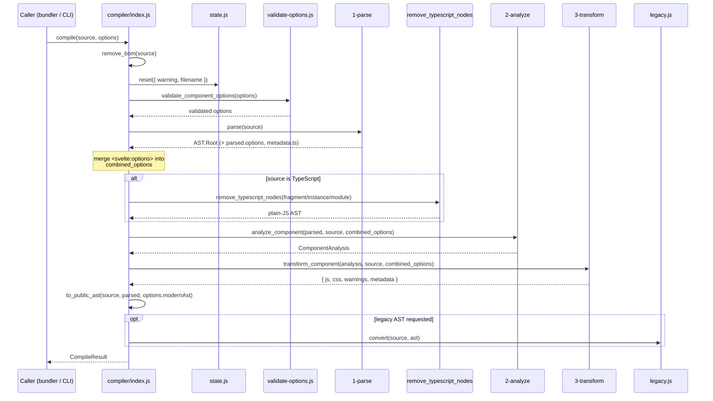
```mermaid
sequenceDiagram
    participant User as Caller (bundler / CLI)
    participant Idx as compiler/index.js
    participant St as state.js
    participant VO as validate-options.js
    participant P1 as 1-parse
    participant TS as remove_typescript_nodes
    participant P2 as 2-analyze
    participant P3 as 3-transform
    participant Leg as legacy.js

    User->>Idx: compile(source, options)
    Idx->>Idx: remove_bom(source)
    Idx->>St: reset({ warning, filename })
    Idx->>VO: validate_component_options(options)
    VO-->>Idx: validated options
    Idx->>P1: parse(source)
    P1-->>Idx: AST.Root (+ parsed.options, metadata.ts)
    Note over Idx: merge <svelte:options> into<br/>combined_options
    alt source is TypeScript
        Idx->>TS: remove_typescript_nodes(fragment/instance/module)
        TS-->>Idx: plain-JS AST
    end
    Idx->>P2: analyze_component(parsed, source, combined_options)
    P2-->>Idx: ComponentAnalysis
    Idx->>P3: transform_component(analysis, source, combined_options)
    P3-->>Idx: { js, css, warnings, metadata }
    Idx->>Idx: to_public_ast(source, parsed, options.modernAst)
    opt legacy AST requested
        Idx->>Leg: convert(source, ast)
    end
    Idx-->>User: CompileResult
```

Key details:

1. **BOM removal first.** `remove_bom` strips a leading ``. If it stayed, all the character offsets used for template generation and source maps would be off by one.
2. **State reset before anything else.** `state.reset()` clears warnings and sets the filename, so a previous compilation cannot leak into this one.
3. **Options come from two places.** CLI/bundler options are validated first, then options written in `<svelte:options>` inside the file override them. `customElement` is pulled out separately into `customElementOptions`.
4. **TypeScript is erased, not compiled.** When `parsed.metadata.ts` is true the AST is re-created with `remove_typescript_nodes` applied to the fragment, instance script, module script, and the custom-element `extend` expression. See [compiler_parse_js_interop](compiler_parse_js_interop.md).

### 3.2 `compileModule(source, options)`

The `.svelte.js` / `.svelte.ts` path. It is much shorter because there is no template, no CSS, and no legacy mode — modules are **always runes mode**.

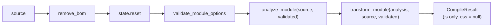
```mermaid
flowchart LR
    A["source"] --> B["remove_bom"]
    B --> C["state.reset"]
    C --> D["validate_module_options"]
    D --> E["analyze_module(source, validated)"]
    E --> F["transform_module(analysis, source, validated)"]
    F --> G["CompileResult<br/>(js only, css = null)"]
```

Inside `analyze_module` the module is parsed with the acorn wrapper, `create_scopes(ast, new ScopeRoot(), false, null)` builds the scope tree (note `allow_reactive_declarations = false` — `$:` labels are not special in modules), and top-level `$name` references are rejected unless they are runes. `transform_module` then picks `client_module` or `server_module` based on `options.generate`, prints with `esrap`, and prepends a `/* file generated by Svelte vX */` banner.

### 3.3 `parse(source, { modern, loose })`

Returns only the AST. It resets state with a warning filter that swallows everything (`() => false`), because parsing on its own should not report warnings.

### 3.4 `to_public_ast(source, ast, modern)`

The compiler's internal AST carries a `metadata` object on almost every node. That is an implementation detail, not public API.

- **modern = true** → walk the whole tree with zimmerframe and `delete node.metadata`. Options attributes get an extra manual clean because their values may be arrays.
- **modern = false** (still the Svelte 5 default) → hand the AST to `convert()` from `legacy.js`, which reshapes it into the Svelte 4 node shapes. See [compiler_legacy_ast_types](compiler_legacy_ast_types.md).

### 3.5 Re-exports

`index.js` also re-exports `preprocess` ([compiler_preprocess](compiler_preprocess.md)), `migrate` ([compiler_migrate](compiler_migrate.md)), and `VERSION`. `walk` is kept only to throw a helpful error telling you to import it from `estree-walker`.

---

## 4. Global compiler state — `state.js`

The compiler is **not** re-entrant. It keeps a handful of module-level `let` variables that every phase reads directly. This avoids threading a context object through hundreds of visitor functions.

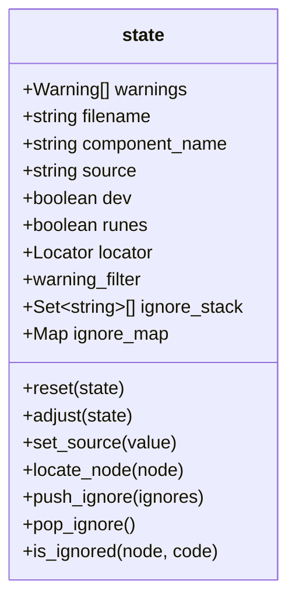
```mermaid
classDiagram
    class state {
        +Warning[] warnings
        +string filename
        +string component_name
        +string source
        +boolean dev
        +boolean runes
        +Locator locator
        +warning_filter
        +Set~string~[] ignore_stack
        +Map ignore_map
        +reset(state)
        +adjust(state)
        +set_source(value)
        +locate_node(node)
        +push_ignore(ignores)
        +pop_ignore()
        +is_ignored(node, code)
    }
```

### 4.1 Lifecycle

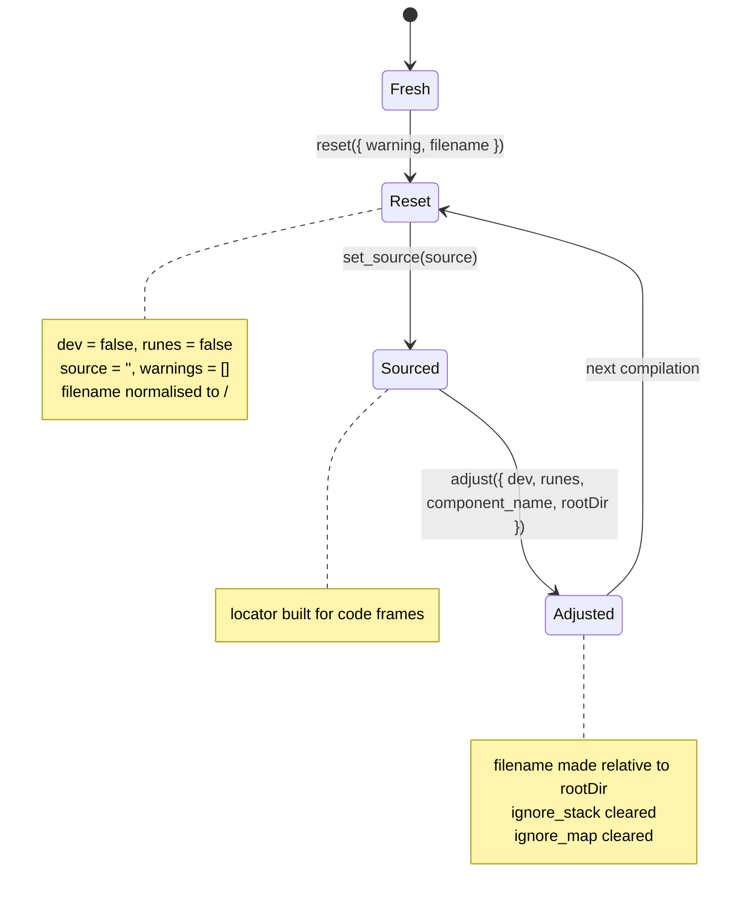
```mermaid
stateDiagram-v2
    [*] --> Fresh
    Fresh --> Reset : reset({ warning, filename })
    note right of Reset
        dev = false, runes = false
        source = '', warnings = []
        filename normalised to /
    end note
    Reset --> Sourced : set_source(source)
    note right of Sourced
        locator built for code frames
    end note
    Sourced --> Adjusted : adjust({ dev, runes, component_name, rootDir })
    note right of Adjusted
        filename made relative to rootDir
        ignore_stack cleared
        ignore_map cleared
    end note
    Adjusted --> Reset : next compilation
```

`reset()` is called by `compile` / `compileModule` / `parse` **before** any work. `adjust()` is called by the analysis phase, once it knows whether the component is in runes mode and what its name is. That split matters: `runes` cannot be known until the scripts have been scanned.

### 4.2 Warning suppression — `push_ignore` / `pop_ignore`

`svelte-ignore` comments suppress warnings for the subtree that follows them. Two structures cooperate:

- **`ignore_stack`** — a stack of `Set<string>`. Each entry is the *cumulative* set of ignored codes at that depth. `push_ignore(ignores)` copies the current top and unions the new codes in, so nesting inherits automatically.
- **`ignore_map`** — a `Map<node, Set<string>[]>`. Some warnings are emitted long after the stack has been unwound (for example CSS "unused selector" warnings, which need the whole stylesheet first). The map remembers, per node, the stack snapshot that was live when the node was visited.

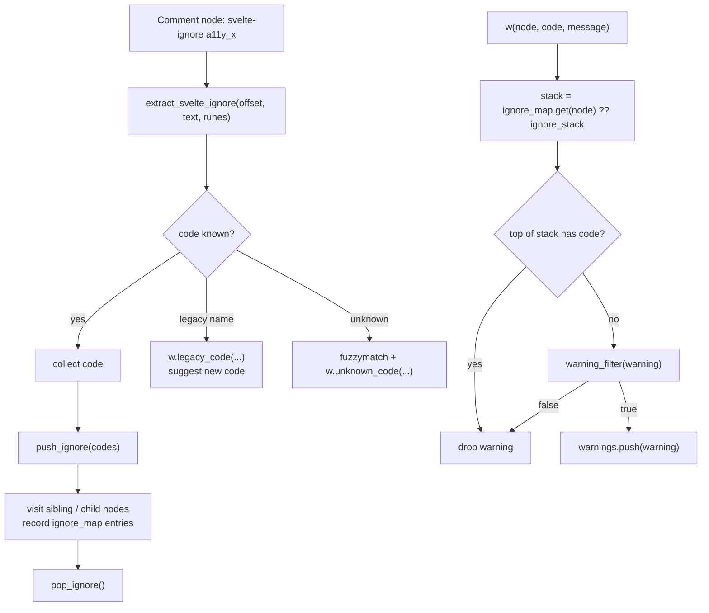
```mermaid
flowchart TD
    A["Comment node: svelte-ignore a11y_x"] --> B["extract_svelte_ignore(offset, text, runes)"]
    B --> C{code known?}
    C -->|yes| D["collect code"]
    C -->|legacy name| E["w.legacy_code(...)<br/>suggest new code"]
    C -->|unknown| F["fuzzymatch + w.unknown_code(...)"]
    D --> G["push_ignore(codes)"]
    G --> H["visit sibling / child nodes<br/>record ignore_map entries"]
    H --> I["pop_ignore()"]

    J["w(node, code, message)"] --> K["stack = ignore_map.get(node) ?? ignore_stack"]
    K --> L{"top of stack has code?"}
    L -->|yes| M["drop warning"]
    L -->|no| N["warning_filter(warning)"]
    N -->|false| M
    N -->|true| O["warnings.push(warning)"]
```

`is_ignored(node, code)` serves a different purpose: it decides whether a **runtime** dev warning should be emitted into the generated code. It is only true in dev mode and only for codes in `IGNORABLE_RUNTIME_WARNINGS`.

> `push_ignore` / `pop_ignore` must always be balanced. An unbalanced push silently suppresses warnings for the rest of the file.

---

## 5. Scope and binding model — `phases/scope.js`

This is the most load-bearing file in the module. Everything after parsing needs to answer: *"what does this identifier refer to, and is it reactive?"*

### 5.1 Data model

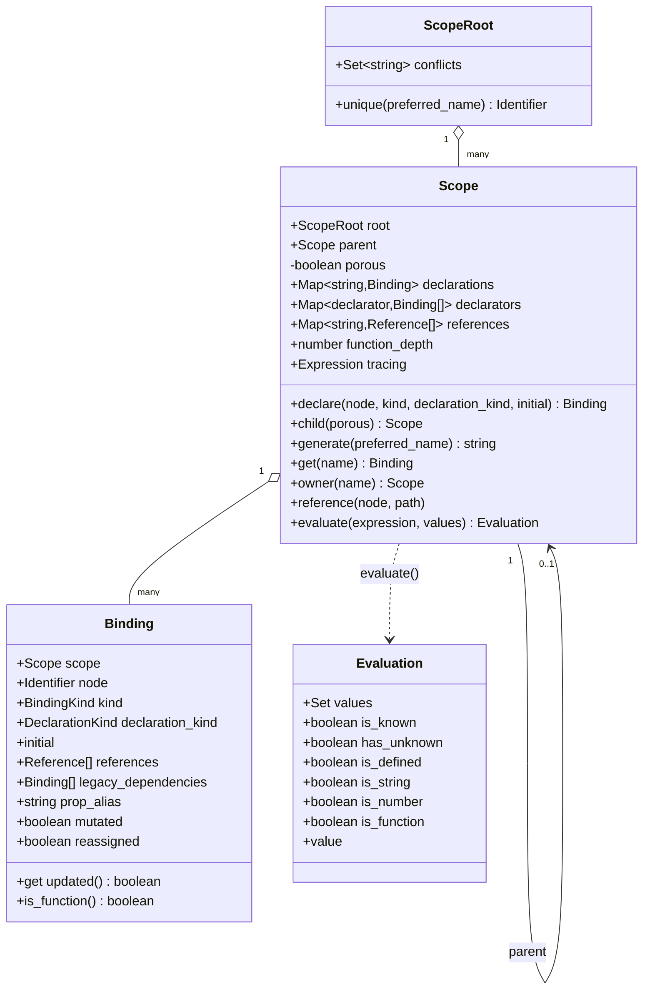
```mermaid
classDiagram
    class ScopeRoot {
        +Set~string~ conflicts
        +unique(preferred_name) Identifier
    }

    class Scope {
        +ScopeRoot root
        +Scope parent
        -boolean porous
        +Map~string,Binding~ declarations
        +Map~declarator,Binding[]~ declarators
        +Map~string,Reference[]~ references
        +number function_depth
        +Expression tracing
        +declare(node, kind, declaration_kind, initial) Binding
        +child(porous) Scope
        +generate(preferred_name) string
        +get(name) Binding
        +owner(name) Scope
        +reference(node, path)
        +evaluate(expression, values) Evaluation
    }

    class Binding {
        +Scope scope
        +Identifier node
        +BindingKind kind
        +DeclarationKind declaration_kind
        +initial
        +Reference[] references
        +Binding[] legacy_dependencies
        +string prop_alias
        +boolean mutated
        +boolean reassigned
        +get updated() boolean
        +is_function() boolean
    }

    class Evaluation {
        +Set values
        +boolean is_known
        +boolean has_unknown
        +boolean is_defined
        +boolean is_string
        +boolean is_number
        +boolean is_function
        +value
    }

    ScopeRoot "1" o-- "many" Scope
    Scope "1" o-- "many" Binding
    Scope "1" --> "0..1" Scope : parent
    Scope ..> Evaluation : evaluate()
```

**Key ideas**

- **Porous scopes.** A block statement is porous: `var` declarations pass through it up to the nearest function scope, and `function_depth` does not increase. `Scope.child(true)` creates one.
- **`function_depth`.** Used to detect a state variable referenced inside its own defining scope, which is usually a bug.
- **`ScopeRoot.conflicts`.** A flat set of every name ever seen anywhere in the file. `unique()` and `Scope.generate()` consult it so generated helper names (`$$index`, `$$props`, …) never collide with user code.
- **`Binding.kind`** distinguishes `normal`, `prop`, `bindable_prop`, `rest_prop`, `state`, `each`, `snippet`, `template`, `static`, `legacy_reactive`, and more. Transform visitors branch on this constantly — see [compiler_transform_client_core_bindings](compiler_transform_client_core_bindings.md).
- **`mutated` vs `reassigned`.** `x = 1` sets `reassigned`; `x.y = 1` sets `mutated`. `updated` is the OR of both. This drives whether a value needs a proxy or a source signal.

### 5.2 `create_scopes(ast, root, allow_reactive_declarations, parent)`

A single zimmerframe walk that builds the whole scope tree, plus a few extras.


```mermaid
flowchart TD
    START["create_scopes(ast, root, allow_reactive, parent)"] --> WALK["single zimmerframe walk"]

    WALK --> JS["JavaScript visitors"]
    WALK --> SV["Svelte visitors"]

    JS --> J1["FunctionDeclaration / FunctionExpression /<br/>ArrowFunctionExpression → child scope + params"]
    JS --> J2["Block / For / ForIn / ForOf / Switch /<br/>CatchClause → porous child scope"]
    JS --> J3["VariableDeclaration / ClassDeclaration /<br/>ImportDeclaration → declare()"]
    JS --> J4["Identifier → queue reference"]
    JS --> J5["Assignment / Update → queue update"]
    JS --> J6["LabeledStatement '$:' → child scope +<br/>possible_implicit_declarations"]
    JS --> J7["AwaitExpression → set has_await<br/>(top-level await ⇒ runes mode)"]

    SV --> S1["Fragment → child(transparent)"]
    SV --> S2["RegularElement / SvelteElement /<br/>SlotElement / SvelteFragment → child scope"]
    SV --> S3["Component / SvelteComponent / SvelteSelf →<br/>per-slot scopes in node.metadata.scopes"]
    SV --> S4["EachBlock → context + index bindings,<br/>build node.metadata"]
    SV --> S5["AwaitBlock → then/catch value + error scopes"]
    SV --> S6["SnippetBlock → declare snippet fn + param scope"]
    SV --> S7["LetDirective → 'template' bindings"]
    SV --> S8["Use/Transition/Animate → SvelteDirective<br/>StyleDirective shorthand → reference"]
    SV --> S9["BindDirective → queue update"]

    WALK --> POST["post-pass"]
    POST --> P1["declare legacy_reactive bindings<br/>for implicit $: targets"]
    POST --> P2["resolve queued references<br/>(forward references now work)"]
    POST --> P3["resolve queued updates →<br/>set mutated / reassigned"]
    POST --> OUT["{ has_await, scope, scopes }"]
```

Two deliberate design choices are worth calling out:

1. **References and updates are queued, not resolved inline.** A function can reference a `const` declared later in the file. By resolving after the walk, hoisting works without a second pass.
2. **`has_await` is piggy-backed onto this walk.** A top-level `await` (not inside any function) automatically opts the file into runes mode. The comment in the source marks this as temporary until legacy mode is removed.

**Named helper visitors exported as core components:**

- **`SvelteFragment`** — the generic "this node introduces a child scope" visitor. It is reused for `SlotElement`, `SvelteElement`, and `RegularElement`, because `let:` directives on any of those declare variables visible only to that element's children.
- **`SvelteDirective`** — used for `use:`, `transition:`, `in:`, `out:`, and `animate:`. It records a reference to the *first segment* of the directive name (`node.name.split('.')[0]`, so `transition:fade.custom` references `fade`) and then visits the parameter expression. `StyleDirective` deliberately does **not** reuse it, because `style:height` shorthand needs to reference a variable named after the CSS property.

### 5.3 `set_scope(node, { next, state })`

A tiny but ubiquitous helper. Every later walk (analysis and both transforms) registers it as the catch-all `_` visitor:

```js
walk(ast, state, {
    _: set_scope,
    Identifier(node, context) { context.state.scope.get(node.name) /* … */ }
});
```

It looks up `state.scopes.get(node)`. If that node opened a scope, it forks the state object with the new scope; otherwise it passes the same state straight through (avoiding a pointless object allocation). This is how `context.state.scope` is always correct inside any visitor without each visitor managing it.

### 5.4 Partial evaluation — `Scope.evaluate()` and `Evaluation`

`evaluate()` does constant folding and rough type inference over an expression. The result reports whether the value is *known exactly*, and whether it is definitely a string / number / function / non-nullish.

It handles literals, identifiers (following non-updated initialisers), binary / logical / unary / conditional expressions, template literals, a whitelist of pure globals (`Math.*`, `Number.*`, `String.*`), global constants (`Math.PI`, …), and runes (`$state`, `$derived`, `$props.id`, `$effect.tracking`, `$derived.by`).

Cyclic evaluation is prevented by a module-level `current_evaluations` map: an expression already being evaluated returns its in-progress `Evaluation` instead of recursing.

> **Ordering rule:** only call `evaluate()` after `create_scopes` has finished. Evaluating during scope construction reads half-built bindings and gives wrong answers.

Consumers use it to skip work — for example, to emit a static class string instead of a reactive effect. See [compiler_transform_client_elements_attributes](compiler_transform_client_elements_attributes.md).

### 5.5 `get_rune(node, scope)`

Answers "is this call expression a rune?" It rebuilds the dotted keypath from a `MemberExpression` chain (`$props.id`, `$state.raw`, `$effect.tracking`), then checks two things:

1. the keypath matches a known rune name;
2. the root identifier is **not** bound in scope.

That second check is what makes `let $state = ...; $state(1)` a plain function call rather than a rune. Used heavily by [compiler_analyze](compiler_analyze.md) and [compiler_transform_server_javascript_runes](compiler_transform_server_javascript_runes.md).

---

## 6. AST builders — `utils/builders.js`

A flat collection of tiny factory functions that produce ESTree nodes. Every code-generating visitor imports this as `import * as b from '#compiler/builders'`, which makes generated-code construction read almost like the code it produces.

Several builders are named `*_builder` internally and re-exported under reserved-word names:

| Export | Internal name | Produces |
|---|---|---|
| `b.await` | `await_builder` | `AwaitExpression` |
| `b.if` | `if_builder` | `IfStatement` |
| `b.for` | `for_builder` | `ForStatement` |
| `b.return` | `return_builder` | `ReturnStatement` |
| `b.let` | `let_builder` | `let x = init` |
| `b.const` | `const_builder` | `const x = init` |
| `b.var` | `var_builder` | `var x = init` |
| `b.function` | `function_builder` | `FunctionExpression` |
| `b.true` / `b.false` / `b.null` / `b.this` / `b.debugger` | shared singletons | literals & keywords |

Other frequently used members: `conditional` (ternary), `object` (object expression), `init` (an `init` property, key auto-escaped via `key()`), `call`, `member`, `id`, `literal`, `arrow`, `thunk`, `block`, `stmt`, `declaration`, `declarator`, `imports`, `import_all`.

**Builders that do more than build:**

- **`call(callee, ...args)`** — trailing falsy arguments are dropped; falsy arguments in the middle become `undefined`. This lets visitors pass optional slots positionally without emitting `f(a, undefined, undefined)`.
- **`thunk(expression)` / `unthunk(arrow)`** — `unthunk` collapses `(a) => f(a)` down to `f`, and `async () => await x()` down to `() => x()` (but not when the body contains a nested `await`). Smaller output, fewer allocations at runtime.
- **`key(name)`** — returns a bare `Identifier` for valid identifiers and a string `Literal` otherwise, so object keys are always syntactically legal.
- **`member_id('a.b.c')`** — builds a nested `MemberExpression` from a dotted string.
- **`get(name, body)` / `set(name, body)` / `method(...)`** — accessor and class-member shorthands.
- **`throw_error(str)`** — `throw new Error("…")`.

Note that `arrow`, `function_builder`, and `function_declaration` set `metadata: null` explicitly; codegen must never read metadata off a synthesised node.

---

## 7. Shared transform helpers — `phases/3-transform/utils.js`

These are used by **both** the client and server transforms, which is why they live above the `client/` and `server/` folders.

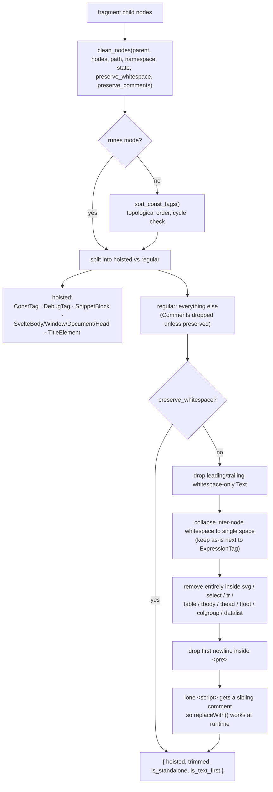
```mermaid
flowchart TD
    NODES["fragment child nodes"] --> CN["clean_nodes(parent, nodes, path, namespace, state, preserve_whitespace, preserve_comments)"]

    CN --> STEP0{"runes mode?"}
    STEP0 -->|no| SORT["sort_const_tags()<br/>topological order, cycle check"]
    STEP0 -->|yes| SPLIT
    SORT --> SPLIT["split into hoisted vs regular"]

    SPLIT --> H["hoisted:<br/>ConstTag · DebugTag · SnippetBlock ·<br/>SvelteBody/Window/Document/Head · TitleElement"]
    SPLIT --> R["regular: everything else<br/>(Comments dropped unless preserved)"]

    R --> TRIM{"preserve_whitespace?"}
    TRIM -->|yes| RES
    TRIM -->|no| W1["drop leading/trailing whitespace-only Text"]
    W1 --> W2["collapse inter-node whitespace to single space<br/>(keep as-is next to ExpressionTag)"]
    W2 --> W3["remove entirely inside svg / select / tr /<br/>table / tbody / thead / tfoot / colgroup / datalist"]
    W3 --> W4["drop first newline inside &lt;pre&gt;"]
    W4 --> W5["lone &lt;script&gt; gets a sibling comment<br/>so replaceWith() works at runtime"]
    W5 --> RES

    RES["{ hoisted, trimmed, is_standalone, is_text_first }"]
```

### 7.1 `clean_nodes(...)`

The single most important helper here. It returns four things:

| Field | Meaning |
|---|---|
| `hoisted` | Nodes lifted out of the fragment and emitted before it (const tags, snippets, `<svelte:head>`, …) |
| `trimmed` | The remaining children, with whitespace normalised |
| `is_standalone` | `true` when the fragment is a single component or non-dynamic render tag — the parent block's anchor can be reused, so no wrapper comments are needed |
| `is_text_first` | `true` when a component / snippet / each body starts with text — an anchor comment is required so the text node does not fuse with its neighbours during hydration |

### 7.2 `sort_const_tags(nodes, state)` — legacy mode only

In Svelte 4, `{@const}` declarations could appear in any order. This helper walks each `{@const}` initialiser (using `set_scope` as the `_` visitor and `is_reference` to filter real references), builds a dependency graph between the bindings, runs `check_graph_for_cycles`, and emits a `const_tag_cycle` error if it finds one. Otherwise it topologically sorts them. In runes mode the source order is required, so this is skipped.

### 7.3 Namespace inference

Three cooperating functions decide whether generated DOM calls should use HTML, SVG, or MathML:

- **`infer_namespace(namespace, parent, nodes)`** — the entry point. `<foreignObject>` always resets to `html`. For a `RegularElement` / `SvelteElement`, the namespace comes from the node's own analysis metadata. For transparent containers (`Fragment`, `Root`, `Component`, `SvelteFragment`, `SnippetBlock`, `SlotElement`, …) it delegates to the heuristic below, then falls back to scanning the direct children.
- **`check_nodes_for_namespace(nodes, namespace)`** — walks into blocks and fragments looking for the first concrete element. Its inner **`RegularElement`** visitor (also registered for `SvelteElement`) is the decision point: if the element is neither SVG nor MathML it sets `html` and **stops the walk immediately**; otherwise, while the state is still `keep`, it adopts the element's namespace. A non-whitespace `Text` node downgrades the result to `maybe_html`.
- **`determine_namespace_for_children(node, namespace)`** — the simple per-element version used when descending into a known element.

Getting this wrong produces elements created with the wrong `createElementNS`, which silently break rendering — hence the conservative "any plain element ⇒ html, stop looking" rule.

### 7.4 `transform_inspect_rune(node, context)` and `is_hoisted_function(node)`

`transform_inspect_rune` rewrites `$inspect(a, b)` and `$inspect(a).with(fn)` into `$.inspect(...)` calls. In production (`dev === false`) it returns `b.empty`, so the whole call disappears. On the client the arguments are wrapped in a thunk (`() => [a, b]`) so they can be re-read reactively; on the server they are passed as a plain array.

`is_hoisted_function(node)` is a one-line check for `node.metadata?.hoisted === true` on the three function node types. Analysis marks event handlers and similar callbacks as hoistable when they do not close over per-instance state; the client transform then lifts them to module scope so they are allocated once instead of per component instance.

---

## 8. Diagnostics

### 8.1 `CompileDiagnostic` and `get_code_frame`

`CompileDiagnostic` is the shared base for both `InternalCompileError` (thrown by `e.*`) and `InternalCompileWarning` (pushed by `w.*`).

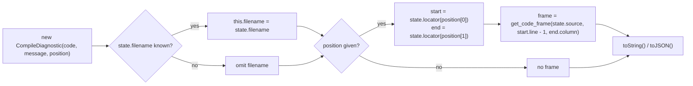
```mermaid
flowchart LR
    A["new CompileDiagnostic(code, message, position)"] --> B{"state.filename known?"}
    B -->|yes| C["this.filename = state.filename"]
    B -->|no| D["omit filename"]
    C --> E
    D --> E{"position given?"}
    E -->|yes| F["start = state.locator(position[0])<br/>end = state.locator(position[1])"]
    F --> G["frame = get_code_frame(state.source, start.line - 1, end.column)"]
    E -->|no| H["no frame"]
    G --> I["toString() / toJSON()"]
    H --> I
```

`get_code_frame(source, line, column)` prints the error line plus two lines of context before and three after, with right-aligned line numbers and a `^` caret under the offending column. Tabs are expanded to two spaces first, so the caret lines up in any terminal.

Because the diagnostic reads `state.filename`, `state.locator`, and `state.source` directly, it can be constructed from anywhere in the compiler with just a code, a message, and a character offset. That is why `state.set_source()` must run before any diagnostic is created — otherwise the locator is the empty-string default and no frame is produced.

### 8.2 `extract_svelte_ignore` and `migrate_svelte_ignore`

Both parse `svelte-ignore …` comments, but for different purposes.

| | `extract_svelte_ignore(offset, text, runes)` | `migrate_svelte_ignore(text)` |
|---|---|---|
| Used by | parse / analyze, to feed `push_ignore` | [compiler_migrate](compiler_migrate.md) |
| Runes mode | codes must be **comma-separated**; the first non-comma-terminated token ends the list, everything after is prose | n/a |
| Legacy mode | lax — every word-like token is treated as a code, and both the old and the new spelling are collected | n/a |
| Unknown code | `w.legacy_code(...)` if a known replacement exists, otherwise `fuzzymatch` against all codes and `w.unknown_code(...)` with a suggestion | rewrites in place |
| Output | `string[]` of codes | the rewritten comment text |

Both share a `replacements` table mapping Svelte 4 kebab-case codes to Svelte 5 snake_case ones, for example:

```
non-top-level-reactive-declaration → reactive_declaration_invalid_placement
empty-block                        → block_empty
a11y-structure                     → a11y_figcaption_parent
unused-export-let                  → export_let_unused
```

Anything not in the table falls back to a plain `-` → `_` substitution. The valid code list is `warnings.codes` concatenated with `IGNORABLE_RUNTIME_WARNINGS`, so runtime-only warning codes can be ignored too. `fuzzymatch` comes from [compiler_parse_utils](compiler_parse_utils.md).

---

## 9. End-to-end data flow

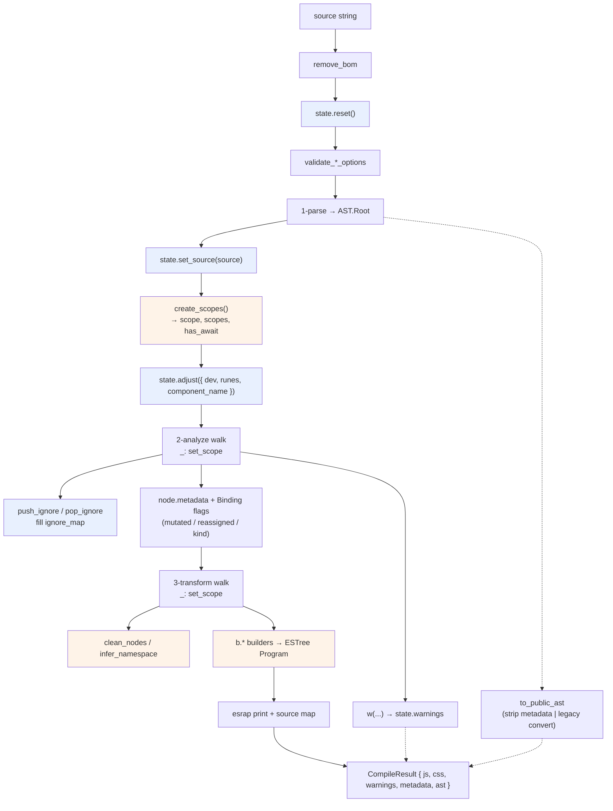
```mermaid
flowchart TB
    SRC["source string"]

    SRC --> BOM["remove_bom"]
    BOM --> RESET["state.reset()"]
    RESET --> VAL["validate_*_options"]
    VAL --> PARSE["1-parse → AST.Root"]

    PARSE --> SETSRC["state.set_source(source)"]
    SETSRC --> SCOPES["create_scopes()<br/>→ scope, scopes, has_await"]
    SCOPES --> ADJUST["state.adjust({ dev, runes, component_name })"]

    ADJUST --> ANALYZE["2-analyze walk<br/>_: set_scope"]
    ANALYZE --> IG["push_ignore / pop_ignore<br/>fill ignore_map"]
    ANALYZE --> META["node.metadata + Binding flags<br/>(mutated / reassigned / kind)"]
    ANALYZE --> WARNS["w(...) → state.warnings"]

    META --> TRANSFORM["3-transform walk<br/>_: set_scope"]
    TRANSFORM --> CLEAN["clean_nodes / infer_namespace"]
    TRANSFORM --> BUILDERS["b.* builders → ESTree Program"]
    BUILDERS --> PRINT["esrap print + source map"]
    PRINT --> RESULT["CompileResult { js, css, warnings, metadata, ast }"]

    WARNS -.-> RESULT
    PARSE -.-> PUBAST["to_public_ast<br/>(strip metadata | legacy convert)"]
    PUBAST -.-> RESULT

    style RESET fill:#e8f0fe
    style SETSRC fill:#e8f0fe
    style ADJUST fill:#e8f0fe
    style SCOPES fill:#fef3e8
    style CLEAN fill:#fef3e8
    style BUILDERS fill:#fef3e8
    style IG fill:#e8f0fe
```

Blue = `state.js`, orange = the rest of `compiler_core`.

---

## 10. Who depends on what

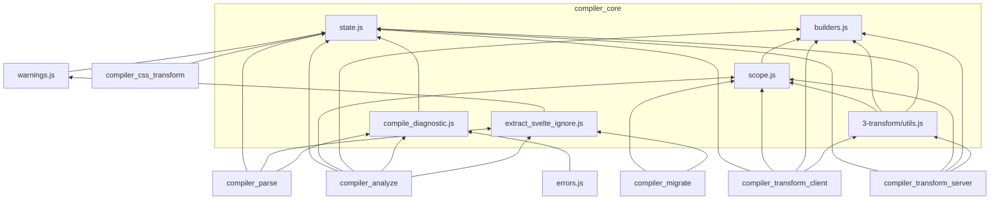
```mermaid
graph BT
    subgraph core["compiler_core"]
        S["state.js"]
        SC["scope.js"]
        B["builders.js"]
        TU["3-transform/utils.js"]
        D["compile_diagnostic.js"]
        EI["extract_svelte_ignore.js"]
    end

    P["compiler_parse"] --> S
    P --> EI
    P --> D

    A["compiler_analyze"] --> S
    A --> SC
    A --> B
    A --> D
    A --> EI

    TC["compiler_transform_client"] --> S
    TC --> SC
    TC --> B
    TC --> TU

    TS["compiler_transform_server"] --> S
    TS --> SC
    TS --> B
    TS --> TU

    CSS["compiler_css_transform"] --> S

    M["compiler_migrate"] --> SC
    M --> EI

    W["warnings.js"] --> S
    E["errors.js"] --> D
    D --> S
    EI --> W
    SC --> B
    TU --> SC
    TU --> B
    TU --> S

    click P "compiler_parse.md"
    click A "compiler_analyze.md"
    click TC "compiler_transform_client.md"
    click TS "compiler_transform_server.md"
    click CSS "compiler_css_transform.md"
    click M "compiler_migrate.md"
```

The arrows show that `compiler_core` is a **leaf-ward** dependency: it depends on very little (zimmerframe, estree types, `locate-character`, `is-reference`) and almost everything depends on it. That is deliberate — it keeps the phases decoupled from each other while still sharing one identifier model and one code-generation vocabulary.

---

## 11. Notes for maintainers

**Global state is a trade-off.** `state.js` uses module-level mutable variables. It makes the code far less verbose, but it means:

- compilations cannot run concurrently in the same JS realm;
- `reset()` must be the first thing any entry point calls;
- `set_source()` must run before any diagnostic is constructed, or code frames will be missing;
- `adjust()` must run after the runes-mode decision, or `dev`/`runes`-gated behaviour will be wrong.

**Adding a new binding kind.** Add it to `BindingKind`, declare it in the right `create_scopes` visitor, then handle it in the analysis validators and in both transforms. Missing one of the transforms is the usual bug — the client path is exercised far more often in tests than the server path.

**Adding a builder.** Keep builders dumb. `call` and `unthunk` already carry optimisation logic; anything more clever belongs in the visitor that calls it, not in `builders.js`, so that the output stays predictable.

**Adding a warning code.** Register it in `warnings.js`, and if it should be suppressible at runtime add it to `IGNORABLE_RUNTIME_WARNINGS` so `extract_svelte_ignore` accepts it and `is_ignored` can gate the emitted code. If it replaces a Svelte 4 code, add the mapping to the `replacements` table so both `extract_svelte_ignore` and `migrate_svelte_ignore` pick it up.

**Whitespace changes are high-risk.** `clean_nodes` decides what the browser will see. A change there can break hydration matching between the server output ([compiler_transform_server](compiler_transform_server.md)) and the client template ([compiler_transform_client_template](compiler_transform_client_template.md)), because both read the same trimmed node list.
