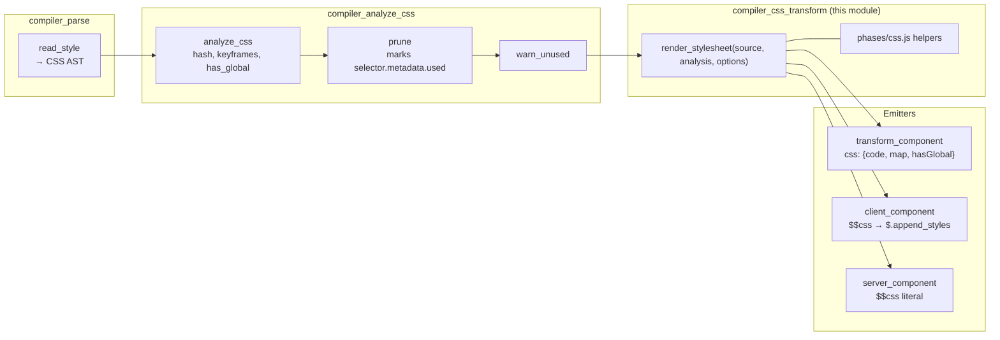
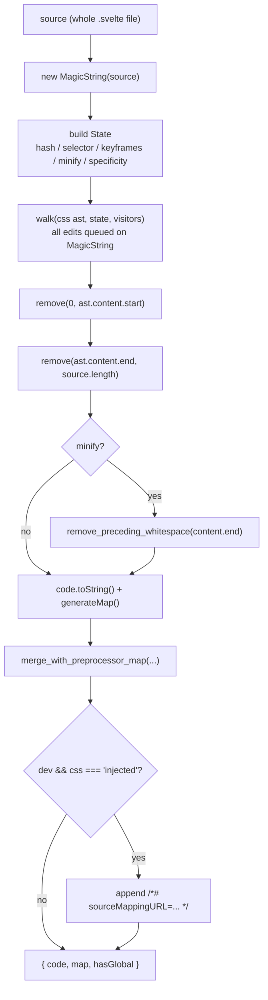
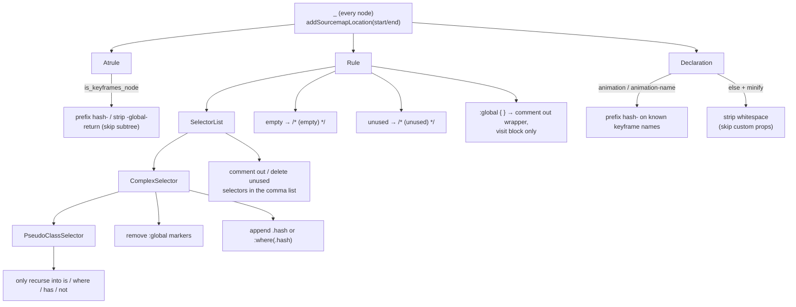
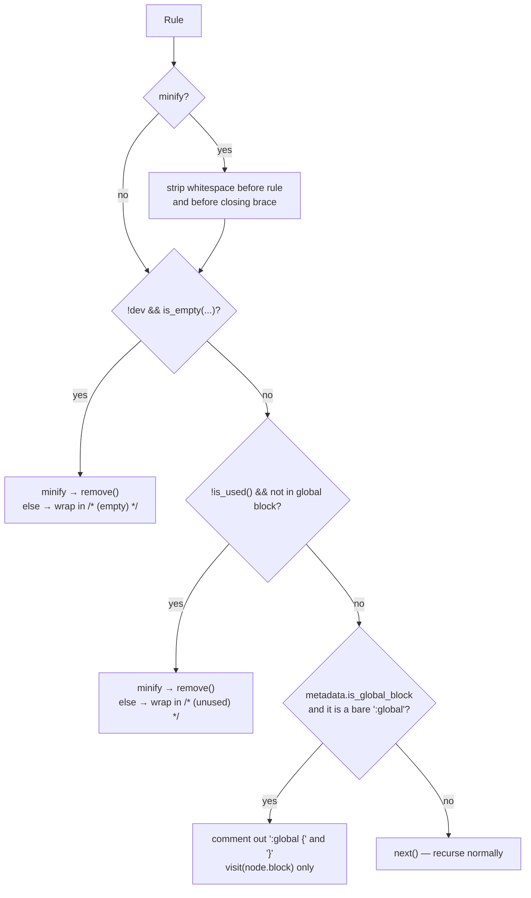
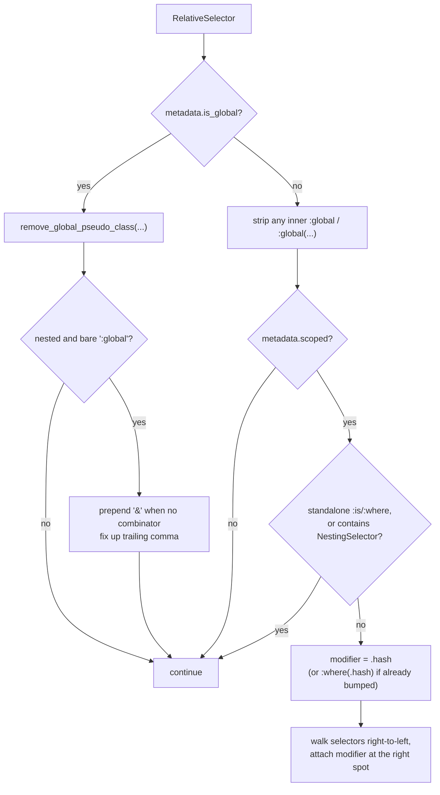
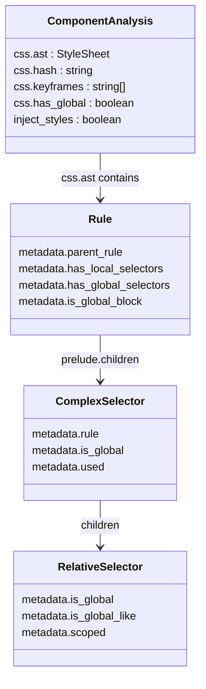
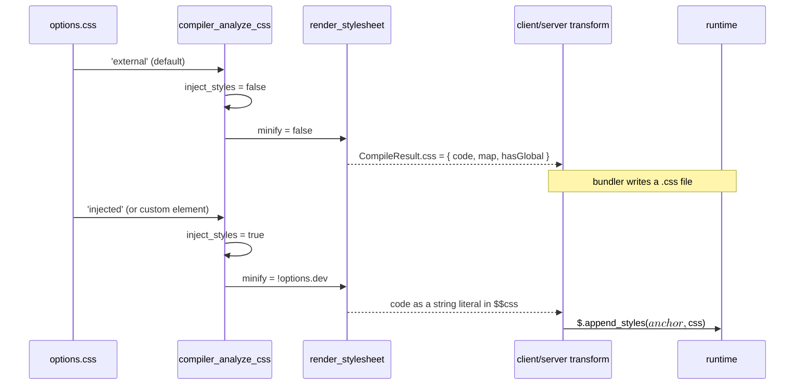

# compiler_css_transform

## Introduction

`compiler_css_transform` is the last step that touches CSS in the Svelte compiler. By the time it runs, the `<style>` block has already been parsed into a CSS AST ([compiler_parse_readers_style](compiler_parse_readers_style.md)) and every selector has already been marked as used / unused / global by the analysis phase ([compiler_analyze_css](compiler_analyze_css.md)).

This module does not decide anything about correctness. It only **rewrites the original CSS text** so that:

- every scoped selector gets the component hash class (`.svelte-xyz123`) attached,
- `:global(...)` / `:global` markers are deleted, because they must not reach the browser,
- local `@keyframes` names (and the `animation` declarations that use them) get the hash prefix,
- unused rules and unused selectors are commented out (or deleted when minifying),
- whitespace is stripped when the CSS will be injected into the JS bundle.

The key design choice: it uses **MagicString** on the *original source string* instead of printing a new AST. That means the output stays byte-for-byte close to what the author wrote, and source maps stay accurate almost for free.

Core files:

| File | Role |
| --- | --- |
| `packages/svelte/src/compiler/phases/3-transform/css/index.js` | `render_stylesheet` + the zimmerframe visitors + local helpers (`is_in_global_block`, `remove_global_pseudo_class`, `escape_comment_close`, `is_empty`, `is_used`, `remove_preceding_whitespace`) |
| `packages/svelte/src/compiler/phases/css.js` | Small shared CSS helpers used by both analysis and transform: `is_keyframes_node`, `remove_css_prefix`, `regex_css_name_boundary` |

---

## Where the module sits



Three call sites, one function:

| Caller | Condition | What happens with the result |
| --- | --- | --- |
| `phases/3-transform/index.js` → `transform_component` | `analysis.css.ast && !analysis.inject_styles` | Returned to the user as `CompileResult.css` (a separate `.css` file for the bundler) |
| `client/transform-client.js` ([compiler_transform_client](compiler_transform_client.md)) | `analysis.inject_styles` | `.code` is inlined as a string literal in `$$css` and injected at runtime via `$.append_styles` |
| `server/transform-server.js` ([compiler_transform_server](compiler_transform_server.md)) | `analysis.inject_styles` | Same, but emitted into the SSR payload `<head>` |

`analysis.inject_styles` is true when `options.css === 'injected'` or the component is a custom element. So the same code path serves both "emit a css file" and "inline the css".

---

## Public entry point: `render_stylesheet`

```js
render_stylesheet(source, analysis, options) → { code, map, hasGlobal }
```

Steps, in order:



Two important details:

- **It receives the whole `.svelte` source, not just the style block.** Everything before `ast.content.start` and after `ast.content.end` is removed at the end. Keeping the full string means every AST offset lines up directly with a MagicString index — no offset arithmetic anywhere in the visitors.
- **`merge_with_preprocessor_map`** (from `compiler/utils/mapped_code.js`) folds in the source map produced by a preprocessor, so a `<style lang="scss">` block still maps back to the author's SCSS. See [compiler_preprocess](compiler_preprocess.md).

### The `State` object

| Field | Meaning |
| --- | --- |
| `code` | The `MagicString` every visitor mutates |
| `hash` | Component CSS hash from `analysis.css.hash` (computed in analysis via the `cssHash` option — see [compiler_options_and_warnings](compiler_options_and_warnings.md)) |
| `selector` | `.${hash}` — the string appended to scoped selectors |
| `keyframes` | Names of locally declared `@keyframes` collected during analysis |
| `minify` | `analysis.inject_styles && !options.dev` — strip whitespace and *delete* dead rules instead of commenting them |
| `specificity.bumped` | Whether the current selector chain already received one real class bump (see below) |

`specificity` is a **shared mutable object** passed down the walk, and `SelectorList` replaces it with a fresh object when it belongs to a `Rule`. That is how "bump once per rule, then use `:where()`" is tracked across nested selectors.

---

## Visitor map



### `_` — sourcemap breadcrumbs

Adds a sourcemap location at the start and end of every CSS node. Without this, MagicString would only emit mappings at edit boundaries, and devtools would point at the wrong line for untouched rules.

### `Atrule` — keyframes naming

Only `@keyframes` is special (matched by `is_keyframes_node`, which strips vendor prefixes first via `remove_css_prefix`, so `@-webkit-keyframes` counts too).

| Input | Output | Why |
| --- | --- | --- |
| `@keyframes spin` | `@keyframes svelte-abc123-spin` | Keyframe names are global in CSS, so they must be namespaced |
| `@keyframes -global-spin` | `@keyframes spin` | Author opted out; the `-global-` marker is deleted |
| `@keyframes spin` inside `:global {}` | unchanged | Already in a global block |

It then `return`s **without calling `next()`** — nothing inside a keyframes body is scoped, pruned, or minified. Percentage selectors like `0% { }` are not real selectors and must be left alone.

### `Declaration` — animation names and whitespace

Two jobs:

1. **`animation` / `animation-name` shorthand rewriting.** The value is scanned character by character. Each word is collected until a boundary (`regex_css_name_boundary` = `[\s,;}]`), and if that word matches a name in `state.keyframes`, the hash prefix is prepended right before it. This handles all of `animation: spin 1s`, `animation-name: spin, fade`, and shorthand where the name is not in a fixed position.
2. **Minification.** Removes whitespace before the declaration and after the colon — except for custom properties (`--foo`), because Chromium < 99 treats `--foo: ;` and `--foo:;` as different values.

### `Rule` — dead code and global blocks

Decision order matters:



- **Empty rules survive in dev.** `if (!dev && is_empty(...))` — keeping them makes devtools inspection easier.
- **Commenting instead of deleting** (non-minify mode) is deliberate: the output stays the same length-ish and readable, so a developer can see *why* a rule vanished. This is why `escape_comment_close` exists.
- **`:global { ... }` unwrapping** only happens for the simple shape (one selector, one complex selector, one simple selector). Anything more complex (`:global, .x {}`) falls through to `next()` and is handled selector-by-selector.

### `SelectorList` — pruning the comma list and specificity

Two responsibilities in one visitor.

**1. Pruning.** Walks the comma-separated children and toggles a `pruning` flag whenever `selector.metadata.used` flips. It tracks `prune_start`, `last`, and `has_previous_used` so it can decide whether the comma belongs to the removed run or the kept run. Getting this wrong produces `.a, { }` or `.a .b { }`, so the comma bookkeeping is the fiddly heart of this visitor.

It skips pruning entirely when the list is inside a global block, or inside a `ComplexSelector` that is itself already unused — otherwise you would nest a `/* (unused) */` comment inside another one.

**2. Specificity reset.** Adding `.svelte-hash` to a selector raises its specificity by `+0-1-0`. Doing that on *every* part of a nested selector chain would break the cascade order the author wrote. So:

- For a selector list that belongs to a `Rule`, a fresh `{ bumped: false }` is created — unless a parent rule already has local selectors (`metadata.has_local_selectors`), in which case it starts as `{ bumped: true }`.
- For a list inside `:is(...)` / `:where(...)`, the existing state is kept.

### `ComplexSelector` — the actual scoping

This is where the hash class gets written. For each relative selector in the chain:



Rules for *where* the modifier goes, scanning the compound selector from right to left:

| Selector kind | Handling |
| --- | --- |
| `PseudoElementSelector` / `PseudoClassSelector` | Skip it (you cannot write `a::before.hash`); if it is the first item, prepend the modifier before it. `:root` and `:host` are left completely alone. |
| `TypeSelector` `*` | The `*` is **replaced** by the modifier — `* {}` becomes `.svelte-hash {}` |
| Anything else (type, class, id, attribute) | Modifier appended right after it, then `break` |

The `:where()` trick: only the **first** scoped selector in a chain gets a real `.hash` (specificity `+0-1-0`); every one after that gets `:where(.hash)`, which matches the same elements at zero specificity cost. `context.state.specificity.bumped` is saved before `next()` and restored after, so sibling branches do not inherit each other's bump.

### `PseudoClassSelector` — controlled recursion

Only recurses into `:is`, `:where`, `:has`, and `:not`. These are the functional pseudo-classes whose arguments are real selectors that need scoping. Anything else (`:nth-child(2n+1)`, `:lang(en)`) has non-selector arguments and is skipped, so the walker never tries to scope `2n+1`.

---

## Helper functions

| Helper | What it does |
| --- | --- |
| `is_in_global_block(path)` | `true` if any ancestor `Rule` has `metadata.is_global_block`. Used as the "leave this subtree alone" guard by `Atrule`, `Rule`, and `SelectorList`. Note: the same helper exists in `css-analyze.js` — the two copies are intentionally independent, one walking the analysis path and one the transform path. |
| `remove_global_pseudo_class(selector, combinator, state)` | Deletes `:global` markers. For the bare form it also eats preceding whitespace when the combinator is a descendant space, so `div :global.x` becomes `div.x`. It uses `update(...)` rather than `remove(...)` because an unused-rule closing comment may already be queued at that position. For `:global(...)` it removes the `:global(` prefix and the trailing `)`. |
| `remove_preceding_whitespace(end, state)` | Walks backwards over whitespace and removes it. The whole minifier is built from this one primitive. |
| `is_empty(rule, is_in_global_block)` | Recursive: a rule is empty if it holds no declarations, no non-empty used child rules, and no non-empty at-rules. Global blocks only check `block.children.length`. |
| `is_used(rule)` | `true` if any selector in the prelude was marked `used` by `prune` in [compiler_analyze_css](compiler_analyze_css.md). |
| `escape_comment_close(node, code)` | Scans the rule text and backslash-escapes any `*/` inside an existing CSS comment. Needed because the module wraps dead rules in `/* ... */`, and a nested `*/` would close the comment early and leak broken CSS. Handles `\` escapes so `\/*` is not mistaken for a comment start. |

### From `phases/css.js`

These three are shared with the analysis phase, which is why they live one directory up:

```js
remove_css_prefix(name)      // "-webkit-keyframes" → "keyframes"
is_keyframes_node(node)      // Atrule → boolean, prefix-insensitive
regex_css_name_boundary      // /^[\s,;}]$/ — end of an identifier in a value
```

---

## Data and metadata contract

The transform is a pure consumer of metadata. It never computes whether something is used or global — it only reads flags.



| Metadata read | Written by | Used for |
| --- | --- | --- |
| `Rule.metadata.is_global_block` | `analyze_css` | Skip scoping / pruning inside `:global {}` |
| `Rule.metadata.has_local_selectors`, `parent_rule` | `analyze_css` | Decide whether the specificity bump was already spent by an ancestor |
| `ComplexSelector.metadata.used` | `prune` | Comment out / delete dead selectors and rules |
| `RelativeSelector.metadata.is_global`, `scoped` | `analyze_css` / `prune` | Strip `:global`, attach the hash class |
| `css.keyframes`, `css.hash` | `analyze_css` (hash via `options.cssHash`) | Rename keyframes, build `state.selector` |
| `css.has_global` | `analyze_css` | Surfaced as `CompileResult.css.hasGlobal` for bundler plugins |

Type definitions for these nodes live in [compiler_ast_types](compiler_ast_types.md) (`types/css.d.ts`) and are re-published via [css_ast](css_ast.md).

---

## Two output modes



Consequences worth remembering:

- **Minification only happens for injected CSS in non-dev builds.** External CSS is never minified here — that is the bundler's job.
- In injected + dev mode, an inline `sourceMappingURL` data-URL comment is appended so devtools can map injected styles back to the `.svelte` file.
- The runtime side of injection is `append_styles` / `cleanup_styles`, documented in [client_render_and_templates](client_render_and_templates.md) and [client_dev_tooling](client_dev_tooling.md); the SSR side is in [server_runtime](server_runtime.md).
- The hash string itself also reaches elements as a `class` value. That happens in the element visitors, not here — see [compiler_transform_client_elements](compiler_transform_client_elements.md) and [compiler_transform_server_elements](compiler_transform_server_elements.md).

---

## Worked example

Input:

```svelte
<style>
  .a { color: red; }
  .unused { color: blue; }
  .a .b { color: green; }
  :global(.c) .a { color: teal; }
  @keyframes spin { from { transform: rotate(0) } }
  .a { animation: spin 1s; }
</style>
```

Output (external mode, `.a` and `.b` used, `.unused` not):

```css
  .a.svelte-abc123 { color: red; }
  /* (unused) .unused { color: blue; }*/
  .a.svelte-abc123 .b:where(.svelte-abc123) { color: green; }
  .c .a.svelte-abc123 { color: teal; }
  @keyframes svelte-abc123-spin { from { transform: rotate(0) } }
  .a.svelte-abc123 { animation: svelte-abc123-spin 1s; }
```

Notice: the first scoped part gets a plain `.hash`, the second gets `:where(.hash)`, `:global(.c)` loses its wrapper and gets no hash, the keyframe name and its use in `animation` are renamed together, and the unused rule is preserved as a comment.

---

## Gotchas for maintainers

1. **Never re-order the edits.** MagicString rejects overlapping edits on the same range. Several visitors deliberately use `update()` instead of `remove()` (see `remove_global_pseudo_class`) precisely because another visitor may already own that range for a closing comment.
2. **`Atrule` for keyframes returns without `next()`.** If you add new work in `Declaration` or `Rule`, it will silently not apply inside keyframes bodies. That is usually correct — check before "fixing" it.
3. **`specificity` is shared mutable state.** `ComplexSelector` saves `bumped` before `next()` and restores it after. Forget that and nested selectors will lose or double their specificity bump.
4. **Dev mode changes the output.** Empty rules are kept, dead rules are commented rather than removed, and a sourcemap comment is appended. Compiler output tests must therefore run per-mode.
5. **Comment escaping is not optional.** Any new "comment this out" branch must call `escape_comment_close`, or a rule containing `/* ... */` will produce invalid CSS.
6. **Offsets are absolute into the whole `.svelte` file**, not into the style block. Any new index arithmetic should start from a node's `start`/`end`, never from 0.

---

## Related modules

- [compiler_analyze_css](compiler_analyze_css.md) — produces every flag this module reads (`analyze_css`, `prune`, `warn_unused`)
- [compiler_parse_readers_style](compiler_parse_readers_style.md) — builds the CSS AST from the `<style>` block
- [compiler_transform_client](compiler_transform_client.md) / [compiler_transform_server](compiler_transform_server.md) — the two emitters that inline the rendered CSS
- [compiler_core](compiler_core.md) — `compile` / `transform_component` orchestration and shared `state.js` (`dev` flag)
- [compiler_options_and_warnings](compiler_options_and_warnings.md) — `css`, `cssHash`, `cssOutputFilename`, `sourcemap` options and the `css_unused_selector` warning
- [compiler_preprocess](compiler_preprocess.md) — preprocessor source maps merged into the CSS map
- [compiler_ast_types](compiler_ast_types.md) / [css_ast](css_ast.md) — CSS node and metadata type definitions
- [client_render_and_templates](client_render_and_templates.md) — `append_styles`, the runtime consumer of injected CSS
