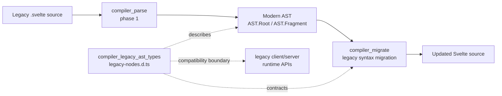
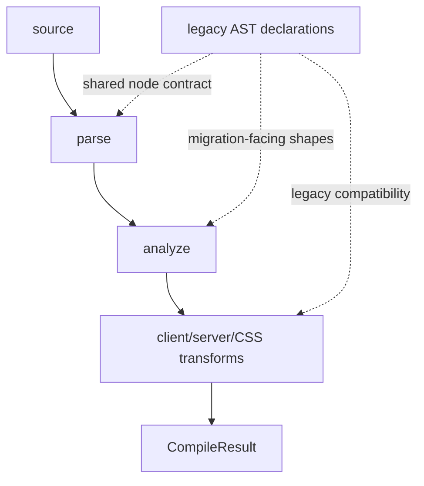
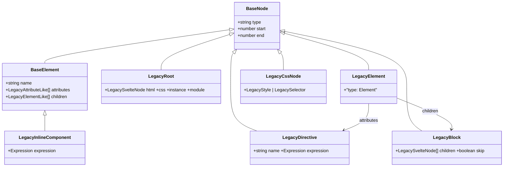
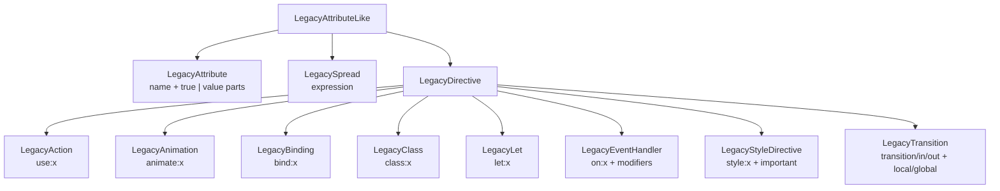
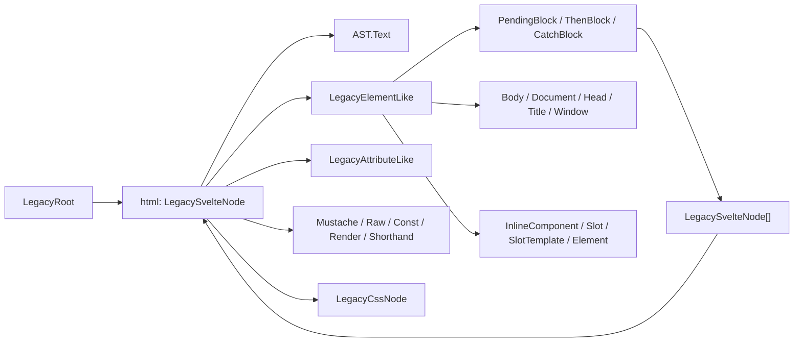
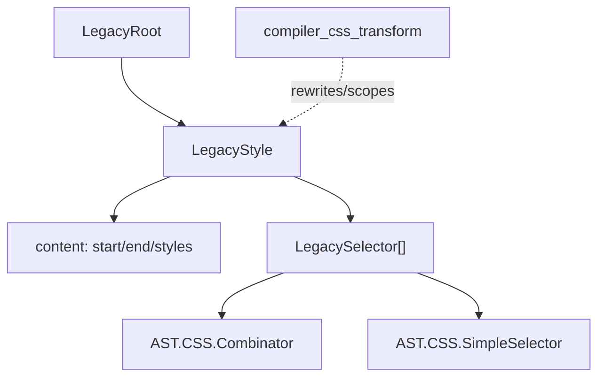
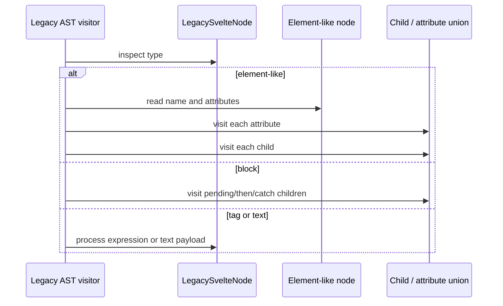
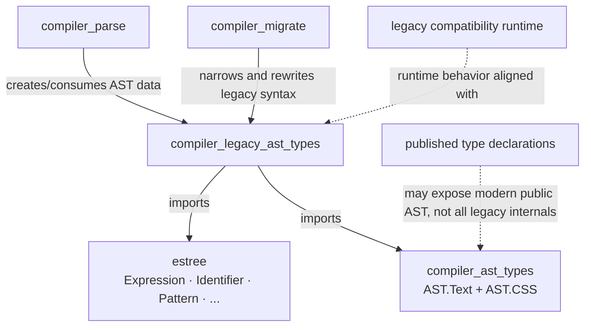

# compiler_legacy_ast_types

## Introduction

`compiler_legacy_ast_types` defines the TypeScript contracts for Svelte's legacy template and stylesheet AST nodes. It is a declaration-only compatibility layer in `packages/svelte/src/compiler/types/legacy-nodes.d.ts`: it describes the tree shape historically produced for Svelte 3/4-style syntax and consumed by migration and legacy-compatible tooling.

The module does not parse, analyze, transform, or render anything itself. Its value is the shared schema that lets code distinguish nodes by their literal `type`, preserve source offsets, and traverse legacy elements, directives, blocks, tags, and CSS nodes safely.

For the modern compiler AST, see [compiler_ast_types](compiler_ast_types.md). For the source rewriter that consumes legacy syntax and converts it to newer Svelte syntax, see [compiler_migrate](compiler_migrate.md). The complete phase ordering is documented in [compilation_pipeline](compilation_pipeline.md).

## Position in the system

Legacy nodes sit at the compatibility boundary between the compiler's modern internal AST and Svelte's migration/legacy surfaces. The declaration file imports `AST` from `#compiler` for shared text, expression, and CSS node types, and imports ESTree types for JavaScript expressions.



The module is a type vocabulary, not a pipeline stage. The actual compiler pipeline is:



## Core design

### Source-location base

`BaseNode` is the common structural contract:

```ts
interface BaseNode {
    type: string;
    start: number;
    end: number;
}
```

`start` and `end` are character offsets into the original component source. They support diagnostics, source-aware migration edits, and AST tooling. `type` is the discriminant used for visitor dispatch and narrowing. Most concrete interfaces replace its general `string` type with a literal such as `'Attribute'`, `'IfBlock'`, or `'RawMustacheTag'`.

`BaseElement` extends this contract with:

```ts
name: string;
attributes: Array<LegacyAttributeLike>;
children: Array<LegacyElementLike>;
```

This is the shared container for element-like nodes. Its `children` type is intentionally narrower than `LegacySvelteNode`: legacy element children are represented as element-like nodes, tags, comments, blocks, and text, while attributes/directives belong in `attributes`.

### Type relationships



The class diagram is conceptual: TypeScript interfaces and unions are structural, and the source file does not declare a runtime `LegacyBlock` or `LegacyDirective` class.

## Root and document structure

### `LegacyRoot`

`LegacyRoot` is the component-level node:

| Field | Type | Meaning |
|---|---|---|
| `type`, `start`, `end` | `BaseNode` fields | Root discriminator and source span. |
| `html` | `LegacySvelteNode` | Root HTML/template subtree. |
| `css` | `any` optional | Legacy stylesheet representation when present. |
| `instance` | `any` optional | Instance script representation. |
| `module` | `any` optional | Module script representation. |

The script and CSS fields are intentionally permissive because legacy AST consumers may receive parser-specific structures. The more precise modern equivalents are documented in [compiler_ast_types](compiler_ast_types.md).

### Document-oriented elements

The element family includes `LegacyBody`, `LegacyDocument`, `LegacyHead`, `LegacyTitle`, and `LegacyWindow`. `LegacyBody` and `LegacyTitle` carry fixed names (`svelte:body` and `title`), while the other special elements are identified primarily by their `type`. `LegacySlot` and `LegacySlotTemplate` represent legacy slot syntax. `LegacyInlineComponent` extends `BaseElement` and may carry `expression` when the source uses `<svelte:component>`.

`LegacyElement` is a notable minimal declaration: it contains only `type: 'Element'` in this file. Consumers should not assume that this interface alone exposes the complete element payload; code working with parsed objects may rely on the broader parser representation or modern AST types.

## Attributes and directives

`LegacyAttributeLike` is the attribute union:

```ts
type LegacyAttributeLike = LegacyAttribute | LegacySpread | LegacyDirective;
```



### Ordinary attributes

`LegacyAttribute` stores `name` and either `true` for a valueless attribute or an ordered array of text, mustache tags, and `LegacyAttributeShorthand` nodes. The shorthand node preserves an expression used in shorthand attribute syntax.

`LegacySpread` represents `{...props}` and stores its ESTree `Expression` directly.

### Directive payloads

| Interface | Syntax model | Payload details |
|---|---|---|
| `LegacyAction` | `use:x={y}` | `name`, nullable expression. |
| `LegacyAnimation` | `animate:x={y}` | `name`, nullable expression. |
| `LegacyBinding` | `bind:x={y}` | `name`, expression narrowed to identifier, member, or sequence expression. |
| `LegacyClass` | `class:x` / `class:x={y}` | Fixed `name: 'class'`; expression is always present. |
| `LegacyEventHandler` | `on:x={y}` | Nullable expression and string modifier list. |
| `LegacyLet` | `let:x={y}` | Nullable identifier, array pattern, or object pattern expression. |
| `LegacyStyleDirective` | `style:x={y}` | Text/expression-tag value parts and optional `important` modifier. |
| `LegacyTransition` | `transition:x`, `in:x`, `out:x` | Nullable expression, `local`/`global` modifiers, and `intro`/`outro` flags. |

The transition booleans preserve source semantics after the three syntaxes are normalized into one node. In particular, `intro` and `outro` can both be true for `transition:`.

## Template tags and control-flow nodes

`LegacyElementLike` is the main child union. It includes ordinary and special elements, comments, mustache tags, options, and pending/then/catch blocks. Additional node types are included in the broader `LegacySvelteNode` union.



### Expression and mustache tags

`LegacyMustacheTag` stores an ESTree expression for `{value}`; `LegacyRawMustacheTag` does the same for raw HTML output. `LegacyConstTag` stores an ESTree `AssignmentExpression`, while `LegacyAttributeShorthand` represents an expression embedded in an attribute value.

`SnippetBlock` and `RenderTag` are included even though they are newer constructs appearing in a legacy-node compatibility file. A snippet stores an identifier, an optional binding `Pattern`, and children; a render tag stores a snippet identifier and an optional argument expression.

### Async blocks

`LegacyPendingBlock`, `LegacyThenBlock`, and `LegacyCatchBlock` each store child nodes plus a `skip` flag. Together they model the branches of an await block. The branch types are separate so legacy visitors can dispatch directly without reconstructing branch intent.

### Comments and options

`LegacyComment` stores the comment body in `data` and parsed `svelte-ignore` codes in `ignores`. For example, `<!-- svelte-ignore a b c -->` becomes `['a', 'b', 'c']`. `LegacyOptions` represents `<svelte:options>` and stores its name plus an untyped attribute array.

## CSS nodes

The stylesheet union is:

```ts
type LegacyCssNode = LegacyStyle | LegacySelector;
```

`LegacyStyle` contains source offsets, an untyped attribute list, a content range and raw stylesheet text, and child nodes. `LegacySelector` contains children drawn from the modern CSS AST's `Combinator` and `SimpleSelector` types. This is a deliberate bridge: legacy stylesheet containers reuse current selector primitives rather than defining duplicate selector variants.



## Type unions and traversal rules

`LegacySvelteNode` is the broad union used for recursive children:

```ts
type LegacySvelteNode =
    | LegacyConstTag
    | LegacyElementLike
    | LegacyAttributeLike
    | LegacyAttributeShorthand
    | LegacyCssNode
    | AST.Text;
```

This union has two practical consequences:

1. A visitor must narrow by `node.type` before reading node-specific fields.
2. An exhaustive visitor must account for both legacy declarations and imported modern `AST.Text` / CSS primitives.

The recursive data flow is:



## Dependency map



The dependency is primarily compile-time. `legacy-nodes.d.ts` emits no JavaScript and therefore does not create a runtime dependency on ESTree or the compiler AST module. The runtime relationship is semantic: parser, migration, and compatibility code must keep their object shapes aligned with these declarations.

## Maintenance guidance

When adding a legacy node:

- extend `BaseNode` or `BaseElement` as appropriate;
- use a unique literal `type` discriminator;
- preserve `start`/`end` offsets;
- add the node to `LegacyAttributeLike`, `LegacyElementLike`, `LegacyCssNode`, or `LegacySvelteNode` when it participates in that recursive position;
- keep JavaScript expressions typed with ESTree and reuse `AST.Text`/`AST.CSS` types where the modern compiler already owns the representation;
- update parser, migration, and any visitor dispatch together.

Be especially careful with nullable directive expressions, the `true` sentinel for valueless attributes, transition `intro`/`outro` flags, and the `skip` flags on await branches. These fields encode source distinctions that are easy to lose by simplifying the unions.

## Related modules

| Area | Documentation |
|---|---|
| Full compiler phase graph | [compilation_pipeline](compilation_pipeline.md) |
| Modern compiler AST contracts | [compiler_ast_types](compiler_ast_types.md) |
| Parsing and AST construction | [compiler_parse](compiler_parse.md) |
| Semantic analysis | [compiler_analyze](compiler_analyze.md) |
| Legacy-to-modern source migration | [compiler_migrate](compiler_migrate.md) |
| Client code generation | [compiler_transform_client](compiler_transform_client.md) |
| Server code generation | [compiler_transform_server](compiler_transform_server.md) |
| CSS rewriting | [compiler_css_transform](compiler_css_transform.md) |


