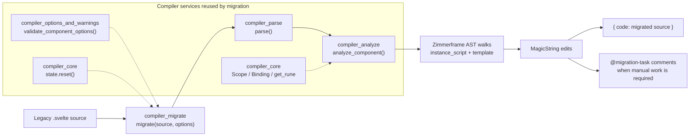
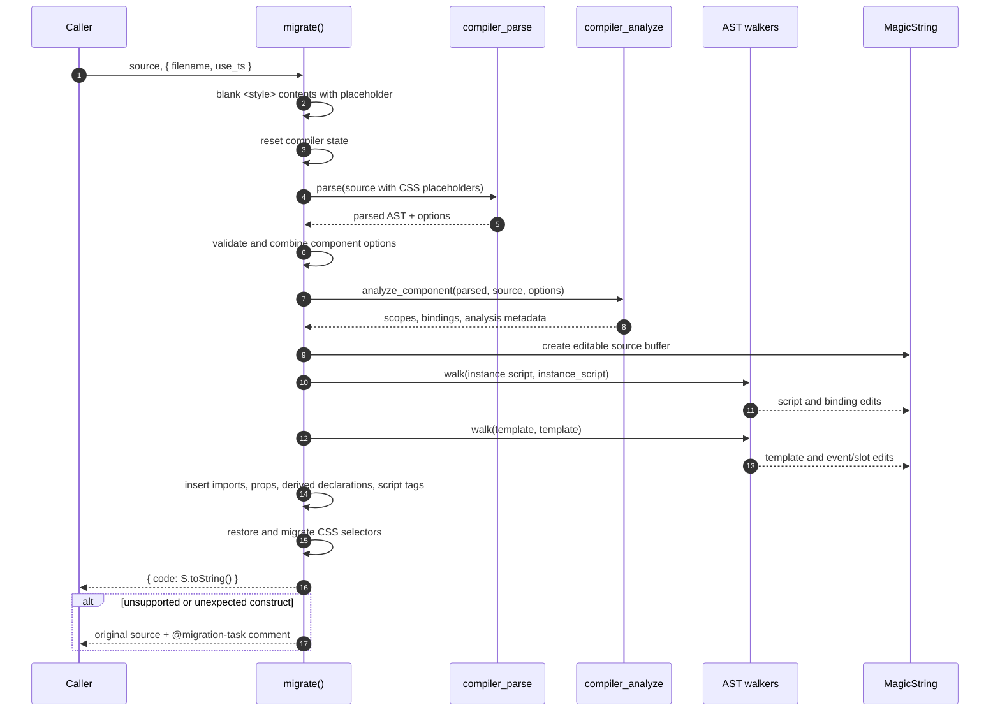
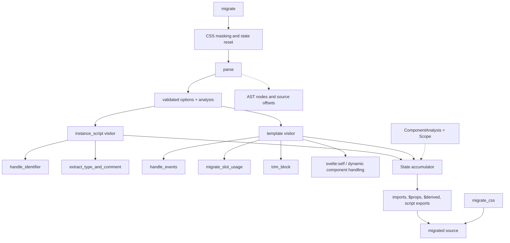
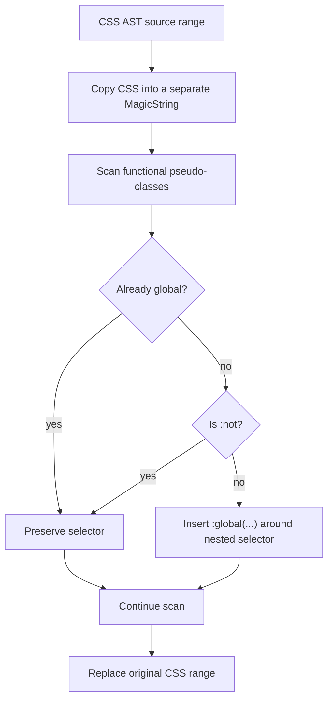
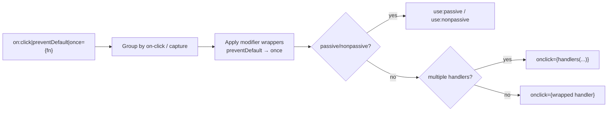
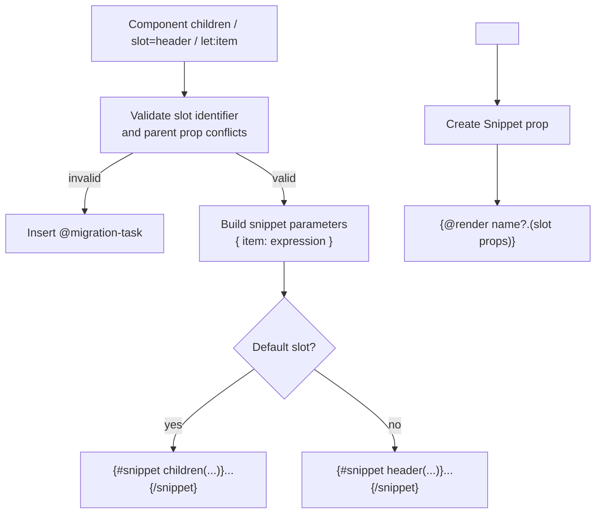
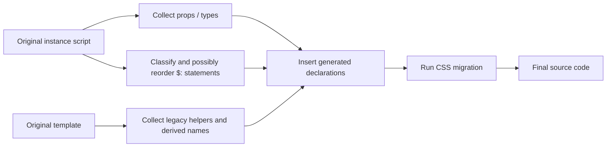
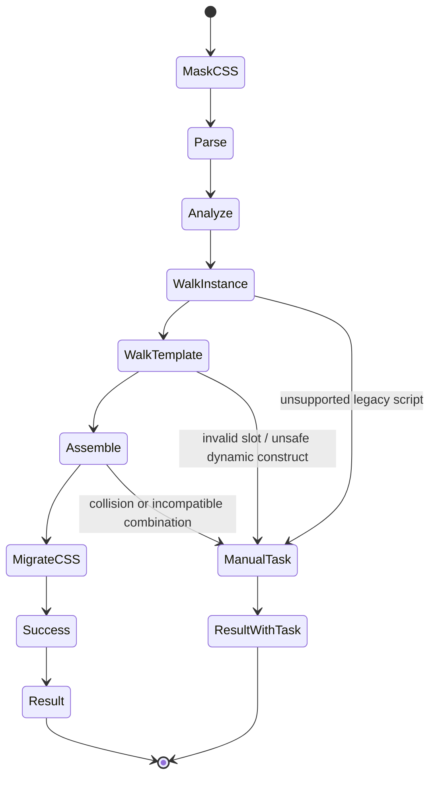

# compiler_migrate

## Introduction

`compiler_migrate` is Svelte's best-effort Svelte 4 → Svelte 5 source migrator. It rewrites a
legacy component in place so that it uses runes, event attributes, snippets/render tags, and
other modern syntax while preserving as much source text, formatting, type information, and
comments as possible.

The module is intentionally a **source-to-source migration pass**, not a general compiler
transform. It parses and analyzes the component using the normal compiler phases, walks the
instance script and template, and applies offset-based edits with `MagicString`. It returns
rewritten source even when some constructs cannot be migrated; those cases receive an
`@migration-task` comment for manual follow-up.

The module is implemented in
[`packages/svelte/src/compiler/migrate/index.js`](https://github.com/sveltejs/svelte/blob/main/packages/svelte/src/compiler/migrate/index.js).

## 1. Position in the system

Migration is a compatibility service alongside the normal compiler pipeline. It reuses parsing,
scope creation, semantic analysis, option validation, diagnostics helpers, and legacy runtime
exports, but its output is source text rather than generated client/server JavaScript.



### Related documentation

| Concern | Reference |
|---|---|
| Overall compiler phase ordering | [compilation_pipeline](compilation_pipeline.md) |
| Parsing Svelte, JavaScript, and CSS into ASTs | [compiler_parse](compiler_parse.md) |
| Scope, bindings, compiler state, and shared helpers | [compiler_core](compiler_core.md) |
| Semantic analysis and `ComponentAnalysis` | [compiler_analyze](compiler_analyze.md) |
| Options and warning definitions | [compiler_options_and_warnings](compiler_options_and_warnings.md) |
| Public and internal compiler AST declarations | [compiler_ast_types](compiler_ast_types.md) |
| Legacy client/server runtime compatibility | [`legacy-client.js`](https://github.com/sveltejs/svelte/blob/main/packages/svelte/src/legacy/legacy-client.js) and [`legacy-server.js`](https://github.com/sveltejs/svelte/blob/main/packages/svelte/src/legacy/legacy-server.js) |
| Preprocessing before compilation | [compiler_preprocess](compiler_preprocess.md) |

Some related documents may be generated independently from this module and are not required to
understand the migration algorithm. This page focuses on the migration-specific orchestration
and rewrite rules.

## 2. Public contract

The public entry point is:

```js
migrate(source, { filename, use_ts })
// => { code: string }
```

| Input | Meaning |
|---|---|
| `source` | Complete Svelte component source. CSS, module script, instance script, and template are all supported. |
| `filename` | Optional filename used for diagnostics and for resolving `<svelte:self>` into a self-import. |
| `use_ts` | Optional hint that generated declarations should use TypeScript when the source does not already provide a type annotation. |

The function always returns an object containing `code`. On an ordinary migration error, the
original source is preserved below a leading HTML comment:

```svelte
<!-- @migration-task Error while migrating Svelte code: ... -->
```

Unexpected errors are logged, while the returned source remains available for manual migration.
The module also logs a summary when one or more migration tasks were emitted.

`has_migration_task` is module-level state. `migrate` resets it at the start and reports it in
`finally`; this is useful for CLI feedback but also means callers should treat migration as
single-threaded work within a JavaScript realm, consistent with the compiler's global state
model described in [compiler_core](compiler_core.md).

## 3. Architecture

### 3.1 Main control flow



### 3.2 Component relationships



### 3.3 Migration state

The local `State` object is the coordination point shared by both walkers. Important fields are:

| Field | Role |
|---|---|
| `str` | `MagicString` buffer containing the editable source. |
| `analysis` | Semantic information from `analyze_component`, including props, slots, runes, CSS, and component name. |
| `scope` | Current lexical scope; switched from instance scope to template scope between walks. |
| `props` | Props and slot-derived snippet declarations to synthesize into `$props()`. |
| `props_insertion_point` | Offset at which generated prop declarations are inserted. |
| `legacy_imports` | Names imported from `svelte/legacy`, such as `run`, `handlers`, and event modifiers. |
| `script_insertions` | Generated declarations, notably the event bubbler factory. |
| `derived_components` | Stable names for dynamic component expressions that need `$derived`. |
| `derived_conflicting_slots` | Aliases used when slot names would shadow component props. |
| `derived_labeled_statements` | Reactive statements already converted as part of a declaration migration. |
| `has_svelte_self` | Whether a self-reference was converted and a self-import is required. |
| `uses_ts` | Whether generated declarations should use TypeScript syntax. |

Names for generated identifiers are allocated through the analysis scope (`unique('props')`,
`unique('run')`, and so on), preventing collisions with user variables.

## 4. Processing stages

### 4.1 Preparation and analysis

Before walking the AST, `migrate`:

1. Replaces each `<style>...</style>` body with a fixed placeholder. This prevents a preprocessor
   language such as SCSS from interfering with JavaScript/template parsing.
2. Calls `reset({ warning: () => false, filename })` to establish compiler state while suppressing
   ordinary warnings during migration.
3. Parses the masked source through [compiler_parse](compiler_parse.md).
4. Merges `<svelte:options>` with validated defaults and enables experimental async analysis.
5. Creates `MagicString`, runs [compiler_analyze](compiler_analyze.md), and guesses the source's
   indentation style.
6. Removes obsolete `accessors` from `<svelte:options>` and restores the original style contents.
7. Converts a module script's `context` attribute to the modern `module` form.

### 4.2 Instance-script migration

The `instance_script` visitor handles JavaScript/TypeScript declarations and legacy APIs.

#### Props and rest props

Legacy `export let` declarations become a destructuring declaration initialized with `$props()`.
The migrator collects:

- local and exported/aliased names;
- defaults and optionality;
- whether a prop was updated and therefore needs `$bindable(...)`;
- TypeScript annotations, JSDoc, inferred primitive types, and comments;
- slot props discovered later from `<slot>` or `$$slots`.

`$$props` and `$$restProps` are redirected to generated names, and the final declaration uses
either explicit props or a rest spread. Existing `$props` usage is recognized so generated
properties can be inserted into the existing rune declaration.

Unsupported patterns include complex destructuring export declarations and incompatible use of
`$$props` together with named props. These throw `MigrationError` and produce a migration task.

#### State and derived values

Legacy state declarations are wrapped in `$state(...)`. The visitor distinguishes several cases:

- initialized declarations become `let value = $state(initializer)`;
- declarations assigned by a simple reactive statement may become `$derived(expression)`;
- reactive assignments with no dependencies can become initialized `$state` declarations;
- more complex legacy `$:` blocks become `run(() => { ... })` using the compatibility runtime;
- `break $` inside a reactive block becomes `return`.

The visitor checks that generated rune names (`state`, `derived`, `props`, and `bindable`) are not
already user bindings. Name collisions are treated as explicit manual-migration errors.

#### Imports and exports

Unused `beforeUpdate`/`afterUpdate` imports from `svelte` are removed. If either is still used,
automatic migration stops because their semantics need manual review. Bindable prop exports are
removed from named export lists, while accessors may cause generated prop exports to be restored.

`svelte-ignore` comments are migrated through `migrate_svelte_ignore`, shared with compiler
diagnostic support.

### 4.3 Template migration

The `template` visitor applies syntax changes to template AST nodes.

| Legacy construct | Migration behavior |
|---|---|
| `on:event` directives | Converted to `onevent={handler}`; multiple handlers use `handlers(...)`. |
| Event modifiers | Wrapped in Svelte 4-compatible order; passive/nonpassive become `use:passive` or `use:nonpassive`. |
| Bare event handlers | Use a generated `createBubbler()` function. |
| `<slot>` | Converted to snippet props and `{@render ...}` calls, with an `{#if}` fallback when slot content exists. |
| Slotted children | Wrapped in `{#snippet name(...)}` blocks; `let:` values become snippet parameters. |
| `<svelte:fragment>` | Its wrapper is removed and its content is retained inside a snippet. |
| `<svelte:component this={...}>` | Converted to a component tag; complex expressions receive a derived or local `{@const}` name. |
| `<svelte:self>` | Renamed to the component name and accompanied by a self-import when a filename is known. |
| `<svelte:element this="div">` | Static tag names are wrapped as expressions where required by modern syntax. |
| Self-closing non-void HTML elements | Expanded to explicit opening and closing tags. |
| HTML/control-flow tag whitespace | Parenthesized block headers are trimmed for modern syntax. |
| `$$slots.name` | Rewritten to the corresponding snippet prop, usually `children` for the default slot. |
| `$$props` / prop identifiers | Redirected to generated props object access when the component uses `$$props`. |

Special elements (`svelte:window`, `svelte:body`, and `svelte:document`) reuse event handling. Slot
and snippet conversion is deliberately skipped for custom-element slot semantics where the modern
representation would not be equivalent.

### 4.4 CSS migration

`migrate_css` runs after the template and script edits. It scans the restored CSS for functional
pseudo-classes such as `:has`, `:is`, `:where`, and `:not`. Where needed, it inserts `:global(...)`
around nested selectors so the migrated selector retains the intended Svelte scoping behavior.
Parentheses are matched by `find_closing_parenthesis`, which accounts for nested functions.



## 5. Event conversion details

`handle_events` groups `OnDirective` nodes by event name and capture mode. For each group it:

1. extracts the existing expression, or creates a bubbler expression for an implicit handler;
2. applies modifiers in this fixed order:
   `preventDefault`, `stopPropagation`, `stopImmediatePropagation`, `self`, `trusted`, `once`;
3. converts passive and nonpassive handling to legacy actions;
4. removes duplicate directives after the first normal event attribute;
5. emits either a direct event attribute or `handlers(handler1, handler2, ...)`.



The generated imports are deferred until all visitors finish. This keeps the output compact and
allows `State.names` to avoid collisions with component-local identifiers.

## 6. Slot and snippet conversion

`migrate_slot_usage` converts content passed to a component into snippets. It validates slot names
with the parser's identifier pattern and rejects reserved names. It also checks for prop shadowing
on the parent component, because changing a slot name in that situation can silently alter the
component API.

For default-slot content, the function identifies the contiguous default content range, separates
named-slot regions, and moves interleaved content where necessary before inserting snippet tags.
Named slots and `svelte:fragment` wrappers are converted by wrapping the element itself.

When a legacy slot is consumed inside the component, `SlotElement` creates a `Snippet` prop and
emits an optional render call. Slot attributes become an object argument, and conflicting slot
names receive a generated derived alias to prevent shadowing.



## 7. Output assembly

After both AST walks, `migrate` computes whether a script block is needed. It inserts, in order as
appropriate:

- a new `<script>` or `<script lang="ts">` block when the component had no instance script;
- a self-import for migrated `<svelte:self>`;
- imports from `svelte/legacy`;
- helper declarations such as the bubbler;
- the `$props()` declaration and generated prop type/JSDoc;
- derived component and conflicting-slot declarations;
- accessor exports;
- a closing script tag for newly created scripts.

Reactive statements are moved to the end of the instance script when dependency ordering would
otherwise differ after prop insertion. `get_node_range` expands movement to include leading and
trailing comments and indentation-only prefixes.



## 8. Failure behavior and safety boundaries

Automatic migration is conservative. It throws `MigrationError` when preserving semantics would
be uncertain, including:

- unsupported export-destructuring patterns;
- conflicting use of legacy named props and `$$props`;
- rune-name collisions;
- used `beforeUpdate` or `afterUpdate` imports;
- slot names that are invalid, reserved, or would be renamed;
- unsupported dynamic component or slot arrangements.

The outer `try/catch` converts these failures into source-level tasks rather than returning a
partial, silently invalid component. This makes the output reviewable and keeps the migration
workflow incremental: automated edits remain in place where safe, while task comments identify
the remaining work.

One special case is `<svelte:self>` without `filename`: the migrator cannot know the import path,
so it leaves the construct in place and inserts a manual task. With a filename, it uses the current
component analysis name and a same-directory `./filename` import.

## 9. Maintenance guide

When changing this module:

1. Preserve AST source offsets until all `MagicString` edits that depend on them are scheduled.
2. Add generated identifiers through `analysis.root.unique(...)` or the active scope rather than
   hard-coding names.
3. Keep collection and insertion separate: visitors record imports/props/derived values in state,
   and the outer function assembles them after traversal.
4. If a construct cannot be proven safe, use `MigrationError` or an explicit
   `@migration-task`, not a best guess that changes the component API.
5. Keep event modifier order aligned with Svelte 4 behavior.
6. Preserve comments when moving reactive statements or extracting prop types.
7. Update migration tests for both JavaScript and TypeScript input, with and without an existing
   instance script, and with custom-element mode where slot behavior differs.

## 10. End-to-end summary



In short, `compiler_migrate` is the bridge from the legacy source model to the modern Svelte
source model. It relies on [compiler_parse](compiler_parse.md) and [compiler_analyze](compiler_analyze.md)
for trustworthy structure and bindings, uses [compiler_core](compiler_core.md) services for
state and names, and emits source that the ordinary [compilation_pipeline](compilation_pipeline.md)
can compile afterward.
