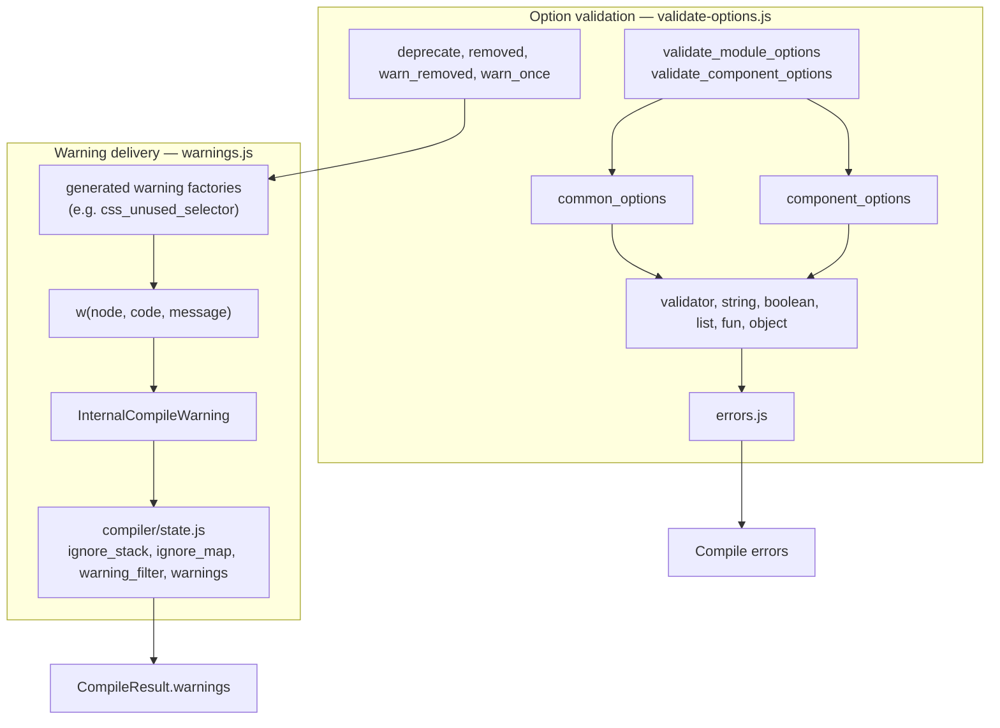
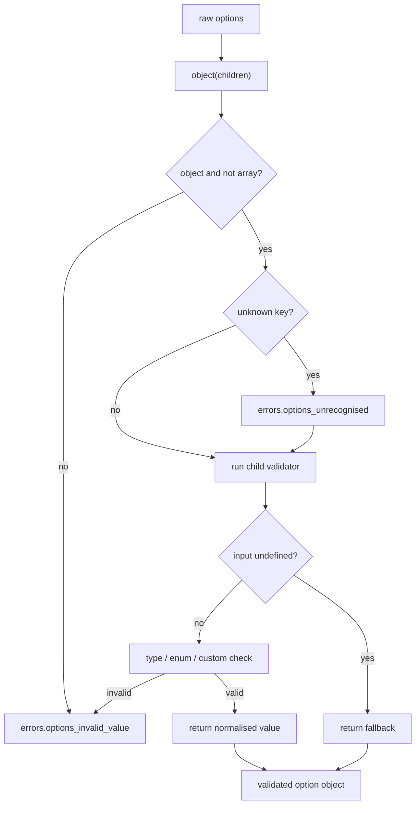
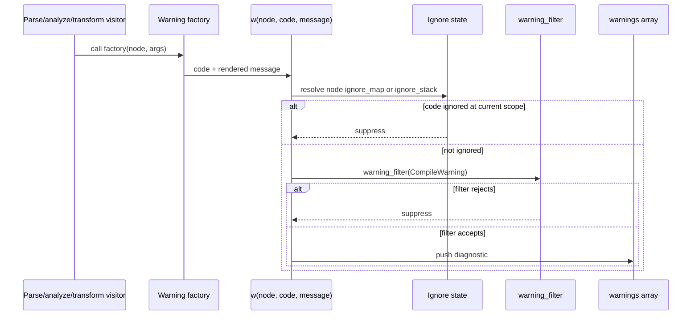
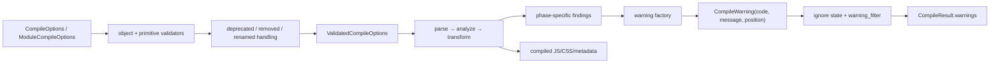

# compiler_options_and_warnings

## Introduction

`compiler_options_and_warnings` is the compiler’s boundary for two kinds of
compile-time policy:

1. **Option validation** — normalises compiler configuration, applies defaults,
   rejects invalid values, and reports deprecated or removed options.
2. **Warning construction and delivery** — converts compiler findings into
   `CompileWarning` diagnostics, while honouring ignore directives and the
   configured warning filter.

The module is implemented by
[`validate-options.js`](packages/svelte/src/compiler/validate-options.js) and
the generated [`warnings.js`](packages/svelte/src/compiler/warnings.js).
`compiler/index.js` consumes validated options; parse, analysis, and transform
phases call warning factories as they discover issues. See
[compiler_core](compiler_core.md), [compiler_parse](compiler_parse.md), and
[compiler_analyze](compiler_analyze.md) for those callers.

## Position in the compiler

```mermaid
flowchart LR
    API["compile / compileModule"] --> V["validate_component_options\nvalidate_module_options"]
    V -->|"validated options"| CORE["compiler/index.js"]
    CORE --> PARSE["phase 1: parse"]
    PARSE --> ANALYZE["phase 2: analyze"]
    ANALYZE --> TRANSFORM["phase 3: client/server/CSS transforms"]

    PARSE --> W["warning factories"]
    ANALYZE --> W
    TRANSFORM --> W
    W --> S["compiler/state.js\nwarnings + ignore state"]
    S --> D["CompileWarning diagnostics"]
    D --> RESULT["CompileResult.warnings"]

    click CORE "compiler_core.md"
    click PARSE "compiler_parse.md"
    click ANALYZE "compiler_analyze.md"
    click TRANSFORM "compiler_transform_client.md"
    click S "compiler_core.md"
```



The option and warning paths are related but deliberately separate. Option
validation can throw an error for an invalid value, or emit a compatibility
warning for a recognised legacy value. The warning subsystem is used throughout
the compiler and does not validate option types itself.

## Architecture



`warnings.js` is generated by `scripts/process-messages/index.js`; changes to
warning messages or codes belong in the message source/generation workflow,
not directly in the generated file.

## Option validation

### Public validators

Both exported validators are recursive validators with the same shape:

```js
(input, keypath) => validatedValue
```

`keypath` is propagated through nested objects so diagnostics identify the
precise option, for example `experimental.async` or `compatibility.componentApi`.

| Export | Input accepted | Result |
| --- | --- | --- |
| `validate_module_options` | `ModuleCompileOptions` | Common options plus component-option keys ignored as module configuration |
| `validate_component_options` | `CompileOptions` | Common and component options fully validated and defaulted |

The module validator includes the component option names in its schema but maps
them to no-op validators. This preserves a shared option surface while keeping
component-only settings out of module compilation.

### Shared options

| Option | Default / accepted values | Behaviour |
| --- | --- | --- |
| `filename` | `'(unknown)'` | Must be a string. |
| `rootDir` | `process.cwd()`, `Deno.cwd()`, or `undefined` | Runtime-sensitive default for Svelte 4 compatibility. |
| `dev` | `false` | Boolean development mode. |
| `generate` | `'client'`, `'server'`, `false` | `'dom'` → `'client'` and `'ssr'` → `'server'`, with a once-only rename warning. |
| `warningFilter` | `() => true` | Must be a function; receives a warning and can suppress it. |
| `experimental.async` | `false` | Nested boolean under `experimental`. |

### Component options

| Option | Default / accepted values | Compatibility notes |
| --- | --- | --- |
| `accessors` | `false` | Deprecated through `options_deprecated_accessors`. |
| `css` | `'external'` or `'injected'` | Booleans and `'none'` are hard errors. |
| `cssHash` | `(css, hash) => \`svelte-${hash(css)}\`` | Must be a function. |
| `cssOutputFilename` | `undefined` or string | Sourcemap-related filename. |
| `customElement` | `false` | Boolean compile mode. |
| `discloseVersion` | `true` | Boolean. |
| `immutable` | `false` | Deprecated through `options_deprecated_immutable`. |
| `compatibility.componentApi` | `5` or `4` | Validated as a list value. |
| `loopGuardTimeout` | `undefined` | Removed; presence emits a once-only warning. |
| `name`, `outputFilename` | `undefined` or string | Optional names/filenames. |
| `namespace` | `'html'`, `'mathml'`, `'svg'` | Enumerated namespace. |
| `modernAst` | `false` | Boolean AST output flag. |
| `preserveComments`, `preserveWhitespace`, `hmr` | `false` | Boolean flags. |
| `fragments` | `'html'` or `'tree'` | Enumerated fragment representation. |
| `runes` | `undefined`, `true`, or `false` | Controls runes mode when specified. |
| `sourcemap` | `undefined` or any supported sourcemap value | Intentionally permissive because several map implementations are supported. |

The following options are recognised only to provide migration diagnostics and
otherwise return `undefined`: `enableSourcemap`, `hydratable`, `format`, `tag`,
`sveltePath`, `errorMode`, and `vars`. `format` and `tag` provide explanatory
removal messages; the others use generated removal warnings where applicable.

### Validator primitives and control flow



- `validator` supplies a fallback only when the input is `undefined`.
- `string`, `boolean`, `list`, and `fun` enforce primitive contracts.
- `object` rejects arrays, reports unrecognised keys, and recursively validates
  every declared child.
- `deprecate` validates normally but calls a warning factory once when the
  option is present.
- `warn_removed` warns once and discards the supplied value.
- `removed` reports an option-removal error whenever the option is present.

`warn_once` uses a module-level `Set` keyed by warning function. Consequently,
repeated uses of the same deprecated option during one process do not duplicate
the compatibility warning.

## Warning subsystem

### Factory contract

Each exported warning factory accepts a nullable AST-like node and, where
needed, interpolation arguments:

```js
css_unused_selector(node, selectorName)
a11y_incorrect_aria_attribute_type_id(node, attribute)
options_renamed_ssr_dom(null)
```

Factories delegate to `w(node, code, message)`, which creates an
`InternalCompileWarning` (name: `CompileWarning`) extending
`CompileDiagnostic`. The diagnostic contains the stable warning code, rendered
message, and an optional `[start, end]` position derived from the node.

The exported `codes` array is the catalogue of recognised warning identifiers.
It covers accessibility, options/migration, CSS, reactivity, performance,
attribute, block, and legacy syntax diagnostics. The core option-related
factories are:

| Factory | Purpose |
| --- | --- |
| `options_deprecated_accessors` | Reports deprecated `accessors`. |
| `options_deprecated_immutable` | Reports deprecated `immutable`. |
| `options_removed_enable_sourcemap` | Explains that sourcemaps are always generated. |
| `options_removed_hydratable` | Explains that components are always hydratable. |
| `options_removed_loop_guard_timeout` | Reports removed loop guard configuration. |
| `options_renamed_ssr_dom` | Maps old `generate: 'dom'/'ssr'` names to client/server. |

Other compiler phases use the same mechanism. For example, CSS analysis emits
`css_unused_selector`; accessibility visitors emit `a11y_*`; parser and
transform visitors emit syntax and migration warnings. Refer to
[compiler_analyze_css](compiler_analyze_css.md) and the relevant phase
documentation for producer-specific rules.

### Filtering and ignore handling



Ignore resolution is node-aware: a node-specific entry in `ignore_map` takes
precedence over the global `ignore_stack`; otherwise the current global stack is
used. An ignore entry suppresses a matching code before the warning filter is
consulted. The state helpers that manage this context are documented with
[compiler_core](compiler_core.md), which covers `push_ignore` and `pop_ignore`.

Passing `null` is intentional for option warnings, because those warnings are
not associated with a source AST node. Such diagnostics have no source range
but still pass through the warning filter and are appended to the same result.

## End-to-end data flow



## Maintenance guidance

- Add or change option contracts in `validate-options.js`, preserving the
  distinction between hard removal errors and compatibility warnings.
- Keep option warning emission once-only for process-wide compatibility notices.
- Add warning messages through the generated-message workflow; do not manually
  edit `warnings.js`.
- Use stable warning codes so `svelte-ignore` directives and `warningFilter`
  remain reliable.
- Keep source-node positions intact when calling warning factories so tooling
  can present useful diagnostics.

## Related modules

- [compiler_core](compiler_core.md) — public compile orchestration, option
  merging, diagnostic state, and result assembly.
- [compiler_parse](compiler_parse.md) — parser-side warning producers and AST
  source positions.
- [compiler_analyze](compiler_analyze.md) — semantic and accessibility warning
  producers.
- [compiler_analyze_css](compiler_analyze_css.md) — unused-selector warning
  production and CSS metadata.
- [compiler_ast_types](compiler_ast_types.md) — compile result and AST type
  declarations consumed by validators and diagnostics.
- [published_type_declaration_surface](published_type_declaration_surface.md)
  — public declaration surface that exposes compiler option/result types.
