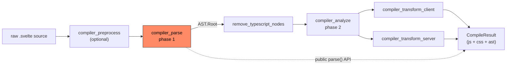
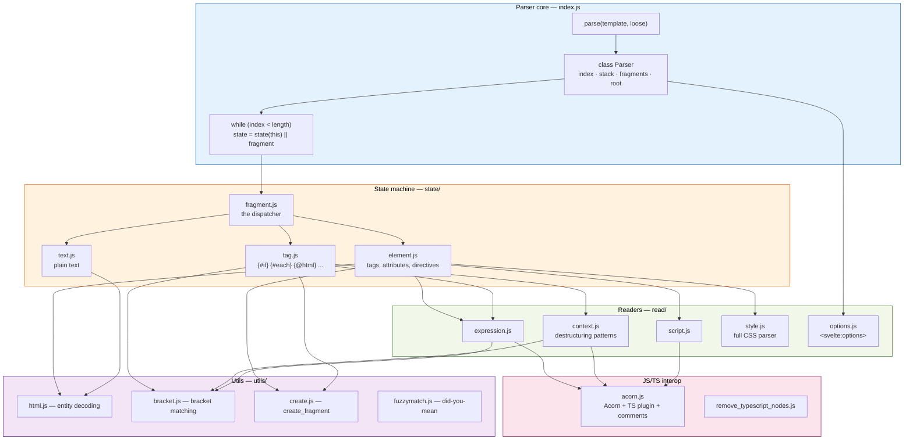
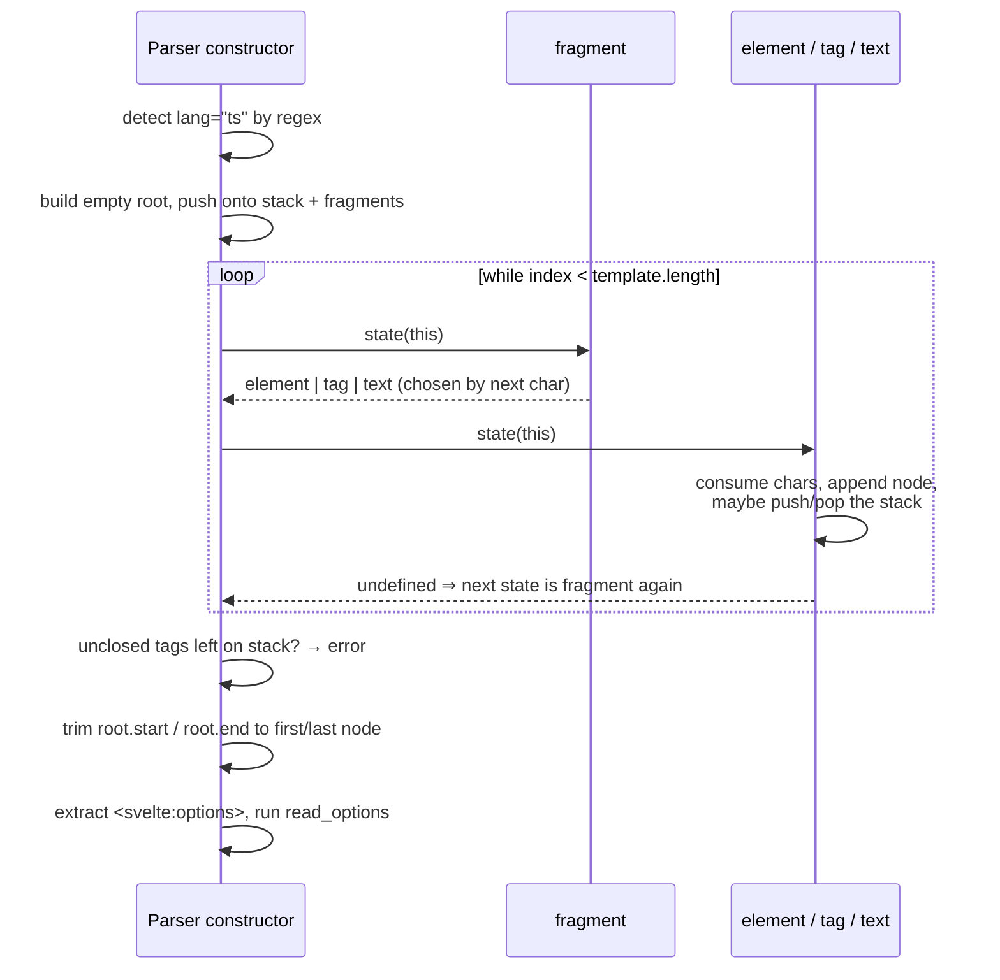
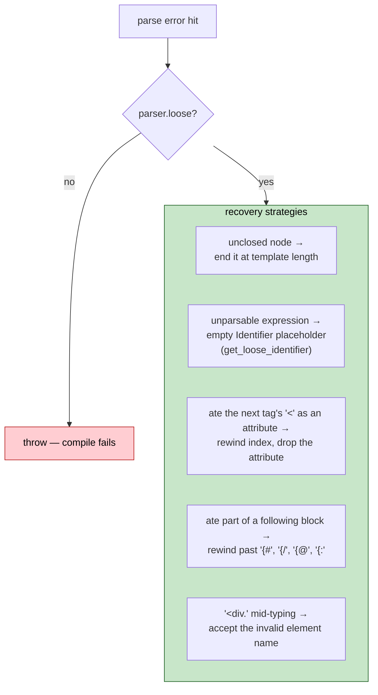
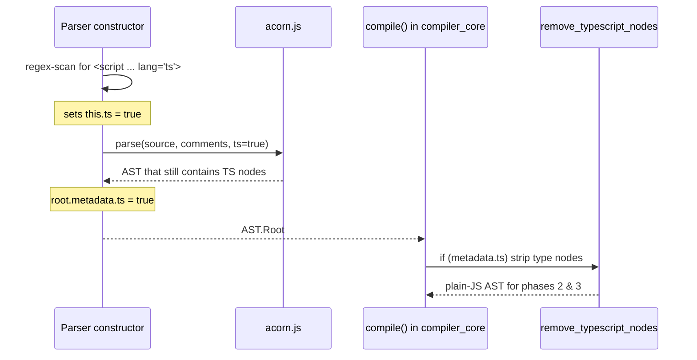
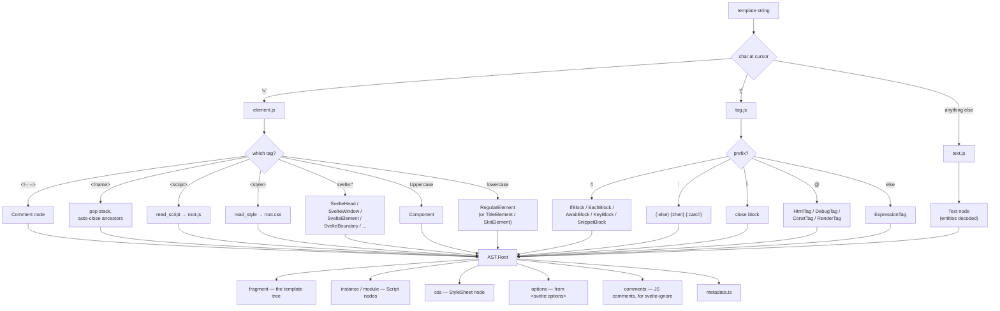
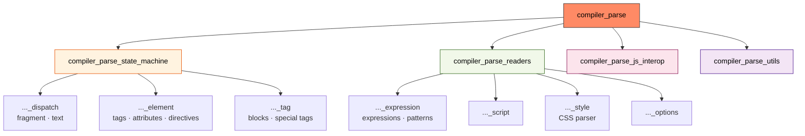
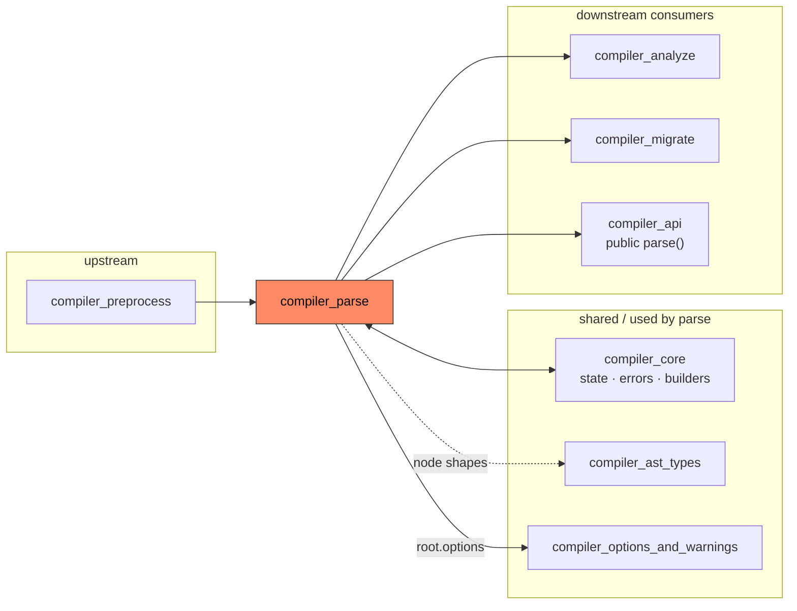

# compiler_parse

## 1. What this module does

`compiler_parse` is **phase 1 of the Svelte compiler**. It takes one thing — a raw `.svelte`
source string — and turns it into one thing — an `AST.Root` object.

That is the whole job. It does not check whether your code makes sense, it does not rename
variables, and it does not produce JavaScript. It only reads characters and builds a tree.

```
"<h1>hello {name}</h1>"   ──►   compiler_parse   ──►   AST.Root { fragment, js, css, options }
```

Source lives in `packages/svelte/src/compiler/phases/1-parse/`.

### Why it is a separate phase

A `.svelte` file is really **three languages glued together**:

| Part of the file | Language | Who parses it |
| --- | --- | --- |
| `<h1>{name}</h1>` | Svelte template markup | this module's own hand-written parser |
| `<script>` contents, `{expressions}` | JavaScript / TypeScript | Acorn (third-party), wrapped by this module |
| `<style>` contents | CSS | this module's own hand-written CSS parser |

No off-the-shelf parser can read that mix, so Svelte writes its own outer parser and calls
Acorn for the embedded JavaScript. Keeping this in one isolated phase means the later phases
([compiler_analyze](compiler_analyze.md), [compiler_transform_client](compiler_transform_client.md),
[compiler_transform_server](compiler_transform_server.md)) only ever see a clean tree and never
touch raw text.

---

## 2. Place in the compiler pipeline

`parse()` is the first thing `compile()` calls. Everything downstream depends on the shape of
the tree this module returns.



Concretely, in `packages/svelte/src/compiler/index.js` (see [compiler_core](compiler_core.md)):

1. `_parse(source)` → an `AST.Root`.
2. `parsed.options` (read from `<svelte:options />`) is merged into the compile options.
3. If the file is TypeScript (`parsed.metadata.ts`), `remove_typescript_nodes()` strips the
   type-only nodes.
4. The cleaned tree goes to `analyze_component()`.

Two other consumers exist:

- **Public `parse()` API** — third-party tools (`prettier-plugin-svelte`, `svelte-language-tools`)
  call it directly to get an AST without compiling.
- **[compiler_migrate](compiler_migrate.md)** — imports both `parse` and
  `regex_valid_component_name` from this module when rewriting Svelte 4 code to Svelte 5.

---

## 3. Architecture

The module is a **state-machine parser**. One mutable `Parser` object holds the cursor, and
small "state" functions take turns moving that cursor forward.



### 3.1 The five layers

| Layer | Responsibility | Documentation |
| --- | --- | --- |
| **Parser core** (`index.js`) | Owns the cursor and the node stack. Provides the small primitives (`eat`, `match`, `read`, `append`, `pop`) every other file uses. Runs the loop. | this file, §4 |
| **State machine** (`state/`) | Decides *what kind of thing* is at the cursor and builds the matching AST node. | [compiler_parse_state_machine](compiler_parse_state_machine.md) |
| **Readers** (`read/`) | Parse one self-contained sub-language: an expression, a pattern, a `<script>`, a `<style>`, or `<svelte:options>`. | [compiler_parse_readers](compiler_parse_readers.md) |
| **JS/TS interop** (`acorn.js`, `remove_typescript_nodes.js`) | Wrap Acorn, attach comments, and later delete TypeScript-only nodes. | [compiler_parse_js_interop](compiler_parse_js_interop.md) |
| **Utils** (`utils/`) | HTML entity decoding, string-aware bracket matching, fragment factory, fuzzy suggestions. | [compiler_parse_utils](compiler_parse_utils.md) |

---

## 4. The Parser core

`packages/svelte/src/compiler/phases/1-parse/index.js`

### 4.1 `parse(template, loose?)`

The only public entry point. It is deliberately tiny:

```js
export function parse(template, loose = false) {
        state.set_source(template);          // for error code frames — see compiler_core
        const parser = new Parser(template, loose);
        return parser.root;
}
```

All the real work happens in the `Parser` **constructor**. This is unusual but intentional:
constructing a `Parser` *is* parsing. There is no separate `.run()` step.

### 4.2 State held on the `Parser`

| Field | Meaning |
| --- | --- |
| `template` | the source, with trailing whitespace trimmed. Treated as read-only (with two documented exceptions in `tag.js`). |
| `index` | the cursor — a single number that only ever moves forward (again, with deliberate backtracking exceptions) |
| `ts` | `true` if a `<script lang="ts">` was detected up front by regex |
| `stack` | open nodes, outermost first. `current()` is the top. |
| `fragments` | the matching stack of `Fragment` node lists that `append()` writes into |
| `root` | the `AST.Root` being built |
| `meta_tags` | which root-only tags (`<svelte:head>`, …) have already been seen, so duplicates can error |
| `loose` | tolerant mode — see §5 |
| `last_auto_closed_tag` | remembers a tag that was implicitly closed (e.g. `<p>` before `<div>`), so the later `</p>` gets a better error |

`stack` and `fragments` are the heart of the design. Two parallel stacks let `append()` add a
node to the *currently open* fragment without ever walking the tree.

### 4.3 Cursor primitives

Every state function and reader is built out of these:

| Method | What it does |
| --- | --- |
| `match(str)` | peek — is `str` at the cursor? does not move |
| `match_regex(re)` | peek with a regex anchored at the cursor |
| `eat(str, required?, required_in_loose?)` | consume `str` if present; optionally error if absent |
| `read(re)` | consume and return a regex match |
| `read_until(re)` | consume everything up to the next match |
| `read_identifier(allow_reserved?)` | consume a JS identifier (uses Acorn's `isIdentifierStart` / `isIdentifierChar`, so Unicode works) |
| `allow_whitespace()` / `require_whitespace()` | skip whitespace, optionally demanding at least one |
| `append(node)` | push a node into the current fragment |
| `pop()` | close the current node — pops both stacks |
| `current()` | the innermost open node |
| `acorn_error(err)` | convert an Acorn exception into a Svelte `js_parse_error` |

The three-argument `eat` is worth noting: `required_in_loose` lets a call site say
*"this token is mandatory normally, but tolerate it missing in loose mode."*

### 4.4 The main loop



A "state" is just `(parser) => ParserState | void`. Returning nothing means *"go back to
`fragment` and re-dispatch"*, which is what almost every state does. Only `fragment` itself
returns another state.

### 4.5 What happens after the loop

Three finishing steps, in order:

1. **Unclosed-node check.** If `stack.length > 1`, something never closed. In strict mode this
   raises `element_unclosed` or `block_unclosed`; in loose mode the node is simply ended at the
   end of the template.
2. **Root bounds.** `root.start` / `root.end` are set to the first and last non-whitespace
   positions, so the reported span ignores leading/trailing blank lines. An empty template gets
   `start = end = null`.
3. **`<svelte:options>` extraction.** The `SvelteOptions` node is *removed* from
   `root.fragment.nodes` and converted to a settings object by `read_options`. The original raw
   node is re-attached as a non-enumerable `__raw__` property so the legacy AST converter can
   still find it.

Step 3 is why compile options can be set from inside the component file — see
[compiler_options_and_warnings](compiler_options_and_warnings.md) for how those values are
validated afterwards.

---

## 5. Loose mode

`parse(source, true)` switches on **loose mode**. The goal is: *always return a tree, even for
code that is mid-keystroke and cannot compile.* This is what powers the Svelte language server
— an editor needs a usable AST while you are still typing.

Loose mode changes behaviour in several places:



The trade-off: a loose AST may contain placeholder nodes (identifiers with `name: ''`) that
would never appear in a valid parse. Downstream consumers must expect them. Because of this,
`compile()` never uses loose mode — only the public `parse()` API exposes it.

---

## 6. TypeScript handling

TypeScript support is split across two moments in time:



1. **During parsing** the flag `this.ts` picks the Acorn instance
   (`acorn.Parser.extend(tsPlugin())` versus plain `acorn.Parser`). The type annotations are
   kept in the tree at this point, so tools that want them (the public `parse()` API) can see
   them.
2. **After parsing** `compile()` calls `remove_typescript_nodes()`, which deletes annotations,
   drops `type`-only imports/exports, unwraps `as` / `satisfies` / `!`, and hard-errors on
   TypeScript features that are not stage-4 proposals (decorators, `enum`, namespaces with
   runtime code, parameter properties).

The `lang="ts"` detection is a plain regex over the whole template, not a real parse. The
regex also matches HTML comments first so that a commented-out `<script lang="ts">` is skipped,
and it loops until the match starts with `<s` to avoid matching other tags.

Details in [compiler_parse_js_interop](compiler_parse_js_interop.md).

---

## 7. Data flow: source text to `AST.Root`



### The `AST.Root` contract

| Field | Filled by | Consumed by |
| --- | --- | --- |
| `fragment` | `state/` functions via `append()` | phases 2 and 3 |
| `instance`, `module` | `read_script` | scope building in [compiler_core](compiler_core.md) |
| `css` | `read_style` | [compiler_analyze](compiler_analyze.md), [compiler_css_transform](compiler_css_transform.md) |
| `options` | `read_options` | `compile()` option merging |
| `comments` | `acorn.js` comment handlers | `svelte-ignore` extraction in [compiler_core](compiler_core.md) |
| `metadata.ts` | `lang="ts"` regex | `remove_typescript_nodes` trigger |

Node type definitions live in [compiler_ast_types](compiler_ast_types.md); the published
declarations are in [template_ast](template_ast.md) and [css_ast](css_ast.md).

---

## 8. Sub-modules

### 8.1 Full documentation map

Every file in this module's wiki, and which source files it covers:

| Documentation file | Source covered |
| --- | --- |
| **compiler_parse.md** (this file) | `index.js` — the `Parser` class and `parse()` |
| [compiler_parse_state_machine](compiler_parse_state_machine.md) | overview of `state/` |
| &nbsp;&nbsp;└ [compiler_parse_state_machine_dispatch](compiler_parse_state_machine_dispatch.md) | `state/fragment.js`, `state/text.js` |
| &nbsp;&nbsp;└ [compiler_parse_state_machine_element](compiler_parse_state_machine_element.md) | `state/element.js` |
| &nbsp;&nbsp;└ [compiler_parse_state_machine_tag](compiler_parse_state_machine_tag.md) | `state/tag.js` |
| [compiler_parse_readers](compiler_parse_readers.md) | overview of `read/` |
| &nbsp;&nbsp;└ [compiler_parse_readers_expression](compiler_parse_readers_expression.md) | `read/expression.js`, `read/context.js` |
| &nbsp;&nbsp;└ [compiler_parse_readers_script](compiler_parse_readers_script.md) | `read/script.js` |
| &nbsp;&nbsp;└ [compiler_parse_readers_style](compiler_parse_readers_style.md) | `read/style.js` |
| &nbsp;&nbsp;└ [compiler_parse_readers_options](compiler_parse_readers_options.md) | `read/options.js` |
| [compiler_parse_js_interop](compiler_parse_js_interop.md) | `acorn.js`, `remove_typescript_nodes.js` |
| [compiler_parse_utils](compiler_parse_utils.md) | `utils/html.js`, `utils/bracket.js`, `utils/create.js`, `utils/fuzzymatch.js` |



### 8.2 [compiler_parse_state_machine](compiler_parse_state_machine.md)

`state/fragment.js`, `state/element.js`, `state/tag.js`, `state/text.js`

The state functions that recognise template syntax and build nodes. Covers element and
component classification, attribute and directive parsing (`bind:`, `on:`, `class:`, `style:`,
`use:`, `transition:`, `let:`, `{@attach}`, `{...spread}`), block parsing
(`{#if}` / `{#each}` / `{#await}` / `{#key}` / `{#snippet}`), implicit tag closing,
`<textarea>` and raw-text special cases, and HTML entity decoding of text.

### [compiler_parse_readers](compiler_parse_readers.md)

`read/expression.js`, `read/context.js`, `read/script.js`, `read/style.js`, `read/options.js`

Five focused readers for the embedded sub-languages. Includes the tricks used to make Acorn
accept Svelte-only syntax — padding source with whitespace to keep byte offsets exact, wrapping
destructuring patterns in `(pattern = 1)` to force pattern parsing, and rewriting `x: T` into
`_ as T` to read type annotations. Also documents the full hand-written CSS parser (selectors,
at-rules, declarations, nesting) and the `<svelte:options>` validator.

### [compiler_parse_js_interop](compiler_parse_js_interop.md)

`acorn.js`, `remove_typescript_nodes.js`

The boundary with Acorn. Explains the TypeScript-aware parser instance, the
`parseExpressionAt` path used for inline expressions, the `undefinedExports` workaround that
lets `<script>` export things declared in the template, the comment-attachment walker
(`leadingComments` / `trailingComments`) and its block-comment de-indentation, and the
zimmerframe visitor set that strips TypeScript for downstream phases.

### [compiler_parse_utils](compiler_parse_utils.md)

`utils/html.js`, `utils/bracket.js`, `utils/create.js`, `utils/fuzzymatch.js`

Small shared helpers: HTML character-reference decoding with the Windows-1252 and illegal
code-point fixups, string- and comment-aware bracket matching (needed because a `}` inside a
string literal must not end a `{expression}`), the `create_fragment` factory, and the
FuzzySet-based "did you mean…?" matcher that is also reused by
[compiler_analyze](compiler_analyze.md) and `extract_svelte_ignore`.

---

## 9. Cross-module map



| Module | Relationship |
| --- | --- |
| [compiler_preprocess](compiler_preprocess.md) | Runs *before* parsing, so this module always sees plain Svelte syntax rather than Sass/Pug/etc. |
| [compiler_core](compiler_core.md) | Provides `state.set_source()` (used for error code frames), the `errors.js` / `warnings.js` reporters, and the `#compiler/builders` helpers used by `remove_typescript_nodes`. |
| [compiler_ast_types](compiler_ast_types.md) | Declares every node type this module produces (`AST.Root`, `AST.Fragment`, `AST.Attribute`, `AST.CSS.*`, …). |
| [compiler_options_and_warnings](compiler_options_and_warnings.md) | Validates the option object that `read_options` produces from `<svelte:options>`. |
| [compiler_analyze](compiler_analyze.md) | First consumer of the tree. Also re-imports `acorn.js`'s `parse` for `compileModule`, and `fuzzymatch` for its suggestion messages. |
| [compiler_migrate](compiler_migrate.md) | Uses `parse` plus `regex_valid_component_name` to rewrite Svelte 4 components. |
| [compiler_api](compiler_api.md) | Publishes the `parse()` signature, including the `modern` and `loose` flags. |

---

## 10. Notes for maintainers

- **Adding a new block or tag** (`{#foo}` / `{@foo}`) means touching `state/tag.js`, adding the
  node type in [compiler_ast_types](compiler_ast_types.md), and adding visitors in
  [compiler_analyze](compiler_analyze.md) and both transform modules. The parser change is the
  smallest part.
- **Adding a new directive prefix** (`foo:bar`) is a one-line addition to `get_directive_type`
  in `state/element.js`, plus the same downstream work.
- **Positions matter.** Every node carries `start` / `end` offsets into the *original* source.
  Source maps, error code frames, and `esrap` output all depend on them. When you feed a padded
  or rewritten string to Acorn (as the readers do), the padding must preserve byte offsets —
  that is why the code replaces characters with spaces rather than slicing text away.
- **The parser mutates one cursor.** Backtracking (`parser.index = ...`) is used in a handful of
  places and each one is commented. Adding new backtracking is risky; prefer look-ahead with
  `match` / `match_regex`, which do not move the cursor.
- **`parser.template` is documented as read-only** but `tag.js` temporarily truncates it while
  recovering from `{#each x as { y = z }}`. It always restores the original. Do not add more
  cases without the same care.
