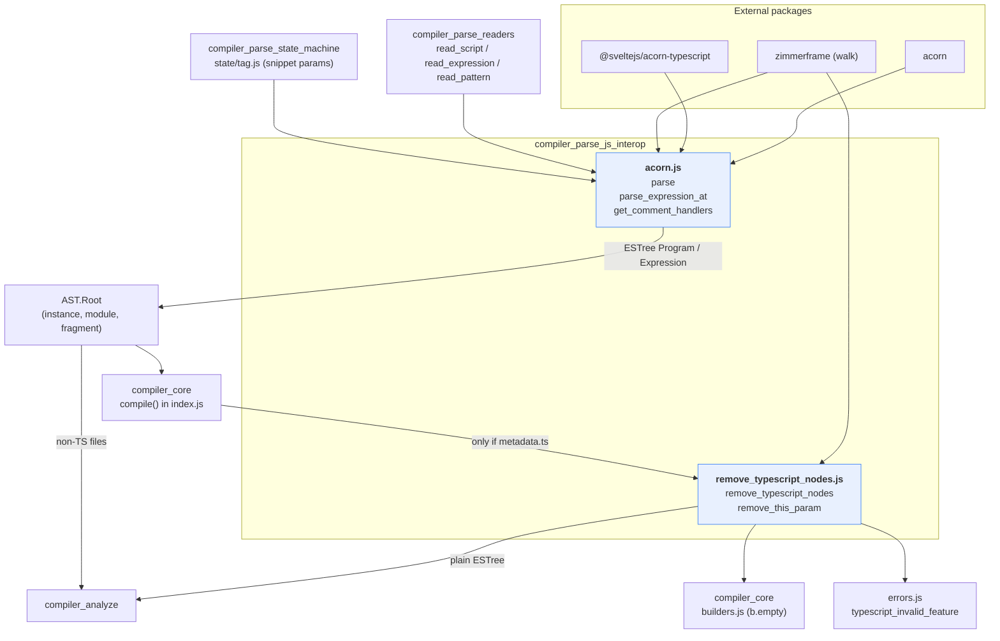
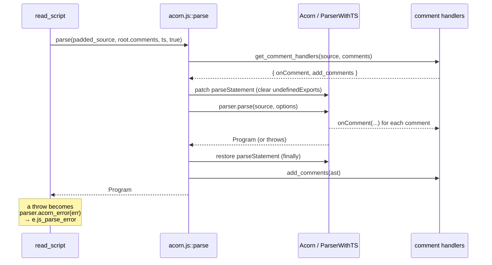
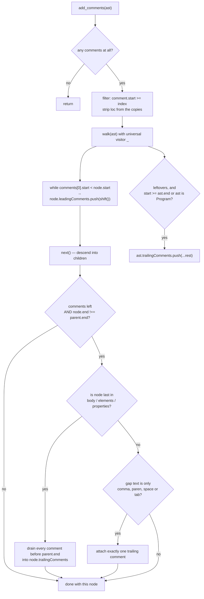
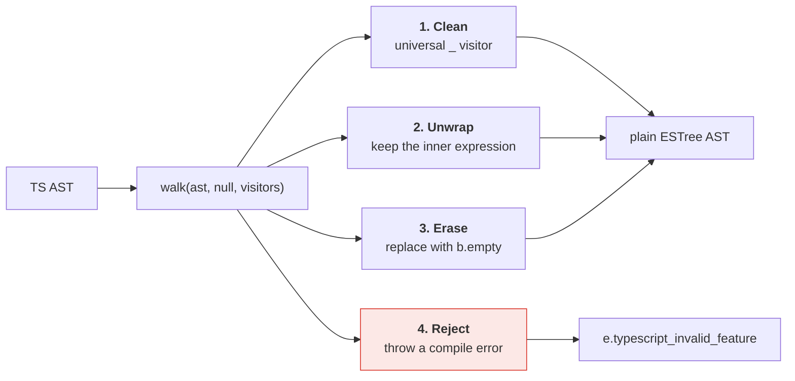
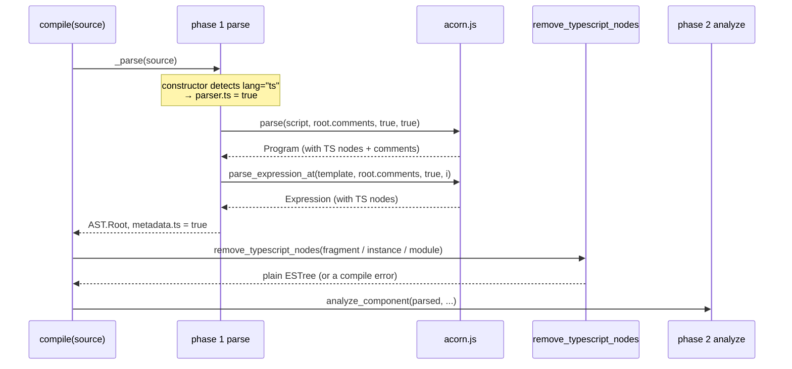
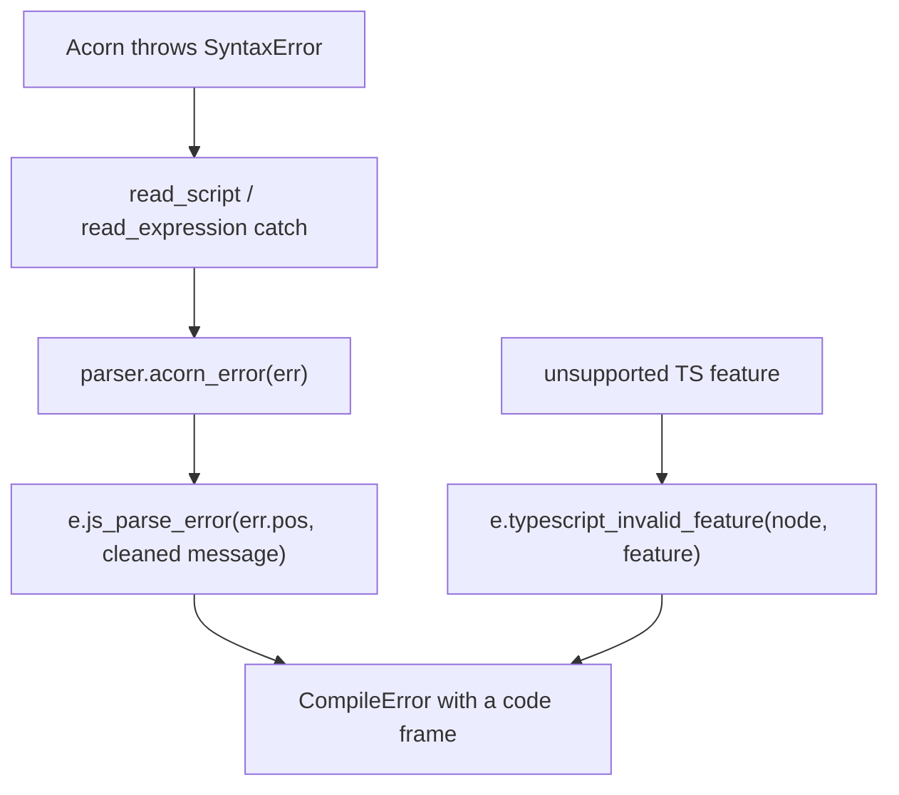

# compiler_parse_js_interop

## 1. What This Module Is

Svelte does not write its own JavaScript parser. It borrows one — [Acorn](https://github.com/acornjs/acorn) — plus a TypeScript plugin. This module is the **thin layer that glues Acorn to the Svelte parser**.

It is two files, and they answer two questions:

| File | Question it answers |
| --- | --- |
| `phases/1-parse/acorn.js` | "How do I get a JS/TS AST out of a piece of my template, with the right offsets and the comments kept?" |
| `phases/1-parse/remove_typescript_nodes.js` | "How do I get rid of the TypeScript-only parts so the rest of the compiler never sees them?" |

Everything else in phase 1 — the state machine, the readers — treats these two files as a black box. Give them a string and a start offset; get back a plain ESTree AST.

### The five core components

```javascript
// acorn.js
export function parse(source, comments, typescript, is_script)        // a whole module
export function parse_expression_at(source, comments, typescript, index) // one expression
function get_comment_handlers(source, comments, index = 0)            // private factory

// remove_typescript_nodes.js
export function remove_typescript_nodes(ast)   // strip all TS syntax
function remove_this_param(node, context)      // drop a leading `this` parameter
```

`get_comment_handlers` is **not exported**. It is a private factory used by both `parse` and `parse_expression_at`, and it holds all of the comment logic in one place.

### Why this module exists at all

Three problems make "just call `acorn.parse`" not good enough:

1. **Offsets must match the original file.** A `{count + 1}` tag sits at character 812 of a `.svelte` file. Its AST nodes must say 812, not 0, or every error message and source map is wrong.
2. **Acorn throws comments away.** Svelte needs them, for `<!-- svelte-ignore -->`-style comments in JS and so `prettier-plugin-svelte` does not delete every comment when it formats.
3. **Acorn's TS plugin produces TS nodes.** The rest of the compiler, and the printer (`esrap`), only understand plain ESTree. Types have to go.

---

## 2. Where It Sits



The two halves run at **different times**:

- `acorn.js` runs *during* parsing, many times, once per script block and once per expression.
- `remove_typescript_nodes` runs **once**, *after* the whole file is parsed, from `compile()` in [compiler_core](compiler_core.md).

---

## 3. `acorn.js` — Getting an AST

### 3.1 The two parser classes

```javascript
const ParserWithTS = acorn.Parser.extend(tsPlugin());
```

This happens once, at module load. Both entry points then pick a class from the `typescript` flag:

```javascript
const parser = typescript ? ParserWithTS : acorn.Parser;
```

The flag comes from `parser.ts`, which the `Parser` constructor computed once by looking for a `lang="ts"` attribute on a `<script>` tag (see [compiler_parse](compiler_parse.md)). So a file is TS or not TS as a whole — never per block.

Both entry points use the same Acorn options:

| Option | Value | Why |
| --- | --- | --- |
| `sourceType` | `'module'` | `import` / `export` are legal; code is strict mode. |
| `ecmaVersion` | `16` | Pinned on purpose. Bumping it is a deliberate, breaking-ish change. |
| `locations` | `true` | Every node gets `loc.start` / `loc.end`, needed for source maps and error frames. |
| `onComment` | from the factory | Collect comments instead of dropping them. |

### 3.2 `parse` — a whole `<script>`

Called by `read_script` (see [compiler_parse_readers_script](compiler_parse_readers_script.md)) and by `analyze_module` for `compileModule`.

The interesting part is the `is_script` flag:

```javascript
if (is_script) {
    parser.prototype.parseStatement = function (...args) {
        const v = parse_statement.call(this, ...args);
        this.undefinedExports = {};   // <- forget the complaint
        return v;
    };
}
```

Acorn normally errors on `export { x }` when `x` was never declared. In a Svelte component that is legal: the value can come from the template or from the other script block. Acorn tracks these as `undefinedExports` and reports them at the end of the parse. Clearing the map after **every** statement means the check never fires.

Two things worth knowing about this trick:

- It patches a **shared prototype**, so the patch is undone in a `finally` block. If it leaked, every later parse would silently lose the check.
- The saved `parse_statement` is read off the prototype chain and written back as an own property. Behaviour is identical; the property just stops being inherited.



`read_script` does not slice the script body out of the file. It replaces every non-newline character *before* the body with a space:

```javascript
const source =
    parser.template.slice(0, script_start).replace(regex_not_newline_characters, ' ') + data;
```

Same length, same line breaks, so Acorn's offsets and line numbers line up with the original `.svelte` file. This padding trick is the whole reason offsets stay honest.

### 3.3 `parse_expression_at` — one expression inside the template

Called from `read_expression`, `read_pattern` (see [compiler_parse_readers_expression](compiler_parse_readers_expression.md)), and from `state/tag.js` for snippet parameter lists.

It hands Acorn the **entire template string** plus an `index`, and uses `parseExpressionAt`. Acorn starts at `index`, reads exactly one expression, and stops. No slicing, so again no offset fixing is needed.

The caller then decides where the cursor really ends. `read_expression` walks past trailing comments and counts unbalanced `(` before the node, because Acorn's `node.end` does not include a wrapping paren or a trailing comment.

`state/tag.js` uses the same padding trick for snippet parameters, building a fake arrow function so Acorn will parse a bare parameter list:

```javascript
const prelude = parser.template.slice(0, params_start).replace(/\S/g, ' ');
parse_expression_at(prelude + `${params} => {}`, parser.root.comments, parser.ts, params_start);
```

### 3.4 `get_comment_handlers` — the comment machinery

The factory returns two functions that share one `comments` array.

**`onComment`** is called by Acorn as it scans. It normalises indentation on multi-line block comments — find the indentation of the comment's own start line, then strip that prefix from every line — and pushes a record:

```javascript
{ type: 'Block' | 'Line', value, start, end, loc }
```

**`add_comments(ast)`** runs after the parse and attaches the collected comments onto nodes as `leadingComments` and `trailingComments`, using a universal `zimmerframe` visitor.



Three details drive the design:

- **Leading is easy, trailing is hard.** Any comment starting before a node clearly belongs to it. A comment *after* a node might belong to that node, its parent, or the next sibling. Hence the `/^[,) \t]*$/` gap test: only a comma, a closing paren, spaces, or tabs may sit between the node and its trailing comment. A newline means "this belongs to whatever comes next".
- **Last-in-body is a special case.** After the final statement in a block there can be several comments separated by newlines, with no following node to claim them. They are all drained onto the last node, stopping at `parent.end`.
- **Root trailing comments matter for tags.** A comment after the root node is kept on the AST itself. `read_expression` reads it back to work out where an expression tag truly ends.

#### The shared comments array

`comments` is `parser.root.comments`, passed by reference, and it is **appended to across the whole parse**. Every script and every expression pushes into the same array.

`add_comments` does *not* consume that array. It first makes a filtered, `loc`-stripped **copy** and shifts from the copy:

```javascript
comments = comments
    .filter((comment) => comment.start >= index)
    .map(({ type, value, start, end }) => ({ type, value, start, end }));
```

So two things stay true at once:

- `root.comments` keeps the full, ordered list for the whole file — used by `read_expression` for cursor movement and exposed on the public AST.
- Each parse only attaches comments at or after its own `index`, so an expression never re-adopts comments that an earlier expression already handled.

---

## 4. `remove_typescript_nodes.js` — Stripping the Types

### 4.1 When it runs

Only from `compile()`, and only when the parser flagged the file as TS:

```javascript
if (parsed.metadata.ts) {
    parsed = {
        ...parsed,
        fragment: parsed.fragment && remove_typescript_nodes(parsed.fragment),
        instance: parsed.instance && remove_typescript_nodes(parsed.instance),
        module:   parsed.module   && remove_typescript_nodes(parsed.module)
    };
    if (combined_options.customElementOptions?.extend) {
        combined_options.customElementOptions.extend =
            remove_typescript_nodes(combined_options.customElementOptions?.extend);
    }
}
```

Note the consequences:

- The **fragment** is walked too, not just the scripts — expressions inside the template can contain `as` casts and `!` assertions.
- `customElementOptions.extend` is a piece of user JS from `<svelte:options>` (see [compiler_parse_readers_options](compiler_parse_readers_options.md)) and gets the same treatment.
- The public `parse()` API **does not** call this. Tools that use `parse()` still see TS nodes. Only `compile()` strips them.
- `compileModule` never needs it — `analyze_module` calls `parse(source, comments, false, false)`, so TS is not even enabled there.

### 4.2 Why strip instead of type-check

Svelte is not a type checker. Types are only noise to it, and `esrap` — the printer used in phase 3 — cannot print TS nodes. The comment in the source is blunt about it:

> TODO there may come a time when we decide to preserve type annotations. until that day comes, we just delete them so they don't confuse esrap.

### 4.3 Four kinds of visitor

`remove_typescript_nodes` is one `zimmerframe` walk with a table of visitors. Every visitor does one of four things.



**1. Clean — the universal `_` visitor.** Runs for every node. It visits children first, then deletes the type-carrying properties:

```javascript
_(node, context) {
    const n = context.next() ?? node;
    delete n.typeAnnotation;
    delete n.typeParameters;
    delete n.typeArguments;
    delete n.returnType;
    delete n.accessibility;
}
```

This is where the bulk of the work happens. `context.next() ?? node` means: use the rewritten node if children changed, otherwise mutate the original in place.

**2. Unwrap — a wrapper that has a real expression inside.**

| Node | Example | Result |
| --- | --- | --- |
| `TSAsExpression` | `x as string` | `x` |
| `TSSatisfiesExpression` | `x satisfies Foo` | `x` |
| `TSNonNullExpression` | `x!` | `x` |
| `TSTypeAssertion` | `<string>x` | `x` |
| `TSInstantiationExpression` | `f<string>` | `f` |
| `TSParameterProperty` | `constructor(private x)` | `x` |

Each one calls `context.visit(node.expression)` (or `node.parameter`), so the wrapper disappears and the inner node is still cleaned.

**3. Erase — replace with `b.empty` (an `EmptyStatement`) from [compiler_core](compiler_core.md)'s builders.**

| Node | Condition |
| --- | --- |
| `ImportDeclaration` | `importKind === 'type'`, or every specifier is a type import |
| `ExportNamedDeclaration` | `exportKind === 'type'`, all-type specifiers, or its declaration erased to nothing |
| `ExportDefaultDeclaration` / `ExportAllDeclaration` | `exportKind === 'type'` |
| `TSInterfaceDeclaration` / `TSTypeAliasDeclaration` | always |
| `TSDeclareFunction` | always |
| `ClassDeclaration` / `VariableDeclaration` | `declare` modifier |
| `MethodDefinition` | `abstract` |
| `TSModuleDeclaration` | body is entirely types (otherwise: error) |

An `EmptyStatement` is used instead of splicing the node out, because a `zimmerframe` visitor must return a node. Statement positions tolerate an empty statement; a missing one would break the parent's shape.

Two containers do real filtering instead:

- `ClassBody` rebuilds `body`, dropping `declare` property definitions.
- `ClassDeclaration` also does `delete node.implements`.

**4. Reject — features Svelte refuses to compile**, all via `e.typescript_invalid_feature`:

| Feature | Why |
| --- | --- |
| Decorators | The TC39 proposal is not stage 4 yet. |
| `accessor` fields | Same reason. |
| `enum` | Enums emit runtime code; stripping them would change behaviour. |
| `private` / `readonly` constructor parameters | Also emit runtime assignments. |
| Namespaces with non-type members | Same — they are not purely types. |

The rule behind all five: **anything that would still exist at runtime cannot simply be deleted.** Erasing it would silently change what the program does, so Svelte errors out instead.

### 4.4 `remove_this_param`

```javascript
function remove_this_param(node, context) {
    if (node.params[0]?.type === 'Identifier' && node.params[0].name === 'this') {
        node.params.shift();
    }
    return context.next();
}
```

TypeScript lets a function declare its `this` type as a fake first parameter:

```typescript
function handler(this: HTMLElement, event: Event) { ... }
```

That parameter is type-only. If it survived, the runtime function would take an extra argument and every real argument would shift by one. It is registered for both `FunctionExpression` and `FunctionDeclaration`.

---

## 5. End-to-End: a TypeScript Component



The ordering rule is worth stating plainly: **parse first, strip second.** The parser must accept TS so that offsets and comments are correct; the stripper cannot run per-block because `remove_typescript_nodes` needs to see whole ASTs (and the fragment) at once.

---

## 6. Error Handling

Errors leave this module by two different doors.



- **Acorn syntax errors** are not caught inside `acorn.js`. They propagate to the caller, which is what lets `read_expression` fall back to `get_loose_identifier` in loose mode. When the caller does give up, `parser.acorn_error` strips Acorn's `(1:5)` position suffix and re-raises through `e.js_parse_error`.
- **TS feature errors** are raised from inside the visitors, with the offending node, so the frame points at the real code. Code frames come from `utils/compile_diagnostic.js` — see [compiler_core](compiler_core.md).

---

## 7. Design Notes and Gotchas

| Decision | Reason | What to watch for |
| --- | --- | --- |
| Pad instead of slice | Keeps offsets and line numbers aligned with the source file | Any new caller must pad, not slice — see `read_script` and `state/tag.js` |
| Shared, growing `root.comments` | One ordered list for the whole file; callers use it for cursor math | `add_comments` must copy-and-filter, never drain the shared array |
| `index` filter in the handlers | Stops a later expression re-adopting earlier comments | Always pass the real start index to `parse_expression_at` |
| Prototype patch for `is_script` | Cheapest way to disable Acorn's `undefinedExports` check | The `finally` restore is load-bearing; do not add an early `return` |
| `ecmaVersion: 16` pinned | Predictable, reviewable syntax support | Bumping it lets new syntax through into phases 2 and 3 unannounced |
| Types deleted, not preserved | `esrap` cannot print TS nodes; Svelte does not type-check | If a new TS node type appears, the universal `_` visitor will not know it — add a visitor |
| `b.empty` instead of removal | Visitors must return a node | Parents that count children (`ClassBody`) filter explicitly instead |
| Error on runtime-affecting TS | Deleting it would change behaviour | Enums, decorators, param properties, `accessor`, value namespaces |

### Adding support for a new TS syntax node

1. Decide which of the four buckets it belongs in: clean, unwrap, erase, or reject.
2. If it is purely a type, erase it with `b.empty` or let the universal `_` visitor delete the property.
3. If it wraps an expression, `return context.visit(node.expression)`.
4. If it produces runtime code, call `e.typescript_invalid_feature` with a short reason — and add a message to `errors.js`.
5. Check the parent containers. `ClassBody` and the export visitors filter children and may need a matching change.

---

## 8. Related Modules

| Module | Relationship |
| --- | --- |
| [compiler_parse](compiler_parse.md) | Owns the `Parser` class, `parser.ts`, `root.comments`, and `acorn_error` |
| [compiler_parse_readers](compiler_parse_readers.md) | The main caller — every reader that needs JS goes through `acorn.js` |
| [compiler_parse_readers_script](compiler_parse_readers_script.md) | Calls `parse` with `is_script = true`; owns the whitespace padding |
| [compiler_parse_readers_expression](compiler_parse_readers_expression.md) | Calls `parse_expression_at`; owns cursor recovery and loose-mode fallback |
| [compiler_parse_state_machine_tag](compiler_parse_state_machine_tag.md) | Calls `parse_expression_at` for snippet parameter lists |
| [compiler_parse_readers_options](compiler_parse_readers_options.md) | Produces `customElementOptions.extend`, which is later stripped |
| [compiler_core](compiler_core.md) | Calls `remove_typescript_nodes` from `compile()`; provides `b.empty` and code frames |
| [compiler_analyze](compiler_analyze.md) | First consumer of the cleaned AST; also calls `parse` directly for `compileModule` |
| [compiler_ast_types](compiler_ast_types.md) | Declares `AST.JSComment` and the node shapes used here |
