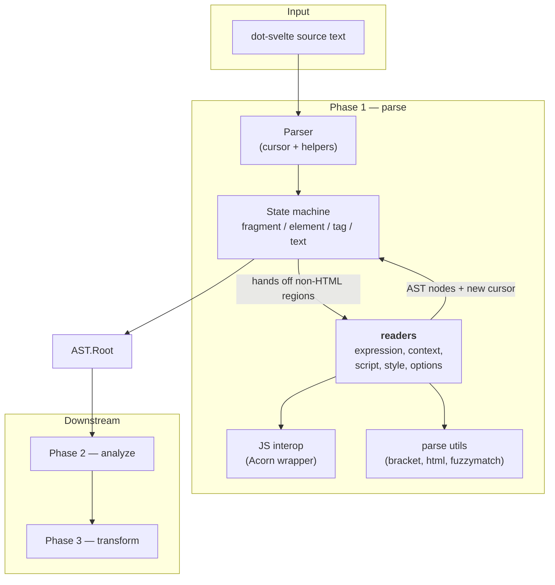
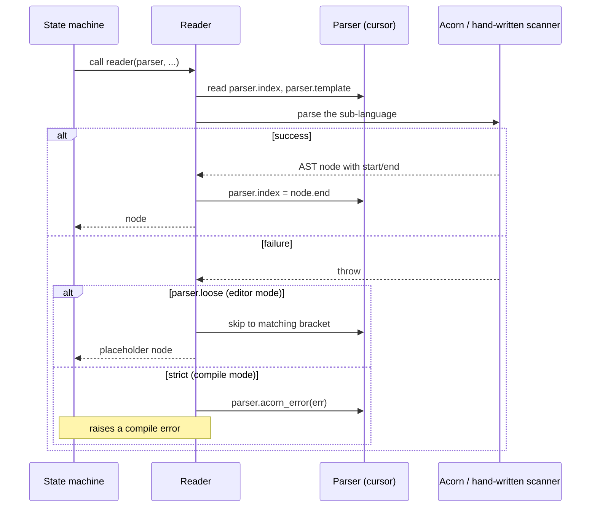
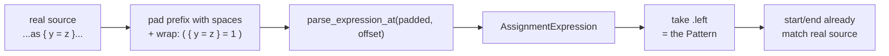
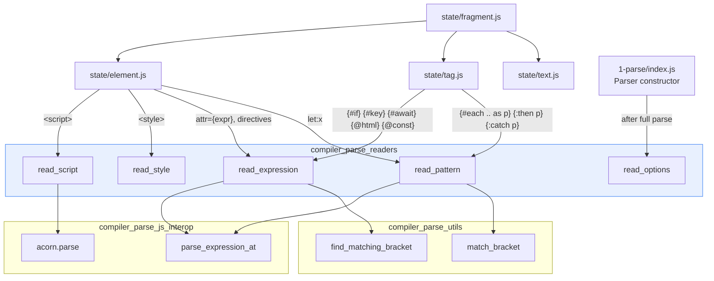
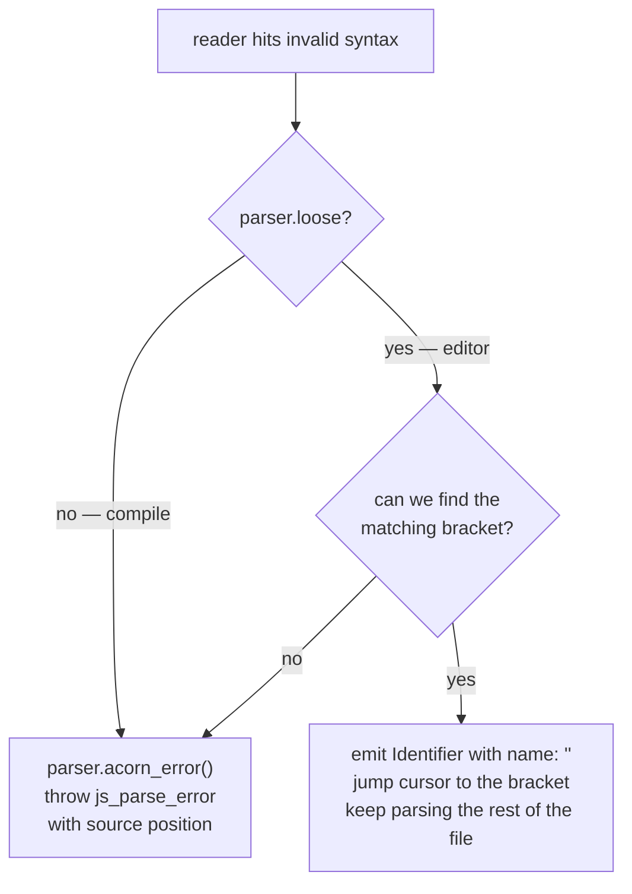

# compiler_parse_readers

## 1. What This Module Is

The **readers** are the part of Svelte's template parser that handle everything
which is *not* plain HTML markup.

Svelte's `.svelte` file is a mix of four different languages:

| Language | Where it appears | Who reads it |
| --- | --- | --- |
| HTML-like markup | anywhere | the state machine (see [compiler_parse_state_machine](compiler_parse_state_machine.md)) |
| JavaScript / TypeScript **expressions** | `{...}`, attribute values, block heads | `read/expression.js` |
| JavaScript / TypeScript **patterns** | `{#each list as x}`, `{:then x}` | `read/context.js` |
| A whole JS/TS **program** | ``, hands the body to Acorn as a full `Program`,
and validates the tag's attributes (`module`, the legacy `context="module"`,
`lang`, `generics`). Produces the `AST.Script` node that becomes `root.js`.

### 4.4 Options reader → [compiler_parse_readers_options](compiler_parse_readers_options.md)

File: `read/options.js`

Turns the already-parsed `<svelte:options>` element into a typed
`AST.SvelteOptions` object: `runes`, `namespace`, `css`, `customElement`
(including its nested `props` / `shadow` / `extend` shape and custom-element tag
name validation), plus the legacy `immutable` / `accessors` /
`preserveWhitespace` flags.

Unlike the other four, this one runs **after** the template is fully parsed —
the `Parser` constructor pulls the `SvelteOptions` node out of the root fragment
and calls `read_options` on it. So it takes a *node*, not the parser.

---

## 5. Who Calls What

---

## 6. Strict Mode vs Loose Mode

The parser has a `loose` flag. The compiler sets it to `false`; the Svelte
language server sets it to `true` so it can still produce a tree for half-typed
code.

The placeholder node — an `Identifier` whose `name` is the empty string — is the
signal downstream phases use to mean *"there was an expression here, but we do
not know what it was."*

One important exception lives in `{#each}`: `read_expression` accepts a
`disallow_loose` flag. `{#each x as { y = z }}` legitimately fails as an
expression, and the `{#each}` handler *needs* that failure so it can backtrack
to the `as` keyword and re-read the tail as a pattern. Suppressing the throw
would break that recovery. See
[compiler_parse_state_machine_tag](compiler_parse_state_machine_tag.md).

---

## 7. Error and Warning Surface

The readers are one of the loudest sources of user-facing diagnostics:

| Kind | Examples |
| --- | --- |
| JS parse errors | `js_parse_error`, `expected_token`, `expected_pattern` |
| Script errors | `element_unclosed`, `script_reserved_attribute`, `script_invalid_attribute_value`, `script_invalid_context` |
| Script warnings | `script_unknown_attribute` |
| CSS errors | `css_selector_invalid`, `css_expected_identifier`, `css_empty_declaration`, `unexpected_eof` |
| Options errors | `svelte_options_unknown_attribute`, `svelte_options_invalid_customelement`, `svelte_options_invalid_tagname`, `svelte_options_reserved_tagname`, `svelte_options_deprecated_tag` |

All of them are raised through the shared `errors.js` / `warnings.js` helpers and
carry absolute source offsets, which is what lets
[compiler_core](compiler_core.md)'s `get_code_frame` print a pointer at the exact
character.

---

## 8. Documentation Map

### Sub-modules of `compiler_parse_readers`

| Document | Source files | Covers |
| --- | --- | --- |
| [compiler_parse_readers_expression](compiler_parse_readers_expression.md) | `read/expression.js`, `read/context.js` | `read_expression`, `get_loose_identifier`, `read_pattern`, `read_type_annotation` |
| [compiler_parse_readers_style](compiler_parse_readers_style.md) | `read/style.js` | `read_style`, `read_selector`, `read_at_rule`, `read_declaration` |
| [compiler_parse_readers_script](compiler_parse_readers_script.md) | `read/script.js` | `read_script` |
| [compiler_parse_readers_options](compiler_parse_readers_options.md) | `read/options.js` | `read_options` |

### Suggested reading order

1. **[compiler_parse_readers_expression](compiler_parse_readers_expression.md)** —
   establishes the cursor contract and the offset-preservation trick that the
   others reuse.
2. **[compiler_parse_readers_script](compiler_parse_readers_script.md)** — the
   simplest reader; a good place to see the contract with less noise.
3. **[compiler_parse_readers_options](compiler_parse_readers_options.md)** —
   pure validation, no cursor work.
4. **[compiler_parse_readers_style](compiler_parse_readers_style.md)** — the
   biggest, and independent of everything else.

### Neighbouring modules

| Document | Why you would go there |
| --- | --- |
| [compiler_parse](compiler_parse.md) | Parent module — the `Parser` class and phase-1 entry point |
| [compiler_parse_state_machine](compiler_parse_state_machine.md) | The caller of every reader |
| [compiler_parse_state_machine_element](compiler_parse_state_machine_element.md) | Calls `read_script`, `read_style`, `read_expression` |
| [compiler_parse_state_machine_tag](compiler_parse_state_machine_tag.md) | Calls `read_expression` / `read_pattern` for blocks; owns the `{#each}` backtracking |
| [compiler_parse_js_interop](compiler_parse_js_interop.md) | The Acorn wrapper the JS readers delegate to |
| [compiler_parse_utils](compiler_parse_utils.md) | `find_matching_bracket`, `match_bracket`, entity decoding |
| [compiler_ast_types](compiler_ast_types.md) | Shape of every node the readers build |
| [compiler_css_transform](compiler_css_transform.md) | What later happens to the CSS AST |
| [compiler_core](compiler_core.md) | Diagnostic rendering (`get_code_frame`) |
