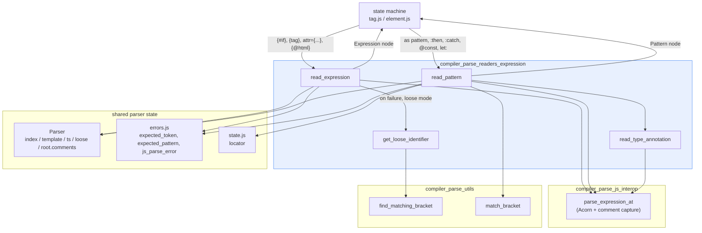
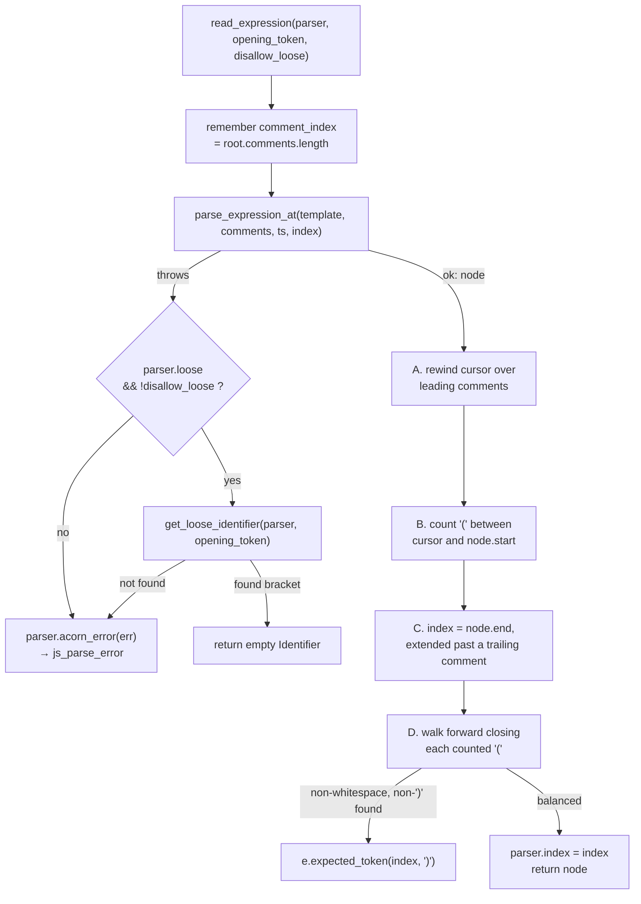
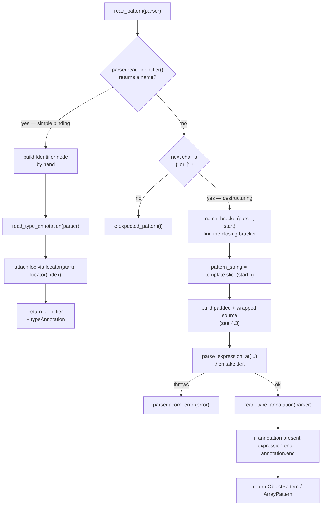
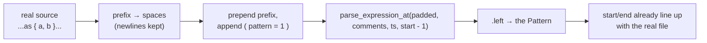
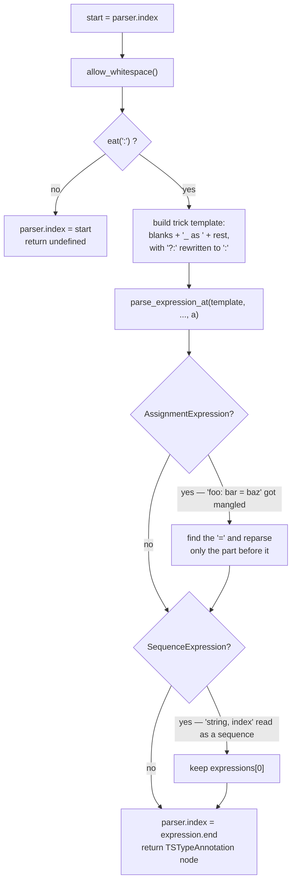
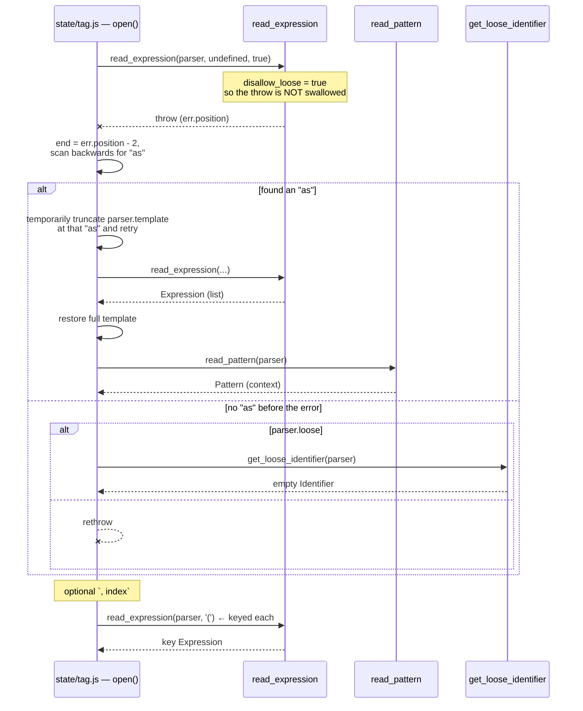
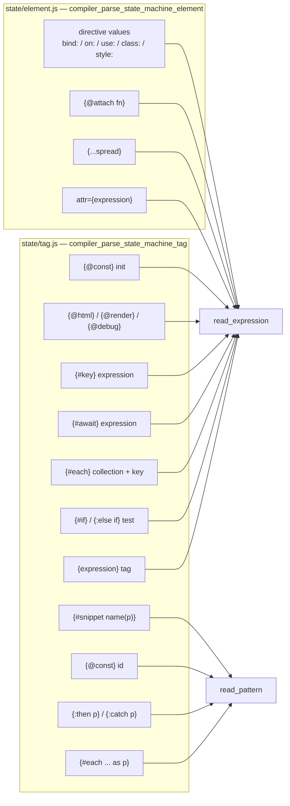
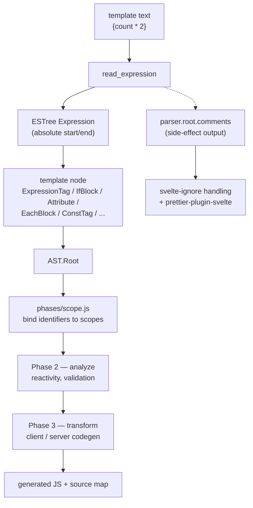

# compiler_parse_readers_expression

## 1. What This Module Is

This module is the bridge between Svelte's template language and JavaScript.

A `.svelte` file is mostly HTML-like markup, but small pieces of it are real
JavaScript (or TypeScript). Two kinds of pieces:

| Kind | Example | Read by |
| --- | --- | --- |
| **Expression** — something that produces a value | `{count * 2}`, `{#if ready}`, `class={cls}` | `read_expression` |
| **Pattern** — something that receives a value (destructuring) | `{#each list as { a, b }}`, `{:then value}`, `{@const x = 1}` | `read_pattern` |

Two files do the whole job:

- `packages/svelte/src/compiler/phases/1-parse/read/expression.js`
  - `read_expression` (default export) — read one JS expression
  - `get_loose_identifier` — build a placeholder when reading fails
- `packages/svelte/src/compiler/phases/1-parse/read/context.js`
  - `read_pattern` (default export) — read one JS binding pattern
  - `read_type_annotation` (module-private) — read the `: Type` part after a pattern

They are the most-called readers in the parser. Every mustache in every Svelte
component goes through one of them.

The module does **not** implement a JavaScript parser. Acorn does that. What this
module implements is the three hard things Acorn cannot do on its own:

1. **Know where the expression ends.** Acorn is happy to stop early; the parser
   needs the exact character where the JS ends and the template resumes.
2. **Make invalid-in-isolation snippets parseable.** `{ y = z }` is not a valid
   expression, and `: string` is not valid anything. Both must be wrapped in fake
   syntax before Acorn will accept them — without breaking source positions.
3. **Fail softly when asked.** In editor (loose) mode, a broken expression must
   become a placeholder node instead of killing the whole parse.

For the shared reader contract, the cursor rules, and how this module compares
to the other four readers, see
[compiler_parse_readers](compiler_parse_readers.md).

---

## 2. Where It Sits



Related modules:

- [compiler_parse_readers](compiler_parse_readers.md) — parent module; the shared
  reader contract.
- [compiler_parse_state_machine_tag](compiler_parse_state_machine_tag.md) — the
  heaviest caller (`{#if}`, `{#each}`, `{#await}`, `{#key}`, `{@html}`,
  `{@const}`, `{@render}`, `{@debug}`).
- [compiler_parse_state_machine_element](compiler_parse_state_machine_element.md) —
  attribute values, `{...spread}`, `{@attach}`, directive expressions.
- [compiler_parse_js_interop](compiler_parse_js_interop.md) — `parse_expression_at`,
  the Acorn/acorn-typescript wrapper and comment collector.
- [compiler_parse_utils](compiler_parse_utils.md) — `find_matching_bracket` and
  `match_bracket`.
- [compiler_ast_types](compiler_ast_types.md) — the node shapes produced here.
- [compiler_core](compiler_core.md) — `phases/scope.js` later walks these nodes to
  resolve every identifier.

---

## 3. `read_expression`

### 3.1 Signature

```js
read_expression(parser, opening_token?, disallow_loose?) => Expression
```

| Parameter | Meaning |
| --- | --- |
| `parser` | The whole `Parser`. Gives the cursor (`index`), the source (`template`), the TypeScript flag (`ts`), the `loose` flag, and the shared `root.comments` array. |
| `opening_token` | Which bracket opened this region — `'{'` by default, `'('` for `{#each}` keys. Only used by the loose fallback, so it knows which closing bracket to hunt for. |
| `disallow_loose` | When `true`, never fall back to a placeholder — rethrow instead. `{#each}` needs this (see §5). |

On success `parser.index` points just past the expression, and the caller
normally does `parser.allow_whitespace(); parser.eat('}', true)`.

### 3.2 The flow



### 3.3 Why steps A–D exist

These four fix-ups are the real content of the function. Each one exists because
Acorn's idea of a node's span is narrower than the template's idea of the region.

**A. Rewind over leading comments.**
`parse_expression_at` records comments into `parser.root.comments` as a
side effect. Any comment that ended *before* the node started is a leading
comment, e.g. `{/* note */ value}`. The loop walks the newly-added comments
backwards and moves `parser.index` to the end of the first one it finds that sits
before `node.start`. This keeps the cursor from being left behind the comment
text.

**B + D. Balance the parentheses Acorn dropped.**
Acorn returns the *inner* expression for `{((foo))}` — its `start` is at `foo`,
not at the first `(`. If the reader trusted `node.end`, the cursor would land on
`)` and the caller's `eat('}')` would fail with a confusing message.

So step B counts every `(` between the cursor and `node.start`, and step D walks
forward from `node.end` consuming exactly that many `)`. Anything other than
whitespace or `)` in that stretch is a real syntax error →
`e.expected_token(index, ')')`.

```
template:   { ( ( foo ) ) }
             ^             cursor before
               ^ ^         step B counts 2
                   ^^^     Acorn's node
                        ^ ^ step D consumes 2
                            ^ cursor ends here
```

**C. Extend past a trailing comment.**
`{value /* done */}` — Acorn's node ends at `value`, but the region really ends
after the comment. If the last collected comment ends after `node.end`, the
cursor is pushed to the comment's end instead. Without this, `eat('}')` would
choke on the `/`.

### 3.4 `get_loose_identifier`

```js
get_loose_identifier(parser, opening_token?) => Expression | undefined
```

The soft-failure escape hatch. It asks
[`find_matching_bracket`](compiler_parse_utils.md) for the closing bracket that
matches `opening_token` (default `'{'`), starting from the current cursor.
`find_matching_bracket` is bracket-aware *and* string/comment/regex-aware, so a
`}` inside `"a}b"` does not fool it.

If a bracket is found it:

- jumps `parser.index` to that bracket, and
- returns `{ type: 'Identifier', start, end, name: '' }`.

The **empty `name`** is the signal. It means *"there was an expression here and we
do not know what it was."* Downstream phases treat it as an unknown value rather
than a variable called `""`.

If no matching bracket exists, it returns `undefined` and the caller falls
through to a hard error — there is nothing sensible to skip to.

It is exported (not just used internally) because `{#each}` calls it directly
after its own backtracking attempt gives up.

---

## 4. `read_pattern` and `read_type_annotation`

### 4.1 Two shapes of pattern



The simple branch is hand-built rather than delegated to Acorn — for a bare
identifier that is both faster and easier to position exactly. Note it is the
only place in this module that calls `locator` (from
`packages/svelte/src/compiler/state.js`) to attach a `loc` with line/column.

### 4.2 Why the destructuring branch needs a trick

`{#each list as { a, b }}` — the text `{ a, b }` on its own is parsed by Acorn as
a *block statement*, not an object pattern. `[a, b]` parses as an array
*expression*, not an array pattern. Patterns only exist in JavaScript on the left
side of an assignment.

So the reader manufactures one:

```
parse `( { a, b } = 1 )`  →  AssignmentExpression  →  take `.left`  →  ObjectPattern
```

### 4.3 Keeping the offsets honest

The wrapped string is not the real source, so positions would normally be wrong.
The fix is to reproduce the real prefix as whitespace of the same length, keeping
newlines so line numbers survive:



One subtlety: the wrapper adds a `(` in front, which shifts everything right by
one character. To cancel that out the code deletes the **first space** from the
padding, and parses at `start - 1`. Result: columns come out exactly right
without any post-processing.

```js
// prefix of the file, turned into blanks
let space_with_newline = parser.template
    .slice(0, start)
    .replace(regex_not_newline_characters, ' ');
// remove one space to compensate for the injected '('
const first_space = space_with_newline.indexOf(' ');
space_with_newline =
    space_with_newline.slice(0, first_space) + space_with_newline.slice(first_space + 1);
```

### 4.4 `read_type_annotation`

Runs after both pattern shapes. Its job: if the next non-whitespace character is
`:`, read the TypeScript type that follows.



Three separate hacks live in this one function, and each maps to a real Svelte
snippet:

| Trick | Fixes | Example |
| --- | --- | --- |
| Wrap as `_ as <Type>` | a bare type is not parseable; a `TSAsExpression` is | `{#each x as y: string}` |
| Rewrite `?\s*:` to `:` | acorn-typescript reads later function params as a sequence and then errors on optional params | `(a: string, b?: number) => void` |
| Unwrap `AssignmentExpression` / `SequenceExpression` | the type text runs into the template text that follows it | `foo: bar = baz`, `as item: string, index` |

The returned node is a synthetic `TSTypeAnnotation` whose `start` is the `:` and
whose `end` is the parser's new cursor — again so the span matches the real file.
TypeScript-only nodes like this are stripped later; see
[compiler_parse_js_interop](compiler_parse_js_interop.md).

---

## 5. The `{#each}` Special Case

This is the one place where the two readers interact in a non-obvious way, and
it is the reason `read_expression` has a `disallow_loose` parameter.

The head of an each block is `{#each <expression> as <pattern>}`. The parser does
not know where the expression stops, so it just calls `read_expression` — which
happily swallows the `as ...` part and then fails, because `as { y = z }` is not
a valid expression tail.

`{#each}` turns that failure into information:



Two things to notice:

- `disallow_loose: true` is what makes the backtracking possible. If loose mode
  swallowed the error into a placeholder, `{#each}` would never learn where the
  `as` is, and every destructured each block would silently lose its pattern.
- The keyed form `{#each list as item (item.id)}` passes `opening_token = '('`,
  so if *that* expression fails in loose mode the fallback looks for `)` rather
  than `}`.

`{#each}` also handles a related mess after a successful parse: TypeScript's
`as` operator collides with Svelte's `as` keyword, so it unwraps a stray
`TSAsExpression` and rewinds the cursor to the `as`. Details in
[compiler_parse_state_machine_tag](compiler_parse_state_machine_tag.md).

---

## 6. All Call Sites



Callers frequently do a **shape check** on the returned node instead of asking
the reader for a narrower grammar. Examples from `state/tag.js`:

| Caller | Check | Error if it fails |
| --- | --- | --- |
| `{@debug ...}` | every item is an `Identifier` (a `SequenceExpression` is split first) | `debug_tag_invalid_arguments` |
| `{@render ...}` | node is a `CallExpression` (or a `ChainExpression` wrapping one) | `render_tag_invalid_expression` |
| `{@const ...}` | not a bare `SequenceExpression` — unless it was parenthesised | `const_tag_invalid_expression` |

This keeps the reader generic: it always returns "one JS expression", and the
caller decides what is acceptable in that position.

---

## 7. Data Flow Out of the Module



Two outputs, not one:

1. **The returned node**, embedded in a template node by the caller. Every block
   and tag that holds an expression also gets an `expression` metadata slot
   (`create_expression_metadata()`), which phase 2 fills in with dependency
   information.
2. **Comments pushed into `parser.root.comments`**, as a side effect of
   `parse_expression_at`. These are what make `<!-- svelte-ignore -->` inside JS
   work and what stops `prettier-plugin-svelte` from deleting comments on
   format. The comment array is shared across the whole parse, which is exactly
   why `read_expression` has to snapshot `comments.length` before parsing.

Because every node carries absolute offsets into the original file, the whole
chain down to source maps and editor diagnostics keeps working. Getting an
offset wrong here shows up much later as a source map that points at the wrong
line — which is why so much of this module is offset bookkeeping.

---

## 8. Error Surface

| Error | Raised by | When |
| --- | --- | --- |
| `js_parse_error` | `parser.acorn_error(err)` in both files | Acorn rejected the snippet and loose recovery was unavailable. The position indicator Acorn appends to the message is stripped first. |
| `expected_token(index, ')')` | `read_expression` step D | Unbalanced parentheses around an expression, e.g. `{(foo}`. |
| `expected_pattern(i)` | `read_pattern` | A binding position that starts with neither an identifier nor `{` / `[`, e.g. `{#each list as 1}`. |
| `expected_token` / `unexpected_eof` / `unterminated_string_constant` | `match_bracket` (utils) | Mismatched or unterminated brackets/quotes while scanning a destructuring pattern. |

All carry absolute offsets, which is what lets `get_code_frame` in
[compiler_core](compiler_core.md) print a caret at the exact character.

---

## 9. Things to Know Before Changing This Code

- **Never leave `parser.index` in the middle of a region.** Every caller
  immediately does `allow_whitespace()` then `eat('}')`. An off-by-one here turns
  into a nonsense error message somewhere else in the file.
- **Padding length must match the real prefix exactly.** In `read_pattern` and
  `read_type_annotation`, if the blanked-out prefix is one character too short or
  long, every position in that node is wrong — silently, until someone looks at a
  source map.
- **Do not "clean up" the parenthesis counting.** Steps B and D of
  `read_expression` look redundant but are the only thing making `{((x))}` work.
- **Do not make `{#each}` use loose mode.** `disallow_loose` is load-bearing; see
  §5.
- **`name: ''` is a protocol, not a bug.** Downstream code checks for it. Do not
  replace the placeholder with `null` or a made-up name.
- **Comment bookkeeping is shared mutable state.** `parser.root.comments` grows
  during the whole parse. Any new logic that inspects it must snapshot the length
  first, exactly like `read_expression` does.
