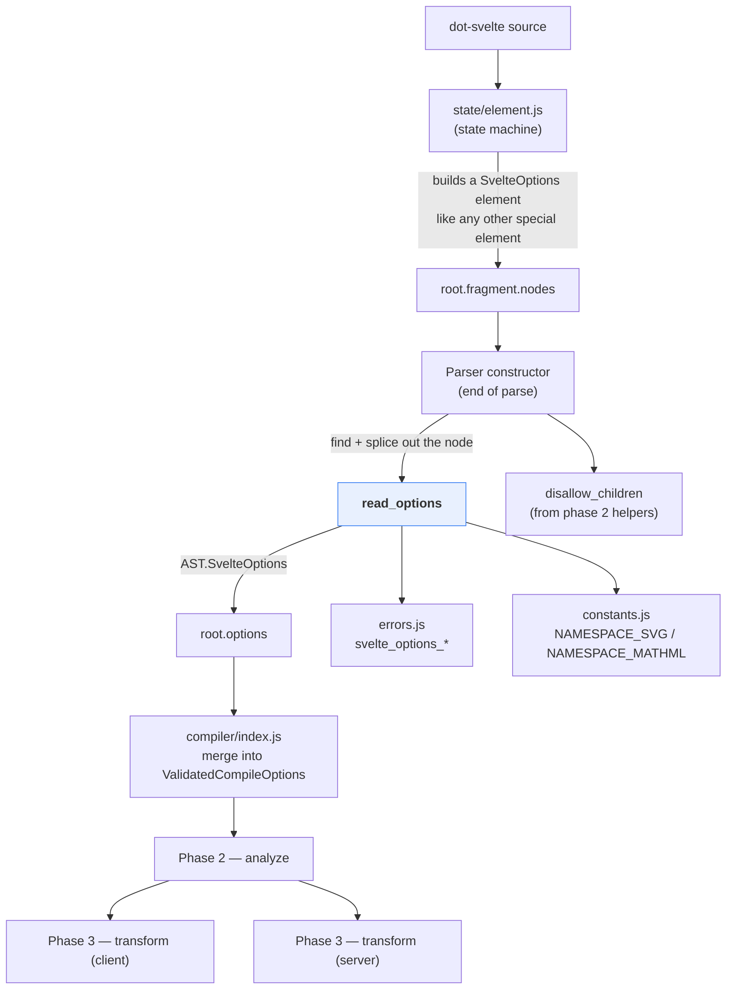
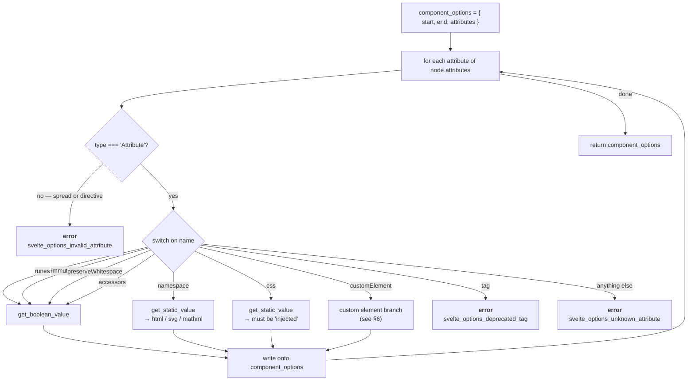
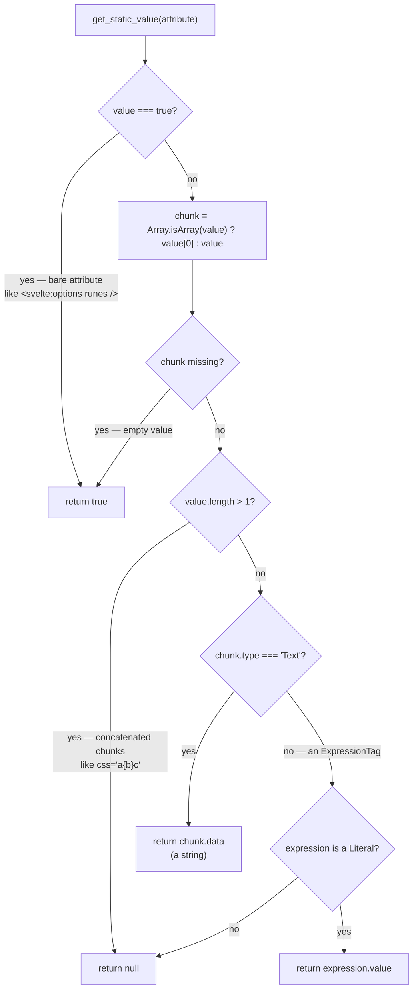
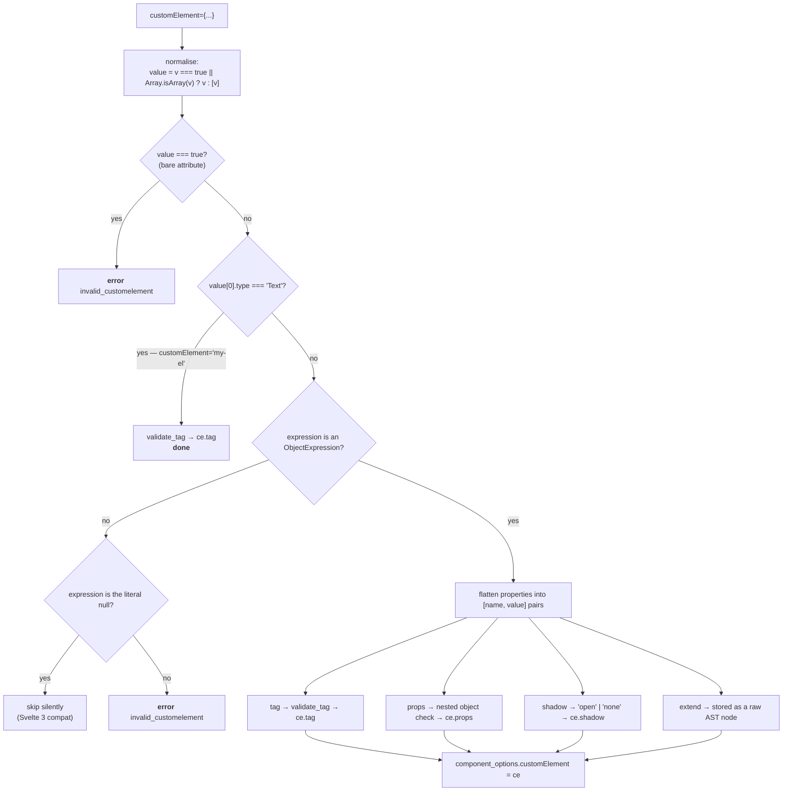
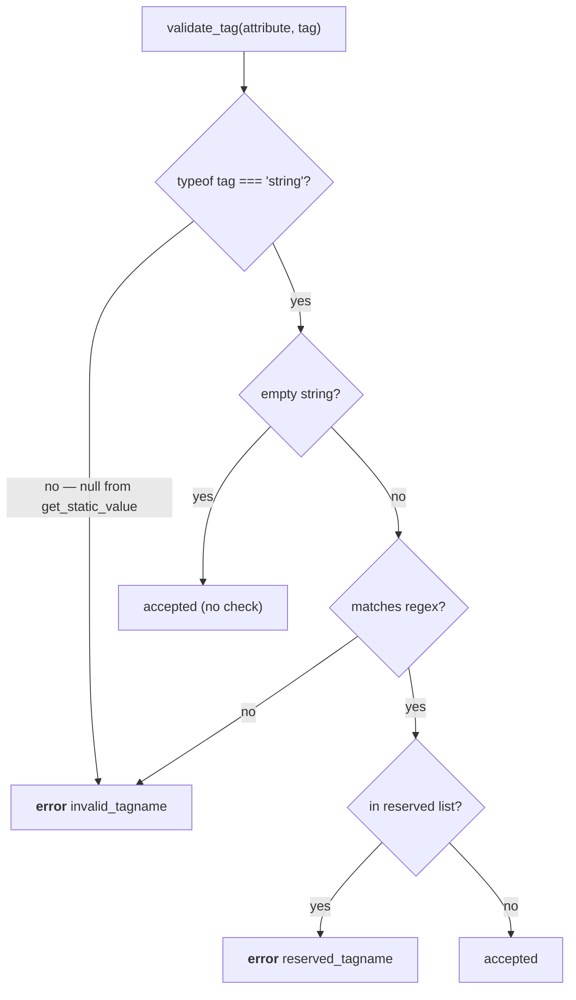
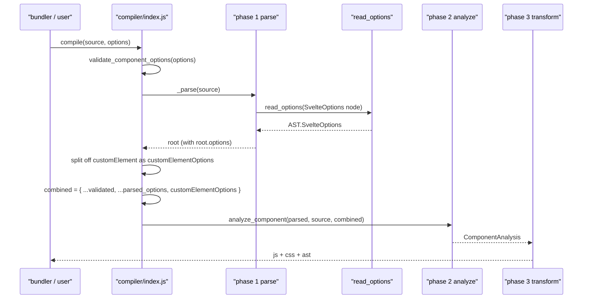

# compiler_parse_readers_options

## 1. What This Module Is

This module is one function: **`read_options`**, in
`packages/svelte/src/compiler/phases/1-parse/read/options.js`.

Its job is to turn the `<svelte:options />` tag of a component into a small,
plain settings object (`AST.SvelteOptions`) that the rest of the compiler can
read without ever looking at the template again.

```svelte
<svelte:options runes={true} namespace="svg" customElement={{ tag: 'my-widget' }} />
```

becomes

```js
{
  start: 0,
  end: 78,
  runes: true,
  namespace: 'svg',
  customElement: { tag: 'my-widget' },
  attributes: [ /* the raw Attribute nodes, kept on purpose */ ]
}
```

Two ideas explain almost everything in the file:

1. **Everything must be static.** `<svelte:options>` is read at *compile* time.
   There is no component instance, no scope, no runtime. So only literals are
   allowed — no variables, no function calls, no template strings.
2. **Be strict, and fail early.** Every unknown attribute, every wrong value
   type, every bad custom-element tag name is a hard compile error, thrown right
   here in phase 1. Later phases can therefore trust the object completely.

It is the odd one out among the five readers described in
[compiler_parse_readers](compiler_parse_readers.md): the other four move the
parser cursor through raw source text, while this one runs **after** parsing is
finished and only walks an AST node that already exists. See §3.2.

---

## 2. Where It Sits



Related modules:

- [compiler_parse_readers](compiler_parse_readers.md) — the parent module and the
  shared reader contract that this reader deliberately breaks.
- [compiler_parse](compiler_parse.md) — the `Parser` class; its constructor is the
  only caller.
- [compiler_parse_state_machine_element](compiler_parse_state_machine_element.md) —
  builds the `SvelteOptions` element node and its attributes in the first place.
- [compiler_ast_types](compiler_ast_types.md) — the `AST.SvelteOptionsRaw`,
  `AST.SvelteOptions` and `AST.Root` shapes.
- [compiler_options_and_warnings](compiler_options_and_warnings.md) — the
  `svelte_options_*` errors thrown here, and the *compile-time* option schema
  (`validate-options.js`) that these values are merged on top of.
- [compiler_core](compiler_core.md) — `compiler/index.js`, where the merge happens.
- [compiler_analyze](compiler_analyze.md) — turns the merged options into
  `analysis.runes`, `analysis.accessors`, `analysis.inject_styles`, and re-reads
  `root.options.attributes` to emit deprecation warnings.
- [compiler_legacy_ast_types](compiler_legacy_ast_types.md) — consumer of the
  hidden `__raw__` back-pointer (§8.2).

---

## 3. The Signature and the Contract

```js
export default function read_options(node) // → AST.Root['options']
```

| Parameter | Meaning |
| --- | --- |
| `node` | The `AST.SvelteOptionsRaw` element — a normal element node with `type: 'SvelteOptions'`, `name: 'svelte:options'`, `start`, `end`, `attributes`, `fragment`. |

Returns an `AST.SvelteOptions` object. Throws (never returns) on any invalid
attribute.

### 3.1 How the caller uses it

From the `Parser` constructor, after the whole template has been consumed:

```js
const options_index = this.root.fragment.nodes.findIndex((t) => t.type === 'SvelteOptions');

if (options_index !== -1) {
    const options = this.root.fragment.nodes[options_index];
    this.root.fragment.nodes.splice(options_index, 1);   // remove from the tree
    this.root.options = read_options(options);           // this module
    disallow_children(options);                          // no children allowed
    Object.defineProperty(this.root.options, '__raw__', { value: options, enumerable: false });
}
```

Three things happen around the call that are worth naming:

- **The node is spliced out of the fragment.** `<svelte:options>` is
  configuration, not markup, so it must not reach the renderers. After this line
  no visitor in phase 2 or 3 will ever see a `SvelteOptions` node.
- **`disallow_children`** rejects `<svelte:options>hi</svelte:options>`. That check
  lives in the phase-2 shared helpers and is simply reused here.
- **`__raw__`** is a hidden (non-enumerable) link back to the original element,
  needed only by the legacy AST converter.

Only the **first** `SvelteOptions` node is handled — `findIndex` stops at one.
Duplicate `<svelte:options>` tags are rejected earlier, by the state machine's
"only one of these special elements" rule.

### 3.2 Why this reader is different

| | The other four readers | `read_options` |
| --- | --- | --- |
| Input | raw source text + `parser.index` | a finished AST node |
| Moves the cursor? | yes | no |
| When it runs | during the state-machine walk | after the walk finishes |
| Needs `Parser`? | yes | no — it is a pure function |
| Sub-parser used | Acorn / CSS scanner | none |

The reason is ordering. `<svelte:options>` may legally appear anywhere in the
file, including the last line. Its attributes were already parsed as ordinary
element attributes by
[compiler_parse_state_machine_element](compiler_parse_state_machine_element.md).
So there is nothing to tokenize — only to *interpret*. Doing that as a small
post-pass keeps the state machine free of special cases, and makes
`read_options` trivially unit-testable: give it a node, get an object.

---

## 4. The Main Loop



The first check is the one that enforces "static only". Anything that is not a
plain `Attribute` node — a spread like `<svelte:options {...config} />`, or a
directive like `bind:` / `on:` — is rejected immediately, because a spread's
contents cannot be known at compile time.

### 4.1 The supported attributes

| Attribute | Accepted values | Stored as | Notes |
| --- | --- | --- | --- |
| `runes` | `true` / `false` | `runes?: boolean` | Forces runes or legacy mode for this one file. |
| `immutable` | `true` / `false` | `immutable?: boolean` | Legacy only; warned as deprecated in runes mode. |
| `accessors` | `true` / `false` | `accessors?: boolean` | Legacy only; warned as deprecated in runes mode. |
| `preserveWhitespace` | `true` / `false` | `preserveWhitespace?: boolean` | Keeps template whitespace as written. |
| `namespace` | `"html"`, `"svg"`, `"mathml"`, or the full XML namespace URL | `namespace?: Namespace` | URLs are normalised to the short name. |
| `css` | `"injected"` only | `css?: 'injected'` | The only value that ever made sense per-component. |
| `customElement` | string tag, or an object literal, or `null` | `customElement?: {...}` | See §6. |
| `tag` | — | — | Always an error; use `customElement`. |

Two design points show up in this table:

- **`tag` gets its own error case instead of falling into "unknown attribute".**
  It was the Svelte 3 spelling of `customElement`. A dedicated message
  (`"tag" option is deprecated — use "customElement" instead`) is far more useful
  than a generic one.
- **The switch has no fall-through and no dedup.** Writing the same attribute
  twice just overwrites the earlier value. Last one wins, silently.

---

## 5. Reading Static Values

Two tiny private helpers do all the value extraction. Everything else in the file
is validation on top of them.



`get_boolean_value` is a thin wrapper: call `get_static_value`, and if the result
is not a real `boolean`, throw `svelte_options_invalid_attribute_value(attribute,
'true or false')`.

Worked examples:

| Source | `get_static_value` | Result |
| --- | --- | --- |
| `runes` | `true` | ok, `runes: true` |
| `runes={true}` | `true` | ok |
| `runes={false}` | `false` | ok |
| `runes="true"` | `"true"` (a string) | **error** — a quoted string is not a boolean |
| `runes={enabled}` | `null` (Identifier, not Literal) | **error** |
| `namespace="svg"` | `"svg"` | ok |
| `namespace="http://www.w3.org/2000/svg"` | the URL | ok, normalised to `"svg"` |
| `css="inj{x}ected"` | `null` (two chunks) | **error** |

The `null` return is the "I could not statically determine this" signal. It is
never a valid option value, so every caller ends up throwing on it — either via
`get_boolean_value`, or via the explicit `else` branches for `namespace` and
`css`, or via `validate_tag` for custom-element tags.

Note the deliberate leniency in the `value.length > 1` and non-`Literal` cases:
the helper **returns** `null` rather than throwing. That keeps the error message
in the caller, where the caller knows what the allowed values actually are
(`"html", "mathml" or "svg"` reads much better than a generic complaint).

---

## 6. The `customElement` Branch

This one branch is more than half the file, because `customElement` accepts two
completely different shapes plus one backwards-compatibility escape hatch.



### 6.1 The two accepted shapes

```svelte
<!-- short form: just the tag name -->
<svelte:options customElement="my-element" />

<!-- long form: full configuration -->
<svelte:options customElement={{
    tag: 'my-element',
    shadow: 'none',
    props: {
        count: { reflect: true, type: 'Number', attribute: 'element-index' }
    },
    extend: (klass) => class extends klass { /* ... */ }
}} />
```

### 6.2 The `null` escape hatch

```js
if (value[0].expression.type === 'Literal' && value[0].expression.value === null) {
    break; // no error, no option set
}
```

Before Svelte 4 you had to write `customElement={null}` to silence a warning.
That is no longer needed, but old components still contain it, so the reader
quietly ignores it instead of erroring. This is a pure backwards-compatibility
branch — see [compiler_migrate](compiler_migrate.md) for the wider story of how
Svelte carries old syntax forward.

### 6.3 Why the object is hand-walked

The properties are not evaluated — they are **read out of the ESTree AST**, one
node type check at a time. Every level insists on the most boring possible
syntax:

| Level | Must be | Rejected |
| --- | --- | --- |
| the value itself | `ObjectExpression` | arrays, identifiers, calls |
| each property | `Property`, not computed, key is an `Identifier` | `[key]: v`, `...spread`, getters, `'quoted': v` |
| each `props` entry | value is an `ObjectExpression` | anything else |
| each prop setting | value is a `Literal` | `type: SomeConst` |

So `{ tag: 'my-el' }` works and `{ ['t' + 'ag']: 'my-el' }` does not, even though
a human can see they are the same. That is the price of compile-time-only
configuration: the compiler is a reader, not an interpreter.

### 6.4 `props` validation

Each entry in `props` may set only three keys:

| Key | Must be | Meaning downstream |
| --- | --- | --- |
| `type` | one of `'String'`, `'Number'`, `'Boolean'`, `'Array'`, `'Object'` | how to convert the DOM attribute string into a prop value |
| `reflect` | a boolean | whether prop changes write back to the DOM attribute |
| `attribute` | a string | use a different attribute name than the prop name |

Anything else — a fourth key, a wrong value type, an unknown `type` string —
throws `svelte_options_invalid_customelement_props`.

### 6.5 `shadow` and `extend`

- **`shadow`** must be exactly `'open'` or `'none'`. Note the error points at the
  *property value node*, not the whole attribute, so the squiggle lands on the
  offending word.
- **`extend`** is stored **as a raw AST node** (an `ArrowFunctionExpression` or
  `Identifier`), with no validation at all. It is the one part of
  `<svelte:options>` that is real code: the client transform splices that
  expression straight into the generated `$.create_custom_element(...)` call. It
  is also why `compiler/index.js` has to run `remove_typescript_nodes` over
  `customElementOptions.extend` separately — the node escaped the normal
  TypeScript-stripping pass because it lives outside `root.fragment`,
  `root.instance` and `root.module`. See
  [compiler_parse_js_interop](compiler_parse_js_interop.md).

---

## 7. Custom Element Tag Name Rules

`validate_tag` enforces the HTML spec's [valid custom element name] rules, in two
steps.

```js
const regex_valid_tag_name = new RegExp(`^[a-z]${tag_name_char}*-${tag_name_char}*$`, 'u');
```

In words: start with a lowercase ASCII letter, contain at least one hyphen, and
use only the wide "PCEN char" set (letters, digits, `_`, `.`, `-`, plus large
Unicode ranges). The `u` flag is required because the character class reaches up
to `\u{EFFFF}`.

Then a blocklist of eight names that the spec already reserves for SVG and MathML
legacy elements:

```
annotation-xml   color-profile   font-face        font-face-src
font-face-uri    font-face-format font-face-name  missing-glyph
```



Why validate here rather than at runtime? Because `customElements.define()` throws
a `SyntaxError` in the browser for a bad name. Catching it at compile time turns a
mysterious runtime crash into a pointed message with a source location.

Two small quirks in this function:

- The empty string passes. `if (tag)` guards the checks, so `customElement=""`
  is silently accepted (and later defines nothing useful).
- In the object form, the call is `validate_tag(tag, tag_value)` where `tag` is
  the `[name, value]` **pair array**, not an AST node. Since the error helper reads
  `node?.start`, an array yields `undefined` — so that particular error is
  reported without a source position. In the string form the real attribute node
  is passed, and the position is correct.

---

## 8. The Output

### 8.1 Shape

```ts
interface SvelteOptions {
    start: number;          // for warnings and for the Prettier plugin
    end: number;
    runes?: boolean;
    immutable?: boolean;
    accessors?: boolean;
    preserveWhitespace?: boolean;
    namespace?: Namespace;                 // 'html' | 'svg' | 'mathml'
    css?: 'injected';
    customElement?: {
        tag?: string;
        shadow?: 'open' | 'none';
        props?: Record<string, { attribute?: string; reflect?: boolean; type?: ... }>;
        extend?: ArrowFunctionExpression | Identifier;
    };
    attributes: Attribute[];               // the raw nodes, kept deliberately
}
```

Every option is **optional**. An option that was not written is simply absent —
never `false`, never a default. That is what makes the spread merge in §9 work:
absent keys do not clobber the compile options passed by the bundler.

### 8.2 Why `start`, `end` and `attributes` are kept

The reader stores three things that are not settings at all:

| Field | Used by |
| --- | --- |
| `start` / `end` | the Prettier plugin, and warnings that want to point at the whole tag |
| `attributes` | phase 2, to attach deprecation warnings to the exact attribute (`options_deprecated_accessors`, `options_deprecated_immutable`, `options_missing_custom_element`) |
| `__raw__` (hidden) | the legacy AST converter, which needs the original element |

Concretely, [compiler_analyze](compiler_analyze.md) does this:

```js
if (root.options) {
    for (const attribute of root.options.attributes) {
        if (attribute.name === 'accessors' && analysis.runes) w.options_deprecated_accessors(attribute);
        if (attribute.name === 'customElement' && !options.customElement) w.options_missing_custom_element(attribute);
        if (attribute.name === 'immutable' && analysis.runes) w.options_deprecated_immutable(attribute);
    }
}
```

Those warnings depend on facts that phase 1 does not know — "are we in runes
mode?" and "did the bundler pass `customElement: true`?" — so they cannot live in
this module. Keeping the raw attribute nodes is what makes the split possible
without re-walking the source.

---

## 9. What Happens Next

`root.options` is not the final word. It is **merged on top of** the compile
options that the bundler passed in, and the per-file values win.



The merge itself is three lines:

```js
const { customElement: customElementOptions, ...parsed_options } = parsed.options || {};

const combined_options = {
    ...validated,        // from validate-options.js
    ...parsed_options,   // from <svelte:options> — wins
    customElementOptions
};
```

Note the rename. The compile option `customElement` is a **boolean** ("compile
this as a custom element"), while `<svelte:options customElement={...}>` is an
**object** of settings. They cannot share a key, so the parsed one is moved aside
to `customElementOptions`, and phase 2 tests both:

```js
const is_custom_element = !!options.customElementOptions || options.customElement;
```

### 9.1 Who consumes each option

| Option | Consumer | Effect |
| --- | --- | --- |
| `runes` | [compiler_analyze](compiler_analyze.md) | `runes = options.runes ?? inferred`; picks runes vs legacy code generation everywhere |
| `immutable` | [compiler_analyze](compiler_analyze.md) | `analysis.immutable = runes \|\| options.immutable`; selects the equality function |
| `accessors` | [compiler_analyze](compiler_analyze.md) | forced on for custom elements; ignored (and warned) in runes mode |
| `preserveWhitespace` | phase 2 / 3 fragment handling | stops whitespace collapsing in the template |
| `namespace` | phase 2 / 3 element visitors | decides `createElementNS` vs `createElement`, and self-closing rules |
| `css` | [compiler_analyze](compiler_analyze.md) | `inject_styles = options.css === 'injected' \|\| is_custom_element` |
| `customElementOptions` | [compiler_transform_client](compiler_transform_client.md) | emits `$.create_custom_element(Component, props, slots, exports, accessors, extend)` |

The custom-element path is the most visible one. In `transform-client.js`:

```js
const ce = options.customElementOptions ?? options.customElement;
if (ce) {
    // build the props descriptor object from ce.props,
    // fill in any props the user did not describe,
    // then emit $.create_custom_element(...) with ce.tag, ce.shadow, ce.extend
}
```

There is even a small inference step there: if a prop has no declared `type` but
its initial value is a boolean literal, the transform fills in
`type: 'Boolean'` for you. See
[client_dom_elements](client_dom_elements.md) for the runtime side
(`create_custom_element`).

---

## 10. Diagnostics Raised Here

Every one is an **error**. This module emits no warnings — those come later, from
phase 2, using the `attributes` array (§8.2).

| Code | Trigger |
| --- | --- |
| `svelte_options_invalid_attribute` | a spread or directive instead of a plain attribute |
| `svelte_options_unknown_attribute` | an attribute name outside the supported list |
| `svelte_options_deprecated_tag` | the Svelte 3 `tag` attribute |
| `svelte_options_invalid_attribute_value` | wrong value for `runes` / `immutable` / `accessors` / `preserveWhitespace` / `namespace` / `css` |
| `svelte_options_invalid_customelement` | `customElement` is not a string, an object literal, or `null` |
| `svelte_options_invalid_customelement_props` | `props` is not a statically analyzable nested object literal, or uses an unknown key / bad `type` |
| `svelte_options_invalid_customelement_shadow` | `shadow` is not `'open'` or `'none'` |
| `svelte_options_invalid_tagname` | tag name is missing, non-static, or not lowercase-and-hyphenated |
| `svelte_options_reserved_tagname` | tag name is one of the eight reserved names |

Message text lives in `messages/compile-errors/`, from which `errors.js` is
generated — see
[compiler_options_and_warnings](compiler_options_and_warnings.md). Never edit
`errors.js` by hand.

---

## 11. Notes and Gotchas

- **Dead code.** The `if (!node) return component_options;` guard sits *after*
  `node.start` has already been read, so a null `node` would have thrown one line
  earlier. Harmless, but it is not doing what it looks like it is doing.
- **No `default` in the switch means "unknown" is fatal.** This is intentional:
  a typo like `preserveWhitepace` should not be silently ignored, because the
  user would then spend an hour wondering why whitespace still collapses.
- **Options are per file, not per instance.** They are baked into the compiled
  output. Nothing at runtime can change them.
- **Order does not matter, duplicates are not caught.** Attributes are processed
  in source order and later writes overwrite earlier ones.
- **Loose mode does not soften anything here.** The parser's `loose` flag (used by
  the language server to keep going through broken source) is not consulted by
  this reader, so a malformed `<svelte:options>` still throws.

---

## 12. Adding a New Option

The full checklist, in order:

1. **`read/options.js`** (this module) — add a `case` to the switch, validate with
   `get_boolean_value` / `get_static_value`, write onto `component_options`.
2. **`types/template.d.ts`** — add the field to `AST.SvelteOptions`. See
   [compiler_ast_types](compiler_ast_types.md).
3. **`messages/compile-errors/`** — add an error message if the option needs one
   beyond `svelte_options_invalid_attribute_value`, then regenerate `errors.js`.
4. **`validate-options.js`** — if the same option can also be passed by the
   bundler, add it there so the spread merge in §9 has something to override. See
   [compiler_options_and_warnings](compiler_options_and_warnings.md).
5. **Consumers** — read it from `options` in phase 2 or 3.
6. **`types/index.d.ts`** — if it reaches `ValidatedCompileOptions`.

Steps 1 and 2 alone will already produce a value on `root.options`, which the
public `parse()` API exposes. Everything after that is about making the compiler
actually *act* on it.
