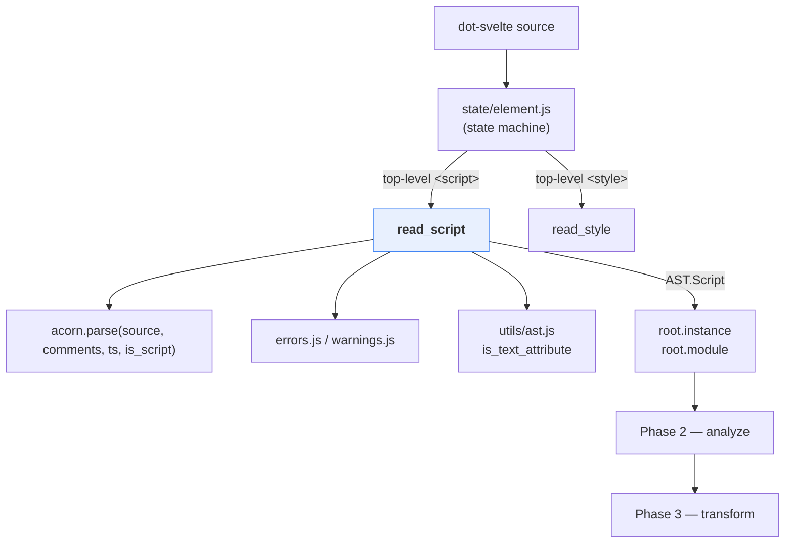
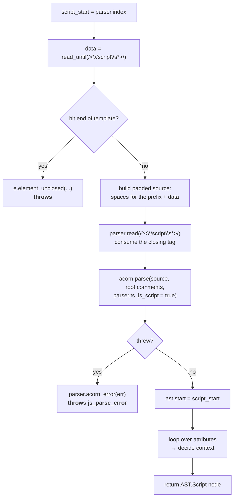
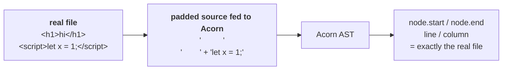
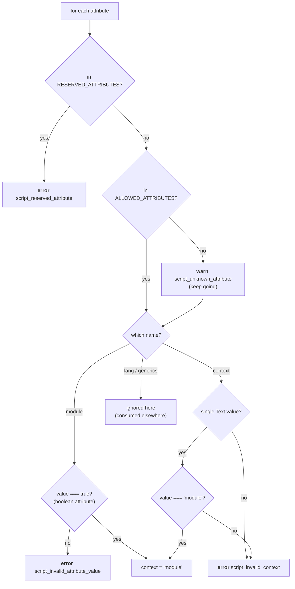
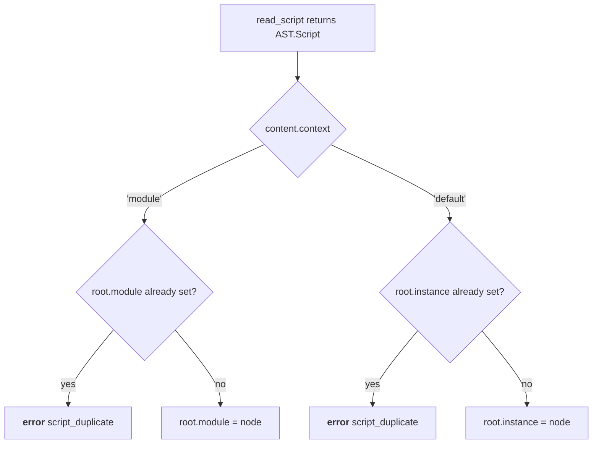
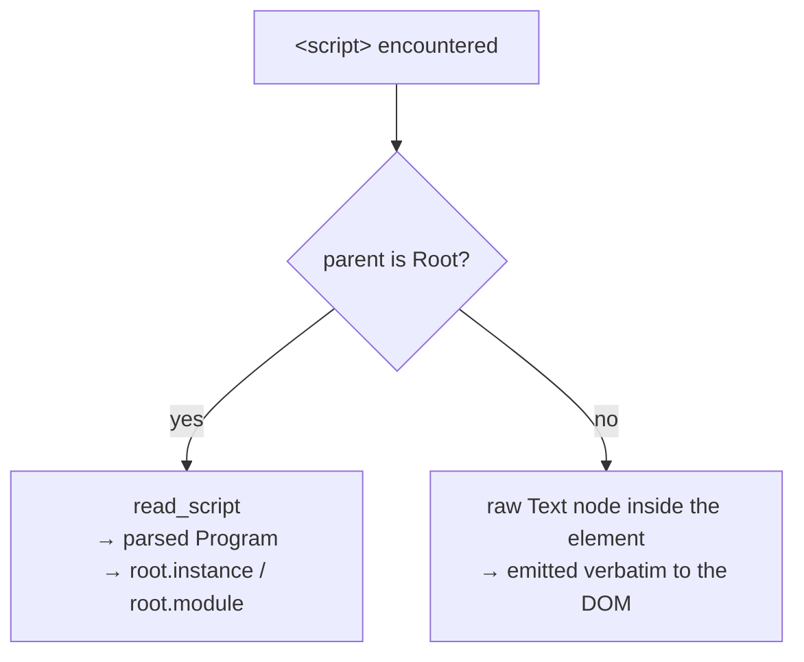
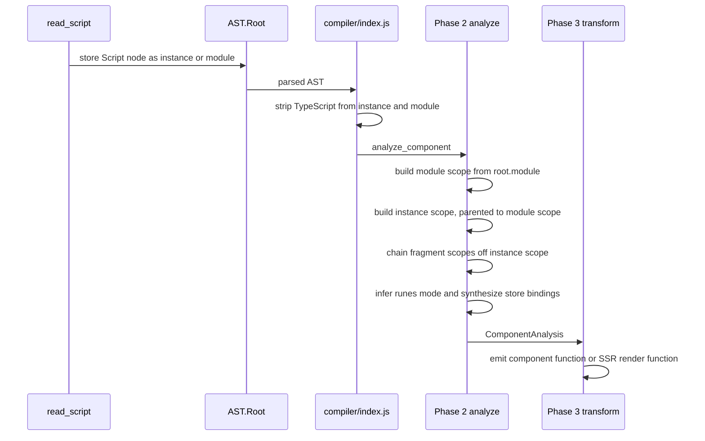

# compiler_parse_readers_script

## 1. What This Module Is

This module is one function: **`read_script`**, in
`packages/svelte/src/compiler/phases/1-parse/read/script.js`.

Its job is to turn a top-level `<script>` tag in a `.svelte` file into an
`AST.Script` node. It does four things, in order:

1. **Find the end.** Scan forward from the cursor until `</script>`.
2. **Parse the body as real JavaScript.** Hand the text to Acorn as a full
   ES module `Program` (TypeScript included, if the file is TS).
3. **Check the tag's attributes.** Decide whether this is the *instance* script
   or the *module* script, and reject attributes that are reserved or malformed.
4. **Return a node.** Plus leave `parser.index` sitting right after the closing
   tag.

It is the smallest of the five readers described in
[compiler_parse_readers](compiler_parse_readers.md), which makes it the best
place to learn the reader contract without extra noise.

### Why this needs to be a reader at all

The template state machine is an HTML-ish tokenizer. Inside `<script>` the rules
are completely different — `<`, `>`, `{`, and `}` are all ordinary JavaScript
operators, not markup. If the state machine kept scanning, `a < b` would look
like the start of a tag.

So the moment `state/element.js` sees a top-level `<script>`, it stops
tokenizing markup and calls `read_script`, which switches to an entirely
different grammar (JavaScript) and an entirely different parser (Acorn).

---

## 2. Where It Sits



Related modules:

- [compiler_parse_readers](compiler_parse_readers.md) — the parent module and the
  shared reader contract.
- [compiler_parse_state_machine_element](compiler_parse_state_machine_element.md) —
  the only caller.
- [compiler_parse_js_interop](compiler_parse_js_interop.md) — the Acorn wrapper
  that actually parses the body, attaches comments, and (later) strips TypeScript.
- [compiler_parse](compiler_parse.md) — owns the `Parser` class whose cursor and
  helpers this reader uses.
- [compiler_ast_types](compiler_ast_types.md) — the `AST.Script` and `AST.Root`
  shapes.
- [compiler_options_and_warnings](compiler_options_and_warnings.md) — where the
  error and warning messages live.
- [compiler_analyze](compiler_analyze.md) — the first consumer of the node.

---

## 3. The Signature

```js
export function read_script(parser, start, attributes) // → AST.Script
```

| Parameter | Meaning |
| --- | --- |
| `parser` | The whole `Parser`. Needed for `template`, `index`, `ts`, `root.comments`, `read`, `read_until`, `acorn_error`. |
| `start` | Offset of the `<` in `<script`. Becomes `node.start`. |
| `attributes` | Attributes already read off the opening tag by `state/element.js`. |

Two important preconditions, both established by the caller:

- The cursor (`parser.index`) is already **past the `>`** of the opening tag, so
  it points at the first character of the script body.
- The attributes were read with `read_static_attribute`, not `read_attribute`.
  That means `<script>` attributes can only be plain text — `{expressions}` and
  directives are not allowed there. See
  [compiler_parse_state_machine_element](compiler_parse_state_machine_element.md).

And one postcondition: on return, `parser.index` points just past `</script>`.

---

## 4. The Flow, Step by Step



### 4.1 Finding the end — text scan, not real tokenizing

```js
const data = parser.read_until(regex_closing_script_tag); // /<\/script\s*>/
```

This is a **plain regex scan**, not a JavaScript-aware scan. The body ends at the
first literal `</script>`, wherever it appears. That is the same rule browsers
use, and it has the same famous consequence: you cannot write `</script>` inside
a string literal in a `<script>` block. You have to break it up, e.g.
`'<\/script>'`.

If the scan runs off the end of the file, `parser.index` lands on
`template.length` and the reader raises `element_unclosed`. Note this happens
**even in loose (editor) mode** — an unterminated `<script>` is not recoverable
here, because there is no way to know where the JavaScript was meant to stop.

### 4.2 The padding trick — keeping offsets honest

This is the one clever line in the file:

```js
const source =
    parser.template.slice(0, script_start).replace(regex_not_newline_characters, ' ') + data;
```

`regex_not_newline_characters` is `/[^\n]/g`. So everything before the script
body is replaced character-for-character with spaces, **except newlines, which
are kept**.



Why bother instead of just parsing `data` on its own and adding an offset later?

- **Byte offsets come out right for free.** Same string length ⇒ same absolute
  `start`/`end` on every node, with no post-walk fix-up pass.
- **Line and column come out right too.** Acorn is called with
  `locations: true`. Because newlines are preserved, `loc.line` matches the real
  file. A pure `offset + n` adjustment could never fix line numbers.
- **Comments land in the right place.** `root.comments` is a single shared array
  across the whole component; positions from the script must be comparable with
  positions from the template.

Everything downstream — source maps, `svelte-ignore` comment matching,
`get_code_frame` in [compiler_core](compiler_core.md), and language-server
diagnostics — depends on this. It is the same trick `read/context.js` uses; see
[compiler_parse_readers_expression](compiler_parse_readers_expression.md).

The one thing the padding does *not* fix is `Program.start`, which Acorn sets to
the first token. Hence the follow-up line:

```js
ast.start = script_start; // point at the start of the body, not the first statement
```

### 4.3 Parsing — and the `is_script` flag

```js
ast = acorn.parse(source, parser.root.comments, parser.ts, true);
```

Four things worth noticing:

| Argument | Why |
| --- | --- |
| `source` | The padded string from 4.2. |
| `parser.root.comments` | Shared array. The script's comments are appended to the component-wide list, which is how `<!-- svelte-ignore -->` and `// svelte-ignore` both work. |
| `parser.ts` | Set once in the `Parser` constructor by regex-sniffing for `lang="ts"`. Selects the TypeScript-enabled Acorn. |
| `true` (`is_script`) | Suppresses Acorn's "export of undefined name" check. |

That last flag matters. In a Svelte component you can write
`export { foo }` where `foo` is declared *nowhere in the script* — it may come
from the template's scope, or be re-exported machinery. Plain Acorn would reject
that, so [compiler_parse_js_interop](compiler_parse_js_interop.md) monkey-patches
`parseStatement` to clear `undefinedExports` while `is_script` is set.

TypeScript syntax is **kept** in the AST at this stage. It is stripped much
later, in `compiler/index.js`, via `remove_typescript_nodes` — which is why the
public `parse()` API can hand you a TS-bearing AST while `compile()` cannot.

### 4.4 Attribute validation and the `context` decision

Three lists drive this loop:

```js
const RESERVED_ATTRIBUTES = ['server', 'client', 'worker', 'test', 'default'];
const ALLOWED_ATTRIBUTES  = ['context', 'generics', 'lang', 'module'];
```



Reading the branches:

- **`RESERVED_ATTRIBUTES`** are names Svelte wants to keep free for future
  meanings (`<script server>`, `<script worker>`, …). Using one is a hard error
  today so that adding the feature later is not a breaking change.
- **Unknown attributes warn, not error.** The message points out that if the
  attribute exists for a preprocessor, the preprocessor must remove it — see
  [compiler_preprocess](compiler_preprocess.md). Warning rather than erroring
  keeps the door open for third-party tooling.
- **`module` must be valueless.** `<script module>` is fine; `<script
  module="x">` is not. The error code is deliberately generic
  (`script_invalid_attribute_value`) so future boolean attributes can reuse it.
- **`context="module"` is the Svelte 4 spelling** of the same thing. Only the
  literal string `module` is accepted; anything else — including an expression
  value, caught by `is_text_attribute` — errors. It still *works*, but
  [compiler_analyze](compiler_analyze.md) emits `script_context_deprecated` for
  it in runes mode. That deprecation lives in phase 2, not here, because
  "are we in runes mode" is not known until analysis.
- **`lang` and `generics` are accepted and then ignored by this function.**
  `lang="ts"` was already detected by the `Parser` constructor before any
  parsing began (it has to be — the choice of Acorn variant depends on it).
  `generics` is consumed by the TypeScript tooling, not the compiler core.

The loop is deliberately **not** an `else if` chain, and there is no dedup: two
`module` attributes just set `context = 'module'` twice, harmlessly. Duplicate
*script tags* are caught by the caller, not here (see §6).

---

## 5. The Output Node

```js
{
  type: 'Script',
  start,                 // the '<' of <script
  end: parser.index,     // just past </script>
  context,               // 'default' | 'module'
  content: ast,          // an estree Program
  attributes             // the raw attribute nodes, kept for later inspection
}
```

`attributes` is retained rather than discarded because phase 2 needs to look
back at it — that is how the `context` deprecation warning finds the exact node
to point at.

### Where the node lands

`read_script` does **not** append to the current fragment. The caller files it
onto the `Root` instead:



So a component has at most one instance script and at most one module script.

The caller also does one extra piece of stitching: if the `<script>` is directly
preceded by an HTML comment, that comment is copied onto
`content.leadingComments`. This is what makes
`<!-- svelte-ignore some_warning -->` placed *above* a `<script>` apply to the
code inside it.

---

## 6. Division of Labour With the Caller

`read_script` is intentionally narrow. Anything that needs to know about
*other* nodes stays in `state/element.js`.

| Concern | Handled by |
| --- | --- |
| Is this `<script>` at the top level? | caller (`current.type === 'Root'`) |
| Read the opening tag's attributes | caller (`read_static_attribute`) |
| Eat the `>` of the opening tag | caller |
| Find the preceding HTML comment | caller |
| Duplicate script tags (`script_duplicate`) | caller |
| Assign to `root.instance` / `root.module` | caller |
| Find `</script>`, parse the body | **`read_script`** |
| Validate attributes, pick `context` | **`read_script`** |

A crucial consequence of that first row: **a nested `<script>` never reaches this
reader.** `<div><script>...</script></div>` is not component code — it is markup
that happens to contain a script tag. `state/element.js` handles it separately,
storing the body as a single raw `Text` node with no JavaScript parsing at all.



---

## 7. Downstream Life of the Node



The `context` field decided back in §4.4 is what produces this scope chain:

- **module scope** — from `root.module`. Evaluated once per module, shared by all
  instances.
- **instance scope** — from `root.instance`, whose parent is the module scope. So
  instance code can see module declarations, but not the reverse.
- **template scope** — chains off the instance scope.

Analysis also uses `module.ast.start` / `module.ast.end` — the very offsets the
padding trick preserved — to decide whether a `$store` reference physically sits
inside the module script, which is illegal. Getting the padding wrong would
silently break that check.

---

## 8. Diagnostics Raised Here

| Code | Kind | Trigger |
| --- | --- | --- |
| `element_unclosed` | error | no `</script>` before end of file |
| `js_parse_error` | error | Acorn rejected the body (raised via `parser.acorn_error`) |
| `script_reserved_attribute` | error | `server` / `client` / `worker` / `test` / `default` |
| `script_invalid_attribute_value` | error | `module` given a value |
| `script_invalid_context` | error | `context` missing, non-text, or not `"module"` |
| `script_unknown_attribute` | warning | attribute outside the allowed four |

Raised nearby, but by the caller: `script_duplicate`. Raised later, in phase 2:
`script_context_deprecated`.

`parser.acorn_error` strips Acorn's trailing `(line:column)` suffix before
re-raising, because Svelte's own diagnostic formatter prints a code frame with
the position already — see
[compiler_options_and_warnings](compiler_options_and_warnings.md) and
[compiler_core](compiler_core.md).

---

## 9. Gotchas Worth Remembering

1. **`</script>` inside a string breaks the file.** The end-of-body scan is a
   regex, not a JS tokenizer. This is by design (browsers behave the same way).
2. **Unclosed `<script>` errors even in loose mode.** Unlike expression reading,
   there is no placeholder-node recovery path here.
3. **The padding string is O(file size) per script tag.** Harmless in practice
   (at most two script tags per component), but it is why the source handed to
   Acorn is as long as the whole file.
4. **`parser.ts` is decided by regex before parsing starts**, in the `Parser`
   constructor — not by the `lang` attribute this function sees. The attribute
   check here is validation only.
5. **TypeScript is still in the AST when this function returns.** Do not assume a
   plain-JS `Program`.
6. **`root.comments` is mutated as a side effect.** `read_script` appends to a
   shared array; order matters to `svelte-ignore` resolution.

---

## 10. If You Need to Change It

- **Adding a new `<script>` attribute:** add the name to `ALLOWED_ATTRIBUTES`
  (and remove it from `RESERVED_ATTRIBUTES` if it is listed there), then add a
  branch in the loop. If it is a boolean attribute, reuse
  `script_invalid_attribute_value`. Remember to widen `AST.Script` in
  [compiler_ast_types](compiler_ast_types.md) if the value must survive into
  later phases, and update
  [compiler_migrate](compiler_migrate.md) if Svelte 4 code needs converting.
- **Changing how the body is delimited:** the two regexes at the top of the file
  are the only place that knows about `</script>`. Any change must keep the
  padded-source length invariant from §4.2 intact, or every source map in the
  project silently shifts.
- **Adding a new script-level diagnostic:** define it in `messages/`, regenerate
  `errors.js` / `warnings.js`, and pass the *attribute node* (not an offset) so
  the code frame can point at the right span.
