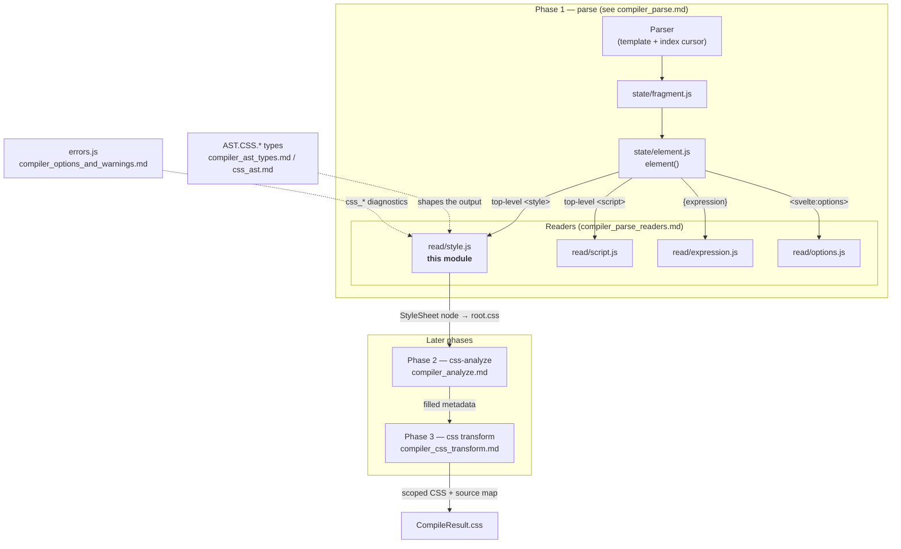
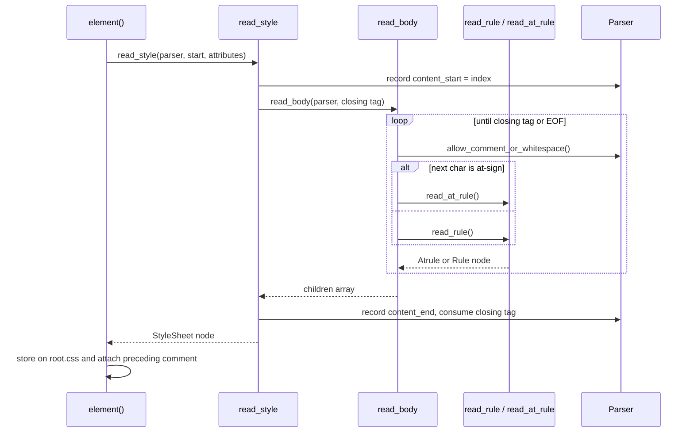
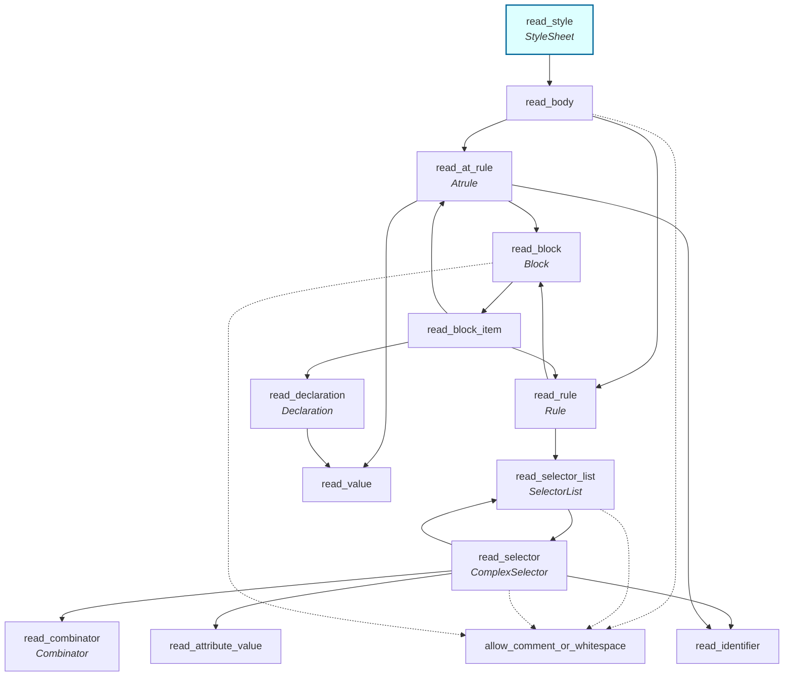
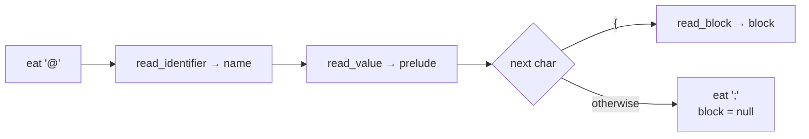
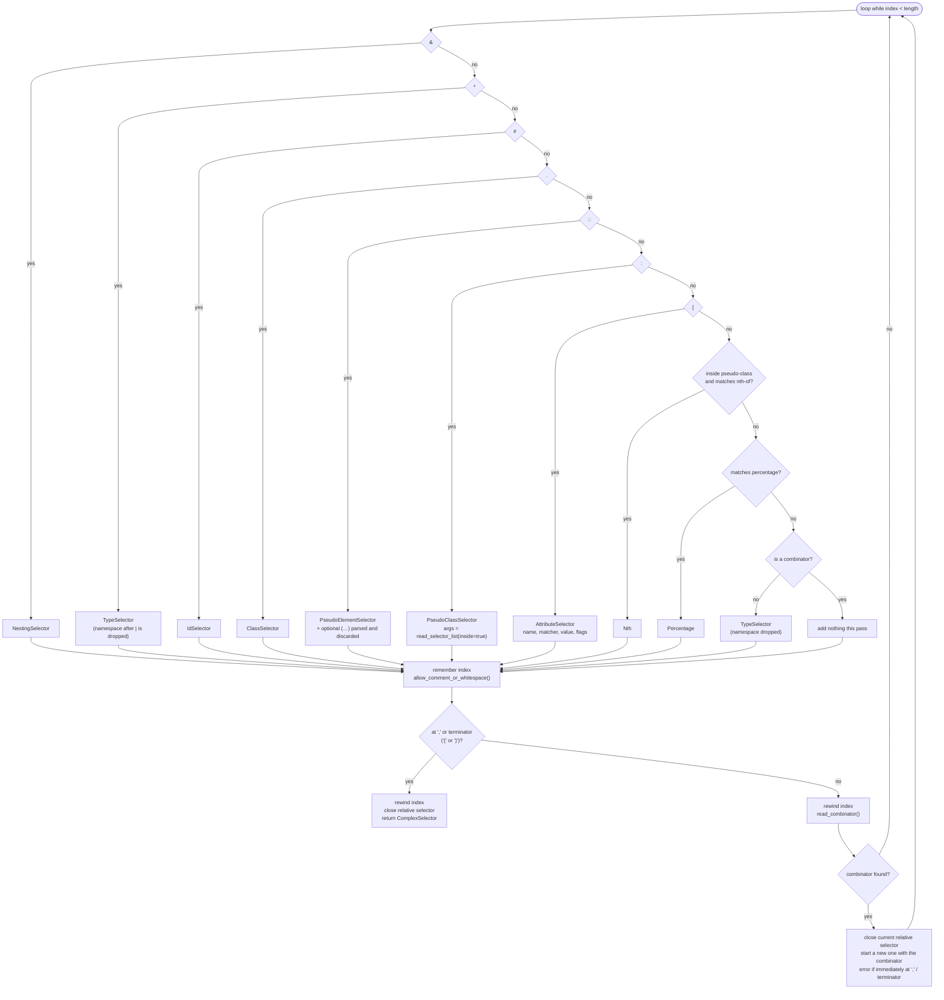
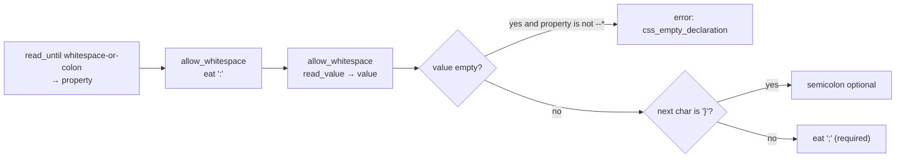
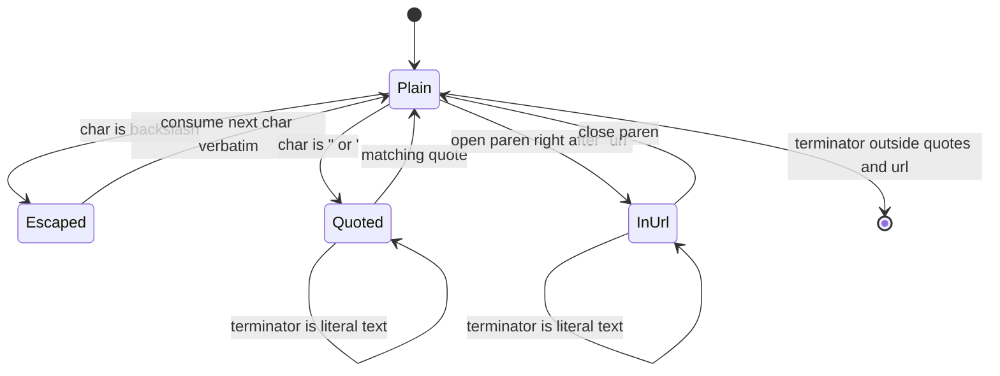
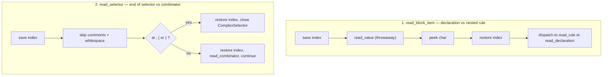
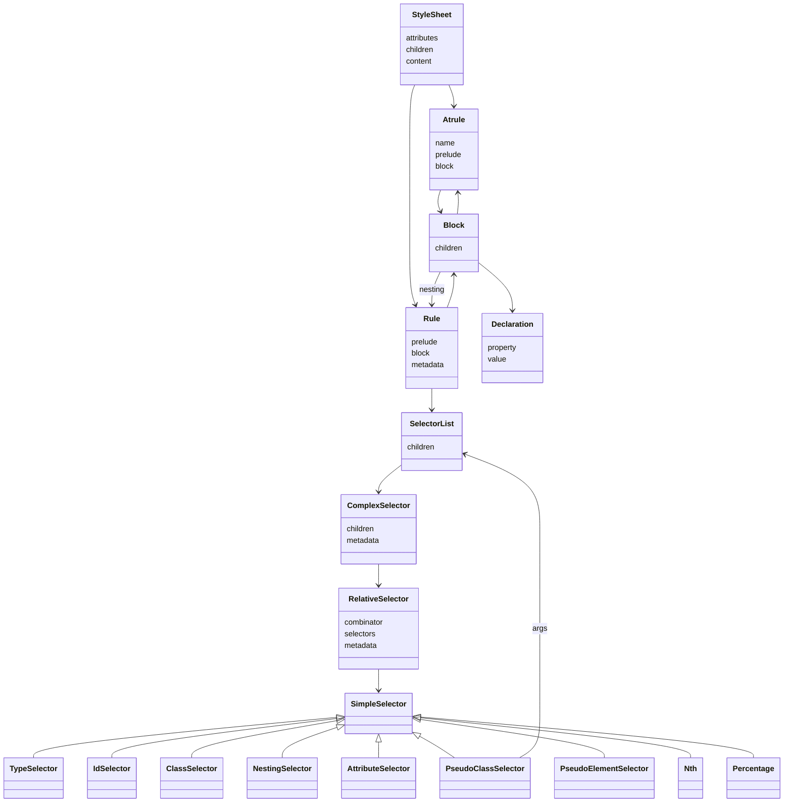

# compiler_parse_readers_style

## Introduction

This module is the CSS reader of the Svelte compiler. It has one job: take the text inside a
`<style>` tag of a `.svelte` file and turn it into a **CSS AST** (`StyleSheet` node).

It is a small, self-contained, hand-written **recursive descent parser**. It does not use PostCSS or
any other CSS library. It shares the same cursor (`Parser`) as the rest of the template parser, so
every node it makes carries `start`/`end` offsets that point back into the original `.svelte` file.
Those offsets are what later let Svelte scope styles, warn about unused selectors, and build correct
source maps.

The whole module lives in one file:

| File | Exports |
| --- | --- |
| `packages/svelte/src/compiler/phases/1-parse/read/style.js` | `read_style` (default export) plus a set of file-private readers: `read_body`, `read_at_rule`, `read_rule`, `read_selector_list`, `read_selector`, `read_combinator`, `read_block`, `read_block_item`, `read_declaration`, `read_value`, `read_attribute_value`, `read_identifier`, `allow_comment_or_whitespace` |

Only `read_style` is exported. The other readers are internal, but they are the interesting part —
each one maps to one piece of CSS grammar.

---

## Where this module sits

The style reader is a **leaf** of the parse phase. It is called once per component, from the element
state machine, at the moment a top-level `<style>` open tag has been consumed.



Key facts about that placement:

- `element()` in [compiler_parse_state_machine](compiler_parse_state_machine.md) decides *when* to
  call `read_style`, and stores the result on `root.css`. It also attaches any HTML comment directly
  above the `<style>` tag to `content.comment` (used for `svelte-ignore` handling).
- Two `<style>` tags in one component is an error (`style_duplicate`), raised by the caller, not here.
- Nested `<style>` inside markup is *not* parsed as CSS — `element()` treats it as raw text. Only a
  **top-level** `<style>` reaches this module.

---

## Public entry point: `read_style`

```js
export default function read_style(parser, start, attributes) → AST.CSS.StyleSheet
```

| Parameter | Meaning |
| --- | --- |
| `parser` | The shared `Parser` instance. Its `index` is positioned just after `<style ...>`. |
| `start` | Offset of the `<` of `<style`, so the node spans the whole tag. |
| `attributes` | Already-parsed attributes of the tag (e.g. `lang="scss"`, `global`), read by `read_static_attribute`. |

What it returns:

```js
{
  type: 'StyleSheet',
  start, end,            // whole <style>...</style> range
  attributes,            // passed through untouched
  children,              // Array<Rule | Atrule>
  content: {
    start, end,          // range of the raw text between the tags
    styles,              // that raw text verbatim
    comment: null        // filled in by the caller
  }
}
```

The `content.styles` raw slice matters: the CSS transform phase rewrites the **original text** using
node offsets rather than re-printing the AST, which is how comments, formatting and unusual syntax
survive compilation.

### Sequence of a single `<style>` block



Note that `read_body` stops when it *matches* `</style` but does not consume it; `read_style` then
consumes the full closing tag with a regex that tolerates `</style >`.

---

## Reader hierarchy

Every function is a small consumer of the cursor. The call graph is the CSS grammar:



Recursion appears in three places, and each one is a real CSS feature:

1. `read_selector → read_selector_list` — selector arguments of `:is()`, `:where()`, `:not()`, `:has()`.
2. `read_block_item → read_rule` — CSS **nesting** (`.a { .b { ... } }`).
3. `read_block_item → read_at_rule` and `read_at_rule → read_block` — nested at-rules (`@media` inside a rule).

### Cursor primitives borrowed from `Parser`

The module owns no state of its own; all position handling goes through the parser (documented in
[compiler_parse](compiler_parse.md)):

| Primitive | Used for |
| --- | --- |
| `parser.index` | Direct read/write — used for lookahead and rewind. |
| `parser.match(str)` / `parser.match_regex(re)` | Peek without consuming. |
| `parser.eat(str, required?)` | Consume a literal, optionally erroring if absent. |
| `parser.read(re)` | Consume a regex match and return it. |
| `parser.read_until(re)` | Consume up to a delimiter. |
| `parser.allow_whitespace()` | Skip whitespace. |
| `parser.template` | The full source, sliced directly by `read_value` / `read_identifier`. |

Because `parser.index` is writable, this module uses a **rewind** trick in two places rather than
try/catch backtracking — see "Lookahead and rewind" below.

---

## Core components in detail

### `read_at_rule` → `Atrule`

Handles `@media`, `@supports`, `@keyframes`, `@import`, `@charset`, custom at-rules — all of them
with the same shape.



| Field | Content |
| --- | --- |
| `name` | The at-rule name without `@`, e.g. `media`, `keyframes`. |
| `prelude` | Everything between the name and `{` or `;`, trimmed, as a **string** (not parsed further). |
| `block` | A `Block` node, or `null` for statement at-rules like `@import '...'`. |

Leaving the prelude as an opaque string is deliberate: Svelte does not need to understand media
queries, only to preserve and relocate them. The one exception is `@keyframes`, which the transform
phase recognizes by name (`is_keyframes_node`, see
[compiler_css_transform](compiler_css_transform.md)) so it can rename animations per component.

### `read_selector` → `ComplexSelector`

The largest function in the module. A *complex selector* such as `.a > .b .c` is stored as a list of
**relative selectors**, where each relative selector holds the combinator that introduced it plus the
run of simple selectors that follow it:

```
.a > .b .c
│    │    └── RelativeSelector { combinator: ' ',  selectors: [ClassSelector c] }
│    └─────── RelativeSelector { combinator: '>',  selectors: [ClassSelector b] }
└──────────── RelativeSelector { combinator: null, selectors: [ClassSelector a] }
```

Each loop iteration tries the simple-selector alternatives in a **fixed order**:



`read_combinator` itself has a subtle rule: if it finds `+`, `~`, `>` or `||` it returns that
combinator; if it found no symbol but *did* skip whitespace, it returns the **descendant** combinator
`' '`; only if the cursor did not move at all does it return `null`.

Ordering subtleties worth knowing before touching this function:

- **`Nth` before combinator.** In `:nth-child(+2n-1)` the leading `+` would otherwise be read as a
  `+` combinator. The `Nth` branch is therefore tried first, and only when `inside_pseudo_class` is
  true.
- **`::` before `:`.** Otherwise `::before` would parse as a pseudo-class named `before`.
- **Namespaces are dropped.** `svg|circle` and `*|circle` both yield `TypeSelector { name: 'circle' }`,
  because Svelte's selector matching works on element names only.
- **Pseudo-element arguments are parsed and thrown away.** They are read purely to keep the cursor in
  the right place and to surface syntax errors.
- **Trailing combinator is an error.** `.a > {` triggers `css_selector_invalid`.

The node also carries placeholder metadata that this module always initializes to the same values:

| Node | Metadata initialized here | Filled in by |
| --- | --- | --- |
| `ComplexSelector` | `{ rule: null, is_global: false, used: false }` | Phase 2 `css-analyze` |
| `RelativeSelector` | `{ is_global: false, is_global_like: false, scoped: false }` | Phase 2 `css-analyze` |
| `Rule` | `{ parent_rule: null, has_local_selectors: false, has_global_selectors: false, is_global_block: false }` | Phase 2 `css-analyze` |

This split is the module's contract with the rest of the compiler: **parse decides shape, analyze
decides meaning.** `:global` is just an ordinary `PseudoClassSelector` here — nothing in this file
knows it is special. Recognition happens later, in `is_global_block_selector` / `is_unscoped`
([compiler_analyze](compiler_analyze.md)) and `remove_global_pseudo_class`
([compiler_css_transform](compiler_css_transform.md)).

### `read_selector_list` → `SelectorList`

A thin loop over `read_selector`, separated by commas. Its `inside_pseudo_class` flag switches the
terminator from `{` to `)` and enables the `Nth` branch. Its `end` is the end of the **last
selector**, not of the following `{`, because trailing whitespace and comments are skipped before the
terminator check.

### `read_declaration` → `Declaration`



Details:

- `end` is captured **before** the `;` is eaten, so the node covers `color: red` and not the
  semicolon.
- An empty value is allowed only for custom properties, because `--foo: ;` is legal CSS with a real
  meaning (the guard is `property.startsWith('--')`).
- The `:` is eaten *non-required*, which keeps loose/partial parsing (used by language tools) alive.

### `read_value` — the shared value scanner

Used by both `read_at_rule` (prelude) and `read_declaration` (value). It scans forward and stops at
`;`, `{` or `}` — but only when those characters are not "protected":



That is why `background: url(data:image/svg+xml;base64,...)` and `content: "}"` do not break the
parser. The returned string is trimmed. Hitting end of input raises `unexpected_eof`.

### `read_attribute_value`

Same idea, one level simpler, used only inside `[...]`. It accepts an optional `"` or `'` quote; when
quoted it stops at the matching quote (and requires it), when unquoted it stops at whitespace or `]`.
Backslash escapes are preserved as-is. The result is trimmed.

### `read_block` and `read_block_item` — nesting via lookahead

Inside `{ ... }`, each item can be a declaration, a nested rule, or an at-rule. `color: red` and
`a:hover { }` start out looking identical, so `read_block_item` **speculatively scans** with
`read_value`, checks whether the next character is `{`, then rewinds:

```js
const start = parser.index;
read_value(parser);                       // throwaway scan
const char = parser.template[parser.index];
parser.index = start;                     // rewind
return char === '{' ? read_rule(parser) : read_declaration(parser);
```

The source comment explains the choice: it duplicates a little work, but it avoids a `try`/`catch`
that would swallow genuine syntax errors and report them at the wrong place.

#### Lookahead and rewind — the two places it happens



Both exist so that the node offsets stay tight — a selector must not swallow the whitespace before
its `{`, and a rule must not report the wrong start position.

### `read_identifier`

Implements the CSS `ident-token` rules well enough for real stylesheets:

- Rejects identifiers starting with a digit or `-<digit>` (`css_expected_identifier`).
- Decodes unicode escapes (`\1F600`, optionally followed by one whitespace char) into real
  characters via `String.fromCodePoint`.
- Keeps other backslash escapes as `\` + the escaped character.
- Accepts `[a-zA-Z0-9_-]` and **any code point ≥ 160**, so non-ASCII class names work.
- An empty result is an error.

### `allow_comment_or_whitespace`

Skips whitespace, `/* ... */` comments, **and** `<!-- ... -->` HTML comments. The HTML-comment
support is a legacy allowance: `<style> <!-- ... --> </style>` used to be a way to hide CSS from
ancient browsers, and Svelte still tolerates it. Comments are skipped, not retained as nodes — the
transform phase preserves them by rewriting the original text slice instead (and escapes stray
`*/` via `escape_comment_close`, see [compiler_css_transform](compiler_css_transform.md)).

---

## Regex table

All patterns are module-level constants so they are compiled once. Every "match at cursor" pattern is
`^`-anchored, as `Parser.match_regex` requires for good performance.

| Constant | Purpose |
| --- | --- |
| `REGEX_MATCHER` | Attribute selector operator: `=`, `~=`, `^=`, `$=`, `*=`, `\|=`. |
| `REGEX_CLOSING_BRACKET` | End of an unquoted attribute value (whitespace or `]`). |
| `REGEX_ATTRIBUTE_FLAGS` | Attribute flags — today only `i` and `s`, kept future-proof. |
| `REGEX_COMBINATOR` | Explicit combinators `+`, `~`, `>`, and the column combinator `\|\|`. |
| `REGEX_PERCENTAGE` | `@keyframes` selectors like `50%` or `12.5%`. |
| `REGEX_NTH_OF` | `even` / `odd` / `An+B` forms, with optional `of <selector>`. |
| `REGEX_WHITESPACE_OR_COLON` | End of a declaration property name. |
| `REGEX_LEADING_HYPHEN_OR_DIGIT` | Rejects invalid identifier starts. |
| `REGEX_VALID_IDENTIFIER_CHAR` | Identifier body characters. |
| `REGEX_UNICODE_SEQUENCE` | Unicode escapes in identifiers, e.g. `\2014 `. |
| `REGEX_COMMENT_CLOSE` | End of a CSS comment (`*/`). |
| `REGEX_HTML_COMMENT_CLOSE` | End of a legacy HTML comment (`-->`). |

---

## Produced AST



Full type declarations live in `types/css.d.ts` — see
[compiler_ast_types](compiler_ast_types.md) for the internal shapes and
[css_ast](css_ast.md) for the published, public versions.

Every node has `start` and `end`. These are load-bearing, not decorative: unused-selector warnings
point at them, and the transform phase edits the original source at exactly those offsets.

### Worked example

```html
<style>
  /* comment */
  .a > .b:hover { color: red }
  @media (min-width: 40rem) { .a { --x: ; } }
</style>
```

produces, in outline:

```
StyleSheet
├─ Rule
│  ├─ SelectorList
│  │  └─ ComplexSelector
│  │     ├─ RelativeSelector combinator=null  selectors=[ClassSelector a]
│  │     └─ RelativeSelector combinator='>'   selectors=[ClassSelector b,
│  │                                                     PseudoClassSelector hover]
│  └─ Block → [Declaration property='color' value='red']
└─ Atrule name='media' prelude='(min-width: 40rem)'
   └─ Block
      └─ Rule → SelectorList[.a] , Block → [Declaration property='--x' value='']
```

The `/* comment */` produces no node; the empty `--x` value is allowed only because the property is a
custom property.

---

## Errors

The module raises diagnostics through `errors.js` (`import * as e`). All of them are fatal — the CSS
reader does not warn.

| Error | Raised when |
| --- | --- |
| `css_expected_identifier` | Identifier is empty or starts with a digit / `-<digit>`. |
| `css_empty_declaration` | Declaration has no value and is not a custom property. |
| `css_selector_invalid` | A combinator is followed immediately by `,`, `)` or `{`. |
| `expected_token` | Missing `;`, `{`, `}`, `]`, `)`, `@`, `*/`, `-->`; also when `read_body` hits end of input without finding `</style`. |
| `unexpected_eof` | `read_value`, `read_attribute_value`, `read_selector` or `read_selector_list` runs off the end of the template. |

Error offsets are always parser indices into the untouched `.svelte` source, so
`get_code_frame` can render a correct code frame (see the utilities in
[compiler_core](compiler_core.md) and message definitions in
[compiler_options_and_warnings](compiler_options_and_warnings.md)).

Note that **preprocessing runs before parsing**. If a component uses `lang="scss"`, the
[compiler_preprocess](compiler_preprocess.md) step must have already converted it to plain CSS;
otherwise this reader will fail on the non-CSS syntax.

---

## Design notes and gotchas

- **Single cursor, no separate tokenizer.** The reader mutates the same `parser.index` as the HTML
  state machine. Any reader that returns must leave the cursor in a valid position, or the enclosing
  template parse breaks in confusing ways.
- **Preludes and values stay strings.** Only *selectors* are structured, because selectors are the
  only thing Svelte needs to rewrite for scoping. This keeps the module small and makes unfamiliar or
  future CSS syntax pass through unharmed.
- **Metadata is always initialized, never computed.** Adding a metadata field means updating both
  this file (the default) and phase 2 (the real value).
- **Loose mode is only partially honored.** Unlike the expression and element readers, most `eat`
  calls here are strictly required, so malformed CSS still throws even in loose parsing mode.
- **`content.comment` is set by the caller**, not here. It always starts as `null`.
- **`read_body` takes a `close` parameter** (`'</style'`) even though there is only one caller — a
  seam left for reuse.

---

## Related modules

| Module | Relationship |
| --- | --- |
| [compiler_parse](compiler_parse.md) | Owns the `Parser` class and cursor primitives this module drives. |
| [compiler_parse_state_machine](compiler_parse_state_machine.md) | `element()` calls `read_style` and stores the result on `root.css`. |
| [compiler_parse_readers](compiler_parse_readers.md) | Sibling readers overview. |
| [compiler_parse_readers_script](compiler_parse_readers_script.md) | The `<script>` counterpart, invoked from the same place. |
| [compiler_parse_readers_expression](compiler_parse_readers_expression.md) | Reads `{...}` expressions; not used by CSS. |
| [compiler_parse_readers_options](compiler_parse_readers_options.md) | Reads `<svelte:options>`, including custom-element style options. |
| [compiler_analyze](compiler_analyze.md) | Consumes the `StyleSheet`, resolves `:global`, marks used selectors, fills metadata. |
| [compiler_css_transform](compiler_css_transform.md) | Rewrites the original CSS text using node offsets to add scoping hashes. |
| [compiler_ast_types](compiler_ast_types.md) / [css_ast](css_ast.md) | Type definitions for every node produced here. |
| [compiler_preprocess](compiler_preprocess.md) | Must run first for non-CSS style languages. |
| [compiler_options_and_warnings](compiler_options_and_warnings.md) | Defines the `css_*` diagnostic messages. |
