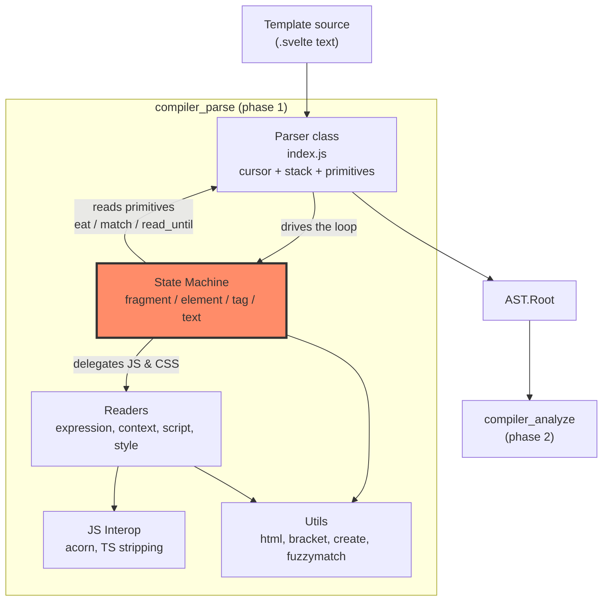
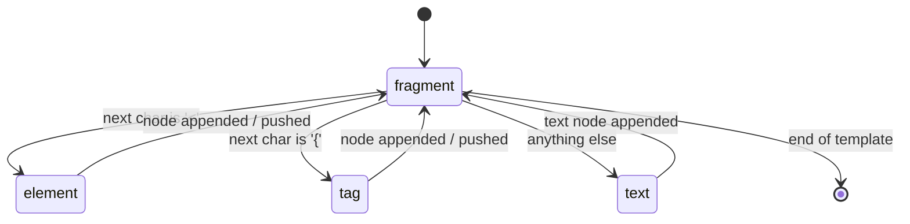
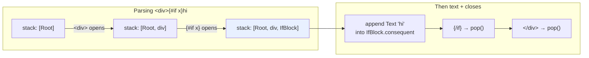
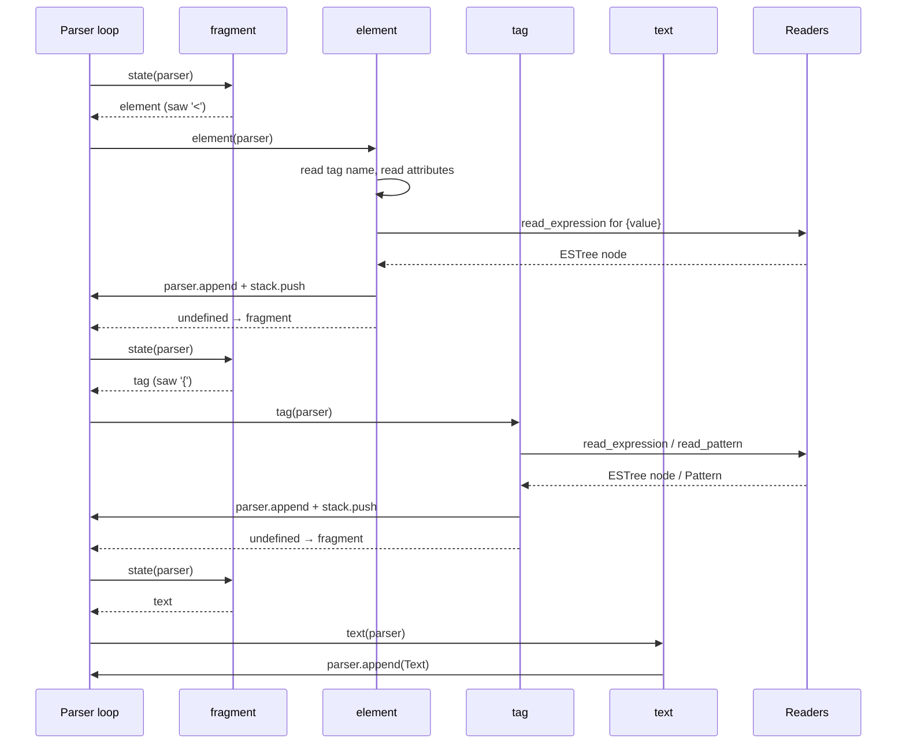
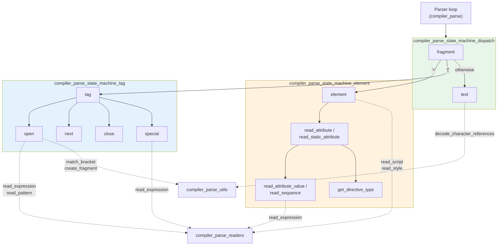
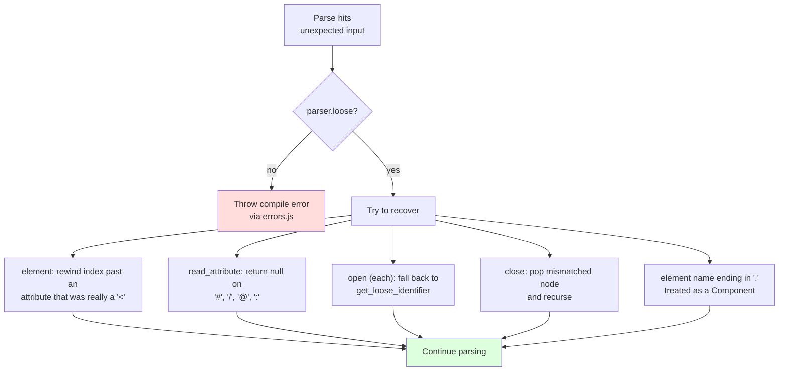
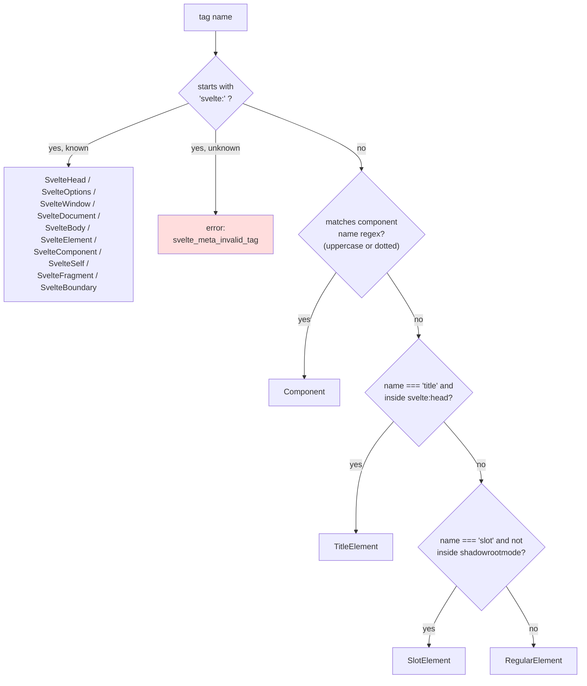

# Compiler Parse State Machine

## Introduction

The **parse state machine** is the heart of Svelte's template parser. It is the code that walks
through a `.svelte` file one character at a time and turns raw text into a tree of AST nodes.

The idea is simple. The parser keeps a cursor (`parser.index`) into the template string. A
**state function** looks at the character under the cursor, consumes some text, builds a node, and
then hands control back. A small loop keeps calling state functions until the whole template is
consumed:

```js
let state = fragment;

while (this.index < this.template.length) {
    state = state(this) || fragment;
}
```

That is the whole engine. Everything in this module is one of those state functions, or a helper
that a state function uses.

There are only four files, but they carry most of the syntax rules of Svelte's template language:

| File | Role |
| --- | --- |
| `state/fragment.js` | The dispatcher. Looks at one character and picks the next state. |
| `state/text.js` | Eats plain text until it sees `<` or `{`. |
| `state/element.js` | Handles everything inside `<...>`: tags, attributes, directives. |
| `state/tag.js` | Handles everything inside `{...}`: blocks, tags, expressions. |

### What this module is responsible for

- Deciding **what kind of syntax** starts at the current cursor position.
- Building template AST nodes (`RegularElement`, `Component`, `IfBlock`, `EachBlock`, `Text`, …).
- Pushing and popping the **open-node stack** so nesting works.
- Reporting syntax errors, and — in **loose mode** — backtracking instead of crashing.

### What it is *not* responsible for

- Parsing JavaScript expressions and CSS. That is delegated to
  [compiler_parse_readers](compiler_parse_readers.md).
- Running Acorn or stripping TypeScript. See
  [compiler_parse_js_interop](compiler_parse_js_interop.md).
- Character-reference decoding, bracket matching, fragment creation. See
  [compiler_parse_utils](compiler_parse_utils.md).
- Any meaning or validation of the tree. That happens later in
  [compiler_analyze](compiler_analyze.md).

---

## Architecture Overview

### Where the state machine sits



The `Parser` class owns the mutable state. The state machine only *uses* it. That split is worth
keeping in mind: state functions are plain functions, not classes, and they share everything
through the single `parser` object passed as their only argument.

### The state transition graph



Every state returns either `undefined` (meaning "go back to `fragment`") or another state function.
Today only `fragment` returns a different state; `element`, `tag`, and `text` always fall back.
So in practice the machine is a tight `fragment → worker → fragment` cycle.

### The open-node stack

Nesting is handled with two parallel stacks on the `Parser`:

- `parser.stack` — the chain of currently open nodes (`Root`, elements, blocks).
- `parser.fragments` — the child list that new nodes get appended to.



`parser.append(node)` pushes into `fragments.at(-1)`. `parser.pop()` pops both stacks together.
Self-closing elements and void elements are appended but never pushed, so they never need a close.

### Data flow for one full pass



---

## Sub-modules

The four files split cleanly into three groups by responsibility.

| Sub-module documentation | Source files | Covers |
| --- | --- | --- |
| [compiler_parse_state_machine_dispatch](compiler_parse_state_machine_dispatch.md) | `state/fragment.js`, `state/text.js` | `fragment`, `text` |
| [compiler_parse_state_machine_element](compiler_parse_state_machine_element.md) | `state/element.js` | `element`, `read_attribute`, `read_static_attribute`, `read_attribute_value`, `read_sequence`, `get_directive_type` |
| [compiler_parse_state_machine_tag](compiler_parse_state_machine_tag.md) | `state/tag.js` | `tag`, `open`, `next`, `close`, `special` |



### 1. Dispatcher and Text

`state/fragment.js` and `state/text.js`. Together these are about 30 lines, but they define the
top-level shape of the language: a template is a sequence of elements, tags, and text.

- **`fragment(parser)`** — a three-way branch on the current character. Returns the `element`
  state for `<`, the `tag` state for `{`, and `text` for everything else. It consumes nothing.
- **`text(parser)`** — scans forward until it hits `<` or `{`, then appends a `Text` node. It
  keeps both the `raw` source slice and the `data` string with HTML entities decoded.

Full details: **[compiler_parse_state_machine_dispatch](compiler_parse_state_machine_dispatch.md)**

### 2. Element and Attribute Parsing

`state/element.js`. The biggest file in the module. It covers:

- **`element(parser)`** — comments, closing tags, tag-name classification (10 node types from one
  name), auto-closing of tags like `<p>`, `<script>`/`<style>` hand-off, `<textarea>` raw content,
  and the loose-mode backtracking dance.
- **`read_attribute(parser)`** — the full attribute grammar: `{...spread}`, `{@attach fn}`,
  `{shorthand}`, `name`, `name="value"`, and all eight directive kinds.
- **`read_static_attribute(parser)`** — the restricted form used only for top-level `<script>` and
  `<style>`, where `{}` has no special meaning.
- **`read_attribute_value(parser)`** and **`read_sequence(parser, done, location)`** — the shared
  machinery that mixes literal text with `{expression}` chunks.
- **`get_directive_type(name)`** — maps a prefix such as `bind` or `transition` to a node type.

Full details: **[compiler_parse_state_machine_element](compiler_parse_state_machine_element.md)**

### 3. Tag and Block Parsing

`state/tag.js`. Everything that starts with `{`:

- **`tag(parser)`** — the sub-dispatcher. `{#` → `open`, `{:` → `next`, `{@` → `special`,
  `{/` → `close`, anything else → a plain `ExpressionTag`.
- **`open(parser)`** — opens `{#if}`, `{#each}`, `{#await}`, `{#key}`, `{#snippet}`. Contains the
  module's trickiest code: the backtracking loop that lets `{#each x as { y = z }}` parse, and the
  TypeScript `as` disambiguation.
- **`next(parser)`** — continuation clauses: `{:else}`, `{:else if}`, `{:then}`, `{:catch}`. These
  swap the current fragment without touching the stack depth.
- **`close(parser)`** — matches `{/if}`, `{/each}` etc. against the top of the stack, and in loose
  mode recursively pops mismatched nodes.
- **`special(parser)`** — the `{@...}` tags: `{@html}`, `{@debug}`, `{@const}`, `{@render}`.

Full details: **[compiler_parse_state_machine_tag](compiler_parse_state_machine_tag.md)**

---

## Cross-cutting concerns

### Loose mode

The parser has a `loose` flag. It is set when the compiler is being used by language tooling
(editors, the Svelte language server), where the template is usually half-typed and broken.

In loose mode the state machine tries hard to produce *some* tree instead of throwing:



Because of this, almost every branch in `element.js` and `tag.js` has a loose-mode counterpart.
When reading the code, it helps to first read the strict path and treat the loose branches as
error-recovery patches layered on top.

### Errors and warnings

State functions never format their own messages. They call named helpers:

- `e.*` from `compiler/errors.js` — throws and aborts the parse (`e.tag_invalid_name`,
  `e.attribute_duplicate`, `e.block_unexpected_close`, …).
- `w.*` from `compiler/warnings.js` — records a warning and continues
  (`w.element_implicitly_closed`, `w.svelte_element_invalid_this`).

Both are documented under [compiler_options_and_warnings](compiler_options_and_warnings.md).

### Node shapes

Every node the state machine builds is typed in
[compiler_ast_types](compiler_ast_types.md) (`types/template.d.ts`), and re-exported to users via
[template_ast](template_ast.md) and [template_directives](template_directives.md).

Two factory helpers from `phases/nodes.js` are used constantly:

- `create_attribute(name, start, end, value)` — an `Attribute` with empty `metadata`.
- `create_expression_metadata()` — the blank metadata bag (`dependencies`, `has_state`,
  `has_call`, …) that phase 2 fills in.

Fragments come from `create_fragment(transparent)` in
[compiler_parse_utils](compiler_parse_utils.md).

### Node type classification

One name in `<...>` can become one of many node types. This decision, made inside `element`, is
worth showing on its own because it silently drives the rest of the compiler:



The five *root-only* meta tags (`svelte:head`, `svelte:options`, `svelte:window`,
`svelte:document`, `svelte:body`) additionally must appear at the top level and only once — the
state machine tracks this in `parser.meta_tags`.

---

## Reading order for newcomers

1. `state/fragment.js` — 15 lines, shows the whole idea.
2. The `Parser` class in `1-parse/index.js` — the primitives every state uses
   (`eat`, `match`, `read_until`, `append`, `pop`).
3. `state/text.js` — the simplest real state.
4. `state/tag.js` → `tag` and `special` — straightforward node building.
5. `state/element.js` → `element` — long, but linear top to bottom.
6. `state/tag.js` → `open` (the `each` branch) — the hardest code in the module. Read it last.

## Related modules

| Module | Relationship |
| --- | --- |
| [compiler_parse](compiler_parse.md) | Parent module; owns the `Parser` class that drives this state machine. |
| [compiler_parse_readers](compiler_parse_readers.md) | Called by state functions to parse JS expressions, patterns, `<script>`, `<style>`. |
| [compiler_parse_js_interop](compiler_parse_js_interop.md) | Acorn wrapper and TypeScript stripping used underneath the readers. |
| [compiler_parse_utils](compiler_parse_utils.md) | `decode_character_references`, `match_bracket`, `create_fragment`. |
| [compiler_analyze](compiler_analyze.md) | Consumes the AST this module produces. |
| [compiler_ast_types](compiler_ast_types.md) | Type definitions for every node built here. |
| [compilation_pipeline](compilation_pipeline.md) | The full parse → analyze → transform flow. |
