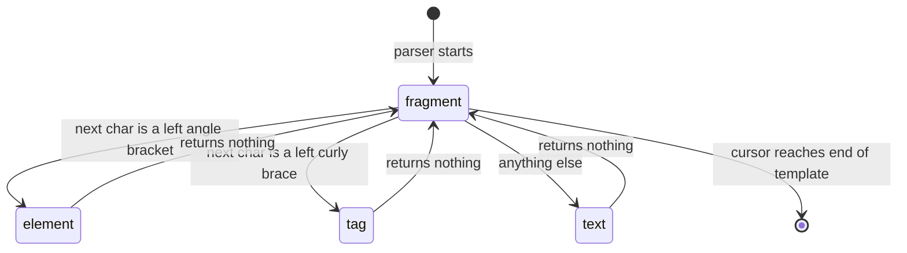
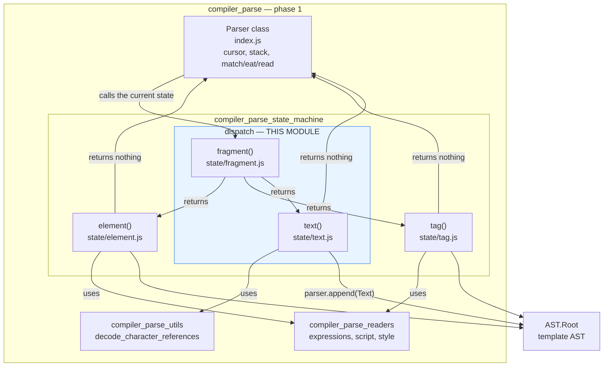
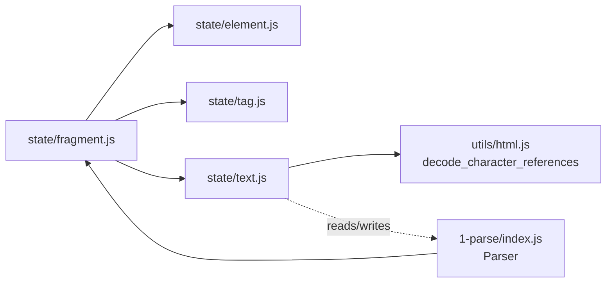
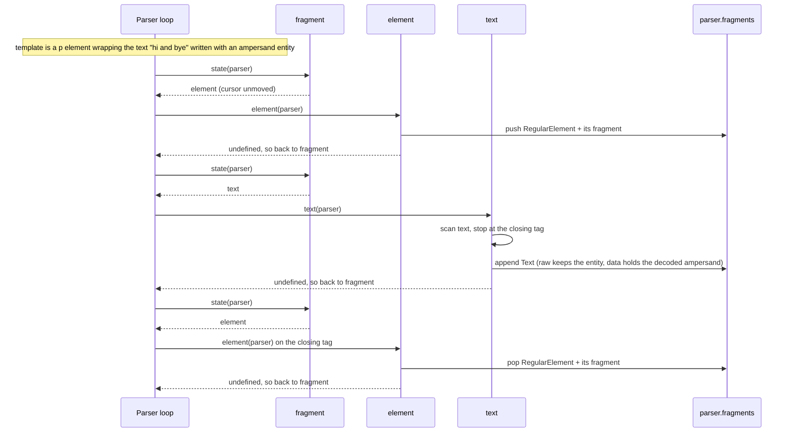
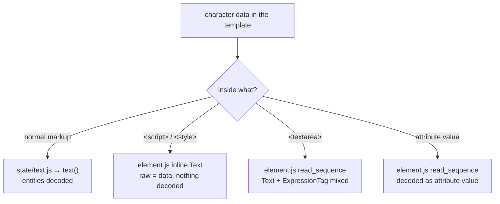
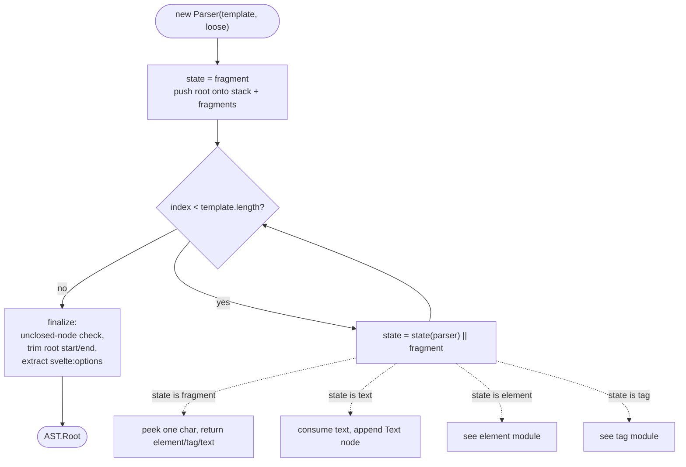
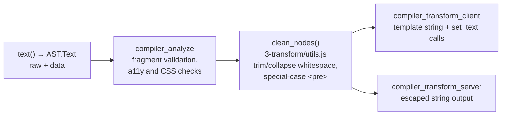

# Compiler Parse State Machine — Dispatch

## Introduction

This module is the **entry point and the fallback** of Svelte's template parser state machine.

It contains only two small files, but every single character of a `.svelte` template passes through
them:

| File | Export | Role |
| --- | --- | --- |
| `phases/1-parse/state/fragment.js` | `fragment` | The **dispatcher**. Looks at one character and decides which state runs next. |
| `phases/1-parse/state/text.js` | `text` | The **fallback**. Eats plain text until markup starts again. |

Together they answer two questions, over and over, until the file is fully read:

1. *"What kind of syntax starts here?"* → `fragment`
2. *"Nothing special starts here, so how much plain text can I take?"* → `text`

Everything else — elements, attributes, directives, blocks, expressions — is handled by the sibling
modules [compiler_parse_state_machine_element](compiler_parse_state_machine_element.md) and
[compiler_parse_state_machine_tag](compiler_parse_state_machine_tag.md). This module never parses
them; it only *routes* to them.

---

## Background: how the state machine works

The `Parser` class (see [compiler_parse](compiler_parse.md)) holds a cursor into the template string
and runs a very small loop:

```js
// packages/svelte/src/compiler/phases/1-parse/index.js
let state = fragment;

while (this.index < this.template.length) {
    state = state(this) || fragment;
}
```

Two rules follow from that one line:

- A state function may **return another state function**, and that one runs next.
- A state function may **return nothing**, and then the machine falls back to `fragment`.

`fragment` is therefore the "home" state. After any element, block, or tag is finished, control
always comes back here.



---

## Architecture Overview

### Where dispatch sits inside phase 1



### Dependencies



Note the shape of this graph:

- `fragment` imports all three states but calls **none** of them. It only returns a reference.
- `text` has exactly **one** outside dependency: `decode_character_references`.
- Neither file imports the `Parser` class as a value — only as a JSDoc type. The parser is always
  passed in as an argument.

This keeps the dispatch layer free of cycles, even though `element`/`tag` and the parser loop all
point back to `fragment`.

---

## Component: `fragment`

**File:** `packages/svelte/src/compiler/phases/1-parse/state/fragment.js`

```js
/** @param {Parser} parser */
export default function fragment(parser) {
        if (parser.match('<')) {
                return element;
        }

        if (parser.match('{')) {
                return tag;
        }

        return text;
}
```

### What it does

`fragment` is a pure lookup. It peeks at the character under the cursor with `parser.match(...)`
and returns the state that should handle it. It is the only state function in the whole parser that
**consumes nothing** — `parser.index` is exactly the same before and after it runs.

### The dispatch table

| Character at the cursor | Next state | Handled by |
| --- | --- | --- |
| `<` | `element` | [compiler_parse_state_machine_element](compiler_parse_state_machine_element.md) |
| `{` | `tag` | [compiler_parse_state_machine_tag](compiler_parse_state_machine_tag.md) |
| anything else | `text` | this module |

```mermaid
flowchart TD
    START(["fragment(parser)"]) --> C1{"parser.match('&lt;')?"}
    C1 -->|yes| E["return element<br/>tags, comments, doctype,<br/>script, style, closing tags"]
    C1 -->|no| C2{"parser.match('&#123;')?"}
    C2 -->|yes| T["return tag<br/>expressions, blocks,<br/>@html / @const / @debug / @render"]
    C2 -->|no| TX["return text<br/>plain character data"]
    E --> LOOP(["back to the parser loop"])
    T --> LOOP
    TX --> LOOP
```



### Why the order matters

`<` is tested before `{`, and `text` is the last resort. Because `text` stops at both `<` and `{`,
the three branches are mutually exclusive — there is no character that two of them could claim.
This is what makes the machine total: **every** possible character has exactly one home.

### Why the returned state is not called directly

Returning the function instead of calling it keeps the call stack flat. Deeply nested markup does
not grow the JS stack per nesting level — the parser loop simply keeps replacing `state`. Nesting
depth lives in `parser.stack` / `parser.fragments` (data), not in the call stack.

---

## Component: `text`

**File:** `packages/svelte/src/compiler/phases/1-parse/state/text.js`

```js
/** @param {Parser} parser */
export default function text(parser) {
        const start = parser.index;

        let data = '';

        while (parser.index < parser.template.length && !parser.match('<') && !parser.match('{')) {
                data += parser.template[parser.index++];
        }

        /** @type {AST.Text} */
        parser.append({
                type: 'Text',
                start,
                end: parser.index,
                raw: data,
                data: decode_character_references(data, false)
        });
}
```

### What it does

1. Remembers where the run of text starts.
2. Walks forward one character at a time and stops at the first `<`, the first `{`, or the end of
   the template.
3. Appends one `Text` node to the fragment that is currently open.
4. Returns nothing, so the parser loop goes back to `fragment`.

### The `Text` node it produces

| Field | Meaning |
| --- | --- |
| `type` | Always `'Text'` |
| `start` / `end` | Offsets into the original template — used for error frames, source maps and the migration tool |
| `raw` | The characters **exactly as written**, entities still encoded (`&amp;`) |
| `data` | The **decoded** value that will actually be rendered (`&`) |

Keeping both `raw` and `data` matters. Tools that rewrite source (see
[compiler_migrate](compiler_migrate.md)) need the original characters, while the code generators in
[compiler_transform_client](compiler_transform_client.md) and
[compiler_transform_server](compiler_transform_server.md) need the decoded string.

### Data flow

```mermaid
flowchart LR
    TPL["template string<br/>'hello &amp;amp; welcome'"] -->|"char-by-char scan<br/>stop at &lt; or &#123;"| RAW["raw<br/>'hello &amp;amp; welcome'"]
    RAW -->|"decode_character_references(raw, false)"| DATA["data<br/>'hello &amp; welcome'"]
    RAW --> NODE["AST.Text node"]
    DATA --> NODE
    START["start = index before"] --> NODE
    END["end = index after"] --> NODE
    NODE -->|"parser.append(node)"| FRAGSTACK["top of parser.fragments<br/>current open fragment"]
```



### Where the node lands

`parser.append` pushes onto `parser.fragments.at(-1)` — the fragment on top of the stack. That stack
is managed by `element` and `tag` when they open a nesting level. So the same `text` function puts a
node inside a `<div>`, inside an `{#if}` branch, or at the top level of the file, with no special
casing at all.



### Guaranteed forward progress

`text` can only be reached when the cursor is **not** on `<` or `{`, and the parser loop only runs
while the cursor is inside the template. So the `while` loop always consumes at least one character.
This is the property that stops the parser loop from spinning forever: every trip through
`fragment` either ends the template or moves the cursor.

### Attribute-value text is decoded differently

`text` always passes `false` as the second argument to `decode_character_references`. Text inside an
attribute value is produced by `read_sequence` in
[compiler_parse_state_machine_element](compiler_parse_state_machine_element.md) and passes `true`
instead, because the HTML spec decodes entities without a trailing `;` differently inside attribute
values. See [compiler_parse_utils](compiler_parse_utils.md) for the entity-pattern details.

### Raw-text elements bypass this state

Contents of `<script>`, `<style>` and `<textarea>` are **not** produced here. `element` reads them
directly:

- `script` / `style` → a `Text` node built inline with `raw === data` (no entity decoding, because
  the content is JS/CSS, later handed to [compiler_parse_readers](compiler_parse_readers.md)).
- `textarea` → `read_sequence`, so `{expressions}` still work inside it.

That is why `text` can stay this simple: it only ever handles ordinary character data.



---

## Process Flow: a full template pass



The `|| fragment` in the loop is what makes `fragment` the default. `element`, `tag` and `text` all
return `undefined` in the normal case, which resets the machine to the dispatcher.

---

## Loose mode

The parser can run in **loose mode** (used by language tooling on half-typed files), where syntax
errors are recovered from instead of thrown. Neither file in this module has any loose-mode
handling:

- `fragment` cannot fail — every character maps to some state.
- `text` cannot fail — it only reads characters that already exist.

All loose-mode recovery lives in `element`, `tag` and the readers. Dispatch stays identical in both
modes, which is a useful invariant: a loose parse visits the same states in the same order, only the
error handling deeper down differs.

---

## Downstream: what happens to `Text` nodes later

This module deliberately does **no** cleanup — no whitespace trimming, no merging of adjacent runs.
That happens further along the pipeline:



Because trimming is a *transform* concern, the AST that `parse` returns still matches the source
byte-for-byte. That is what lets the public `parse` API, the migration tool, and editor tooling rely
on `start`/`end` offsets. See [compiler_ast_types](compiler_ast_types.md) for the node shapes and
[compiler_core](compiler_core.md) for how the phases are wired together.

---

## Summary

| Aspect | `fragment` | `text` |
| --- | --- | --- |
| Consumes characters | No | Yes, at least one |
| Creates AST nodes | No | One `Text` node |
| Returns | The next state function | Nothing (falls back to `fragment`) |
| Can raise an error | No | No |
| External dependencies | `element`, `tag`, `text` (as values only) | `decode_character_references` |

Two functions, about twenty lines of code, and they define the top-level grammar of the Svelte
template language: *a fragment is a sequence of elements, tags, and text.*

## Related modules

- [compiler_parse_state_machine](compiler_parse_state_machine.md) — the parent module
- [compiler_parse_state_machine_element](compiler_parse_state_machine_element.md) — the `<...>` branch
- [compiler_parse_state_machine_tag](compiler_parse_state_machine_tag.md) — the `{...}` branch
- [compiler_parse_utils](compiler_parse_utils.md) — entity decoding, bracket matching, fragment creation
- [compiler_parse](compiler_parse.md) — the `Parser` class and phase-1 overview
- [compiler_ast_types](compiler_ast_types.md) — the `AST.Text` and `AST.Fragment` type definitions
