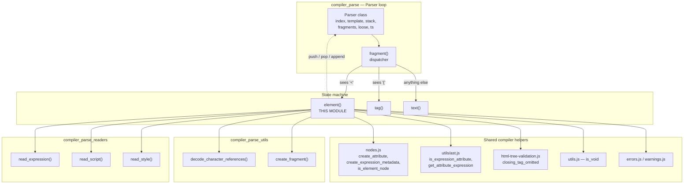
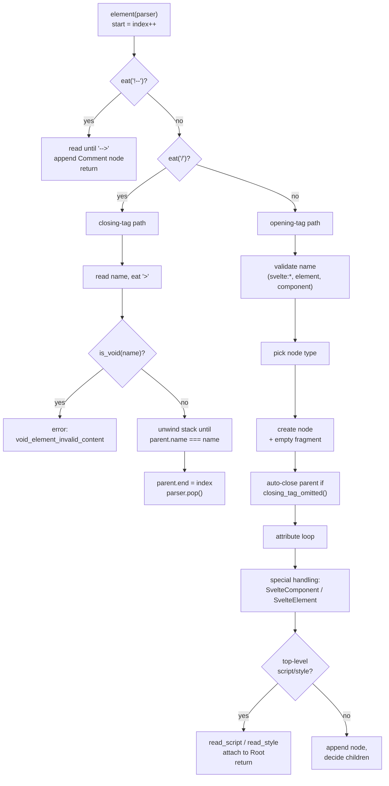
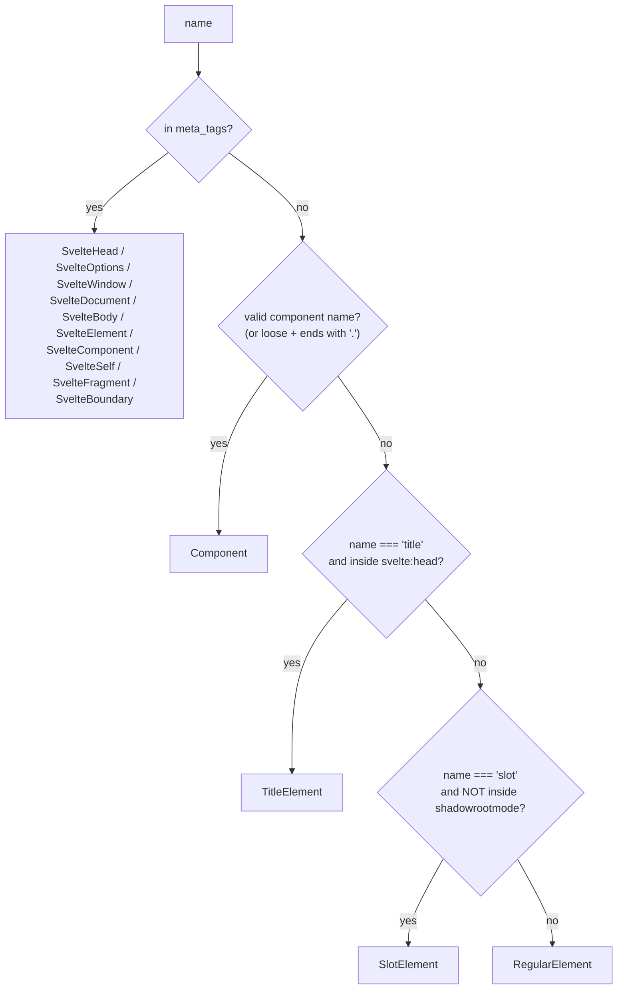
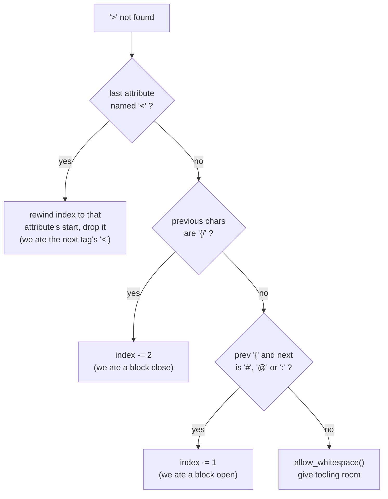
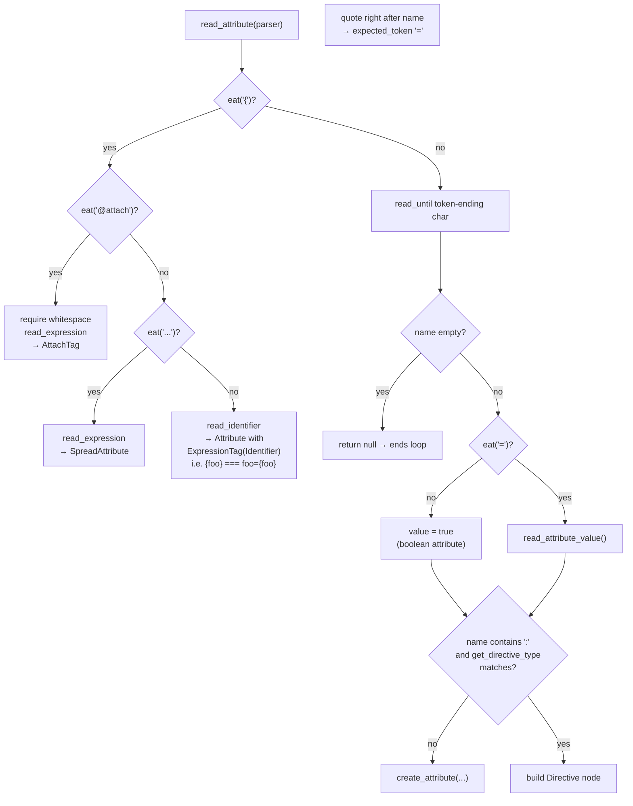
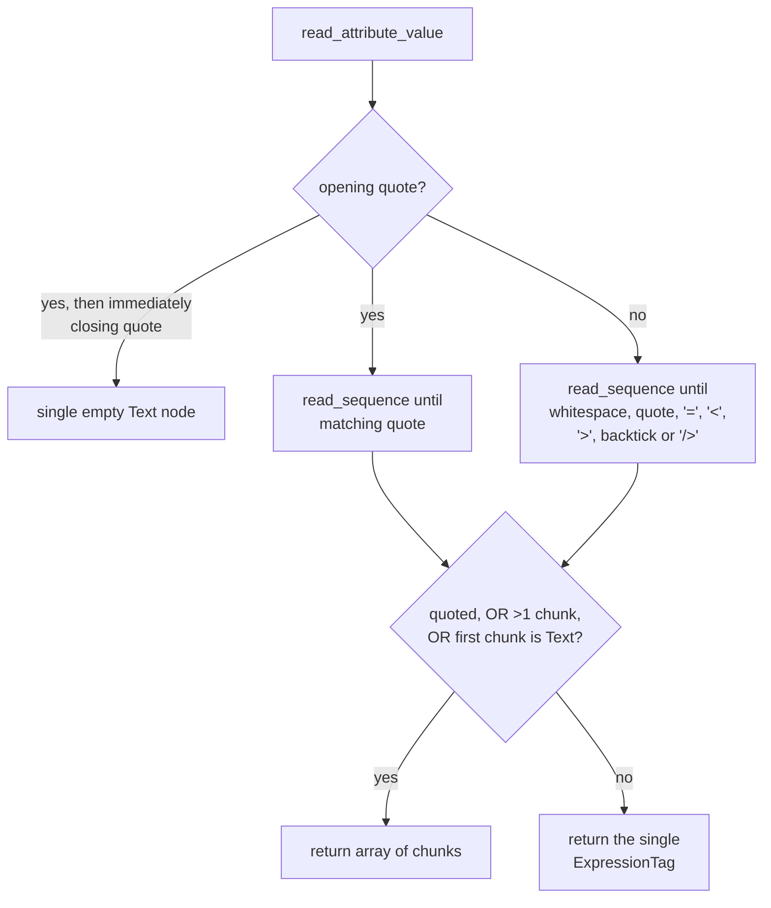
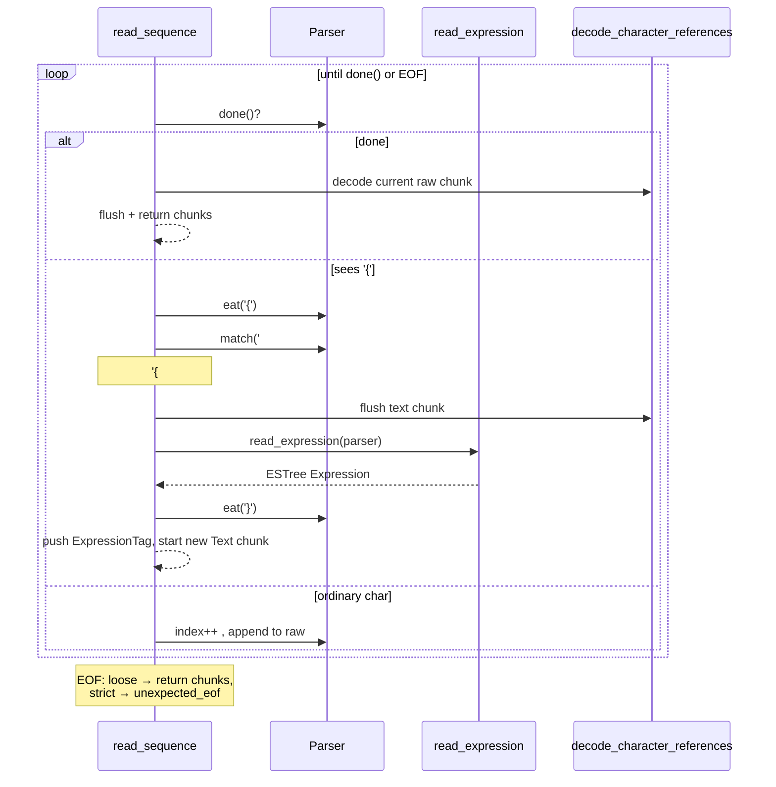
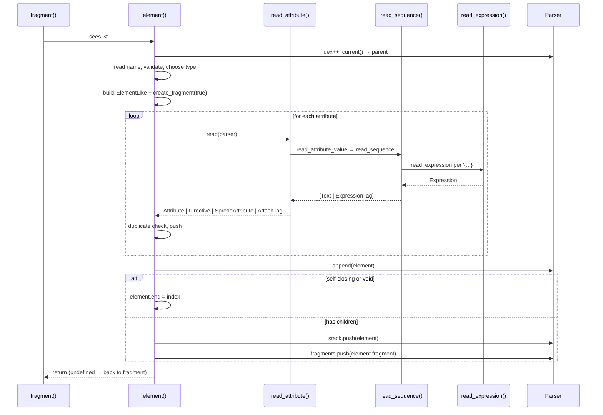
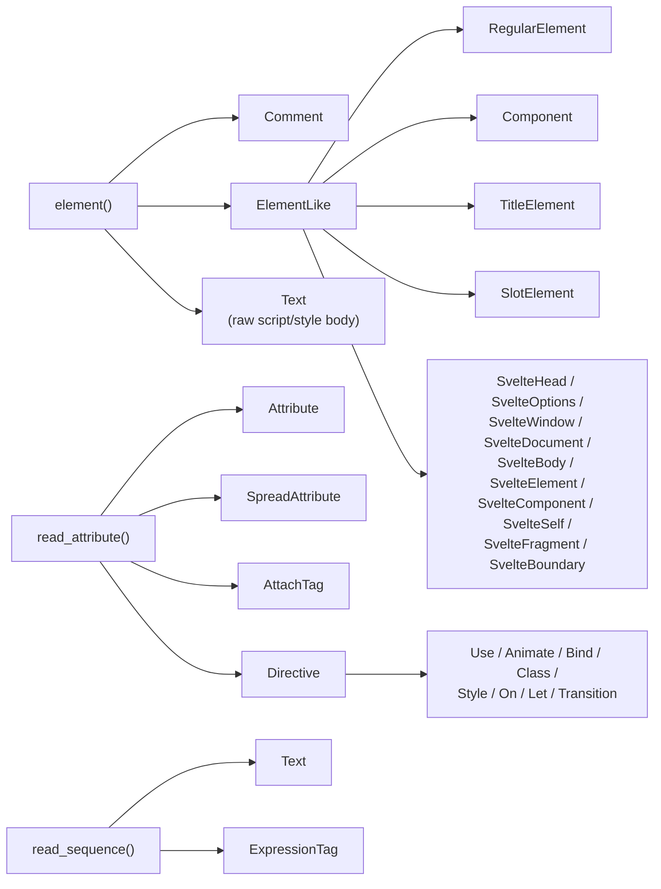

# compiler_parse_state_machine_element

## Introduction

This module is the part of the Svelte parser that reads **tags** — everything that starts with `<`.
It turns raw template text like:

```svelte
<div class="box" bind:this={el} on:click|once={handler} {...rest} {@attach tip}>
```

into AST nodes: an element node, plus its attributes, directives, spreads and attachments.

It is one small file with a big job:

`packages/svelte/src/compiler/phases/1-parse/state/element.js`

The module is a **state function** in the parser's state machine. The dispatcher
([compiler_parse_state_machine_dispatch](compiler_parse_state_machine_dispatch.md)) sees a `<`
character and hands control to `element`. When `element` returns, the dispatcher takes over again.

Its siblings are:

- [compiler_parse_state_machine_dispatch](compiler_parse_state_machine_dispatch.md) — picks which state runs next
- [compiler_parse_state_machine_tag](compiler_parse_state_machine_tag.md) — handles `{...}` mustache tags and blocks

Parent module: [compiler_parse](compiler_parse.md) · Whole pipeline: [compilation_pipeline](compilation_pipeline.md)

---

## Core components

| Component | Kind | What it does |
| --- | --- | --- |
| `element` | default export, state function | Reads one whole tag: comment, closing tag, or opening tag with all its attributes |
| `read_attribute` | reader | Reads one attribute, directive, spread (`{...x}`) or attachment (`{@attach x}`) |
| `read_static_attribute` | reader | Reads one plain attribute — used only for top-level `<script>` / `<style>` |
| `read_attribute_value` | reader | Reads the right-hand side of `name=...` (quoted, unquoted, or `{expr}`) |
| `read_sequence` | reader | Reads mixed text + `{expr}` chunks until a stop condition |
| `get_directive_type` | pure helper | Maps a prefix (`bind`, `on`, `use`, …) to a directive node type |

Two private helpers walk the parser stack:

- `parent_is_head(stack)` — is this `<title>` inside `<svelte:head>`? (→ `TitleElement`)
- `parent_is_shadowroot_template(stack)` — is this `<slot>` inside a declarative shadow root? (→ stays a `RegularElement`)

---

## Where it sits



The module never owns cursor state. All position tracking lives on the `Parser` instance
(`parser.index`, `parser.stack`, `parser.fragments`) — see [compiler_parse](compiler_parse.md).
`element` only calls parser methods (`eat`, `match`, `read_until`, `allow_whitespace`, `append`, `pop`).

---

## The three shapes of a tag

`element` is really three routines behind one entry point, chosen by the first few characters
after `<`.



### 1. Comment

`<!-- ... -->` becomes a flat `Comment` node with its raw `data`. No children, no stack change.

### 2. Closing tag

`</name>` unwinds the stack. The interesting part is **implicit closing**: HTML lets you write
`<div><p>a<p>b</div>`, so when the top of the stack is not the tag being closed, the loop keeps
popping. Each pop reports something:

| Situation | Outcome |
| --- | --- |
| Popped node is a `RegularElement` | warning `element_implicitly_closed` (unless it was already auto-closed for this reason) |
| Not a `RegularElement`, strict mode, matches `last_auto_closed_tag` | error `element_invalid_closing_tag_autoclosed` |
| Not a `RegularElement`, strict mode, otherwise | error `element_invalid_closing_tag` |
| `loose` mode | recover silently; may backtrack if the previous element swallowed `<name` as an attribute |

`parser.last_auto_closed_tag` is the memory that stops the parser from complaining twice about the
same implicit close. It is cleared once the stack shrinks below the depth where it was recorded.

### 3. Opening tag

This is the bulk of the module. Steps in order:

**a. Name validation.** Two regexes decide what a name is allowed to look like:

- `regex_valid_element_name` — HTML-ish names, `!doctype`, and namespaced `a:b`
- `regex_valid_component_name` (exported, reused elsewhere in the compiler) — Unicode identifier
  starting with an uppercase letter, or a dotted path like `foo.Bar`

Anything starting with `svelte:` must be in the `meta_tags` map or it is
`svelte_meta_invalid_tag`. In `loose` mode a name ending in `.` is tolerated (you are mid-typing
`<Foo.`), which is what makes editor tooling usable.

**b. Node-type selection.** A single conditional chain:



The five **root-only** meta tags (`svelte:head`, `svelte:options`, `svelte:window`,
`svelte:document`, `svelte:body`) get two extra checks: `svelte_meta_duplicate` if already seen
(tracked in `parser.meta_tags`) and `svelte_meta_invalid_placement` if the parent is not `Root`.

`RegularElement` gets a populated `metadata` object (`svg`, `mathml`, `scoped`, `has_spread`,
`path`); other types get an empty one that later phases fill in. Node shapes are declared in
[compiler_ast_types](compiler_ast_types.md).

**c. Auto-closing the parent.** Before reading attributes, `closing_tag_omitted(parent.name, name)`
asks whether the new tag ends its parent (e.g. `<li>` after `<li>`). If so the parent is popped,
a warning is emitted, and `last_auto_closed_tag` is recorded so the matching `</li>` later does not
error.

**d. Attribute loop.** Reader choice matters here:

```js
const is_top_level_script_or_style =
    (name === 'script' || name === 'style') && current.type === 'Root';
const read = is_top_level_script_or_style ? read_static_attribute : read_attribute;
```

Top-level `<script>` and `<style>` are *not* templates, so their attributes must not be parsed as
Svelte expressions — `read_static_attribute` is deliberately dumber.

Duplicate detection uses a `unique_names` list of `type + name` strings. `BindDirective` is
normalised to `Attribute` (so `value` and `bind:value` clash), while `class:x` / `style:x` keep
their own namespace (so `class` and `class:x` may coexist). The name `this` is exempt, because
`<svelte:element bind:this this={tag}>` is legal.

**e. `this` extraction.** `SvelteComponent` and `SvelteElement` need a `this` attribute; it is
spliced out of `attributes` and promoted to `element.expression` / `element.tag`.
`SvelteElement` additionally tolerates a non-expression value (`this="h{n}"`) with a warning
instead of an error — a documented Svelte 4 compatibility wart.

**f. Script / style handoff.** For top-level `script`/`style`, control passes to
[compiler_parse_readers](compiler_parse_readers.md) (`read_script`, `read_style`) and the result is
attached to `Root.module` / `Root.instance` / `Root.css`, with `script_duplicate` /
`style_duplicate` guards. A preceding HTML comment is captured and stashed as
`leadingComments` so `<!-- svelte-ignore -->` above a `<script>` still works — see
[compiler_options_and_warnings](compiler_options_and_warnings.md).

**g. Children.** Finally, how the element's body is handled:

| Case | Behaviour |
| --- | --- |
| Self-closing (`/>`) or void element | `element.end = index`; nothing pushed |
| `<textarea>` | body read with `read_sequence` until `</textarea>`; treated as text + expressions |
| Nested `<script>` / `<style>` (not top-level) | body read raw into a single `Text` node |
| Everything else | `parser.stack.push(element)` and `parser.fragments.push(element.fragment)` — children go inside |

### Loose-mode recovery on `>`

`parser.eat('>', true, false)` means "required, but not required in loose mode". If the `>` is
missing, the module tries to un-eat what it wrongly consumed:



This is why an unfinished tag in an editor does not blow up the whole file.

---

## Attribute reading in detail



### `get_directive_type`

| Prefix | Node type |
| --- | --- |
| `use` | `UseDirective` |
| `animate` | `AnimateDirective` |
| `bind` | `BindDirective` |
| `class` | `ClassDirective` |
| `style` | `StyleDirective` |
| `on` | `OnDirective` |
| `let` | `LetDirective` |
| `in` / `out` / `transition` | `TransitionDirective` |
| anything else | `false` → treated as a plain attribute |

Because the fallback is `false`, an unknown prefix such as `foo:bar` silently becomes an ordinary
attribute — useful for namespaced HTML like `xlink:href`.

### Directive construction rules

- The part after `:` is split on `|`; the first piece is the name, the rest are `modifiers`.
  An empty name → `directive_missing_name`.
- `StyleDirective` is special: it keeps the raw `value` (text + expression chunks), because
  `style:color="rgb({r},{g},{b})"` is a valid string template. Every other directive stores a
  single `expression` and rejects text content via `directive_invalid_value`.
- `TransitionDirective` derives `intro` / `outro` booleans from the prefix — `in:` sets `intro`,
  `out:` sets `outro`, `transition:` sets both.
- Shorthand: `bind:value` and `class:isRed` with no value get a synthesised `Identifier`
  expression matching the directive name.
- Every node gets `metadata.expression = create_expression_metadata()`, the slot later phases use
  for dependency tracking — see [compiler_analyze](compiler_analyze.md).

### `read_attribute_value` and quoting



The return shape carries meaning downstream: a **bare `ExpressionTag`** means
`attr={value}` (value keeps its JS type), while an **array** means the value is stringified.
`is_expression_attribute` in [compiler_core](compiler_core.md) reads exactly this distinction.

There is also a targeted error-recovery trick: acorn may report *"Unterminated regular expression"*
for `<Component test={{a:1} />` because it reads `/>` as a regex. The `catch` block detects a
`js_parse_error` positioned right at `/>` and re-reports it as the much clearer
`expected_token` — see [compiler_parse_js_interop](compiler_parse_js_interop.md).

### `read_sequence` — the text/expression splitter

`read_sequence(parser, done, location)` is the shared engine for attribute values and `<textarea>`
bodies. It accumulates raw characters into a `Text` chunk, and on `{` flushes that chunk and reads
an expression instead.



Two details worth remembering:

- Every text chunk keeps both `raw` and `data`; `data` is passed through
  `decode_character_references(raw, true)` — the `true` flag means *attribute mode*, which decodes
  entities slightly less aggressively than in body text. See
  [compiler_parse_utils](compiler_parse_utils.md).
- Blocks and tags are explicitly rejected inside attribute values with a message naming the
  `location` string (`'in attribute value'`, `'inside <textarea>'`), so the error tells you where
  you went wrong.

---

## Data flow: one tag, end to end



Note the last line: `element` returns nothing, so the dispatcher defaults back to `fragment`.
Children are then parsed by the normal loop and land in `element.fragment` because it is now the
top of `parser.fragments`. The matching `</tag>` re-enters `element` and pops it.

---

## Error and warning surface

All diagnostics come from `errors.js` / `warnings.js` and are rendered by
`get_code_frame` — see [compiler_core](compiler_core.md) and
[compiler_options_and_warnings](compiler_options_and_warnings.md).

| Diagnostic | Raised when |
| --- | --- |
| `void_element_invalid_content` | `</br>`-style closing tag on a void element |
| `element_invalid_closing_tag` | closing tag with no open counterpart |
| `element_invalid_closing_tag_autoclosed` | closing a tag the parser already auto-closed |
| `element_unclosed` *(from Parser)* | stack not empty at EOF |
| `element_implicitly_closed` *(warning)* | parent closed by HTML rules, not by you |
| `svelte_meta_invalid_tag` | unknown `svelte:*` name |
| `svelte_meta_duplicate` | second `<svelte:head>` etc. |
| `svelte_meta_invalid_placement` | root-only meta tag nested inside something |
| `tag_invalid_name` | name matches neither element nor component regex |
| `attribute_duplicate` | same attribute/bind/class/style key twice |
| `attribute_empty_shorthand` | `{}` used as an attribute |
| `expected_attribute_value` | `name=` with nothing after it |
| `expected_token` | missing `=`, `>`, quote or `}` |
| `directive_missing_name` | `bind:` with nothing after the colon |
| `directive_invalid_value` | directive value contains literal text |
| `svelte_component_missing_this` / `svelte_component_invalid_this` | `<svelte:component>` without a usable `this` |
| `svelte_element_missing_this` | `<svelte:element>` without `this` |
| `svelte_element_invalid_this` *(warning)* | `<svelte:element this="literal">` |
| `script_duplicate` / `style_duplicate` | more than one instance/module script, or more than one style |
| `block_invalid_placement` / `tag_invalid_placement` | `{#if}` / `{@html}` inside an attribute value |
| `unexpected_eof` | template ends mid-sequence (strict mode only) |

### Strict vs loose mode

`parser.loose` is set by the caller (language tooling passes `true`). Inside this module it changes
behaviour in six places:

1. Names ending in `.` are accepted (mid-typing a component path).
2. Mismatched closing tags backtrack instead of erroring.
3. A missing `>` triggers the rewind heuristics instead of `expected_token`.
4. `read_attribute` returns `null` when it hits `#`, `/`, `@` or `:` — so an unclosed tag followed
   by a block does not crash the parse.
5. `{` immediately followed by `}` yields an empty shorthand name instead of an error.
6. `read_sequence` returns what it has at EOF instead of `unexpected_eof`.

The rule of thumb: **loose mode never throws away already-parsed nodes.** It gives back a partial
but shaped tree so an editor can still offer completions.

---

## Node types produced



Every one of these types is consumed later by a matching visitor:

- validation in [compiler_analyze](compiler_analyze.md) (e.g. `ClassDirective`, `StyleDirective`,
  `SvelteBoundary`, `TitleElement` visitors)
- code generation in [compiler_transform_client](compiler_transform_client.md) and
  [compiler_transform_server](compiler_transform_server.md) (e.g. `Attribute`, `AttachTag`,
  `BindDirective`, `RegularElement`, `SvelteElement` visitors)
- public type definitions in [compiler_ast_types](compiler_ast_types.md) and
  [template_ast](template_ast.md) / [template_directives](template_directives.md)

So the contract this module implements — which fields exist, and whether a value is an array or a
bare `ExpressionTag` — is depended on by the entire rest of the compiler.

---

## Notes for maintainers

- **Position bookkeeping is manual.** `start` is captured before `parser.index++`, and `end` is
  assigned at several different points depending on the path taken (self-closing, closing tag, loose
  recovery). If you add a branch, set `end` on it — a node with `end: -1` escaping the parser causes
  confusing downstream failures.
- **Order of operations matters.** Auto-closing the parent happens *before* the attribute loop,
  because `closing_tag_omitted` only needs the two names. Moving it after would change which
  fragment attributes are appended to.
- **`regex_valid_component_name` is exported.** Other files import it; changing it has effects
  beyond this module.
- **Don't add expression parsing to `read_static_attribute`.** Its whole purpose is that
  `<script lang="ts">` attributes are inert.
- **Adding a new directive** means touching `get_directive_type`, the duplicate-detection list in
  `element`, the AST types, and a visitor in each transform phase.
- **`root_only_meta_tags` vs `meta_tags`.** The first is a subset spread into the second; placement
  and duplicate rules apply only to the subset.
