# compiler_parse_state_machine_tag

## Introduction

This module is the part of the Svelte parser that reads **mustache tags** — everything written inside curly braces in a `.svelte` template.

It lives in a single file:

```
packages/svelte/src/compiler/phases/1-parse/state/tag.js
```

Whenever the parser sees a `{` character, control is handed to this module. From that one entry point it produces every brace-based AST node Svelte has:

| Template syntax | AST node produced |
| --- | --- |
| `{count * 2}` | `ExpressionTag` |
| `{#if}` / `{#each}` / `{#await}` / `{#key}` / `{#snippet}` | `IfBlock`, `EachBlock`, `AwaitBlock`, `KeyBlock`, `SnippetBlock` |
| `{:else}` / `{:else if}` / `{:then}` / `{:catch}` | new fragment branch on the open block |
| `{/if}` / `{/each}` / `{/await}` / `{/key}` / `{/snippet}` | closes the open block |
| `{@html}` / `{@debug}` / `{@const}` / `{@render}` | `HtmlTag`, `DebugTag`, `ConstTag`, `RenderTag` |

The module has five functions. Only one is exported:

- `tag` — default export; the dispatcher (which sigil follows the `{`?)
- `open` — reads `{#...}` block openers
- `next` — reads `{:...}` block continuations
- `close` — reads `{/...}` block closers
- `special` — reads `{@...}` tags

Everything else (element parsing, plain text, JS expressions) belongs to sibling modules. See [compiler_parse_state_machine](compiler_parse_state_machine.md) for the whole state machine, and [compiler_parse](compiler_parse.md) for the full parse phase.

---

## Where this module sits

The parser is a hand-written state machine. The `Parser` class (see [compiler_parse](compiler_parse.md)) loops over the template, calling the current state function; each state function returns the next state, or `undefined` to mean "go back to `fragment`".

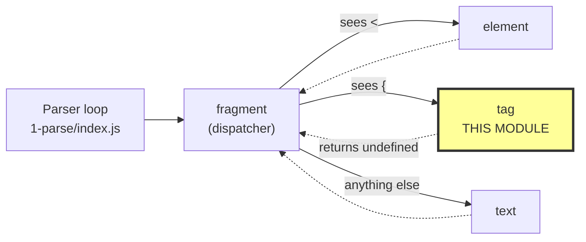

`tag` never returns another state — it always parses one complete tag and falls back to `fragment`. This means one call to `tag` handles exactly one pair of matching braces.

Related modules:

- [compiler_parse_state_machine_dispatch](compiler_parse_state_machine_dispatch.md) — `fragment` and `text`, the states that route into this one
- [compiler_parse_state_machine_element](compiler_parse_state_machine_element.md) — `element`, which handles `<...>` and attribute mustaches
- [compiler_parse_readers](compiler_parse_readers.md) — `read_expression`, `read_pattern`, the helpers that do the real JS reading
- [compiler_parse_js_interop](compiler_parse_js_interop.md) — the Acorn wrapper (`parse_expression_at`)
- [compiler_parse_utils](compiler_parse_utils.md) — `create_fragment`, `match_bracket`

---

## Internal structure

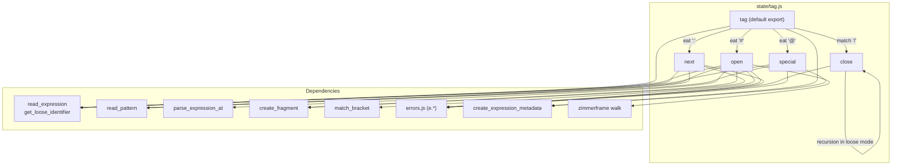

### Dependency notes

| Dependency | Used for |
| --- | --- |
| `read_expression` | reads any JS expression starting at the cursor and advances the cursor past it |
| `get_loose_identifier` | loose-mode fallback: gives back an empty `Identifier` covering up to the matching `}` |
| `read_pattern` | reads destructuring targets — `{#each x as {a, b}}`, `{:then value}`, `{@const [a] = b}` |
| `parse_expression_at` | used once, to parse a snippet's parameter list as an arrow function |
| `match_bracket` | used once, to skip a snippet's TypeScript generic parameters `<T>` |
| `create_fragment` | makes the empty child fragment each block branch writes into |
| `create_expression_metadata` | attaches the metadata slot that phase 2 fills in ([compiler_analyze](compiler_analyze.md)) |
| `walk` (zimmerframe) | unwraps a stray `TSAsExpression` in `{#each ... as ...}` |
| `e.*` | all compile errors raised here |

---

## The two parser stacks

Almost everything in this module is really about keeping two stacks on the `Parser` in sync:

- `parser.stack` — the currently *open* nodes (root, elements, blocks). `parser.current()` is the top.
- `parser.fragments` — the fragment new nodes get appended to. `parser.append(node)` pushes into `fragments.at(-1)`.

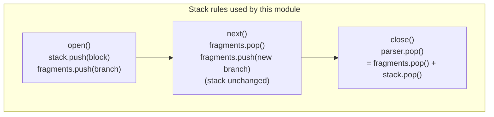

A block opener sets `end: -1`; `close` is what finally writes the real `end` offset. If the template runs out before that happens, the `Parser` constructor reports `block_unclosed`.

### Worked example — `{#if a}x{:else}y{/if}`

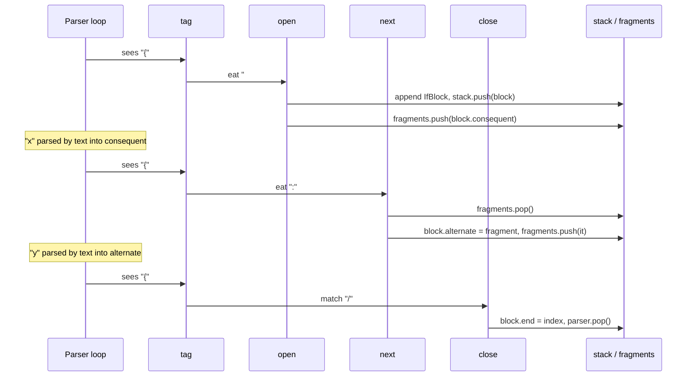

---

## `tag` — the dispatcher

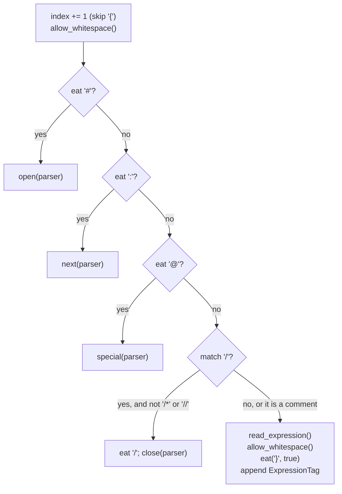

Two details worth knowing:

1. **Comments are not close tags.** `{/* … */}` and `{// … }` start with `/` but are deliberately *not* treated as `{/if}`-style closers. They fall through to `read_expression`, which lets Acorn's comment handlers pick them up ([compiler_parse_js_interop](compiler_parse_js_interop.md)).
2. **Whitespace after `{` is allowed** before the sigil, so `{ #if x }` parses like `{#if x}`.

---

## `open` — `{#...}` block openers

`open` first walks the index backwards to find the real `{`, because `start` must point at the brace, not at the sigil.

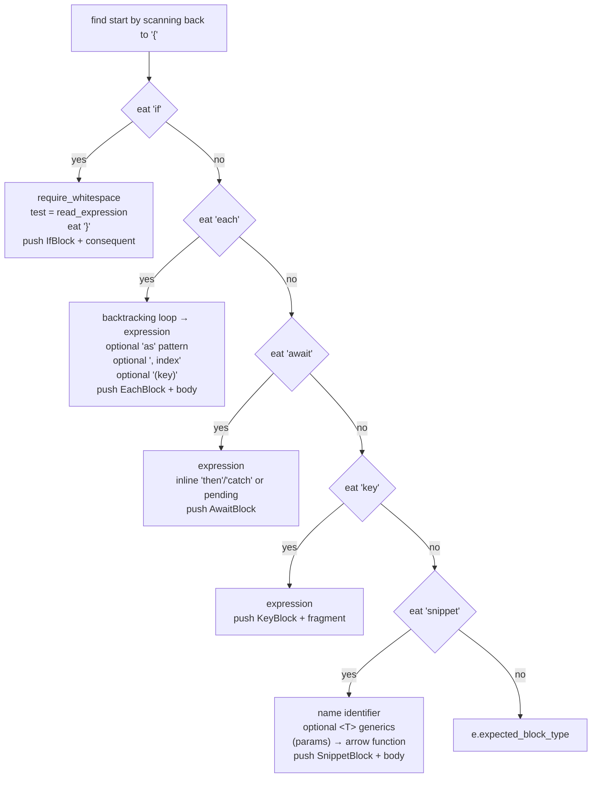

### `{#if ...}`

The simplest case. `elseif: false` marks it as a top-level `if`; `{:else if}` creates a nested block with `elseif: true` (see `next`).

### `{#each ...}` — the hardest case in the file

Three separate problems are solved here.

**1. `as` reads as an expression, not a pattern.**
`{#each x as { y = z }}` cannot be parsed in one pass — Acorn sees `as { y = z }` as an expression, and `{ y = z }` is not a valid expression. The fix is a backtracking loop: try to read the expression; on failure, temporarily truncate `parser.template` just before the last `as` and retry. The original template is restored afterwards.

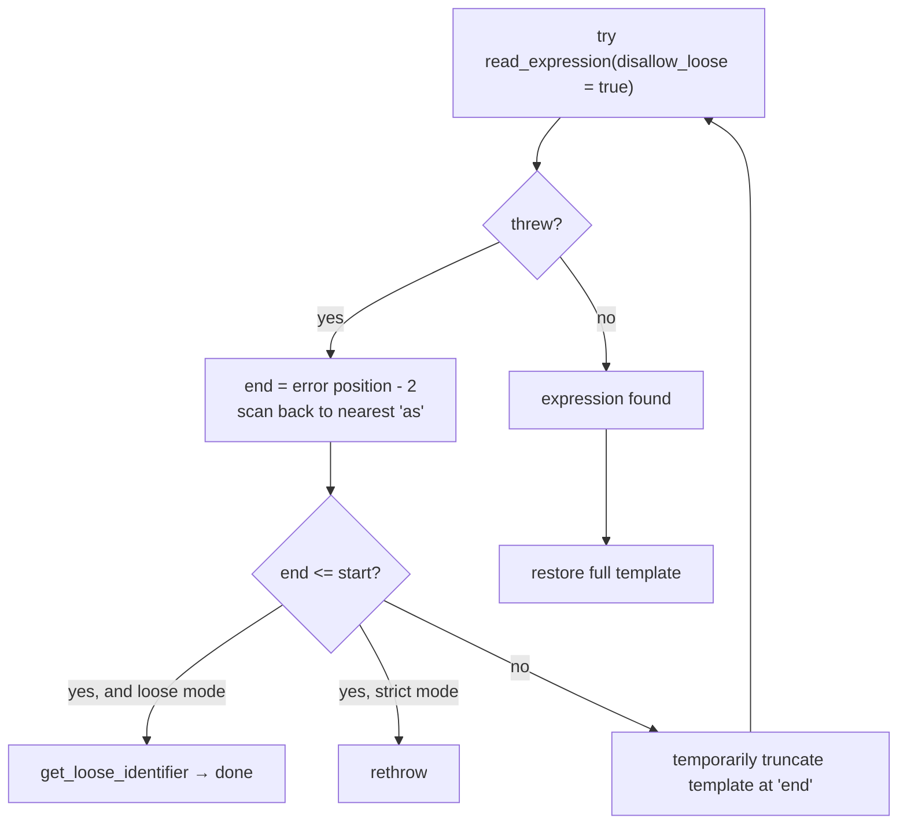

**2. A TypeScript `as` assertion can be eaten by mistake.**
In `{#each items as Foo[]}`-shaped code Acorn may swallow the `as` into a `TSAsExpression`. If no `as` remains at the cursor, the code walks the expression with zimmerframe, unwraps that trailing `TSAsExpression`, and rewinds `parser.index` back to the `as` so it can be read as the context keyword instead.

**3. `{#each expr, i}` with no `as`.**
Without `as`, `expr, i` parses as a `SequenceExpression`. The index is reset to `expression.end` so the `, i` part can be re-read by the normal `,` handling below.

After that, in order: optional `as <pattern>`, optional `, <index identifier>`, optional `(<key expression>)`, then `}`. If the closing brace is missing, one last recovery checks for a literal `" as "` just behind the cursor (the `{#each foo. as x}` case) and rebuilds the expression as an empty `Identifier`; otherwise `eat('}', true)` is re-run purely to produce the error.

`metadata` is left as `null` here — [compiler_analyze](compiler_analyze.md) fills it in.

### `{#await ...}`

An `AwaitBlock` carries three optional fragments (`pending`, `then`, `catch`) plus two optional patterns (`value`, `error`). `open` decides which fragment the *first* branch is:

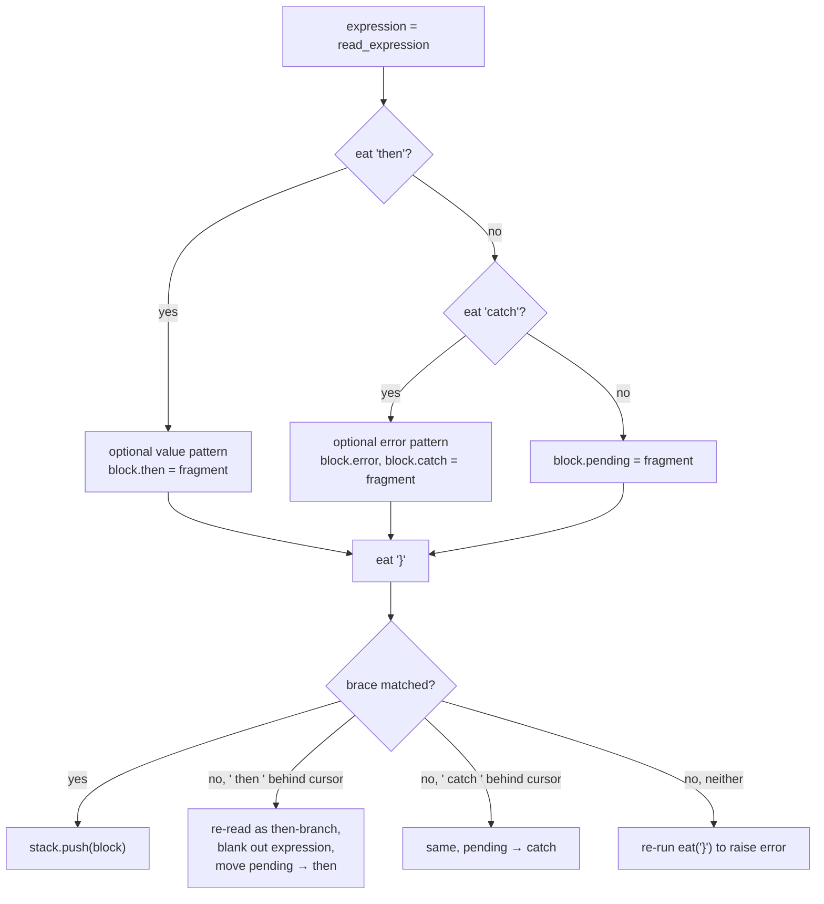

The `regex_whitespace_with_closing_curly_brace` check (`/^\s*}/`) distinguishes `{#await p then}` (no value) from `{#await p then value}`.

### `{#key ...}`

Reads one expression and pushes a `KeyBlock` with a single `fragment`.

### `{#snippet ...}`

The only place in the file that calls Acorn directly.

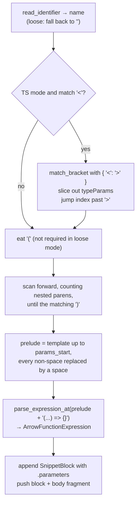

The `prelude` trick is important: padding the synthetic source with the same number of characters as the real template keeps every `start`/`end` offset in the parsed parameters correct, so source maps and error frames still point at the right place. Compare the same idea in `read_pattern` ([compiler_parse_readers](compiler_parse_readers.md)).

`metadata.can_hoist` and `metadata.sites` start empty and are populated later by the analyze and transform phases.

---

## `next` — `{:...}` continuations

`next` does **not** touch `parser.stack`. It only swaps the fragment that subsequent nodes are appended to. Which continuations are legal depends entirely on `parser.current()`.

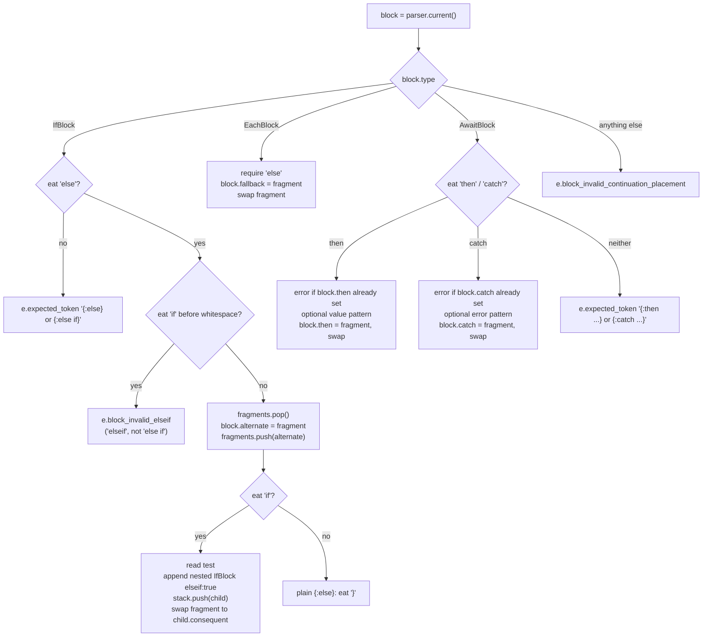

**`{:else if}` builds a nested tree.** Each `else if` becomes a *child* `IfBlock` with `elseif: true`, pushed onto the stack and never popped by `next`. So `{#if a}{:else if b}{:else if c}{/if}` leaves three `IfBlock`s stacked when `{/if}` arrives — which is exactly why `close` has an unwinding loop.

The `elseif_start` offset is computed by scanning back to `{`, so the nested block's `start` points at the `{` of `{:else if}`.

---

## `close` — `{/...}` closers

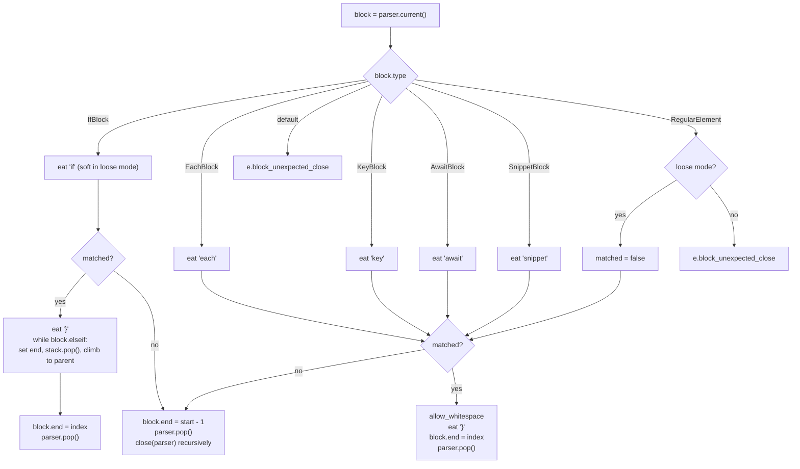

Two mechanisms here:

**Elseif unwinding.** When the top of the stack is an `elseif` `IfBlock`, the `while (block.elseif)` loop pops each one, giving them all the same `end`, until it reaches the original `{#if}`. One `{/if}` therefore closes the whole chain.

**Loose-mode auto-close cascade.** In loose mode (`parser.loose`, used by tooling such as the language server on half-typed files) a mismatched closer does not error. Instead the current block is force-closed at `start - 1` and `close` calls *itself* with the new top of stack. The recursion keeps popping until something matches — so `{#if a}{#each b as c}{/if}` closes the `each` implicitly and then matches the `if`.

`RegularElement` on the stack is only tolerated in loose mode; in strict mode `{/if}` inside an unclosed `<div>` is a hard `block_unexpected_close`.

---

## `special` — `{@...}` tags

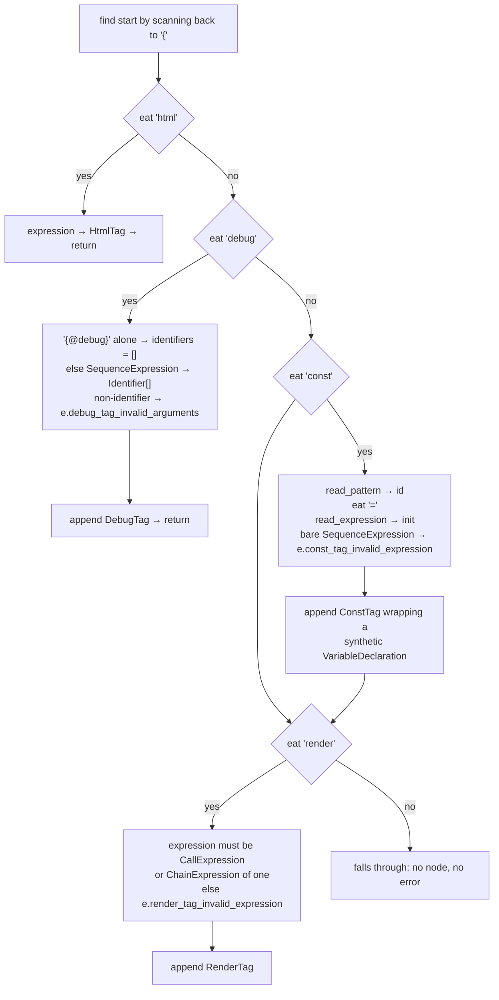

Notes on each tag:

- **`{@html expr}`** — plain `HtmlTag`; escaping and sanitising happen far downstream ([compiler_transform_client](compiler_transform_client.md), [compiler_transform_server](compiler_transform_server.md)).
- **`{@debug}`** — the bare form (matched by `/^\s*}/`) means "debug everything" and stores an empty `identifiers` array. Otherwise a comma list parses as a `SequenceExpression` and every element must be an `Identifier`.
- **`{@const x = y}`** — the node wraps a hand-built `VariableDeclaration` whose `start` is `start + 2` so it points at `const`, not at `@const`. The `SequenceExpression` guard allows `{@const a = (b, c)}` but rejects `{@const a = b, c = d}`, by checking whether a `(` appears between `=` and the expression start.
- **`{@render foo(...)}`** — the expression must be a call, or an optional chain ending in a call (`foo?.()`).

Two behaviours to be aware of:

- `const` and `render` use `if` without `return`, so after a successful `{@const ...}` the function still tests `eat('render')`. This is harmless in practice (the cursor is past `}`), but it is why those two branches read differently from `html` and `debug`.
- An unknown `{@whatever}` produces **no node and no error** from this function. `{@attach ...}` is not handled here at all — attachments are parsed as element attributes; see [compiler_parse_state_machine_element](compiler_parse_state_machine_element.md).

---

## Data flow out of this module

Every node created here is pushed straight onto the AST via `parser.append`, with a metadata slot that later phases fill in.

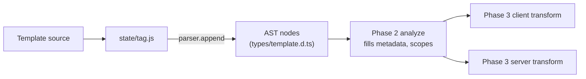

| Node created here | Analyze visitor | Client visitor | Server visitor |
| --- | --- | --- | --- |
| `IfBlock` | `IfBlock.js` | `IfBlock.js` | `IfBlock.js` |
| `EachBlock` | `EachBlock.js` | `EachBlock.js` | `EachBlock.js` |
| `AwaitBlock` | `AwaitBlock.js` | `AwaitBlock.js` | `AwaitBlock.js` |
| `KeyBlock` | `KeyBlock.js` | `KeyBlock.js` | `KeyBlock.js` |
| `SnippetBlock` | — | `SnippetBlock.js` | `SnippetBlock.js` |
| `HtmlTag` | `HtmlTag.js` | `HtmlTag.js` | `HtmlTag.js` |
| `DebugTag` | `DebugTag.js` | `DebugTag.js` | `DebugTag.js` |
| `ConstTag` | `ConstTag.js` | `ConstTag.js` | `ConstTag.js` |
| `RenderTag` | — | `RenderTag.js` | `RenderTag.js` |
| `ExpressionTag` | — | handled in `Fragment.js` | handled in `shared/utils.js` |

Type definitions for all of these live in [compiler_ast_types](compiler_ast_types.md) and are re-exported publicly through [template_ast](template_ast.md).

---

## Error catalogue

All errors come from `errors.js` (see [compiler_options_and_warnings](compiler_options_and_warnings.md) for the generated diagnostics infrastructure).

| Error | Raised by | Trigger |
| --- | --- | --- |
| `expected_block_type` | `open` | `{#foo}` where `foo` is not a known block |
| `expected_identifier` | `open` | missing index name after `,`, or missing snippet name |
| `expected_token` | `open`, `next`, `Parser.eat` | a required `}`, `)`, `=` etc. is missing |
| `block_invalid_elseif` | `next` | `{:elseif}` instead of `{:else if}` |
| `block_duplicate_clause` | `next` | a second `{:then}` or `{:catch}` on one await block |
| `block_invalid_continuation_placement` | `next` | `{:else}` where no matching block is open |
| `block_unexpected_close` | `close` | `{/if}` with nothing (or the wrong thing) open |
| `debug_tag_invalid_arguments` | `special` | `{@debug a.b}` — not a plain identifier |
| `const_tag_invalid_expression` | `special` | `{@const a = b, c = d}` |
| `render_tag_invalid_expression` | `special` | `{@render foo}` — not a call |

---

## Loose parsing mode

Loose mode exists so editor tooling can still get a usable AST from an incomplete file. This module participates in four ways:

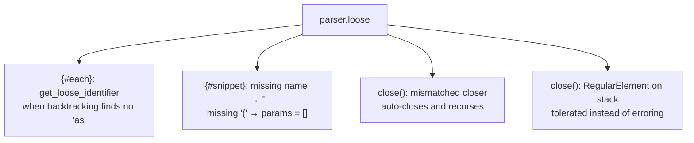

The `eat(str, required, required_in_loose)` third argument is the switch: passing `false` means "required in strict mode, optional in loose mode". You will see `parser.eat('}', true, false)` in exactly the places where a recovery path follows.

---

## Maintainer notes

- **Adding a new block type** — add an `eat` branch in `open` before the final `e.expected_block_type`, add a `case` in `close`, and if it has branches, a branch in `next`. Then add the node type in [compiler_ast_types](compiler_ast_types.md) and visitors in phases 2 and 3.
- **Adding a new `{@...}` tag** — add a branch in `special`. Remember to `return` at the end of the branch, and note there is no catch-all error for unknown tags today.
- **Offsets matter.** `start` is always the `{`, found by scanning backwards; `end` for blocks is written by `close`. Any synthetic source you feed to Acorn must be space-padded so offsets survive — see the snippet `prelude`.
- **Never leave the stacks unbalanced.** Each `stack.push` needs a matching `parser.pop()` on every path, otherwise the `Parser` constructor's unclosed check will fire with a confusing message.
