# Compiler Parse Utils

## Introduction

This module is the **toolbox of the template parser**. It holds four small, mostly self-contained
files that the parser state machine and the readers call when they need a low-level answer:

| File | Exports | The one question it answers |
| --- | --- | --- |
| `phases/1-parse/utils/html.js` | `decode_character_references`, `get_entity_pattern`, `validate_code` | "What real text does this HTML entity stand for?" |
| `phases/1-parse/utils/bracket.js` | `find_matching_bracket`, `match_bracket` | "Where does this bracket close?" |
| `phases/1-parse/utils/create.js` | `create_fragment` | "Give me an empty child-node container." |
| `phases/1-parse/utils/fuzzymatch.js` | `fuzzymatch` (default), `FuzzySet`, `sort_descending` | "The user typed a bad name — did they mean this one?" |

Two things are worth knowing up front:

- **These helpers hold no parser state.** `html.js`, `create.js` and `fuzzymatch.js` are pure
  functions over strings. Only `match_bracket` touches a `Parser`, and it only *reads*
  `parser.template`.
- **The state machine owns the cursor, not this module.** `find_matching_bracket` and
  `match_bracket` return an index; the caller decides whether to move `parser.index` there.

The parser itself, the cursor, and the state loop live in
[compiler_parse](compiler_parse.md) and [compiler_parse_state_machine](compiler_parse_state_machine.md).

---

## Architecture Overview

### Where the toolbox sits inside phase 1

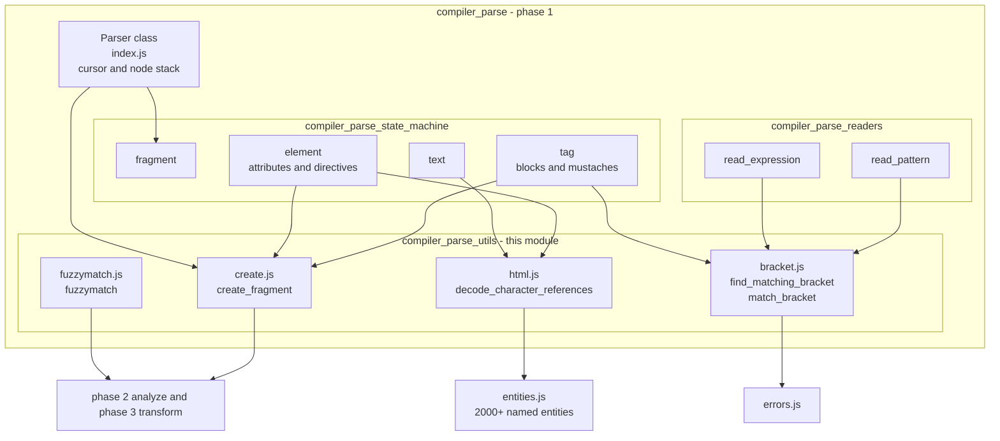

Note the odd one out: **`fuzzymatch` has no caller inside phase 1 any more.** It lives in the parse
folder for historical reasons, but today it is imported by
[compiler_analyze](compiler_analyze.md) and by `utils/extract_svelte_ignore.js`
(see [compiler_core](compiler_core.md)).

### Responsibility split

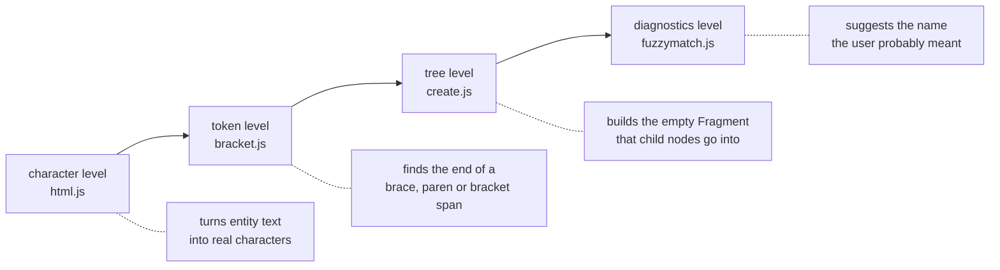

---

## 1. `html.js` — HTML entity decoding

### Purpose

A `.svelte` template is written by humans, so it may contain `&amp;`, `&#8364;` or `&hellip;`.
The compiler does not hand the template to a browser, so nothing decodes those for it. This file
does that job, and it does it **for text nodes and for attribute values only** — never for
expressions or script content.

### The three pieces

| Function | Exported | Job |
| --- | --- | --- |
| `reg_exp_entity` | no | Builds the regex source for **one** entity name, with the attribute-value special case applied |
| `get_entity_pattern` | yes | Joins every entity into **one** big global regex |
| `decode_character_references` | yes | Runs the regex over a string and replaces each hit |
| `validate_code` | yes | Maps a raw code point onto a code point that is legal to emit |

### Why there are two regexes

`get_entity_pattern` is called exactly twice, at module load, and the results are cached in module
constants:

```js
const entity_pattern_content    = get_entity_pattern(false);
const entity_pattern_attr_value = get_entity_pattern(true);
```

Building the pattern is expensive (it walks every key of `entities.js`), so it happens once per
process, not once per template.

The two patterns differ because the HTML spec treats attribute values differently. Inside an
attribute value, an entity **without a trailing semicolon** must *not* decode when the next
character is `=`, a digit, or a letter. `reg_exp_entity` implements that by appending a word
boundary plus a negative lookahead:

| Context | Input | Result |
| --- | --- | --- |
| Text node | `&ampfoo` | decoded — `&` is recognised |
| Attribute value | `?a=1&amp=2` | left alone — `&amp` is followed by `=` |
| Attribute value | `?a=1&amp;b=2` | decoded — the semicolon makes it unambiguous |

This is why every caller must pass the correct `is_attribute_value` flag.

### Decoding flow

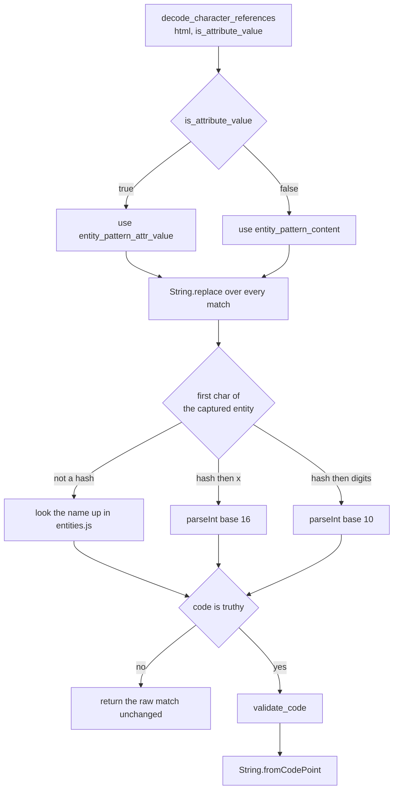

Two consequences of the `if (!code) return match` line:

- An unknown named entity is **kept verbatim** — the parser never errors on it.
- `&#0;` is also kept verbatim, because `0` is falsy.

### `validate_code` — the code point sanitiser

The compiler writes characters straight into generated output, so it bypasses the browser's own
repair step for illegal code points. `validate_code` performs that repair itself.

| Input code point | Returned | Reason |
| --- | --- | --- |
| `10` (line feed) | `32` (space) | a decoded newline becomes generic whitespace |
| below `128` | unchanged | plain ASCII |
| `128` – `159` | `windows_1252[code - 128]` | browsers lenient-map this range; without the fix a `&#128;` euro sign would vanish |
| `160` – `55295` | unchanged | basic multilingual plane |
| `55296` – `57343` | `0` | UTF-16 surrogate halves are not standalone characters |
| `57344` – `65535` | unchanged | rest of the BMP |
| `65536` – `196607` | unchanged | supplementary multilingual and ideographic planes |
| `917504` – `917631`, `917760` – `917999` | unchanged | supplementary special-purpose plane (tag characters, variation selectors) |
| anything else | `0` | not a usable character |

A `0` result becomes a real NUL character in the output string, which is the same substitution a
browser would make.

### Callers

| Caller | Flag | What gets decoded |
| --- | --- | --- |
| `state/text.js` → `text` | `false` | the `data` of every `Text` node |
| `state/element.js` → `read_static_attribute` | `true` | a quoted or bare static attribute value |
| `state/element.js` → `read_sequence` (via `flush`) | `true` | each plain-text chunk of a mixed attribute value such as `class="a {b} c"` |

All three follow the same convention, which downstream phases rely on:

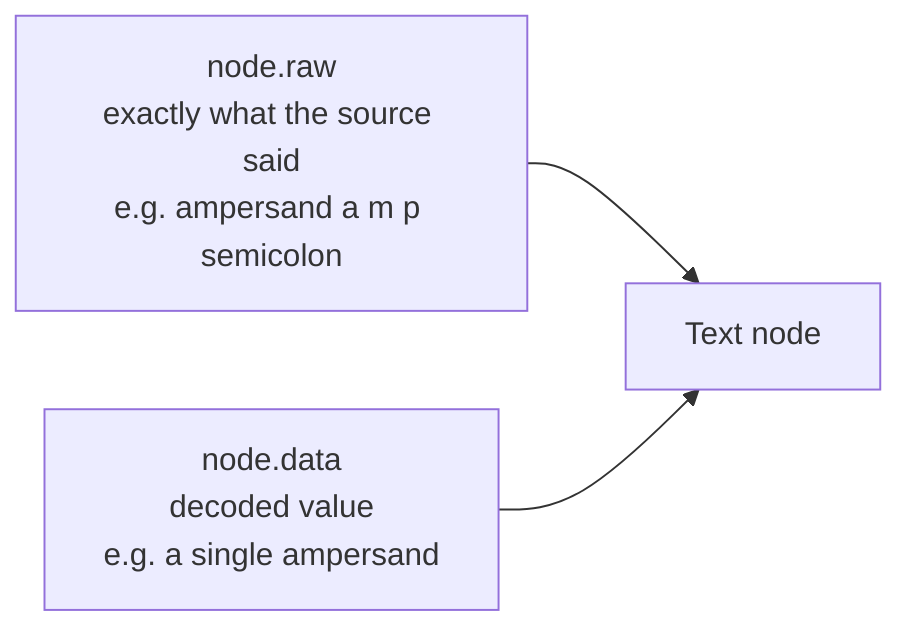

`raw` is preserved so that source maps, the migration tool
([compiler_migrate](compiler_migrate.md)) and error frames can still point at the original text,
while `data` is what actually gets rendered.

---

## 2. `bracket.js` — finding the closing bracket

### Two functions, two contracts

Both functions scan forward for a matching close bracket, but they are built for different
situations and should not be swapped.

| | `find_matching_bracket` | `match_bracket` |
| --- | --- | --- |
| Input | a plain string, a start index, the open char | a `Parser`, a start index, an optional bracket map |
| Assumes the open bracket is | already consumed (`brackets` starts at `1`) | still ahead of `start` (it is pushed on the stack) |
| Returns | index of the close bracket, or `undefined` | index **just past** the close bracket |
| On failure | returns `undefined` quietly | throws a compile error |
| Tracks nesting | one counter for one bracket kind | a stack, so mismatched kinds are detected |
| Skips comments and regex literals | yes | no |
| Main use | loose / error-recovery parsing | strict parsing of patterns and generics |

### `find_matching_bracket` — the forgiving scanner

Its job is to answer "if I cannot parse this expression, where would it have ended?" That is why it
must not be fooled by brackets that live inside strings, comments, or regex literals.

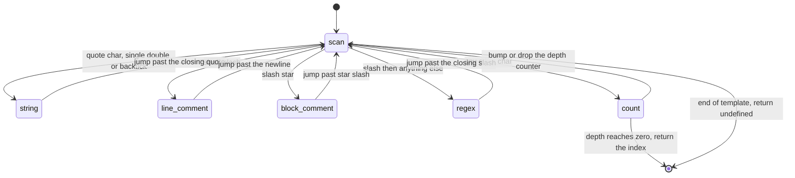

The private helpers exist to make those jumps safe:

| Helper | Job |
| --- | --- |
| `infinity_if_negative` | turns an `indexOf` miss (`-1`) into `Infinity`, so a failed jump lands past the end of the string and the loop stops instead of walking backwards |
| `find_unescaped_char` | finds the next occurrence of a char that is **not** backslash-escaped |
| `count_leading_backslashes` | counts the run of backslashes before an index; an **even** count means the char is not escaped |
| `find_string_end` | wraps `find_unescaped_char`; for `'` and `"` it first clips the search at the next newline, because a normal string cannot span lines. Backtick strings are searched to the end |
| `find_regex_end` | `find_unescaped_char` looking for the closing slash |

The escape counting is the subtle part:

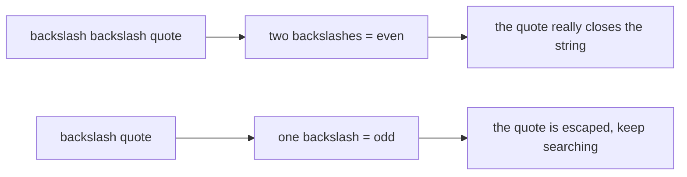

**Edge cases to be aware of**

- The only caller, `get_loose_identifier`, tests the result with `if (end)`. A close bracket at
  index `0` would therefore be treated as "not found" — harmless in practice, since index `0`
  cannot hold a closing bracket of an expression that started earlier.
- If a `/` is the very last character of the template, `const next_char = template[i + 1]` is
  `undefined` and the `continue` runs **without advancing `i`**. Any change to the `'/'` branch
  should keep this in mind.

### `match_bracket` — the strict scanner

`match_bracket` is used where Svelte genuinely needs a well-formed span before it hands the text to
acorn. It keeps a stack of open brackets, so a wrong closer is an immediate diagnostic rather than a
silently wrong index.

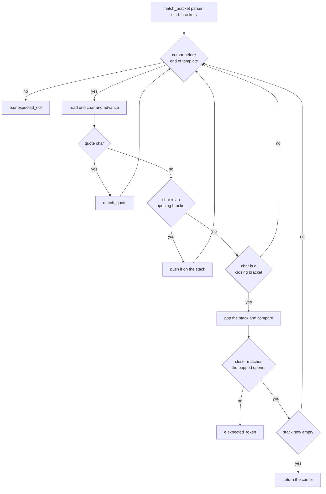

`match_quote` handles strings, and it is where the two functions become **mutually recursive**: a
template literal can contain `${ ... }`, and that interpolation can contain another template
literal.

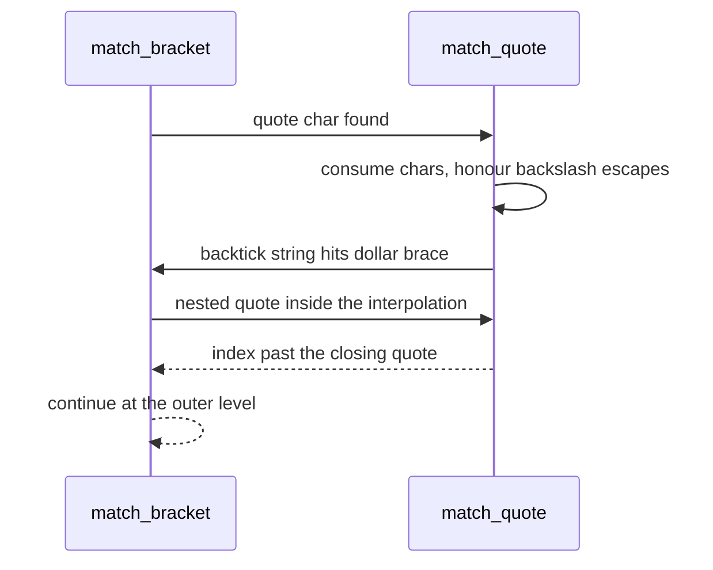

An unterminated string raises `e.unterminated_string_constant` at the position where the string
began, which is the position a developer actually wants to see.

### The `brackets` parameter

`match_bracket` takes a bracket map so the same scanner can be reused for non-JS bracket kinds:

| Caller | Map | Why |
| --- | --- | --- |
| `read/context.js` → `read_pattern` | default: `{}`, `()`, `[]` | isolate a destructuring pattern such as `{ a, b: [c] }` before re-parsing it with acorn |
| `state/tag.js` → snippet parsing | `{ '<': '>' }` (`pointy_bois`) | capture a TypeScript generic signature such as `#snippet foo<T>(...)` |

### Callers in context

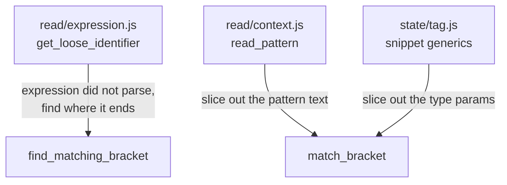

`get_loose_identifier` is the heart of **loose mode** (used by editor tooling, which must produce a
tree even for half-typed code): when acorn fails, the parser skips to the bracket that
`find_matching_bracket` reports and inserts an empty `Identifier` placeholder. See
[compiler_parse_readers_expression](compiler_parse_readers_expression.md) for the full recovery
story.

---

## 3. `create.js` — the empty fragment factory

`create_fragment` is nine lines long and yet it is called from almost every branch of the state
machine, because **every place that can hold child nodes needs a `Fragment`**.

```js
export function create_fragment(transparent = false) {
    return {
        type: 'Fragment',
        nodes: [],
        metadata: { transparent, dynamic: false, has_await: false }
    };
}
```

### The metadata fields

| Field | Set here | Who consumes it |
| --- | --- | --- |
| `transparent` | by the caller, at parse time | `phases/scope.js` — a transparent fragment does **not** open a new scope of its own (`scope.child(transparent)`); see [compiler_core](compiler_core.md) |
| `dynamic` | always `false` | flipped during analysis (`mark_subtree_dynamic`), read by phase 3 to decide whether a template node needs runtime updates; see [compiler_analyze](compiler_analyze.md) |
| `has_await` | always `false` | filled in during analysis, read by the client transform to wrap a fragment in async plumbing; see [compiler_transform_client](compiler_transform_client.md) |

So the function is really a **schema guarantee**: later phases can assume the metadata object
exists and only ever need to *update* flags, never create them. That is why no call site builds a
fragment literal by hand.

### Who calls it

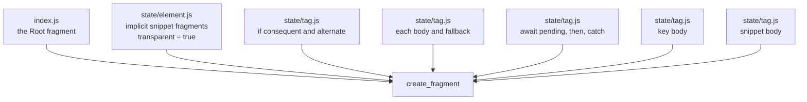

`index.js` also pushes the root fragment onto `parser.fragments`, the stack that `parser.append`
writes into — so this factory produces the very first container the parser ever uses. Details of
that stack are in [compiler_parse](compiler_parse.md).

---

## 4. `fuzzymatch.js` — "did you mean …?"

### Purpose

When a developer writes `bind:valu` or `aria-lable`, an error that only says "unknown name" is
unhelpful. `fuzzymatch(name, names)` returns the closest known name, or `null` if nothing is close
enough:

```js
const match = fuzzymatch(node.name, Object.keys(binding_properties));
```

The gate is deliberately strict — only a score **above 0.7** counts:

```js
return matches && matches[0][0] > 0.7 ? matches[0][1] : null;
```

A bad suggestion is worse than none, so near-misses are dropped.

### The algorithm

The file is an adaptation of `fuzzyset.js` (BSD licensed). It is a **two-stage** matcher: a cheap
n-gram search narrows the field, then an exact edit distance ranks the survivors.

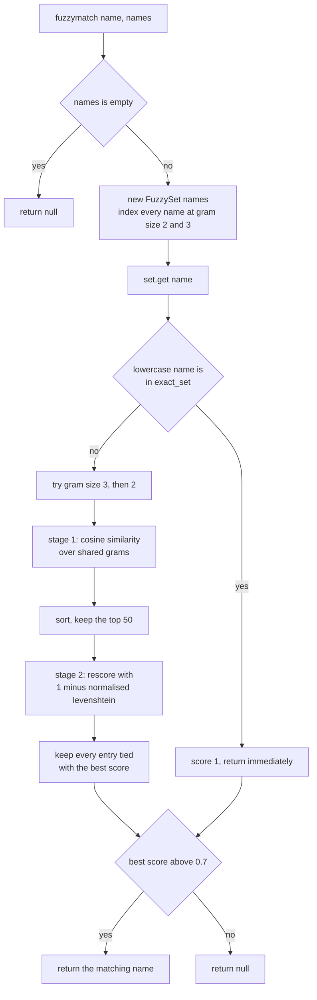

### The `FuzzySet` data structures

| Field | Shape | Role |
| --- | --- | --- |
| `exact_set` | lowercase name → original name | O(1) exact hit, and the way the original casing is restored at the end |
| `items[gram_size]` | array of `[vector_normal, lowercase_name]` | per-name vector length, used as the denominator of the cosine score |
| `match_dict[gram]` | array of `[item_index, gram_count]` | inverted index: given a gram, which names contain it and how often |

Indexing detail: `iterate_grams` lowercases the value, strips non-word characters, and wraps it in
hyphens (`value` becomes `-value-`), so grams at the start and end of a name are weighted like any
other. Each name is indexed twice, at gram size 2 and gram size 3.

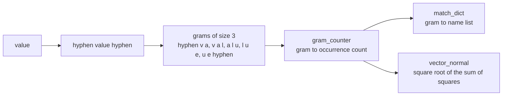

### Helpers

| Helper | Exported | Job |
| --- | --- | --- |
| `levenshtein` | no | classic edit distance, computed with a single rolling row |
| `_distance` | no | `1 - distance / max(len1, len2)` — turns edit distance into a 0-to-1 similarity |
| `iterate_grams` | no | splits a name into overlapping n-grams |
| `gram_counter` | no | counts gram occurrences |
| `sort_descending` | yes | comparator on the score of a `[score, name]` tuple; used for both sort passes |

`sort_descending` is exported mainly so tooling can reference it; inside the file it is the shared
comparator for the candidate list and for the rescored list.

### Why the two-stage design

Stage 1 is cheap and recall-oriented: an inverted-index lookup avoids comparing the typo against
every candidate. Stage 2 is precise but quadratic in string length, so it is applied only to the
top 50 candidates. The `GRAM_SIZE_UPPER` → `GRAM_SIZE_LOWER` fallback loop handles short names,
where 3-grams may produce no candidates at all but 2-grams still do.

### Where suggestions surface

| Call site | Suggests | Diagnostic |
| --- | --- | --- |
| `2-analyze/visitors/BindDirective.js` | a valid binding name | `bind_invalid_name` |
| `2-analyze/visitors/shared/a11y/index.js` | an ARIA attribute, or an ARIA role | `a11y_unknown_aria_attribute`, `a11y_unknown_role` |
| `utils/extract_svelte_ignore.js` | a real warning code inside `svelte-ignore` | `unknown_code` |

See [compiler_analyze](compiler_analyze.md) and
[compiler_options_and_warnings](compiler_options_and_warnings.md) for how those messages are
emitted.

---

## Cross-cutting concerns

### End-to-end data flow

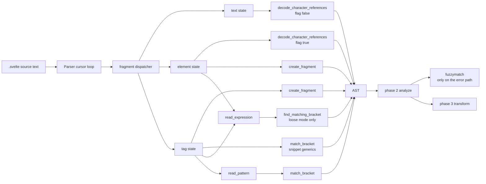

The picture makes the module's two lifetimes clear: `html.js`, `bracket.js` and `create.js` run on
the **happy path**, once per matching construct; `fuzzymatch.js` runs only when something is already
wrong.

### Error handling

| Function | Failure mode |
| --- | --- |
| `decode_character_references` | never fails; unrecognised input is returned verbatim |
| `find_matching_bracket` | returns `undefined`; the caller decides what to do |
| `match_bracket` | throws `expected_token`, `unexpected_eof`, or `unterminated_string_constant` from `errors.js` |
| `create_fragment` | cannot fail |
| `fuzzymatch` | returns `null` when nothing scores above 0.7 |

Only `bracket.js` imports `errors.js`, and only `match_bracket` throws. That is what makes
`find_matching_bracket` usable for loose mode, where throwing would defeat the purpose.

### Dependencies

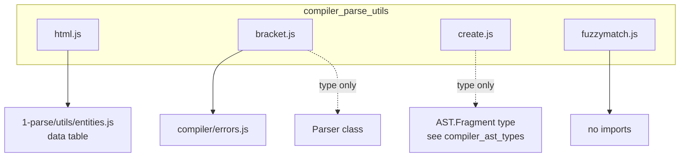

The dependency surface is intentionally tiny: one data table, one error module, and type-only
imports. Nothing here imports another phase, which is why the helpers can be reused freely — and
why `fuzzymatch` can be imported by phase 2 without creating a cycle.

### Performance notes

| Cost | Where |
| --- | --- |
| Two big regexes built once per process | `get_entity_pattern` at module load in `html.js` |
| One `FuzzySet` built **per call** | `fuzzymatch` — acceptable because it only runs on the error path |
| Linear single pass, no backtracking | both bracket scanners |
| One tiny object allocation per container | `create_fragment` |

If `fuzzymatch` ever moves onto a hot path, the per-call `FuzzySet` construction is the first thing
to cache.

---

## Working with this module

**Adding or changing entity behaviour.** Entity names live in `entities.js`, not in `html.js`.
Changing the attribute-value rule means changing `reg_exp_entity`, and the change affects every
attribute in every component — the two cached patterns are shared process-wide.

**Adding a new bracket kind.** Prefer passing a map to `match_bracket` (as `pointy_bois` does) over
writing a new scanner. `find_matching_bracket`'s `default_brackets` table is only consulted for the
closer of the *given* opener, so it stays single-kind by design.

**Adding a new block or container node.** Always build its child list with `create_fragment`, and
pass `transparent: true` only when the construct should **not** introduce its own scope.

**Adding a "did you mean" hint.** Call `fuzzymatch(bad_name, list_of_valid_names)` and pass the
result straight into the warning or error builder; the `null` case is already the "no suggestion"
signal that the message templates expect.

---

## Related documentation

| Document | Relationship |
| --- | --- |
| [compiler_parse](compiler_parse.md) | the `Parser` class, the cursor primitives, and the phase-1 entry point |
| [compiler_parse_state_machine](compiler_parse_state_machine.md) | the states that call `decode_character_references` and `create_fragment` |
| [compiler_parse_state_machine_dispatch](compiler_parse_state_machine_dispatch.md) | `fragment` and `text`, the main users of entity decoding |
| [compiler_parse_state_machine_element](compiler_parse_state_machine_element.md) | attribute reading, the second user of entity decoding |
| [compiler_parse_state_machine_tag](compiler_parse_state_machine_tag.md) | block parsing, snippet generics, and fragment creation |
| [compiler_parse_readers_expression](compiler_parse_readers_expression.md) | loose-mode recovery via `find_matching_bracket`, patterns via `match_bracket` |
| [compiler_parse_js_interop](compiler_parse_js_interop.md) | the acorn wrapper whose failures trigger loose mode |
| [compiler_analyze](compiler_analyze.md) | consumes fragment metadata and calls `fuzzymatch` for suggestions |
| [compiler_ast_types](compiler_ast_types.md) | the `AST.Fragment` and `AST.Text` shapes produced here |
| [compiler_core](compiler_core.md) | scope creation (`transparent`) and `extract_svelte_ignore` |
