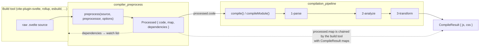
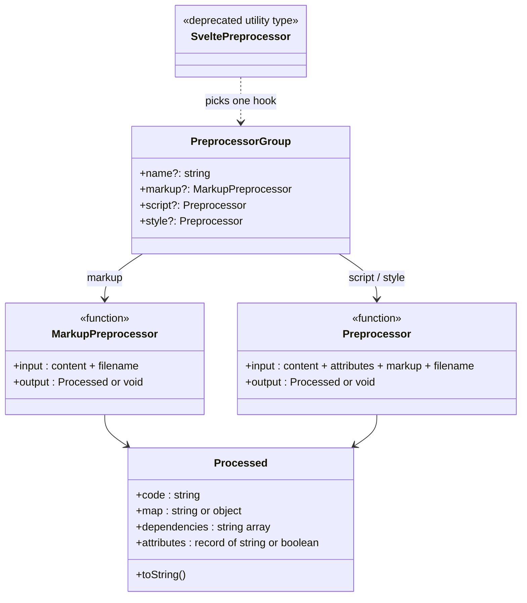
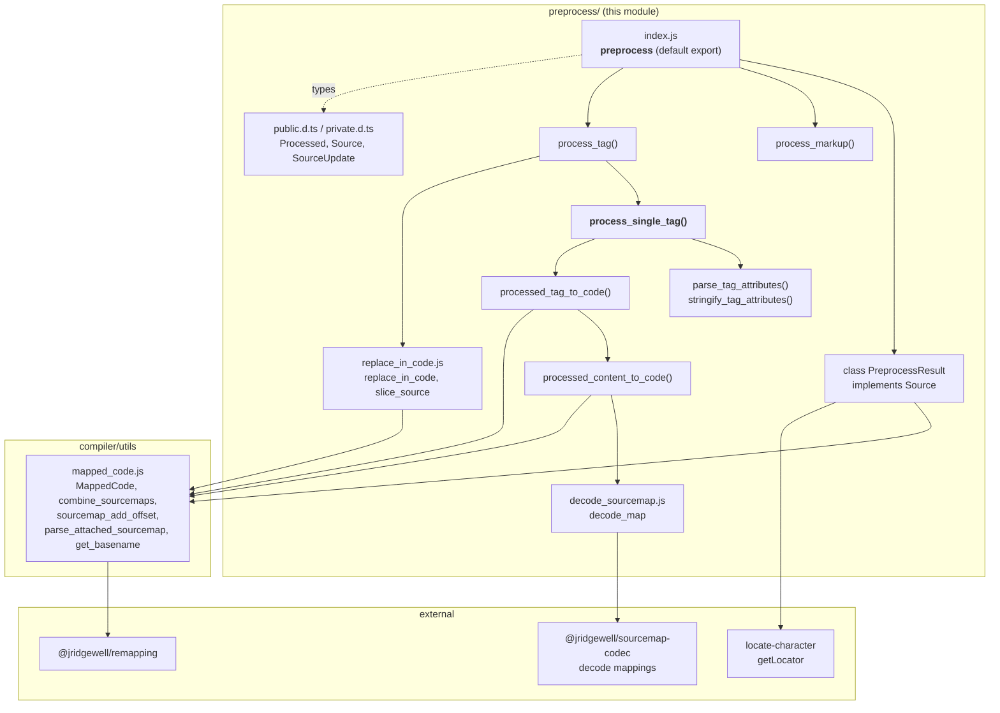
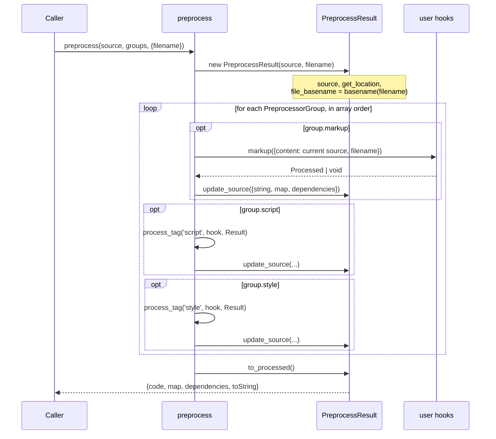
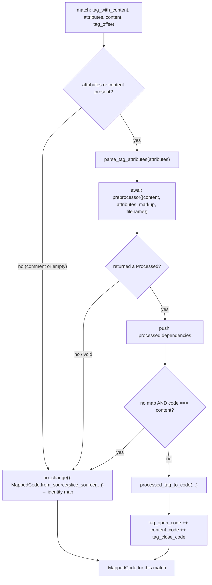
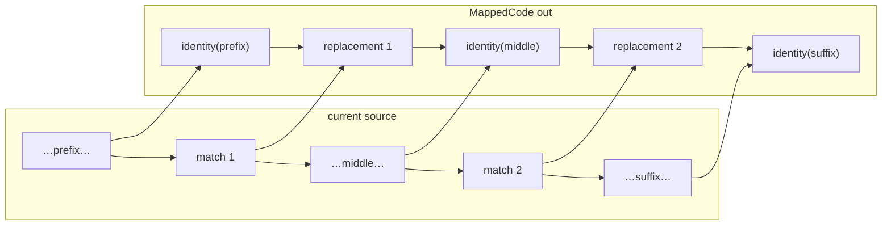
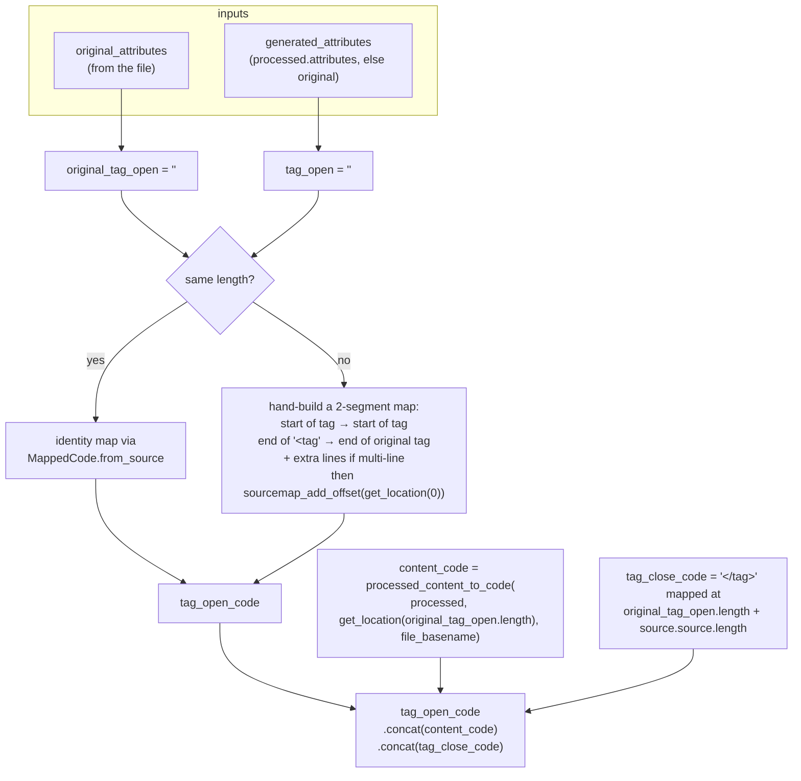
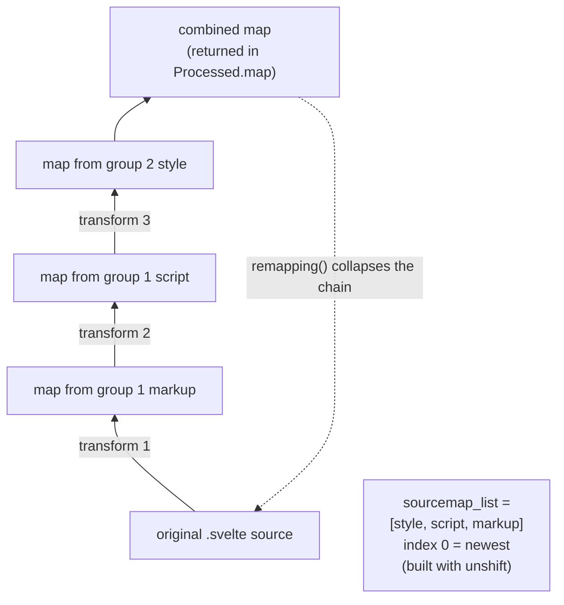
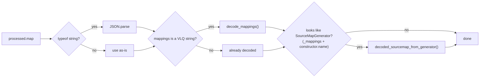
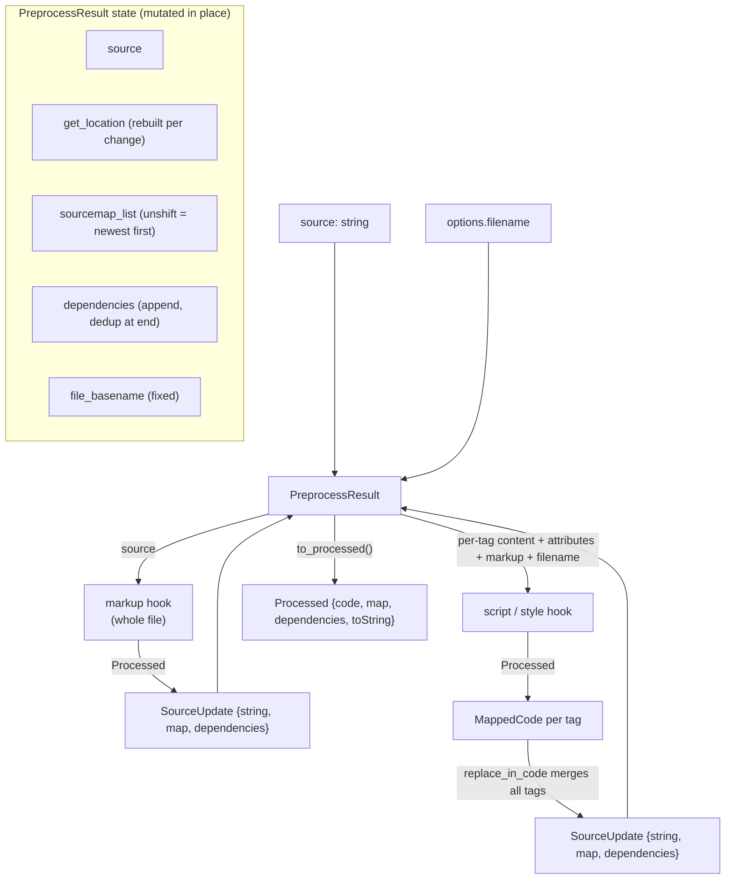

# compiler_preprocess

## Introduction

`compiler_preprocess` is the **text-in / text-out stage that runs before the Svelte compiler**. It lets tools rewrite a `.svelte` file as plain source code, so that by the time the real compiler sees it, the file only contains things Svelte understands.

The classic use case: you write `<style lang="sass">` or `<script lang="ts">`. Svelte cannot parse Sass or TypeScript-flavoured syntax in every position, so a preprocessor swaps those blocks for vanilla CSS/JS first.

Two things make this module more than a `String.replace` helper:

1. **Source maps must survive.** Every preprocessor may return its own map. The module stacks them and collapses them into one map back to the original file, so error messages and debuggers still point at the code the user wrote.
2. **Only tag *content* is replaced, not the tags themselves.** The `<script>`/`<style>` wrapper is kept (and its attributes possibly rewritten), while the inner text is swapped with mapped code.

This module is deliberately **isolated**: it does not parse Svelte, does not build an AST, and knows nothing about components. It only knows regexes, strings, offsets and source maps. The AST work starts afterwards in [compiler_parse](compiler_parse.md).

---

## 1. Scope and responsibilities

| Responsibility | In this module? |
| --- | --- |
| Run user-supplied preprocessor functions in a defined order | ✅ |
| Find `<script>` / `<style>` tags by regex | ✅ |
| Parse and re-serialize tag attributes | ✅ |
| Stitch replaced content back into the full file | ✅ |
| Chain/merge source maps across many preprocessors | ✅ |
| Collect extra watch dependencies | ✅ |
| Parse Svelte syntax, validate, transform | ❌ → [compiler_parse](compiler_parse.md), [compiler_analyze](compiler_analyze.md), [compiler_transform_client](compiler_transform_client.md) |
| Validate compile options / emit warnings | ❌ → [compiler_options_and_warnings](compiler_options_and_warnings.md) |
| Migrate Svelte 4 syntax to Svelte 5 | ❌ → [compiler_migrate](compiler_migrate.md) |

A key consequence of the "regex only" design: **the preprocessor has no semantic understanding of the file.** It cannot tell a `<script>` inside a template string from a real one, beyond skipping HTML comments.

---

## 2. Position in the overall system



Important boundary detail: **`preprocess` is never called by `compile`.** It is a separate public export that the *caller* is expected to run first.

```js
// packages/svelte/src/compiler/index.js
export { default as preprocess } from './preprocess/index.js';
```

So the contract is: `preprocess()` → hand `processed.code` to `compile()`. The two maps (preprocess map and compile map) are combined by the integration layer, not here. See [compiler_core](compiler_core.md) for the compiler entry points and [compiler_api](compiler_api.md) for the published type surface (`Processed_1`, `SveltePreprocessor_1`).

---

## 3. Public API surface

Declared in `preprocess/public.d.ts`. These are the types third-party preprocessors (e.g. `svelte-preprocess`) implement.



### `Processed`

The return value of any preprocessor hook.

| Field | Meaning |
| --- | --- |
| `code` | The new text. Required. |
| `map` | Map back to the original text. `string` or object — kept intentionally opaque so public types don't depend on the remapping library. |
| `dependencies` | Extra files that were read (e.g. `@import`ed Sass partials). Surfaced so build tools can watch them. |
| `attributes` | **Script/style only.** Replacement attributes for the tag. `undefined` means "leave attributes alone". |
| `toString()` | Convenience, so the result can be used where a string is expected. |

### Returning nothing

Every hook may return `void`. That is the explicit signal for **"I did not change anything"**, and it activates the cheapest code path (identity mapping, no map merge). Returning `{ code: unchangedContent }` is *also* detected as a no-op for tags, but returning `void` is clearer.

### `SveltePreprocessor`

A deprecated helper type that extracts a single hook type out of a group (`Required<Pick<PreprocessorGroup, T>>`). Kept for backwards compatibility only; the docs tell you to write the utility yourself.

### `preprocess(source, preprocessor, options?)`

```js
const processed = await preprocess(source, [sveltePreprocess(), myOwn], {
  filename: 'src/lib/Button.svelte'
});
const { js, css } = compile(processed.code, { filename: 'src/lib/Button.svelte' });
```

* `preprocessor` — a single group or an array of groups. `null`/`undefined` yields an empty list (pass-through).
* `options.filename` — used for source-map `sources` and passed to every hook. There is a **legacy fallback**: if `options.filename` is missing, `preprocessor.filename` is read off the group object.

---

## 4. Internal architecture



### Component roles

| Component | Role |
| --- | --- |
| **`preprocess`** (default export) | Orchestrator. Builds a `PreprocessResult`, walks every group in order, applies `markup` → `script` → `style`, returns `to_processed()`. |
| `PreprocessResult` | Mutable accumulator **and** the `Source` object handed to helpers. Holds current `source`, the `sourcemap_list`, `dependencies`, `file_basename`, and a fresh `get_location` locator. |
| `process_markup` | Thin adapter: calls the hook with the whole file, normalizes the returned map (JSON-parses it if it's a string) into a `SourceUpdate`. |
| `process_tag` | Picks the right tag regex, drives `replace_in_code`, collects dependencies for all matches in the file. |
| **`process_single_tag`** | The per-tag worker (closure inside `process_tag`). Decides no-op vs. rewrite, calls the user hook, and produces a `MappedCode` for that tag. |
| `processed_tag_to_code` | Rebuilds `<tag attrs>` + content + `</tag>` as one `MappedCode`, including a hand-built map for the open tag when attributes changed length. |
| `processed_content_to_code` | Decodes the preprocessor's map and offsets it so it points at the tag's real position in the file. |
| `parse_tag_attributes` / `stringify_tag_attributes` | Attribute string ⇄ `Record<string, string | boolean>`. |
| `replace_in_code` / `slice_source` | Generic "replace regex matches with `MappedCode`" utility, plus offset-shifted `Source` views. |
| `decode_map` | Normalizes any incoming map shape into a decoded map (handles JSON strings, VLQ `mappings` strings, and `SourceMapGenerator` instances). |

---

## 5. Execution flow

### 5.1 Outer loop



Two ordering rules that matter in practice:

1. **Within a group:** `markup`, then `script`, then `style`. So a group's `markup` hook always sees the file before that same group's `script`/`style` hooks touched it.
2. **Across groups:** groups are fully applied one after another. Group *n*'s `style` hook runs **before** group *n+1*'s `markup` hook. Preprocessors are therefore *not* interleaved by hook type — order in the array is a real pipeline order.

### 5.2 `update_source` — the accumulator step

```js
update_source({ string: source, map, dependencies }) {
  if (source != null) { this.source = source; this.get_location = getLocator(source); }
  if (map) { this.sourcemap_list.unshift(map); }   // note: unshift, not push
  if (dependencies) { this.dependencies.push(...dependencies); }
}
```

Three invariants live in these five lines:

* The locator is **rebuilt** whenever text changes, so offsets → `{line, column}` always refer to the *current* text.
* `sourcemap_list` is kept in **reverse order** (newest map at index 0), because that is what `@jridgewell/remapping` expects for a chain of transformations.
* Dependencies accumulate across all hooks and are de-duplicated only at the very end (`[...new Set(...)]`).

---

## 6. Tag processing pipeline

### 6.1 Finding tags

Two large regexes do the matching:

```js
const regex_style_tags =
  /<!--[^]*?-->|<style((?:\s+[^=>'"/\s]+=(?:"[^"]*"|'[^']*'|[^>\s]+)|\s+[^=>'"/\s]+)*\s*)(?:\/>|>([\S\s]*?)<\/style>)/g;
```

Reading it piece by piece:

* `<!--[^]*?-->|` — **the comment branch comes first**. A commented-out `<style>` is consumed as a comment, so capture groups 1 and 2 are `undefined` and the match is left untouched. This is how "don't preprocess commented-out blocks" is implemented.
* group 1 = the raw attribute string; group 2 = the tag content.
* `(?:\/>|>…<\/tag>)` — self-closing tags match with `content === undefined`.

### 6.2 Per-tag decision flow



The two `no_change()` shortcuts are the performance story of this module: an untouched tag never produces a source map to merge, only a cheap high-resolution identity map.

> **Signature note:** `process_single_tag`'s JSDoc lists `(tag_with_content, tag_offset)`, but the real parameters are `(tag_with_content, attributes = '', content = '', tag_offset)` — they line up with the regex capture groups, because the function is used as a `String.prototype.replace` callback. The JSDoc is out of date, not the code.

### 6.3 Concurrency

`replace_in_code` collects *all* matches first, then awaits them together:

```js
function calculate_replacements(re, get_replacement, source) {
  const replacements = [];
  source.replace(re, (...match) => { replacements.push(get_replacement(...match).then(...)); return ''; });
  return Promise.all(replacements);   // ← all tags processed in parallel
}
```

So **every `<script>` in a file is handed to the hook concurrently**, and the hook must not rely on being called sequentially or on shared mutable state. Only after all promises settle does `perform_replacements` splice the results together in offset order.

### 6.4 Splicing results back



`perform_replacements` walks the sorted replacements, wrapping every unchanged gap in `MappedCode.from_source(slice_source(gap, last_end, source))` and `concat`-ing everything into one `MappedCode`. `concat` is in-place and mutating, which keeps this cheap for large files — see `MappedCode` in the compiler `utils` layer.

---

## 7. Rebuilding a tag: the tricky part

`processed_tag_to_code` reassembles three pieces. The hard case is the **open tag**, because a preprocessor may change attributes (`lang="ts"` → nothing), which changes the tag's *length*, which breaks a naive identity mapping.



Notes on the details:

* The two-segment map means: *"`<script` maps to `<script`; everything after it, up to `>`, collapses onto the end of the original open tag."* Attribute text that a preprocessor deleted simply has no mapping — which is correct, it does not exist in the original.
* The multi-line `while (mappings.length <= line)` loop handles attributes spread over several lines, pushing a segment per generated line so line counts stay consistent.
* `attributes` are only re-serialized when the hook returned them: `stringify_tag_attributes(processed.attributes) ?? attributes`. Boolean `true` becomes a bare attribute name; everything else becomes `key="value"`.
* `processed_content_to_code` offsets the decoded map by the location of the content start, but **only for segments whose source index is the component file** (`decoded_map.sources.indexOf(file_basename)`). Segments pointing at *other* sources (e.g. an imported Sass partial) are left alone — that is what makes cross-file maps work.

### The offset bookkeeping

`Source` (from `private.d.ts`) is the small interface that makes all of this position-correct:

```ts
interface Source {
  source: string;                              // the text this view covers
  get_location: (search: number) => Location;  // index in this view → line/column in the ORIGINAL
  file_basename: string;
  filename?: string;
}
```

`slice_source(code_slice, offset, parent)` returns a new `Source` whose `get_location(i)` is `parent.get_location(i + offset)`. That is the whole trick: nested views keep resolving back to real positions without copying maps around.

One subtlety worth knowing when reading the code: `process_single_tag` calls

```js
slice_source(content, tag_offset, source)
```

i.e. the content view is anchored at the **start of the tag**, not the start of the content. `processed_tag_to_code` compensates by asking for `get_location(original_tag_open.length)` when placing the content, and `original_tag_open.length + source.source.length` when placing the closing tag. The offsets are consistent — just relative to the tag, not the content.

---

## 8. Source map chaining



`to_processed()` finishes the job:

```js
const map = combine_sourcemaps(this.file_basename, this.sourcemap_list);
return { code: this.source, dependencies: [...new Set(this.dependencies)], map, toString: () => this.source };
```

`combine_sourcemaps` (in `compiler/utils/mapped_code.js`) picks one of two `remapping` strategies:

* **Array interface** — used when no map except the oldest has multiple sources. Simple and fast.
* **Loader interface** — used otherwise; it walks maps by `sourcefile`, treating the component file as a "branch node" and everything else as a leaf.

Both rely on the convention that a preprocessor's map lists the component as a **basename** (`Button.svelte`, not `src/lib/Button.svelte`) in `sources` — hence `file_basename = get_basename(filename)` in the constructor. The source comment flags this as brittle-but-load-bearing: change it and third-party tooling breaks.

Empty edge cases are handled: `combine_sourcemaps` returns `null` for an empty list (so `Processed.map` is absent when nothing produced a map), deletes an empty `file` field, and backfills `sources: [filename]` when the leading map was empty.

### Incoming map normalization

Preprocessors return maps in whatever shape their toolchain produced. `decode_map` normalizes all of them:



`MappedCode.from_processed` then pads `mappings` with empty lines until it has one entry per generated line, because some tools emit fewer.

### `//# sourceMappingURL=` comments

Before mapping content, `parse_attached_sourcemap(processed, tag_name)` strips a trailing sourcemap comment from `processed.code`:

* **data URI** → decoded and used as `processed.map`, unless a `map` was *also* returned, in which case it warns ("Found sourcemap in both processed.code and processed.map") and drops the inline one.
* **path or URL** → cannot be resolved here, so it warns and strips the comment.

Comment syntax differs per tag: `script` accepts both `//#` and `/* … */`, `style` only `/* … */`.

---

## 9. Data flow summary



`PreprocessResult` doubles as the `Source` passed into `process_tag`/`process_markup`, which is why the class carries both accumulator fields (`sourcemap_list`, `dependencies`) and positioning fields (`source`, `get_location`, `file_basename`, `filename`).

---

## 10. Behaviour notes and gotchas

| Area | Behaviour |
| --- | --- |
| **Regex, not a parser** | A `<script>` written inside a template literal, a string, or an attribute value can still be matched. HTML comments are the only construct explicitly skipped. |
| **Nested `<script>` in markup** | The content regex is lazy (`[\S\s]*?`), so it stops at the first `</script>`. Content containing that literal string will be cut short. |
| **Self-closing tags** | `<style/>` matches with `content === undefined`; because `attributes` may still be set, the hook *is* called with `content: ''`. |
| **`attributes` parsing quirk** | `attrs[name] = !value || value` — a bare attribute (`module`) becomes `true`, and an *empty* value (`lang=""`) also becomes `true` rather than `''`. |
| **Attribute round-trip** | Returning `attributes` replaces the whole set, not a merge. Omit the field to keep the originals. |
| **`void` vs unchanged code** | Both are treated as no-ops for tags. For `markup`, returning `void` yields `{}` and nothing is updated. |
| **Parallel hook calls** | All tags of one kind are processed concurrently (`Promise.all`). Hooks must be reentrancy-safe. |
| **Legacy `filename`** | `preprocessor.filename` is still read when `options.filename` is absent. |
| **`filename` omitted entirely** | `file_basename` becomes `null`; map `sources` handling degrades but does not throw. |
| **`map` never merged with compile output** | Combining the preprocess map with the `compile()` map is the integration layer's job. |
| **Known rough edges** | Several `@ts-expect-error` comments plus `// TODO there might be a bug in hiding here` mark places where `SourceUpdate` and `Processed` types don't line up cleanly. Treat that seam carefully when editing. |
| **Future direction** | A `TODO` in `to_processed()` sketches returning separated `markup`/`script`/`style` outputs once `svelte.compile` supports it. |

---

## 11. Usage examples

**Minimal group** — strip TypeScript-ish syntax from `<script lang="ts">`:

```js
import { preprocess } from 'svelte/compiler';

const ts = {
  name: 'my-ts',
  script({ content, attributes, filename }) {
    if (attributes.lang !== 'ts') return;            // void = unchanged
    const { code, map, dependencies } = transpile(content, filename);
    return {
      code,
      map,
      dependencies,
      attributes: { ...attributes, lang: undefined, generics: undefined }
    };
  }
};

const processed = await preprocess(source, ts, { filename });
```

**Pipeline of groups** — order is significant:

```js
// replaceEnvVars.markup runs first, then its script/style hooks (none),
// then sass.markup (none), then sass.script (none), then sass.style.
await preprocess(source, [replaceEnvVars, sass], { filename });
```

**Wiring dependencies into a watcher:**

```js
const processed = await preprocess(source, groups, { filename });
for (const dep of processed.dependencies ?? []) this.addWatchFile(dep);
```

---

## 12. Related modules

| Module | Relationship |
| --- | --- |
| [compiler_core](compiler_core.md) | Re-exports `preprocess` from the compiler entry point; hosts `compile`/`compileModule` that consume `processed.code`. |
| [compilation_pipeline](compilation_pipeline.md) | The three-phase compiler that runs after this module. |
| [compiler_parse](compiler_parse.md) | First consumer of the preprocessed text; the reason `<script>`/`<style>` must be vanilla by then (see `compiler_parse_readers_script`, `compiler_parse_readers_style`). |
| [compiler_options_and_warnings](compiler_options_and_warnings.md) | Compile-option validation and the warning catalogue — separate from preprocessing. |
| [compiler_ast_types](compiler_ast_types.md) | `CompileResult` and AST node types produced downstream. |
| [compiler_api](compiler_api.md) | Published declaration surface, including `Processed_1` and `SveltePreprocessor_1`. |
| [compiler_migrate](compiler_migrate.md) | Also a source-to-source text transform, but a one-shot upgrade tool rather than a build-time hook. |
| [compiler_support_services](compiler_support_services.md) | Parent grouping for this module and its sibling support modules. |
